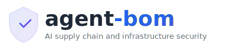
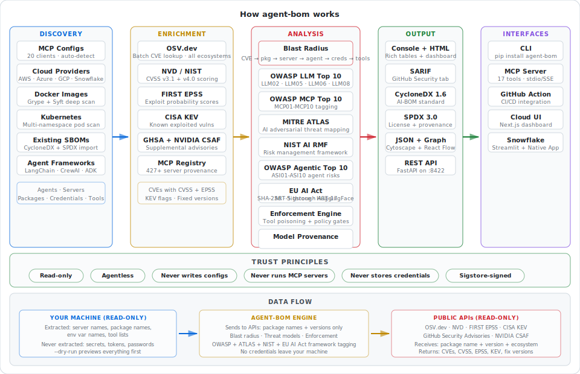
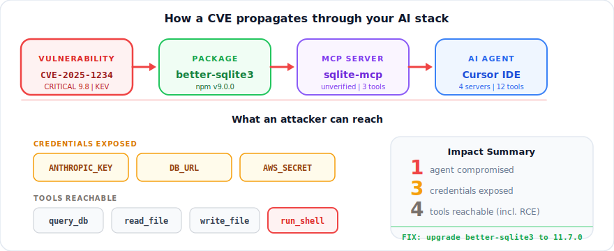

<p align="center">
  <picture>
    <source media="(prefers-color-scheme: dark)" srcset="docs/images/logo-dark.svg">
    
  </picture>
</p>

<p align="center">
  <a href="https://github.com/agent-bom/agent-bom/actions/workflows/ci.yml"></a>
  <a href="https://pypi.org/project/agent-bom/"></a>
  <a href="https://hub.docker.com/r/agentbom/agent-bom"></a>
  <a href="https://github.com/agent-bom/agent-bom/blob/main/LICENSE"></a>
  <a href="https://securityscorecards.dev/viewer/?uri=github.com/agent-bom/agent-bom"></a>
  <a href="https://github.com/agent-bom/agent-bom/stargazers"></a>
</p>

<p align="center">
  <b>Scan AI agents and MCP servers for CVEs. Map blast radius — credentials, tools, and agents at risk. Tag every finding with OWASP LLM Top 10 + MITRE ATLAS.</b>
</p>

<p align="center">
  <picture>
    <source media="(prefers-color-scheme: dark)" srcset="docs/images/architecture-dark.svg">
    
  </picture>
</p>

<p align="center">
  <picture>
    <source media="(prefers-color-scheme: dark)" srcset="docs/images/blast-radius-dark.svg">
    
  </picture>
</p>

---

## Why agent-bom?

<table>
<tr>
<td width="55%" valign="top">

**Not just "this package has a CVE."**

agent-bom answers the question security teams actually need:

> *If this CVE is exploited, which AI agents are compromised, which credentials leak, and which tools can an attacker reach?*

- **Blast radius analysis** — maps CVEs to agents, credentials, and MCP tools
- **OWASP LLM Top 10 + MITRE ATLAS** — dual threat framework tagging on every finding
- **100-server MCP registry** — risk levels, provenance, tool inventories
- **Policy-as-code** — block unverified servers, enforce risk thresholds in CI
- **Read-only** — never writes configs, never runs servers, never stores secrets
- **Works everywhere** — CLI, Docker, REST API, CI/CD, Prometheus, Kubernetes

</td>
<td width="45%" valign="top">

**What it scans:**

| Source | How |
|--------|-----|
| MCP configs | Auto-discover (8 clients) |
| Docker images | Grype / Syft / Docker CLI |
| Kubernetes | kubectl across namespaces |
| Terraform | Bedrock, Vertex AI, Azure |
| GitHub Actions | AI env vars + SDK steps |
| Python agents | 10 frameworks detected |
| Existing SBOMs | CycloneDX / SPDX import |

**What it outputs:**

Console, HTML dashboard, SARIF, CycloneDX 1.6, SPDX 3.0, Prometheus, OTLP, JSON, REST API

</td>
</tr>
</table>

---

## Quick links

- **[Install](#install)** — `pip install agent-bom` or Docker
- **[Get started](#get-started)** — scan in 30 seconds
- **[CI integration](#ci-integration)** — GitHub Actions + SARIF upload
- **[REST API](#rest-api)** — FastAPI on port 8422
- **[MCP Registry](data/mcp-registry.yaml)** — 100 known servers with metadata
- **[PERMISSIONS.md](PERMISSIONS.md)** — auditable trust contract
- **[Roadmap](#roadmap)** — what's coming next

---

## Get started

```bash
pip install agent-bom

# Auto-discover and scan local AI agents
agent-bom scan

# HTML dashboard with severity donut + blast radius chart
agent-bom scan -f html -o report.html && open report.html

# CI gate — fail on critical/high CVEs
agent-bom scan --fail-on-severity high -q
```

No config needed. Auto-discovers Claude Desktop, Cursor, Windsurf, Cline, VS Code Copilot, Continue, Zed, and Cortex Code on macOS, Linux, and Windows.

---

## Install

| Mode | Command |
|------|---------|
| Core CLI | `pip install agent-bom` |
| REST API | `pip install agent-bom[api]` |
| Dashboard | `pip install agent-bom[ui]` |
| OpenTelemetry | `pip install agent-bom[otel]` |
| Everything | `pip install agent-bom[api,ui,otel]` |
| Docker | `docker run --rm -v ~/.config:/root/.config:ro agentbom/agent-bom scan` |

---

## Core capabilities

### CVE scanning + blast radius

```bash
agent-bom scan --enrich                    # OSV + NVD CVSS + EPSS + CISA KEV
agent-bom scan --image myapp:latest        # Docker image (all ecosystems via Grype)
agent-bom scan --k8s --all-namespaces      # Every pod in the cluster
agent-bom scan --sbom syft-output.cdx.json # Pipe in existing SBOMs
```

Every vulnerability is mapped to: **which agents** are affected, **which credentials** are exposed, **which MCP tools** an attacker can reach.

### OWASP LLM Top 10 tagging

| Code | Triggered when |
|------|---------------|
| **LLM05** | Any package CVE (always) |
| **LLM06** | Credential env var exposed alongside CVE |
| **LLM08** | Server with >5 tools + CRITICAL/HIGH CVE |
| **LLM02** | Tool with shell/exec semantics |
| **LLM07** | Tool that reads files or prompts |
| **LLM04** | AI framework + HIGH+ CVE |

### MITRE ATLAS threat mapping

Every finding is also mapped to [MITRE ATLAS](https://atlas.mitre.org/) adversarial ML techniques:

| Technique | Triggered when |
|-----------|---------------|
| **AML.T0010** | Any package CVE (always — supply chain compromise) |
| **AML.T0062** | Credentials exposed alongside vulnerability |
| **AML.T0061** | >3 tools reachable through compromised path |
| **AML.T0051** | Tools can access prompts/context (injection surface) |
| **AML.T0056** | Tools can read files (meta prompt extraction) |
| **AML.T0043** | Tools with shell/exec capability (adversarial data) |
| **AML.T0020** | AI framework + HIGH+ CVE (training data poisoning) |
| **AML.T0058** | AI framework + creds + HIGH+ (agent context poisoning) |

### Threat framework coverage matrix

After every scan, agent-bom shows which OWASP + ATLAS categories were triggered — and how many findings per category:

**CLI** — `print_threat_frameworks()` renders two Rich tables with bar charts:

```
┌───────────── OWASP LLM Top 10 ──────────────┐
│ LLM05  Supply Chain Vulnerabilities    12 ████│
│ LLM06  Sensitive Information Disclosure 4 ██  │
│ LLM08  Excessive Agency                2 █   │
│ LLM01  Prompt Injection                —     │
│ ...                                          │
└──────────────────────────────────────────────┘
```

**JSON** — `threat_framework_summary` section with per-category counts:

```json
{
  "threat_framework_summary": {
    "owasp_llm_top10": [{"code": "LLM05", "name": "Supply Chain Vulnerabilities", "findings": 12, "triggered": true}],
    "mitre_atlas": [{"technique_id": "AML.T0010", "name": "ML Supply Chain Compromise", "findings": 12, "triggered": true}],
    "total_owasp_triggered": 4,
    "total_atlas_triggered": 5
  }
}
```

**Cloud UI** — two-column threat matrix grid with hit/miss indicators and finding counts per category.

### Policy-as-code

```bash
agent-bom scan --policy policy.json --fail-on-severity high
```

```json
[
  {"id": "no-unverified-high", "unverified_server": true, "severity_gte": "HIGH", "action": "fail"},
  {"id": "warn-excessive-agency", "min_tools": 6, "action": "warn"},
  {"id": "block-kev", "severity_gte": "CRITICAL", "action": "fail"}
]
```

### MCP Server Registry (100 servers)

Ships with a curated registry of 100 known MCP servers — 58 verified. Each entry includes: package name + version pin, ecosystem, risk level, tool names, credential env vars, license, and source URL.

Unverified servers in your configs trigger a warning. Policy rules can block them in CI.

---

## Deployment models

| Mode | Command | Best for |
|------|---------|----------|
| Developer CLI | `agent-bom scan` | Local audit, pre-commit checks |
| Pre-install check | `agent-bom check express@4.18.2 -e npm` | Before running any MCP server |
| CI/CD gate | `agent-bom scan --fail-on-severity high -q` | Block PRs on critical CVEs |
| Docker | `docker run agentbom/agent-bom scan` | Isolated, reproducible scans |
| REST API | `agent-bom api` | Dashboards, SIEM, scripting |
| Dashboard | `agent-bom serve` | Team-visible security dashboard |
| Prometheus | `--push-gateway` or `--otel-endpoint` | Continuous monitoring |
| K8s CronJob | Helm chart + CronJob | Cluster-wide auditing |

---

## CI integration

```yaml
- name: AI supply chain scan
  run: |
    pip install agent-bom
    agent-bom scan --inventory agents.json --enrich --fail-on-severity high \
      -f sarif -o results.sarif

- name: Upload to GitHub Security tab
  uses: github/codeql-action/upload-sarif@v3
  with:
    sarif_file: results.sarif
```

SARIF output includes OWASP LLM tags in `result.properties` — visible directly in GitHub Advanced Security.

---

## REST API

```bash
pip install agent-bom[api]
agent-bom api   # http://127.0.0.1:8422  →  /docs for Swagger UI
```

| Endpoint | Description |
|----------|-------------|
| `GET /health` | Liveness + `X-Agent-Bom-Read-Only: true` header |
| `POST /v1/scan` | Start async scan (returns `job_id`) |
| `GET /v1/scan/{job_id}` | Poll status + results |
| `GET /v1/scan/{job_id}/stream` | SSE real-time progress |
| `GET /v1/registry` | Full MCP server registry |
| `GET /v1/registry/{id}` | Single registry entry |

---

## agent-bom vs ToolHive

These tools solve different problems and are **complementary**.

| | agent-bom | ToolHive |
|---|---|---|
| **Purpose** | Scan + audit AI supply chain | Deploy + manage MCP servers |
| **CVE scanning** | OSV, NVD, EPSS, CISA KEV, Grype | No |
| **Blast radius** | Agents, credentials, tools | No |
| **OWASP LLM Top 10** | Auto-tagged on every finding | No |
| **MCP server isolation** | No (scanner only) | Yes (containers + seccomp) |
| **Secret injection** | No | Yes (Vault, AWS SM) |
| **Read-only** | Yes | No (manages processes) |

**Together:** ToolHive runs your MCP servers securely. agent-bom audits whether the packages they depend on have known CVEs and what the blast radius would be.

---

## Trust & permissions

- **`--dry-run`** — shows every file and API URL that would be accessed, then exits
- **[PERMISSIONS.md](PERMISSIONS.md)** — auditable contract: what is read, what APIs are called, what is never done
- **API headers** — every response includes `X-Agent-Bom-Read-Only: true`
- **Sigstore signing** — releases v0.7.0+ signed via [cosign](https://www.sigstore.dev/)
- **Credential redaction** — only env var **names** appear in reports as `***REDACTED***`

---

## Roadmap

- [x] MITRE ATLAS adversarial ML threat mapping
- [x] SLSA provenance + SHA256 integrity verification
- [x] Threat framework coverage matrix (CLI + JSON + UI)
- [ ] AWS Bedrock live agent + action group discovery
- [ ] Snowflake Cortex `CREATE MCP SERVER` scanning
- [ ] Google Vertex AI agent discovery
- [ ] Jupyter notebook AI library scanning
- [ ] Live MCP server introspection (tool enumeration without execution)
- [ ] ToolHive integration (`--toolhive` flag for managed server scanning)

---

## Contributing

```bash
git clone https://github.com/agent-bom/agent-bom.git && cd agent-bom
pip install -e ".[dev]"
pytest && ruff check src/
```

See [CONTRIBUTING.md](CONTRIBUTING.md) | [SECURITY.md](SECURITY.md)

---

Apache 2.0 — [LICENSE](LICENSE)

<!-- Badge reference links -->
[release-img]: https://img.shields.io/pypi/v/agent-bom?style=flat&label=Latest%20version
[ci-img]: https://img.shields.io/github/actions/workflow/status/agent-bom/agent-bom/ci.yml?style=flat&logo=github&label=Build
[license-img]: https://img.shields.io/badge/License-Apache%202.0-blue?style=flat
[docker-img]: https://img.shields.io/docker/pulls/agentbom/agent-bom?style=flat&label=Docker%20pulls
[stars-img]: https://img.shields.io/github/stars/agent-bom/agent-bom?style=flat&logo=github&label=Stars
[ossf-img]: https://api.securityscorecards.dev/projects/github.com/agent-bom/agent-bom/badge
