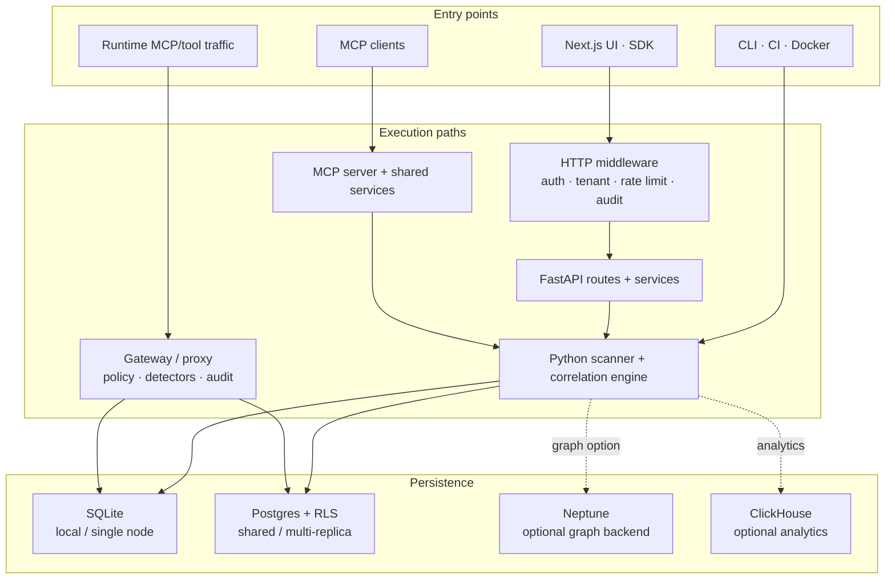

<p align="center">
  <picture>
    <source media="(prefers-color-scheme: dark)" srcset="https://raw.githubusercontent.com/msaad00/agent-bom/main/docs/images/logo-dark.svg">
    
  </picture>
</p>

<p align="center">
  <a href="https://github.com/msaad00/agent-bom/actions/workflows/ci.yml"></a>
  <a href="https://pypi.org/project/agent-bom/"></a>
  <a href="https://hub.docker.com/r/agentbom/agent-bom"></a>
  <a href="https://github.com/msaad00/agent-bom/blob/main/LICENSE"></a>
  <a href="https://securityscorecards.dev/viewer/?uri=github.com/msaad00/agent-bom"></a>
  <a href="https://glama.ai/mcp/servers/msaad00/agent-bom"></a>
  <a href="https://smithery.ai/servers/agent-bom/agent-bom"></a>
</p>
<!-- mcp-name: io.github.msaad00/agent-bom -->

<p align="center"><b>Open security scanner and self-hosted control plane for AI, MCP, and cloud infrastructure.</b></p>
<p align="center">Headless agent primitives and a human cockpit over shared evidence contracts.</p>

<p align="center">
  <a href="https://demo.agent-bom.com"><b>Live demo</b></a> (read-only sandbox) ·
  <a href="https://msaad00.github.io/agent-bom/">Docs</a> ·
  <a href="docs/FIRST_RUN.md">First Run</a> ·
  <a href="site-docs/deployment/overview.md">Self-host</a> ·
  <a href="https://github.com/marketplace/actions/agent-bom">GitHub Action</a> ·
  <a href="https://hub.docker.com/r/agentbom/agent-bom">Docker</a> ·
  <a href="https://github.com/msaad00/agent-bom/releases">Changelog</a>
</p>

## Start in two commands

```bash
pip install agent-bom
agent-bom scan -p .
```

The local CLI reads the project directly and prints inventory, findings, blast
radius, and fix-first actions. No control plane is required. Export an artifact
when another tool needs it: `agent-bom scan -p . -f sarif -o findings.sarif`.

## Three ways to use it

| Product lane | First command | Evidence you get | Natural next step |
|---|---|---|---|
| **Scan locally** — repos, images, SBOMs, agent/MCP config, IaC | `agent-bom scan -p .` | console, JSON, SARIF, CycloneDX/SPDX, HTML, graph export | gate CI or open the local report |
| **Centralize evidence** — fleet, cloud, identity, findings, compliance | `pip install 'agent-bom[ui]' && agent-bom serve` | tenant-scoped API/UI inventory, jobs, graph, audit, posture | self-host with Docker or Helm + Postgres |
| **Enforce runtime behavior** — MCP and tool calls | `agent-bom gateway serve --upstreams upstreams.yaml --bind 127.0.0.1:8090` | allow/warn/block decisions and audit events | bind policies to agents and upstream MCPs |

Discovery and static/cloud scanning are read-only. The self-hosted control plane
stores evidence, and runtime modes make explicit policy decisions; those are
separate operational boundaries, not all one read-only pipeline.

<p align="center">
  <picture>
    <source media="(prefers-color-scheme: dark)" srcset="https://raw.githubusercontent.com/msaad00/agent-bom/main/docs/images/blast-radius-dark.svg">
    
  </picture>
</p>

Blast radius links package risk to the MCP servers that load it, exposed tools,
credential references, and agents that can reach it. Coverage and boundaries:
[AI infrastructure scanning](docs/AI_INFRASTRUCTURE_SCANNING.md) ·
[product boundaries](docs/PRODUCT_BOUNDARIES.md) ·
[first-run guide](docs/FIRST_RUN.md).

## How the full stack fits together

The surfaces share evidence contracts and lower-level services, but they do not
all self-call through FastAPI. Local CLI/CI invokes the scanner engine directly;
the UI and SDK use the authenticated API; MCP server mode exposes shared
services; gateway/proxy modes enforce runtime traffic at their own boundary.

<details>
<summary><b>Full architecture</b> — execution paths, backend, databases, and optional stores</summary>


```mermaid
flowchart TB
    subgraph callers ["Entry points"]
        CLI["CLI · CI · Docker"]
        UI["Next.js UI · SDK"]
        MCP["MCP clients"]
        RT["Runtime MCP/tool traffic"]
    end
    subgraph services ["Execution paths"]
        CORE["Python scanner + correlation engine"]
        MW["HTTP middleware<br/>auth · tenant · rate limit · audit"]
        API["FastAPI routes + services"]
        MCPS["MCP server + shared services"]
        GW["Gateway / proxy<br/>policy · detectors · audit"]
    end
    subgraph stores ["Persistence"]
        SQL["SQLite<br/>local / single node"]
        PG["Postgres + RLS<br/>shared / multi-replica"]
        NEP["Neptune<br/>optional graph backend"]
        CH["ClickHouse<br/>optional analytics"]
    end

    CLI --> CORE
    UI --> MW --> API --> CORE
    MCP --> MCPS --> CORE
    RT --> GW
    CORE --> SQL
    CORE --> PG
    CORE -. graph option .-> NEP
    CORE -. analytics .-> CH
    GW --> SQL
    GW --> PG
```

- **Frontend:** Next.js 16 / React 19 in `ui/`; authenticated browser data comes
  from FastAPI—there is no UI-only privileged store path.
- **Backend:** Python 3.11+ scanner/services plus FastAPI/uvicorn for the control
  plane. The product is not single-language: the cockpit is TypeScript/React.
- **Persistence:** SQLite and Postgres are the primary operational stores.
  Neptune is optional graph persistence; ClickHouse is optional analytics.
  Snowflake implements selected warehouse/store paths with documented parity
  limits—it is not a drop-in implementation of every store.
- **Evidence:** normalized findings and graph contracts correlate inventory,
  vulnerabilities, cloud/config posture, identity context, and runtime records.
  `ContextGraph` and `UnifiedGraph` are still being consolidated, so not every
  record is physically stored as one object.
- **Agent interface:** server mode exposes 76 MCP tools, 6 resources, and 8 workflow prompts
  over strict MCP arguments. Registry metadata includes a committed Smithery manifest;
  integration docs distinguish committed metadata from current catalog liveness.

</details>

<details>
<summary><b>Evidence and accuracy boundaries</b></summary>

agent-bom normalizes advisory and distro evidence into canonical CVE findings
with match-confidence tiers:

`distro_confirmed` > `osv_range` > `osv_ecosystem` > `unfixed_distro` > `nvd_cpe_candidate`

Distro-confirmed findings are treated as confirmed. Optional NVD CPE candidate
matching widens long-tail OS/vendor software coverage, but remains review-grade
and off by default.

**NVD key model.** End users do not need an NVD API key. CVE/CPE enrichment
ships through the distributed vulnerability database. `NVD_API_KEY` is only an
optional self-hosted freshness knob for operators rebuilding or refreshing the
database.

Matching mechanics and release evidence:
[vulnerability matching](docs/VULNERABILITY_MATCHING.md) ·
[scanner accuracy baseline](docs/SCANNER_ACCURACY_BASELINE.md) ·
[graph contract](docs/graph/CONTRACT.md) ·
[architecture deep dive](docs/ARCHITECTURE.md)

</details>

## See it

Try the [live demo](https://demo.agent-bom.com) (read-only sandbox). These
captures come from the shipped Next.js routes using explicitly labeled,
synthetic demo evidence.

| Risk overview | Connect evidence sources |
|:---:|:---:|
|  |  |
| **Start a scan** | **Review runtime decisions** |
|  |  |

<details>
<summary><b>Full CLI walkthrough</b> — current 0.96.3 console demo</summary>

<p align="center">
  
</p>

The demo is intentionally comprehensive, so it is kept collapsed at README
display width. Its seeded `reqeusts` typosquat produces an expected non-zero
security-gate exit; that is a demonstrated finding, not a failed recording.

</details>

Full capture list and reproducible commands: [docs/CAPTURE.md](docs/CAPTURE.md).

## Run it anywhere

The surfaces share normalized finding and graph contracts while keeping their
execution and authentication boundaries explicit. Pick the entry point that
matches your role:

| Need | Surface | First action | Main artifact |
|---|---|---|---|
| Scan a repo, image, or local agent config | CLI / CI | `agent-bom scan -p .` (or the [GitHub Action](https://github.com/marketplace/actions/agent-bom)) | JSON, SARIF, SBOM, HTML |
| Connect cloud and data-estate evidence | Cloud connectors | `agent-bom connect aws` then `agent-bom cloud scan` | assets, CIS findings, graph edges |
| Review posture as a team | API + dashboard | `pip install 'agent-bom[ui]' && agent-bom serve` | findings, graph, audit, compliance |
| Give agents security tools | MCP server | `agent-bom mcp server` | strict MCP tool responses |
| Govern runtime tool calls | Proxy / gateway | `agent-bom gateway serve --upstreams upstreams.yaml --bind 127.0.0.1:8090` | allow/warn/block audit trail |
| Package evidence for audit | Reports / exports | `agent-bom scan -p . -f sarif -o findings.sarif` | SARIF, CycloneDX, SPDX, HTML/PDF, compliance bundle |

Beyond the basics — `agent-bom graph` (multi-hop exposure paths),
`agent-bom remediate -p .` (advisory fix plan),
`agent-bom identity credential-expiry`, `agent-bom cost forecast`, and the CI
gate `uses: msaad00/agent-bom@v0.96.3`. Full command map:
[docs/CLI_MAP.md](docs/CLI_MAP.md) · role routing:
[docs/START_HERE.md](docs/START_HERE.md) · all entry points and auth
boundaries: [docs/PRODUCT_MAP.md](docs/PRODUCT_MAP.md)

**Deploy targets** — you run the control plane in your own boundary (no managed
public SaaS in this repo yet), fastest → most-managed:

- **Docker Compose** — fastest; one file, loopback by default → [pilot compose](deploy/docker-compose.pilot.yml)
- **Helm / Kubernetes** — cluster-native chart → [chart](deploy/helm/agent-bom)
- **EKS** — opinionated Terraform module → [module](deploy/terraform/platform-eks)
- **CloudFormation** — one-click AWS stack → [templates](deploy/cloudformation)
- **Snowflake (SPCS native app)** — host entirely inside your own Snowflake account → [install guide](docs/snowflake-native-app/INSTALL.md)

<details>
<summary><b>Local bring-up</b> — Docker Compose in two commands</summary>

```bash
curl -fsSL https://raw.githubusercontent.com/msaad00/agent-bom/main/deploy/docker-compose.pilot.yml -o docker-compose.pilot.yml
docker compose -f docker-compose.pilot.yml up -d
# Dashboard -> http://localhost:3000
```

Pilot compose binds to `127.0.0.1` with loopback CORS only. Use
`docker-compose.platform.yml` or [docs/HOSTED_POC.md](docs/HOSTED_POC.md) before
sharing a link. Full guides: [Deploy anywhere](docs/DEPLOY_PLATFORM.md).

</details>

## Connected control plane

For brokered control-plane sources, **connect once, then scheduled and operator
actions use the stored connection reference**—not a fresh credential prompt.
Standalone CLI scans remain independent: they read local files or explicitly
configured provider credentials and do not require a control-plane connection.

- **Humans** sign in via **OAuth / OIDC / SAML SSO** (standard providers plus a
  Snowflake OAuth authorization-code + PKCE flow), with **SCIM** for user and
  group provisioning (`src/agent_bom/api/{oidc,saml,scim}.py`,
  `snowflake_oauth.py`).
- **Agents / CI** authenticate with **scoped API keys / tokens**.
- **Sources** are onboarded **once** through read-only, agentless, brokered
  connectors — a single least-privilege managed role per source with
  short-lived, brokered credentials (e.g. AWS `sts:AssumeRole`); connection
  secrets are write-only (encrypted at rest, never read back).

HTTP auth, tenant isolation, and audit are enforced in middleware for the UI and
API/SDK callers. MCP server and gateway/proxy modes enforce their own documented
transport-auth and policy boundaries; none receives a privileged UI-only path.

Cloud connectors are opt-in, default-off, and read no secret values.
`agent-bom connect <provider>` prints the grant template and enable flag
without network I/O until you opt in:

| Cloud | Enable | Scan |
|---|---|---|
| AWS | `AGENT_BOM_AWS_INVENTORY=1` | `agent-bom cloud aws` |
| Azure | `AGENT_BOM_AZURE_INVENTORY=1` | `agent-bom cloud azure` |
| GCP | `AGENT_BOM_GCP_INVENTORY=1` | `agent-bom cloud gcp` |
| Snowflake | SSO or key-pair auth | `pip install 'agent-bom[snowflake]'` then `agent-bom scan --snowflake` |

Snowflake auth defaults to browser SSO (`externalbrowser`); use
`SNOWFLAKE_AUTHENTICATOR=snowflake_jwt` with `SNOWFLAKE_PRIVATE_KEY_PATH` for
CI. Setup and the exact grant per provider:
[docs/CLOUD_CONNECT.md](docs/CLOUD_CONNECT.md) · intake map:
[docs/DATA_SOURCES.md](docs/DATA_SOURCES.md) · enterprise auth surface:
[docs/ENTERPRISE.md](docs/ENTERPRISE.md)

## Trust

- Read-only discovery by default; no mandatory telemetry.
- Credential values redacted; env names preserved for explainable exposure paths.
- Exports: JSON, SARIF, CycloneDX, SPDX, Parquet, CSV, Markdown, HTML, PDF, compliance bundles.
- Tenant scope, auth boundaries, and audit evidence on API/runtime paths.

[Threat model](docs/THREAT_MODEL.md) · [Pentest readiness](docs/PENTEST_READINESS.md) ·
[Python client](docs/PYTHON_API.md) · [Go client](sdks/go/README.md) ·
[Release verification](docs/RELEASE_VERIFICATION.md) ·
[MCP security model](docs/MCP_SECURITY_MODEL.md)

## Contributing

Contributions are welcome. Start with [CONTRIBUTING.md](CONTRIBUTING.md),
[.agents/AGENTS.md](.agents/AGENTS.md), and the
[open issues](https://github.com/msaad00/agent-bom/issues).

License: Apache-2.0.
