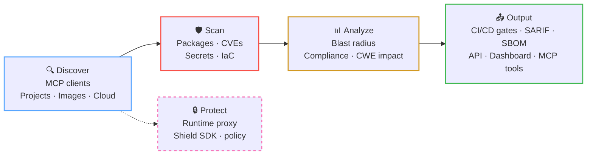
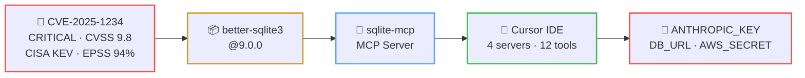

<p align="center">
  <picture>
    <source media="(prefers-color-scheme: dark)" srcset="https://raw.githubusercontent.com/msaad00/agent-bom/main/docs/images/logo-dark.svg">
    
  </picture>
</p>

<p align="center">
  <a href="https://github.com/msaad00/agent-bom/actions/workflows/ci.yml"></a>
  <a href="https://pypi.org/project/agent-bom/"></a>
  <a href="https://hub.docker.com/r/agentbom/agent-bom"></a>
  <a href="https://github.com/msaad00/agent-bom/blob/main/LICENSE"></a>
  <a href="https://securityscorecards.dev/viewer/?uri=github.com/msaad00/agent-bom"></a>
</p>
<!-- mcp-name: io.github.msaad00/agent-bom -->

<p align="center"><b>Open security scanner for agentic infrastructure — agents, MCP, packages, containers, cloud, and runtime.</b></p>

<p align="center">Security and visibility for agentic infrastructure should be open, transparent, and accessible — not reserved for teams with enterprise budgets.</p>

<p align="center"><b>Package risk is only the start. What matters is what it can reach.</b></p>

```text
CVE-2025-1234  (CRITICAL · CVSS 9.8 · CISA KEV)
  |── better-sqlite3@9.0.0  (npm)
       |── sqlite-mcp  (MCP Server · unverified · root)
            |── Cursor IDE  (Agent · 4 servers · 12 tools)
            |── ANTHROPIC_KEY, DB_URL, AWS_SECRET  (Credentials exposed)
            |── query_db, read_file, write_file, run_shell  (Tools at risk)

 Fix: upgrade better-sqlite3 → 11.7.0
```

**agent-bom maps the blast radius**: CVE → package → MCP server → AI agent → credentials → tools.

Package risk is only the start. agent-bom maps what it can reach across MCP servers, agents, credentials, tools, and runtime context. CWE-aware impact classification keeps a DoS from being reported like credential compromise.

`agent-bom` is now a real released product surface, not just a research repo: installable from PyPI, publishable through Docker, usable in GitHub Actions, deployable as an authenticated API and remote MCP service, and validated end to end through CLI, reports, API, dashboard, and policy gates.

For the canonical product brief and verified repo-derived metrics, see [docs/PRODUCT_BRIEF.md](docs/PRODUCT_BRIEF.md) and [docs/PRODUCT_METRICS.md](docs/PRODUCT_METRICS.md).

<p align="center">
  
</p>

The GIF uses the built-in curated sample environment so the output stays reproducible across releases. For real scans, run `agent-bom agents` on your machine or `agent-bom agents -p .` in a project.

## Quick start

```bash
pip install agent-bom                  # Standard CLI install
# pipx install agent-bom               # Isolated global install
# uvx agent-bom --help                 # Ephemeral run without installing

agent-bom agents                              # Discover + scan local AI agents and MCP servers
agent-bom agents -p .                         # Scan project lockfiles/manifests plus agent/MCP context
agent-bom mesh --project .                    # Show the live agent / MCP topology
agent-bom skills scan .                       # Scan CLAUDE.md, AGENTS.md, .cursorrules, skills/*
agent-bom check flask@2.0.0 --ecosystem pypi  # Pre-install CVE gate
agent-bom image nginx:latest                  # Container image scan
agent-bom iac Dockerfile k8s/ infra/main.tf   # IaC scan across one or more paths
```

<details>
<summary><b>More commands</b></summary>

```bash
agent-bom cloud aws                     # Cloud AI posture + CIS benchmarks
agent-bom agents -f cyclonedx -o bom.json  # AI BOM / SBOM export
agent-bom graph report.json                # Blast radius graph / graph HTML inputs
agent-bom proxy "npx @mcp/server-fs /ws"   # MCP security proxy
agent-bom secrets src/                  # Hardcoded secrets + PII
agent-bom verify requests@2.33.0        # Package integrity verification
agent-bom serve                         # API + Next.js dashboard
```

</details>

---

## Why teams use it

- MCP-aware blast radius instead of flat package CVE lists
- AI-focused scanning across agents, instruction files, skills, runtime proxy traffic, and cloud AI surfaces
- Project lockfile and manifest inventory with direct/transitive dependency visibility in CLI and JSON output
- Model and weight supply-chain checks with signed-artifact detection, bundle manifest and lineage visibility, HuggingFace provenance, and hash-verification visibility in CLI and JSON output
- Real operator outputs: SARIF, CycloneDX, HTML, graphs, badges, JSON, API, dashboard, and MCP tools
- Works as local CLI, CI gate, authenticated remote service, and enterprise deployment base

---

## Use it by environment

| Environment | Recommendation |
|-------------|----------------|
| **Developer laptop** | `pip install agent-bom` is fine. It is read-only, does not install a daemon, and does not open a network listener by default. |
| **CI/CD** | Use the GitHub Action or `docker run --rm agentbom/agent-bom`. It is isolated by default and easy to gate on exit code or SARIF. |
| **Enterprise fleet** | Deploy `agent-bom serve` in its own container or namespace with API keys or OIDC-backed role checks and a real backend. Use the CLI or Action on endpoints and repos; use the API for fleet visibility. |
| **Air-gapped / isolated** | Pre-sync the local DB, copy the cache, and run with `--offline` or `auto-update-db: false`. |

## Update and release hygiene

- Releases are signed and published from tagged CI, not local ad hoc steps.
- Dependency updates are expected to carry release-note context when they are major or behavior-affecting.
- Remote package, API, and MCP deployment surfaces should all report the same version and health state after release.
- Automated freshness checks watch for deployment drift so stale Railway or registry surfaces do not go unnoticed.
- The repo monitors both JavaScript surfaces (`ui/` and `sdks/typescript/`) with daily Dependabot, `npm audit`, and CI guards that fail if tracked or published source maps appear unexpectedly.

<details>
<summary><b>Claude, Cortex, and MCP integration</b></summary>

Use `agent-bom` itself as an MCP tool surface:

```bash
agent-bom mcp server
```

That lets Claude Desktop, Claude Code, Cortex CoCo, Cursor, Windsurf, and other MCP-capable clients call the scanner directly through the MCP server mode.

**Claude Code**

```bash
claude mcp add agent-bom -- uvx agent-bom mcp server
```

**Cortex CoCo**

Add to `~/.snowflake/cortex/mcp.json`:

```json
{
  "mcpServers": {
    "agent-bom": {
      "command": "uvx",
      "args": ["agent-bom", "mcp", "server"]
    }
  }
}
```

**Runtime monitoring / proxy mode**

Wrap a third-party MCP server with the proxy when you want runtime inspection instead of just scanning:

```bash
agent-bom proxy "npx @modelcontextprotocol/server-filesystem /workspace"
```

The proxy inspects MCP JSON-RPC traffic with drift, credential, argument, response, vector, rate, and sequence detectors before forwarding to the real server.

Guides:

- [Major MCP client guides](docs/MCP_CLIENT_GUIDES.md)
- [Claude Desktop / Claude Code](docs/CLAUDE_INTEGRATION.md)
- [Cortex CoCo / Cortex Code](docs/CORTEX_CODE.md)
- [Codex CLI](docs/CODEX_CLI.md)
- [MCP server mode](docs/MCP_SERVER.md)
- [Runtime proxy and monitoring](docs/RUNTIME_MONITORING.md)

</details>

---

## How it works


```mermaid
flowchart LR
    DISCOVER["🔍 Discover\nMCP clients\nProjects · Images · Cloud"] --> SCAN["🛡️ Scan\nPackages · CVEs\nSecrets · IaC"]
    SCAN --> ANALYZE["📊 Analyze\nBlast radius\nCompliance · CWE impact"]
    ANALYZE --> OUTPUT["📤 Output\nCI/CD gates · SARIF · SBOM\nAPI · Dashboard · MCP tools"]
    DISCOVER -.-> PROTECT["🔒 Protect\nRuntime proxy\nShield SDK · policy"]

    style DISCOVER stroke:#58a6ff,stroke-width:2px
    style SCAN stroke:#f85149,stroke-width:2px
    style ANALYZE stroke:#d29922,stroke-width:2px
    style OUTPUT stroke:#3fb950,stroke-width:2px
    style PROTECT stroke:#f778ba,stroke-width:2px,stroke-dasharray: 5 5
```

### Blast radius — what makes agent-bom different


```mermaid
flowchart LR
    CVE["🔴 CVE-2025-1234\nCRITICAL · CVSS 9.8\nCISA KEV · EPSS 94%"]
    PKG["📦 better-sqlite3\n@9.0.0"]
    SRV["🔧 sqlite-mcp\nMCP Server"]
    AGT["🤖 Cursor IDE\n4 servers · 12 tools"]
    CRED["🔑 ANTHROPIC_KEY\nDB_URL · AWS_SECRET"]

    CVE --> PKG --> SRV --> AGT --> CRED

    style CVE stroke:#f85149,stroke-width:2px
    style PKG stroke:#d29922,stroke-width:2px
    style SRV stroke:#58a6ff,stroke-width:2px
    style AGT stroke:#3fb950,stroke-width:2px
    style CRED stroke:#f85149,stroke-width:2px
```

Blast radius is **CWE-aware**: an RCE (CWE-94) shows full credential exposure, a DoS (CWE-400) does not. Impact categories: code-execution, credential-access, file-access, injection, ssrf, data-leak, availability, client-side.

## Path to 1.0

`agent-bom` is already a serious OSS product. The path to `1.0` is focused, not vague:

- deepen scanner coverage so MCP-aware blast radius is paired with stronger lockfile and package-depth coverage
- harden enterprise deployment defaults across auth, tenant isolation, Helm, and remote service operation
- keep raising the MCP, runtime, and skills surfaces without letting CLI, API, dashboard, and report contracts drift
- preserve the open-core model while making the product operationally credible for real teams

That work is tracked in [docs/ROADMAP.md](docs/ROADMAP.md).

---

## Coverage at a glance

<details open>
<summary><b>Agents, MCP, and skills</b></summary>

- Auto-detected MCP client configs across mainstream local agent surfaces, including Claude Desktop, Claude Code, Cursor, Windsurf, VS Code, Codex CLI, and Gemini CLI
- MCP servers, tools, transports, trust posture, and capability risk scoring
- Instruction files and skills: `CLAUDE.md`, `AGENTS.md`, `.cursorrules`, `.windsurfrules`, `skills/*`
- Deterministic skill bundle identity, trust analysis, and tool-poisoning detection

</details>

<details>
<summary><b>Supply chain, packages, and SBOM</b></summary>

- Multiple language, OS, and agent package ecosystems
- OSV, NVD, GHSA, EPSS, and CISA KEV enrichment
- Blast radius mapping: CVE → package → MCP server → agent → credentials → tools
- CycloneDX 1.6 with ML BOM extensions, SPDX 3.0, VEX, SARIF, HTML, graph, JSON, and more

</details>

<details>
<summary><b>Containers, IaC, cloud, and secrets</b></summary>

- Native OCI parser for images and running containers
- IaC coverage for Dockerfile, Terraform, CloudFormation, Helm, and Kubernetes manifests
- Cloud AI and infra discovery across AWS, Azure, GCP, Databricks, Snowflake, GPU/DCGM probes, and vector data stores
- Secrets and PII scanning across source, config, lockfiles, and environment-adjacent files

</details>

<details>
<summary><b>Runtime, policy, and trust</b></summary>

- Runtime protection engine plus a lighter MCP proxy path for inline JSON-RPC inspection
- Capability-aware risk, drift detection, credential redaction, and kill-switch controls
- Compliance mapping across OWASP, MITRE, NIST, ISO, SOC 2, CIS, CMMC, FedRAMP, PCI DSS, and the EU AI Act

</details>

**Read-only. Agentless. No secrets leave your machine.**

---

## Runtime protection

MCP security proxy with inline detector chaining, PII redaction, and kill-switch controls:

```bash
agent-bom proxy "npx @mcp/server-filesystem /workspace"
```

**Shield SDK** — drop-in Python middleware:
```python
from agent_bom.shield import Shield
shield = Shield(deep=True)
alerts = shield.check_tool_call("exec", {"command": "rm -rf /"})
safe = shield.redact(response_text)  # [REDACTED:OpenAI API Key]
```

---

## Compliance and evidence

Every finding is tagged with mapped control coverage across 14 surfaced compliance frameworks, with MITRE ATT&CK Enterprise kept as separate threat-mapping context:

| Framework | Coverage |
|-----------|----------|
| OWASP LLM Top 10 | 10 mapped categories |
| OWASP MCP Top 10 | 10 mapped categories |
| OWASP Agentic Top 10 | 10 mapped categories |
| OWASP AISVS v1.0 | 9 mapped checks |
| MITRE ATLAS | 65 mapped techniques |
| NIST AI RMF 1.0 | 14 mapped subcategories |
| NIST CSF 2.0 | 14 mapped categories |
| NIST 800-53 Rev 5 | 29 mapped controls |
| FedRAMP Moderate | 25 mapped controls |
| ISO 27001:2022 | 9 controls |
| SOC 2 TSC | 9 mapped criteria |
| CIS Controls v8 | 10 mapped controls |
| EU AI Act | 6 articles |
| CMMC 2.0 Level 2 | 17 practices |

MITRE ATT&CK Enterprise remains available as separate threat-mapping context rather than part of the 14-framework compliance surface.

---

## Install & deploy

```bash
pip install agent-bom                        # CLI
docker run --rm agentbom/agent-bom agents    # Docker
```

| Mode | Command | Best for |
|------|---------|----------|
| CLI | `agent-bom agents` | Local audit + project scan |
| GitHub Action | `uses: msaad00/agent-bom@v0.75.15` | CI/CD + SARIF |
| Docker | `docker run agentbom/agent-bom` | Isolated scans |
| MCP Server | `agent-bom mcp server` | Claude Desktop, Claude Code, Cursor, Codex, Windsurf, Cortex |
| Runtime proxy | `agent-bom proxy` | MCP traffic enforcement |
| Shield SDK | `from agent_bom.shield import Shield` | In-process protection |
| API + dashboard | `agent-bom serve` | Fleet visibility, audit exports, and central review |

### CI/CD in 60 seconds

Use the GitHub Action when you want a fast CI gate: one step, one gate, SARIF in the Security tab, and a clean exit code for CI.

**Repo + MCP + instruction files**

```yaml
- uses: msaad00/agent-bom@v0.75.15
  with:
    scan-type: scan
    severity-threshold: high
    upload-sarif: true
    enrich: true
    fail-on-kev: true
```

**Container image gate**

```yaml
- uses: msaad00/agent-bom@v0.75.15
  with:
    scan-type: image
    scan-ref: ghcr.io/acme/agent-runtime:sha-abcdef
    severity-threshold: critical
```

**IaC gate**

```yaml
- uses: msaad00/agent-bom@v0.75.15
  with:
    scan-type: iac
    iac: Dockerfile,k8s/,infra/main.tf
    severity-threshold: high
```

**Air-gapped / pre-synced CI**

```yaml
- uses: msaad00/agent-bom@v0.75.15
  with:
    auto-update-db: false
    enrich: false
```

<details>
<summary><b>GitHub Action</b></summary>

```yaml
- uses: msaad00/agent-bom@v0.75.15
  with:
    scan-type: scan
    severity-threshold: high
    upload-sarif: true
    enrich: true
    fail-on-kev: true
```

</details>

### Enterprise rollout

- `Developer endpoints`: run `agent-bom agents` locally or via MDM for workstation inventory and posture.
- `CI/CD`: use the GitHub Action for PR gates, SARIF upload, image gates, and IaC checks.
- `Central security team`: deploy `agent-bom serve` for fleet ingestion, posture, and audit exports.
- `Air-gapped / isolated`: run the Docker image with `--offline` and `auto-update-db: false` using a pre-synced local DB.

See [docs/ENTERPRISE_DEPLOYMENT.md](docs/ENTERPRISE_DEPLOYMENT.md) for rollout patterns, auth models, and storage backends.

<details>
<summary><b>Install extras</b></summary>

| Extra | Command |
|-------|---------|
| Cloud providers | `pip install 'agent-bom[cloud]'` |
| MCP server | `pip install 'agent-bom[mcp-server]'` |
| REST API | `pip install 'agent-bom[api]'` |
| Dashboard | `pip install 'agent-bom[ui]'` |

</details>

<details>
<summary><b>Output formats (19)</b></summary>

JSON, SARIF, CycloneDX 1.6 (with ML BOM), SPDX 3.0, HTML, Graph JSON, Graph HTML, GraphML, Neo4j Cypher, JUnit XML, CSV, Markdown, Mermaid, SVG, Prometheus, Badge, OCSF, Attack Flow, plain text.

</details>

---

## MCP server

36 security tools available inside any MCP-compatible AI assistant:

```json
{
  "mcpServers": {
    "agent-bom": {
      "command": "uvx",
      "args": ["agent-bom", "mcp", "server"]
    }
  }
}
```

Also on [Glama](https://glama.ai/mcp/servers/@msaad00/agent-bom), [Smithery](integrations/smithery.yaml), [MCP Registry](integrations/mcp-registry/server.json), and [OpenClaw](integrations/openclaw/SKILL.md).

---

## Trust & transparency

| When | What's sent | Where | Opt out |
|---|---|---|---|
| Default CVE lookups (`agents`, `scan`, `check`, `image`) | Package names + versions | OSV API | `--offline` |
| Floating version resolution | Package names, requested version/latest lookup | npm, PyPI, Go proxy | `--offline` |
| `--enrich` | CVE IDs | NVD, EPSS; KEV catalog download from CISA | Don't use `--enrich` |
| `--deps-dev` | Package names + versions | deps.dev | Don't use `--deps-dev` |
| `verify` | Package name + version | PyPI or npm integrity endpoints | Don't run `verify` |
| Optional push/integrations | Finding summaries or evidence bundles | Slack, Jira, Vanta, Drata | Don't pass those flags |

No source code, config contents, or credential values are sent. No telemetry or analytics. [Sigstore-signed](docs/PERMISSIONS.md) releases. See [SECURITY_ARCHITECTURE.md](docs/SECURITY_ARCHITECTURE.md) and [PERMISSIONS.md](docs/PERMISSIONS.md) for the full trust model.

---

## Contributing

```bash
git clone https://github.com/msaad00/agent-bom.git && cd agent-bom
pip install -e ".[dev]"
pytest && ruff check src/
```

See [CONTRIBUTING.md](CONTRIBUTING.md) | [SECURITY.md](SECURITY.md) | [CODE_OF_CONDUCT.md](CODE_OF_CONDUCT.md)

---

Apache 2.0 — [LICENSE](LICENSE)
