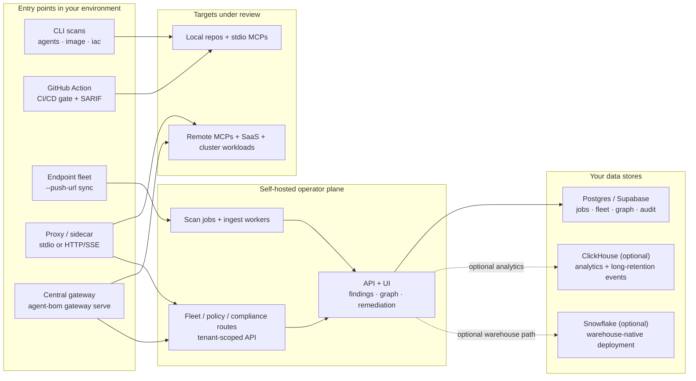
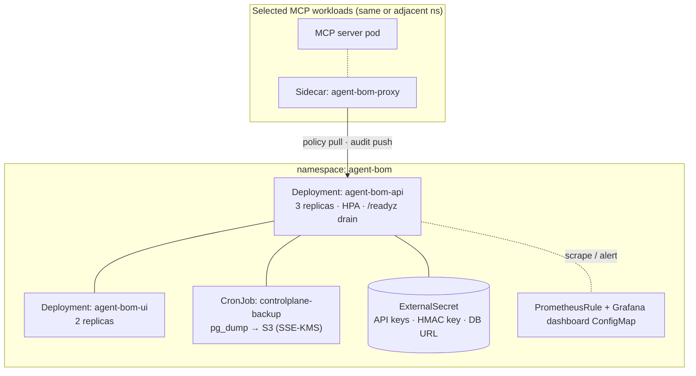
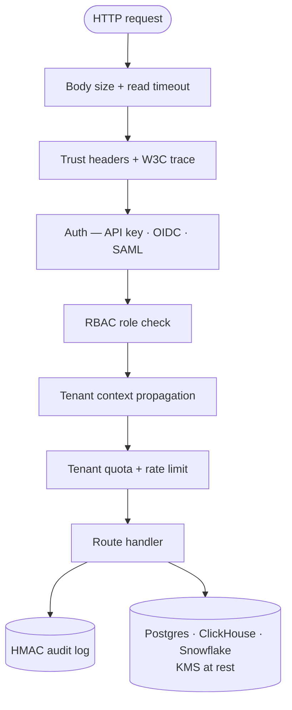

<p align="center">
  <picture>
    <source media="(prefers-color-scheme: dark)" srcset="https://raw.githubusercontent.com/msaad00/agent-bom/main/docs/images/logo-dark.svg">
    
  </picture>
</p>

<p align="center">
  <a href="https://github.com/msaad00/agent-bom/actions/workflows/ci.yml"></a>
  <a href="https://pypi.org/project/agent-bom/"></a>
  <a href="https://hub.docker.com/r/agentbom/agent-bom"></a>
  <a href="https://github.com/msaad00/agent-bom/blob/main/LICENSE"></a>
  <a href="https://securityscorecards.dev/viewer/?uri=github.com/msaad00/agent-bom"></a>
</p>
<!-- mcp-name: io.github.msaad00/agent-bom -->

<p align="center"><b>Open security scanner for AI supply chain — agents, MCP servers, packages, containers, cloud, GPU, and runtime.</b></p>

<p align="center">Every CVE in your AI stack is a credential leak waiting to happen. <code>agent-bom</code> follows the chain end-to-end and tells you exactly which fix collapses it.</p>

<p align="center">
  <picture>
    <source media="(prefers-color-scheme: dark)" srcset="https://raw.githubusercontent.com/msaad00/agent-bom/main/docs/images/blast-radius-dark.svg">
    
  </picture>
</p>

```text
CVE-2025-1234  (CRITICAL · CVSS 9.8 · CISA KEV)
  |── better-sqlite3@9.0.0  (npm)
       |── sqlite-mcp  (MCP Server · unverified · root)
            |── Cursor IDE  (Agent · 4 servers · 12 tools)
            |── ANTHROPIC_KEY, DB_URL, AWS_SECRET  (Credentials exposed)
            |── query_db, read_file, write_file, run_shell  (Tools at risk)

 Fix: upgrade better-sqlite3 → 11.7.0
```

Blast radius is the core idea: `CVE -> package -> MCP server -> agent -> credentials -> tools`. CWE-aware impact keeps a DoS from being reported like credential compromise.

## Try the demo

```bash
agent-bom agents --demo --offline
```

The demo uses a curated sample so the output stays reproducible across releases. Every CVE shown is a real OSV/GHSA match against a genuinely vulnerable package version — no fabricated findings (locked in by [`tests/test_demo_inventory_accuracy.py`](tests/test_demo_inventory_accuracy.py)). For a real scan, run `agent-bom agents`, or add `-p .` to fold project manifests and lockfiles into the same result.

<p align="center">
  
</p>

## Pick your entrypoint

| Goal | Run | What you get |
|---|---|---|
| Find what is installed and reachable | `agent-bom agents -p .` | Agent discovery, MCP mapping, project dependency findings, blast radius |
| Turn findings into a fix plan | `agent-bom agents -p . --remediate remediation.md` | Prioritized remediation with fix versions and reachable impact |
| Check a package before install | `agent-bom check flask@2.2.0 --ecosystem pypi` | Machine-readable pre-install verdict |
| Scan a container image | `agent-bom image nginx:latest` | OS and package CVEs with fixability |
| Audit IaC or cloud posture | `agent-bom iac Dockerfile k8s/ infra/main.tf` | Misconfigurations, manifest hardening, optional live cluster posture |
| Review findings in a persistent graph | `agent-bom serve` | API plus bundled local UI; Kubernetes uses the separate `agent-bom-ui` image |
| Inspect live MCP traffic | `agent-bom proxy "<server command>"` | Inline runtime inspection, detector chaining, response/argument review |

## Quick start

```bash
pip install agent-bom                  # CLI
# pipx install agent-bom               # isolated global install
# uvx agent-bom --help                 # ephemeral run

agent-bom agents                              # discover + scan local AI agents and MCP servers
agent-bom agents -p .                         # add project lockfiles + manifests
agent-bom check flask@2.0.0 --ecosystem pypi  # pre-install CVE gate
agent-bom image nginx:latest                  # container image scan
agent-bom iac Dockerfile k8s/ infra/main.tf   # IaC scan, optionally `--k8s-live`
```

After the first scan:

```bash
agent-bom agents -p . --remediate remediation.md                  # fix-first plan
agent-bom agents -p . --compliance-export fedramp -o evidence.zip # tamper-evident evidence bundle
pip install 'agent-bom[ui]' && agent-bom serve                    # API + bundled local UI
```

## Product views

These come from the live product path, using the built-in demo data pushed through the API. See [`docs/CAPTURE.md`](docs/CAPTURE.md) for the canonical capture protocol.

### Dashboard — Risk overview

The landing page is the **Risk overview**: a letter-grade gauge, the four headline counters (actively exploited · credentials exposed · reachable tools · top attack-path risk), the security-posture grade with sub-scores (policy + controls, open evidence, packages + CVEs, reach + exposure, MCP configuration), and the score breakdown for each driver.


### Dashboard — Attack paths and exposure

The second dashboard frame focuses on the fix-first path list and the coverage / backlog KPIs below it, so the attack-path drilldown stays readable without a tall stitched screenshot.


### Fix-first remediation

Risk, reach, fix version, and framework context in one review table — operators act without jumping between pages.


### Agent mesh

Agent-centered shared-infrastructure graph — selected agents, their shared MCP servers, tools, packages, and findings.


<details>
<summary><b>How a scan moves through the system</b> — five stages, no source code or credentials leave your machine</summary>

<p align="center">
  <picture>
    <source media="(prefers-color-scheme: dark)" srcset="https://raw.githubusercontent.com/msaad00/agent-bom/main/docs/images/scan-pipeline-dark.svg">
    
  </picture>
</p>

Inside the engine: parsers, taint, call graph, blast-radius scoring.

<p align="center">
  <picture>
    <source media="(prefers-color-scheme: dark)" srcset="https://raw.githubusercontent.com/msaad00/agent-bom/main/docs/images/engine-internals-dark.svg">
    
  </picture>
</p>

External calls are limited to package metadata, version lookups, and CVE enrichment.

</details>

---

# Enterprise self-hosted deployment

**`agent-bom` runs end-to-end inside your infrastructure — your AWS account, your VPC, your EKS cluster, your Postgres / ClickHouse / Snowflake, your SSO, your KMS. No hosted control plane. No mandatory vendor backend. No telemetry.**

This section is deployment-first: what runs in your infrastructure, what the
data path looks like, which stores hold state, and how a focused pilot narrows
that same architecture without inventing a different product. The detailed
rollout runbooks live under [`site-docs/deployment/`](site-docs/deployment/).

### Default self-hosted deployment shape

`agent-bom` is easiest to reason about as three layers:

- **entry points**: local CLI scans, GitHub Action CI/CD gates, endpoint fleet
  sync, proxy sidecars/wrappers, and an optional central gateway
- **operator plane**: the self-hosted API + UI, scan/fleet/gateway/compliance
  routes, and job orchestration in your EKS cluster or self-managed compute
- **data plane**: Postgres/Supabase for transactional state, with ClickHouse or
  Snowflake added only when your deployment actually needs them


```mermaid
flowchart LR
    subgraph entry["Entry points in your environment"]
      cli["CLI scans<br/>agents · image · iac"]
      gha["GitHub Action<br/>CI/CD gate + SARIF"]
      fleet["Endpoint fleet<br/>--push-url sync"]
      proxy["Proxy / sidecar<br/>stdio or HTTP/SSE"]
      gateway["Central gateway<br/>agent-bom gateway serve"]
    end

    subgraph targets["Targets under review"]
      local["Local repos + stdio MCPs"]
      remote["Remote MCPs + SaaS + cluster workloads"]
    end

    subgraph control["Self-hosted operator plane"]
      api["API + UI<br/>findings · graph · remediation"]
      routes["Fleet / policy / compliance routes<br/>tenant-scoped API"]
      jobs["Scan jobs + ingest workers"]
    end

    subgraph data["Your data stores"]
      pg["Postgres / Supabase<br/>jobs · fleet · graph · audit"]
      ch["ClickHouse (optional)<br/>analytics + long-retention events"]
      snow["Snowflake (optional)<br/>warehouse-native deployment"]
    end

    cli --> local
    gha --> local
    fleet --> jobs
    proxy --> remote
    gateway --> remote
    proxy --> routes
    gateway --> routes
    jobs --> api
    routes --> api
    api --> pg
    api -. optional analytics .-> ch
    api -. optional warehouse path .-> snow
```

This is the architecture. A **pilot** is just a narrower rollout profile over
the same surfaces and stores.

### Rollout profiles

| Profile | Turn on first | Keep optional until needed |
|---|---|---|
| **Local + CI/CD gate** | CLI scans + GitHub Action + HTML/SARIF output | fleet, proxy, gateway, ClickHouse |
| **Focused pilot** | scan + fleet + proxy + API/UI | ClickHouse, Snowflake, full gateway rollout |
| **Standard self-hosted** | scan + fleet + proxy + gateway + API/UI | ClickHouse |
| **Regulated / zero-trust** | standard self-hosted + Istio/Kyverno/ExternalSecret | Snowflake |

The gateway closes the biggest deployment gap for remote MCP usage: one central
URL in your EKS fronts N remote MCP upstreams, so laptops do not each need
their own proxy config. See the [multi-MCP gateway design](docs/design/MULTI_MCP_GATEWAY.md)
and the [focused EKS rollout](site-docs/deployment/eks-mcp-pilot.md).

## Core surfaces and entry points, one shared graph

| Surface | CLI / route | What it does | Runs as |
|---|---|---|---|
| **scan** | `agent-bom agents`, `agent-bom image`, `agent-bom iac` | Discovery, inventory, CVE enrichment, blast-radius scoring | CLI + CronJob |
| **CI/CD gate** | GitHub Action `uses: msaad00/agent-bom@v0.79.0` | Pull-request and release gating, SARIF, policy-driven exits | GitHub Actions runner |
| **fleet** | `POST /v1/fleet/sync` + CLI `--push-url` | Endpoint + collector fleet ingest with tenant scoping | API endpoint |
| **proxy / runtime** | `agent-bom proxy` (stdio) / `--sse` (HTTP) | Inline MCP JSON-RPC inspection + policy enforcement | K8s sidecar or laptop wrapper |
| **gateway** | `agent-bom gateway serve`, `/v1/gateway/policies`, `/v1/proxy/audit` | Central HTTP traffic plane plus shared policy/audit plane | Service + API routes |
| **API + UI** | `/v1/*` + Next.js dashboard | Findings, graph, remediation, compliance, posture | 2 Deployments + HPA |
| **OTEL / observability** | `POST /v1/traces`, `--otel-endpoint`, API tracing | W3C trace context, OTLP export, and OTEL trace ingest for runtime evidence | API route + CLI/runtime hooks |

By default, findings, fleet data, audit logs, graph state, and remediation outputs stay in your infrastructure. Optional egress (OSV lookups, NVD enrichment, Slack / Jira / Vanta / Drata webhooks, SIEM / OTLP) is operator-controlled.

### OTEL is first-class, OPA is optional interop

`agent-bom` already treats OpenTelemetry as a real product surface, not a bolt-on:

- the API preserves W3C `traceparent` context and can export request spans over OTLP/HTTP
- the CLI can emit OTLP metrics and scan context to your collector with `--otel-endpoint`
- the control plane can ingest OTEL traces at `POST /v1/traces`
- runtime protection can consume OTEL traces as evidence, not just emit them

Policy is different. The shipped gateway and proxy use the repo's native JSON policy engine, not OPA/Rego. That is an intentional product choice documented in [ADR-002](docs/adr/002-custom-policy-engine.md): lower operator complexity, no extra OPA binary, and one policy model shared across scan, gateway, proxy, and runtime.

What makes sense today:

- **promote OTEL** as a first-class interoperability path
- **keep the native policy engine** as the default shipped control plane
- treat **OPA/Rego** as a future enterprise interop option, such as bundle import/export or an external decision hook, not as a replacement for the current engine

### Two enforcement shapes, one control plane

Pilot teams pick per workload:

- **`agent-bom gateway serve`** — central multi-upstream HTTP gateway. One service in your EKS fronts N MCP upstreams (SaaS MCPs, Snowflake-hosted MCPs, in-cluster MCPs) and every laptop points at `/mcp/{server-name}` over HTTP/SSE. Fleet-driven auto-discovery via `--from-control-plane` so the upstream list comes from the scans your team already runs, not a blank YAML. Source: [`src/agent_bom/gateway_server.py`](src/agent_bom/gateway_server.py), CLI: [`src/agent_bom/cli/_gateway.py`](src/agent_bom/cli/_gateway.py), tests: [`tests/test_gateway_server.py`](tests/test_gateway_server.py).
- **`agent-bom proxy`** — per-MCP sidecar or stdio wrapper ([`proxy.py:527`](src/agent_bom/proxy.py:527) stdio, [`proxy.py:258`](src/agent_bom/proxy.py:258) HTTP/SSE). One instance per server. The honest mode for stdio-only MCPs and for workload-local enforcement where a shared traffic plane would hairpin.

Both modes pull the same gateway policy ([`/v1/gateway/policies`](src/agent_bom/api/routes/gateway.py)) and push to the same audit sink ([`/v1/proxy/audit`](src/agent_bom/api/routes/proxy.py:59)). Central control, edge enforcement, no hairpinning.

## Backend matrix — pick what fits your data

`agent-bom` does not treat every backend as interchangeable. Pick per capability — full detail in [backend-parity.md](site-docs/deployment/backend-parity.md).

| Capability | SQLite | **Postgres / Supabase** (default) | **ClickHouse** (analytics) | **Snowflake** (warehouse-native) |
|---|:-:|:-:|:-:|:-:|
| Scan jobs + fleet agents + gateway policies + audit log | ✓ | ✓ | n/a (not a transactional store) | ✓ |
| Exceptions, schedules, graph | ✓ (SQLite stores ship in repo) | ✓ | n/a | n/a (not yet ported) |
| API keys + trend store | Postgres-only | ✓ | n/a | n/a (not yet ported) |
| Row-level tenant isolation | ✓ | ✓ | ✓ | ✓ (governance-oriented) |
| High-volume OLAP / time-series | n/a | n/a | ✓ | ✓ (via Snowpark) |
| Best for | laptops, single-node | standard EKS pilot | audit + analytics at scale | you already live in Snowflake |

Source: [`src/agent_bom/api/store.py`](src/agent_bom/api/store.py), [`postgres_store.py`](src/agent_bom/api/postgres_store.py), [`clickhouse_store.py`](src/agent_bom/api/clickhouse_store.py), [`snowflake_store.py`](src/agent_bom/api/snowflake_store.py). Parity roadmap: [backend-parity.md](site-docs/deployment/backend-parity.md).

Common deployment shapes:

- **Pilot default** — Postgres (or Supabase) control plane. Everything works, fastest install.
- **Analytics-heavy** — Postgres + ClickHouse. Postgres stays transactional; ClickHouse ingests the audit/event firehose.
- **Snowflake-native (unified stack)** — Snowflake as the primary *and* analytics store. Uses Hybrid Tables for transactional writes (scan / fleet / policy / audit), columnar tables for analytics, Snowpipe Streaming for real-time ingest, and the Postgres-compatible protocol where clients need it. Cross-cloud replication lets EKS read/write the same tables your Cortex MCPs read, regardless of region. Best when you already govern data there. See [snowflake-backend.md](site-docs/deployment/snowflake-backend.md).

## Ready-made Helm values files

Three shipped examples in [`deploy/helm/agent-bom/examples/`](deploy/helm/agent-bom/examples/):

| File | Shape | Use when |
|---|---|---|
| [`eks-mcp-pilot-values.yaml`](deploy/helm/agent-bom/examples/eks-mcp-pilot-values.yaml) | Postgres + MCP-focused scanner CronJob + restricted ingress | Pilot scope, MCP + agents + fleet + proxy |
| [`eks-production-values.yaml`](deploy/helm/agent-bom/examples/eks-production-values.yaml) | Postgres pool tuned + HPA + pod anti-affinity + PriorityClass | Production rollout |
| [`eks-istio-kyverno-values.yaml`](deploy/helm/agent-bom/examples/eks-istio-kyverno-values.yaml) | Istio mTLS + Kyverno policy + PSA restricted | Regulated / zero-trust environments |
| [`eks-snowflake-values.yaml`](deploy/helm/agent-bom/examples/eks-snowflake-values.yaml) | Snowflake as primary backend via key-pair auth | You already govern data in Snowflake |

## The scoped product stack

Most self-hosted teams start with the surfaces below. The focused pilot simply
turns on a narrower subset first; it does not use a different architecture.
Every one of them maps to code in this repo and ships today.

- **scan** — discovery, inventory, CVE, image, IaC, Kubernetes, cloud analysis ([`src/agent_bom/cli/agents/`](src/agent_bom/cli/agents/))
- **CI/CD gate** — GitHub Action packaging of the scan surface for pull-request and release workflows with SARIF output
- **fleet** — endpoint + collector inventory pushed into the control plane ([`POST /v1/fleet/sync`](src/agent_bom/api/routes/fleet.py))
- **proxy / runtime** — per-MCP sidecar or stdio wrapper — the honest mode for stdio MCPs and workload-local enforcement ([`src/agent_bom/proxy.py`](src/agent_bom/proxy.py))
- **gateway** — two things, same namespace:
  - **central policy + audit plane** (`/v1/gateway/*`) that every enforcement point pulls + pushes ([`src/agent_bom/api/routes/gateway.py`](src/agent_bom/api/routes/gateway.py))
  - **central HTTP traffic plane** (`agent-bom gateway serve`) that fronts N remote MCP upstreams behind one URL with fleet-driven auto-discovery, bearer + OAuth2 client-credentials auth injection, inline `check_policy`, and audit push ([`src/agent_bom/gateway_server.py`](src/agent_bom/gateway_server.py), [`src/agent_bom/cli/_gateway.py`](src/agent_bom/cli/_gateway.py))
- **API + UI** — operator plane for findings, graph, remediation, audit, policy, compliance ([`src/agent_bom/api/server.py`](src/agent_bom/api/server.py), [`ui/`](ui/))

### 1. External flow — where the data comes from


```mermaid
flowchart LR
    clients["Cursor · Claude · VS Code<br/>Codex · Cortex · Continue"]
    cli["agent-bom agents --push"]
    prx["agent-bom proxy &lt;mcp&gt;"]
    cp(["agent-bom control plane<br/>in your EKS cluster"])

    clients -.-> cli
    clients -.-> prx
    cli -->|HTTPS push| cp
    prx -->|policy pull · audit push| cp
```

### 2. Inside your EKS cluster — what actually deploys

The Helm chart installs a single namespace with the control plane, its backup job, and the operator surface. Selected MCP workloads run alongside with an `agent-bom-proxy` sidecar that pulls gateway policy and pushes audit events back.


```mermaid
flowchart TB
    subgraph ns["namespace: agent-bom"]
        direction TB
        api["Deployment: agent-bom-api<br/>3 replicas · HPA · /readyz drain"]
        ui["Deployment: agent-bom-ui<br/>2 replicas"]
        cron["CronJob: controlplane-backup<br/>pg_dump → S3 (SSE-KMS)"]
        es[("ExternalSecret<br/>API keys · HMAC key · DB URL")]
        obs["PrometheusRule + Grafana dashboard ConfigMap"]
    end

    subgraph work["Selected MCP workloads (same or adjacent ns)"]
        direction LR
        mcpsvc["MCP server pod"]
        proxy["Sidecar: agent-bom-proxy"]
        mcpsvc -.- proxy
    end

    api --- ui
    api --- es
    api -. scrape / alert .- obs
    api --- cron
    proxy -->|policy pull · audit push| api
```

Outside the namespace but in your VPC: **Postgres** (primary state), **ClickHouse** (optional analytics), **External Secrets** wired to **KMS**, and **Prometheus + Grafana + OTel** scraping the API. The restore round-trip is exercised in CI (`backup-restore.yml`).

### 3. How a request flows through the control plane


```mermaid
flowchart TB
    REQ([HTTP request])
    BODY[Body size + read timeout]
    TRACE[Trust headers + W3C trace]
    AUTH["Auth — API key · OIDC · SAML"]
    RBAC[RBAC role check]
    TENANT[Tenant context propagation]
    QUOTA[Tenant quota + rate limit]
    ROUTE[Route handler]
    AUDIT[(HMAC audit log)]
    STORE[(Postgres · ClickHouse · Snowflake<br/>KMS at rest)]

    REQ --> BODY --> TRACE --> AUTH --> RBAC --> TENANT --> QUOTA --> ROUTE
    ROUTE --> AUDIT
    ROUTE --> STORE
```

Every layer is testable on its own; failures emit Prometheus metrics. Operators introspect a live request via `GET /v1/auth/debug` and see rotation status via `GET /v1/auth/policy`.

### 4. Day-1 install on EKS (scripted)

Inside the control plane: **OIDC + SAML SSO** with RBAC, **enforced API-key rotation policy**, **tenant-scoped quotas + rate limits**, **HMAC-chained audit log** with signed export, **KMS-encrypted Postgres backups** with a verified restore round-trip in CI ([`backup-restore.yml`](.github/workflows/backup-restore.yml)), and **signed compliance evidence bundles** with **Ed25519 asymmetric signing** ([`/v1/compliance/{framework}/report`](src/agent_bom/api/routes/compliance.py) — key pinned via [`/v1/compliance/verification-key`](src/agent_bom/api/routes/compliance.py), verification cookbook at [docs/COMPLIANCE_SIGNING.md](docs/COMPLIANCE_SIGNING.md)).

Pilot teams run:

```bash
# 1. Pick your backend shape (postgres default; snowflake / istio / production also shipped)
helm install agent-bom oci://ghcr.io/msaad00/charts/agent-bom \
  --version 0.79.0 \
  -n agent-bom --create-namespace \
  -f deploy/helm/agent-bom/examples/eks-mcp-pilot-values.yaml

# 2. Smoke-test the install end-to-end — health + auth + fleet + scan + evidence bundle
kubectl -n agent-bom port-forward svc/agent-bom-api 8080:8080 &
./scripts/pilot-verify.sh http://localhost:8080 "$API_KEY"

# 3. Sync endpoint fleet
agent-bom agents --preset enterprise --introspect \
  --push-url https://agent-bom.example.com/v1/fleet/sync

# 4. Wrap one MCP server with the runtime proxy (per-MCP today — see roadmap note above)
agent-bom proxy --policy ./policy.json -- <editor-mcp-command>

# 5. Pull an auditor-ready evidence bundle
curl -sD headers.txt -o soc2.json \
  "https://agent-bom.example.com/v1/compliance/soc2/report" \
  -H "Authorization: Bearer $API_KEY"
```

See [docs/ENTERPRISE_SECURITY_PLAYBOOK.md](docs/ENTERPRISE_SECURITY_PLAYBOOK.md) for the full enterprise trust story — every capability mapped to a code path and a test, with the scripted EKS pilot install at the end. Also: [site-docs/deployment/eks-mcp-pilot.md](site-docs/deployment/eks-mcp-pilot.md) for the focused pilot runbook and [docs/COMPLIANCE_SIGNING.md](docs/COMPLIANCE_SIGNING.md) for offline signature verification.

**Operator guides by scenario:**

| Scenario | Guide |
|---|---|
| **Enterprise trust story (start here for pilots)** | [**ENTERPRISE_SECURITY_PLAYBOOK.md**](docs/ENTERPRISE_SECURITY_PLAYBOOK.md) |
| Own AWS / EKS end-to-end | [own-infra-eks.md](site-docs/deployment/own-infra-eks.md) |
| Enterprise pilot scope | [enterprise-pilot.md](site-docs/deployment/enterprise-pilot.md) |
| Focused EKS MCP pilot | [eks-mcp-pilot.md](site-docs/deployment/eks-mcp-pilot.md) |
| Endpoint fleet on laptops | [endpoint-fleet.md](site-docs/deployment/endpoint-fleet.md) |
| Snowflake-native backend | [snowflake-backend.md](site-docs/deployment/snowflake-backend.md) |
| Istio + Kyverno zero-trust | [kubernetes.md](site-docs/deployment/kubernetes.md) |
| Backend parity matrix | [backend-parity.md](site-docs/deployment/backend-parity.md) |
| Grafana dashboards | [grafana.md](site-docs/deployment/grafana.md) |
| SIEM / OCSF integration | [siem-integration.md](site-docs/deployment/siem-integration.md) |
| Metrics catalog + SLOs | [OBSERVABILITY_METRICS.md](docs/OBSERVABILITY_METRICS.md) |
| Performance + sizing | [performance-and-sizing.md](site-docs/deployment/performance-and-sizing.md) |

Self-hosted SSO uses **OIDC or SAML**; SAML admins fetch SP metadata at `/v1/auth/saml/metadata`. Control-plane API keys follow an enforced lifetime policy (`AGENT_BOM_API_KEY_DEFAULT_TTL_SECONDS`, `AGENT_BOM_API_KEY_MAX_TTL_SECONDS`); rotate in place at `/v1/auth/keys/{key_id}/rotate`.

---

## Trust & transparency

agent-bom is a **read-only scanner**. It never writes configs, never executes MCP servers, never stores credential values. No telemetry. No analytics. Releases are [Sigstore-signed](docs/PERMISSIONS.md) with SLSA provenance and self-published SBOMs.

| When | What's sent | Where | Opt out |
|---|---|---|---|
| Default CVE lookups | Package names + versions | OSV API | `--offline` |
| Floating version resolution | Names + requested version | npm / PyPI / Go proxy | `--offline` |
| `--enrich` | CVE IDs | NVD, EPSS, CISA KEV | omit `--enrich` |
| `--deps-dev` | Package names + versions | deps.dev | omit `--deps-dev` |
| `verify` | Package + version | PyPI / npm integrity endpoints | don't run `verify` |
| Optional integrations | Finding summaries | Slack / Jira / Vanta / Drata | don't pass those flags |

Full trust model: [SECURITY_ARCHITECTURE.md](docs/SECURITY_ARCHITECTURE.md) · [PERMISSIONS.md](docs/PERMISSIONS.md) · [SUPPLY_CHAIN.md](docs/SUPPLY_CHAIN.md) · [RELEASE_VERIFICATION.md](docs/RELEASE_VERIFICATION.md).

## Compliance

Bundled mappings for FedRAMP, CMMC, NIST AI RMF, ISO 27001, SOC 2, OWASP LLM Top-10, MITRE ATLAS, and EU AI Act. Export tamper-evident evidence packets in one command.

<p align="center">
  <picture>
    <source media="(prefers-color-scheme: dark)" srcset="https://raw.githubusercontent.com/msaad00/agent-bom/main/docs/images/compliance-dark.svg">
    
  </picture>
</p>

```bash
agent-bom agents -p . --compliance-export fedramp -o fedramp-evidence.zip
agent-bom agents -p . --compliance-export nist-ai-rmf -o evidence.zip
```

The audit log itself is HMAC-chained and exportable as a signed JSON/JSONL bundle at `GET /v1/audit/export`.

## Install & deploy

```bash
pip install agent-bom                        # CLI
docker run --rm agentbom/agent-bom agents    # Docker
```

| Mode | Best for |
|------|----------|
| CLI (`agent-bom agents`) | local audit + project scan |
| Endpoint fleet (`--push-url …/v1/fleet/sync`) | employee laptops pushing into self-hosted fleet |
| GitHub Action (`uses: msaad00/agent-bom@v0.79.0`) | CI/CD + SARIF |
| Docker (`agentbom/agent-bom`) | isolated scans, containerized self-hosting |
| Kubernetes / Helm (`helm install agent-bom deploy/helm/agent-bom`) | self-hosted API + dashboard, scheduled discovery |
| REST API (`agent-bom api`) | platform integration, self-hosted control plane |
| MCP server (`agent-bom mcp server`) | Claude Desktop, Claude Code, Cursor, Codex, Windsurf, Cortex |
| Runtime proxy (`agent-bom proxy`) | MCP traffic enforcement |
| Shield SDK (`from agent_bom.shield import Shield`) | in-process protection |

Backend choices stay explicit and optional:

- `SQLite` for local and single-node use
- `Postgres` / `Supabase` for the primary transactional control plane
- `ClickHouse` for analytics and event-scale persistence
- `Snowflake` for warehouse-native governance and selected backend paths

Run locally, in CI, in Docker, in Kubernetes, as a self-hosted API + dashboard, or as an MCP server — no mandatory hosted control plane, no mandatory cloud vendor.

References: [PRODUCT_BRIEF.md](docs/PRODUCT_BRIEF.md) · [PRODUCT_METRICS.md](docs/PRODUCT_METRICS.md) · [ENTERPRISE.md](docs/ENTERPRISE.md) · [How agent-bom works](site-docs/architecture/how-agent-bom-works.md).

<details>
<summary><b>CI/CD in 60 seconds</b></summary>

```yaml
- uses: msaad00/agent-bom@v0.79.0
  with:
    scan-type: scan
    severity-threshold: high
    upload-sarif: true
    enrich: true
    fail-on-kev: true
```

Container image gate, IaC gate, air-gapped CI, MCP scan, and the SARIF / SBOM examples are documented in [site-docs/getting-started/quickstart.md](site-docs/getting-started/quickstart.md).

</details>

## MCP server

36 security tools available inside any MCP-compatible AI assistant:

```json
{
  "mcpServers": {
    "agent-bom": {
      "command": "uvx",
      "args": ["agent-bom", "mcp", "server"]
    }
  }
}
```

Also on [Glama](https://glama.ai/mcp/servers/@msaad00/agent-bom), [Smithery](integrations/smithery.yaml), [MCP Registry](integrations/mcp-registry/server.json), and [OpenClaw](integrations/openclaw/README.md).

<details>
<summary><b>Install extras + output formats</b></summary>

| Extra | Command |
|-------|---------|
| Cloud providers | `pip install 'agent-bom[cloud]'` |
| MCP server | `pip install 'agent-bom[mcp-server]'` |
| REST API | `pip install 'agent-bom[api]'` |
| Dashboard | `pip install 'agent-bom[ui]'` |
| SAML SSO | `pip install 'agent-bom[saml]'` |

JSON · SARIF · CycloneDX 1.6 (with ML BOM) · SPDX 3.0 · HTML · Graph JSON · Graph HTML · GraphML · Neo4j Cypher · JUnit XML · CSV · Markdown · Mermaid · SVG · Prometheus · Badge · Attack Flow · plain text. OCSF is used for runtime / SIEM event delivery, not as a general report format.

</details>

## Contributing

```bash
git clone https://github.com/msaad00/agent-bom.git && cd agent-bom
pip install -e ".[dev-all]"
pytest && ruff check src/
```

[CONTRIBUTING.md](CONTRIBUTING.md) · [docs/CLI_DEBUG_GUIDE.md](docs/CLI_DEBUG_GUIDE.md) · [SECURITY.md](SECURITY.md) · [CODE_OF_CONDUCT.md](CODE_OF_CONDUCT.md)

---

Apache 2.0 — [LICENSE](LICENSE)
