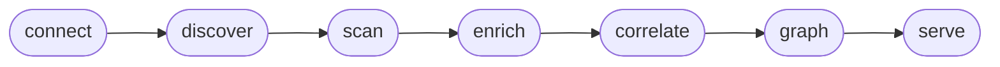
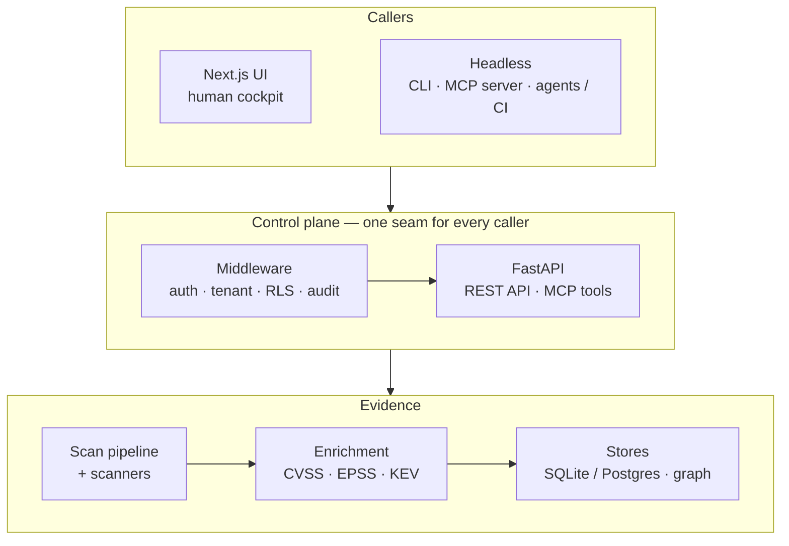

<p align="center">
  <picture>
    <source media="(prefers-color-scheme: dark)" srcset="https://raw.githubusercontent.com/msaad00/agent-bom/main/docs/images/logo-dark.svg">
    
  </picture>
</p>

<p align="center">
  <a href="https://github.com/msaad00/agent-bom/actions/workflows/ci.yml"></a>
  <a href="https://pypi.org/project/agent-bom/"></a>
  <a href="https://hub.docker.com/r/agentbom/agent-bom"></a>
  <a href="https://github.com/msaad00/agent-bom/blob/main/LICENSE"></a>
  <a href="https://securityscorecards.dev/viewer/?uri=github.com/msaad00/agent-bom"></a>
  <a href="https://glama.ai/mcp/servers/msaad00/agent-bom"></a>
  <a href="https://smithery.ai/servers/agent-bom/agent-bom"></a>
</p>
<!-- mcp-name: io.github.msaad00/agent-bom -->

<p align="center"><b>Open security scanner and self-hosted control plane for AI, MCP, and cloud infrastructure.</b></p>
<p align="center">Headless agent primitives and human cockpit surfaces over one shared evidence model.</p>

<p align="center">
  <a href="https://demo.agent-bom.com"><b>Live demo</b></a> (read-only sandbox) ·
  <a href="https://msaad00.github.io/agent-bom/">Docs</a> ·
  <a href="docs/FIRST_RUN.md">First Run</a> ·
  <a href="site-docs/deployment/overview.md">Self-host</a> ·
  <a href="https://github.com/marketplace/actions/agent-bom">GitHub Action</a> ·
  <a href="https://hub.docker.com/r/agentbom/agent-bom">Docker</a> ·
  <a href="https://github.com/msaad00/agent-bom/releases">Changelog</a>
</p>

## What it is

- **Read-only scanner + self-hosted control plane** over local projects, agent
  fleets, MCP runtimes, and cloud estates (AWS, Azure, GCP, Snowflake) —
  agentless, in your own boundary, nothing installed on targets.
- **One correlated evidence model** — findings, assets, packages, cloud
  resources, identities, agents, MCP servers, credentials, and runtime decisions
  normalize into a single `Finding` + `ContextGraph`, so the CLI, API, UI, MCP
  tools, reports, and gateway all read the same evidence.
- **Blast radius, not CVE rows** — a vulnerable package links to the MCP server
  that loads it, the tools it exposes, reachable credential references, and the
  agents that can call it.
- **Posture lanes in one place** — vulnerabilities (SCA + AST reachability),
  cloud misconfigs (CSPM / CIS), identity and authorization evidence (CIEM),
  Kubernetes (KSPM), data (DSPM), code (SAST), AI / MCP (AISPM), runtime
  gateway enforcement, and compliance evidence that reconciles from executive
  read down to each finding.

<p align="center">
  <picture>
    <source media="(prefers-color-scheme: dark)" srcset="https://raw.githubusercontent.com/msaad00/agent-bom/main/docs/images/blast-radius-dark.svg">
    
  </picture>
</p>

Coverage depth and honest boundaries:
[AI infrastructure scanning](docs/AI_INFRASTRUCTURE_SCANNING.md) ·
[product boundaries](docs/PRODUCT_BOUNDARIES.md)

## Who it's for

<p align="center">
  <picture>
    <source media="(prefers-color-scheme: dark)" srcset="https://raw.githubusercontent.com/msaad00/agent-bom/main/docs/images/persona-value-dark.svg">
    
  </picture>
</p>

- **AppSec / GRC** — SARIF, compliance packs, and audit-ready exports from one scan.
- **Platform / SRE** — fleet sync, Helm deploy, CI gates, SBOM — no separate scanner stack.
- **Agent builders** — MCP inventory, Shield SDK, optional runtime proxy or gateway enforcement.
- **Security engineers** — findings queue, attack-path drilldown, blast-radius context in CLI, API, and UI.

Four buyer lanes, two altitudes: an executive single-pane read (posture, top
risks, compliance evidence) that drills to engineer detail (reachability, path,
fix) — all from the same scan.

## How it works

One read-only pipeline from source to answer:


```mermaid
flowchart LR
    C([connect]) --> D([discover]) --> S([scan]) --> E([enrich]) --> R([correlate]) --> G([graph]) --> X([serve])
```

**connect** read-only, brokered creds · **discover** estate, agents, MCP ·
**scan** OSV, advisories, CIS, IaC · **enrich** CVSS, EPSS, KEV, reachability ·
**correlate** finding → asset → identity → config · **graph** blast radius,
attack paths · **serve** exec read + engineer drill.

Every stage is read-only and agentless, and the dashboard shows live per-stage
status rather than a black box. One package carries the full stack: the
**React / Next.js** cockpit and every headless caller hit the same **FastAPI**
control plane, behind one middleware seam, over the same pipeline and stores.
Deeper module and surface detail: [docs/ARCHITECTURE.md](docs/ARCHITECTURE.md).

<details>
<summary><b>The stack</b> — callers → control plane → evidence</summary>


```mermaid
flowchart TB
    subgraph callers ["Callers"]
        direction LR
        UI["Next.js UI<br/>human cockpit"] ~~~ HL["Headless<br/>CLI · MCP server · agents / CI"]
    end
    subgraph plane ["Control plane — one seam for every caller"]
        direction LR
        MW["Middleware<br/>auth · tenant · RLS · audit"] --> API["FastAPI<br/>REST API · MCP tools"]
    end
    subgraph evidence ["Evidence"]
        direction LR
        PIPE["Scan pipeline<br/>+ scanners"] --> ENR["Enrichment<br/>CVSS · EPSS · KEV"] --> ST["Stores<br/>SQLite / Postgres · graph"]
    end
    callers --> plane --> evidence
```

- **Frontend** — Next.js 16 · React 19 · Tailwind 4 (`ui/`). Inventory,
  findings, graph, compliance, and runtime views all render from the same API —
  no privileged "UI-only" data path.
- **Backend** — FastAPI + uvicorn, pure Python 3.11+
  (`src/agent_bom/api/server.py`). The scan pipeline runs on a bounded
  `ThreadPoolExecutor` — heavy scan/DB work stays off the event loop.
- **Stores** scale without a rewrite: SQLite (default / single node) → Postgres
  (multi-replica), plus a correlated graph store.
- **Headless parity** — the MCP server and CLI expose the same evidence to
  agents and CI, not just the UI. Server mode advertises
  75 MCP tools, 6 resources, and 8 workflow prompts; registry metadata lives
  in the committed Smithery manifest and Glama listing, with install and
  liveness checks in the integration docs.

</details>

<details>
<summary><b>Enrichment</b> — from a CVE row to real-world risk</summary>

- Scanners emit raw findings (`src/agent_bom/scanners/` — OSV batch, GHSA,
  distro and vendor advisories); `src/agent_bom/enrichment.py` layers
  **NVD CVSS · EPSS · CISA KEV** and distro advisory data on top.
- **AST reachability** (`src/agent_bom/reachability_cve.py`) resolves whether a
  vulnerable symbol is actually reachable — ranking by exploitability, not just
  CVSS.
- The result feeds severity, exploitability, and blast-radius scoring.

</details>

<details>
<summary><b>Correlated graph</b> — the moat</summary>

- `ContextGraph` / `UnifiedGraph` (`src/agent_bom/context_graph.py`) fuses
  **assets → identities → configs/misconfigs → findings → attack paths** into
  one connected model.
- Estate-scale `CONTAINS` roll-up keeps it readable and sargable at scale; the
  full contract is in [docs/graph/CONTRACT.md](docs/graph/CONTRACT.md).

</details>

<details>
<summary><b>Accuracy model</b> — match-confidence tiers and NVD key model</summary>

agent-bom normalizes advisory and distro evidence into canonical CVE findings
with match-confidence tiers:

`distro_confirmed` > `osv_range` > `osv_ecosystem` > `unfixed_distro` > `nvd_cpe_candidate`

Distro-confirmed findings are treated as confirmed. Optional NVD CPE candidate
matching widens long-tail OS/vendor software coverage, but remains review-grade
and off by default.

**NVD key model.** End users do not need an NVD API key. CVE/CPE enrichment
ships through the distributed vulnerability database. `NVD_API_KEY` is only an
optional self-hosted freshness knob for operators rebuilding or refreshing the
database.

Matching mechanics and release evidence:
[vulnerability matching](docs/VULNERABILITY_MATCHING.md) ·
[scanner accuracy baseline](docs/SCANNER_ACCURACY_BASELINE.md)

</details>

## See it

<p align="center">
  
</p>

Try the [live demo](https://demo.agent-bom.com) (read-only sandbox), or browse
the packaged dashboard below.

<details>
<summary><b>Product screenshots</b> — packaged dashboard on seeded demo data</summary>

<p align="center">
  
  <br/><em>Overview command center — posture ring, findings breakdown, scan coverage, environment tabs</em>
</p>

<p align="center">
  
  <br/><em>Connections hub — connector gallery across cloud, code, AI, and data sources</em>
</p>

<p align="center">
  
  <br/><em>New Scan — connected account, ad-hoc, and public repo modes</em>
</p>

<p align="center">
  
  <br/><em>Security graph — fix-first attack-path queue with evidence export</em>
</p>

<p align="center">
  
  <br/><em>Blast radius — agent → MCP server → package → tool → CVE</em>
</p>

<p align="center">
  
  <br/><em>Runtime gateway — KPI rollup and live tool-call feed</em>
</p>

<p align="center">
  
  <br/><em>Findings — package and CVE evidence from the seeded demo estate</em>
</p>

<p align="center">
  
  <br/><em>Remediation — prioritized fix list with framework context</em>
</p>

<sub>Synthetic seeded evidence for docs proof, captured from the real Next.js
routes with a visible <strong>Demo data — sample environment</strong> label — not a
claim these entities came from a buyer environment. Regenerate from the UI package
with <code>npm run capture:product-proof</code> (see
<a href="docs/CAPTURE.md">docs/CAPTURE.md</a>). CLI demo GIF:
<code>bash scripts/render_demo_gif.sh</code>.</sub>

</details>

## First run

```bash
pip install agent-bom
agent-bom scan -p .
```

`agent-bom scan -p .` prints a posture grade, blast radius, and fix-first
findings inline — nothing to open. Optional next steps:

```bash
agent-bom db update                     # local vuln DB for --offline package/image scans
agent-bom quickstart --run --offline    # sample scan, gateway policy seed, dashboard data
agent-bom scan -p . -f html -o agent-bom-report.html
```

Then review posture as a team: `pip install 'agent-bom[ui]' && agent-bom serve`.
Guided path: [docs/FIRST_RUN.md](docs/FIRST_RUN.md)

## Run it anywhere

Every surface writes into the same `Finding` and `ContextGraph` model — pick
the entry point that matches your role:

| Need | Surface | First action | Main artifact |
|---|---|---|---|
| Scan a repo, image, or local agent config | CLI / CI | `agent-bom scan -p .` (or the [GitHub Action](https://github.com/marketplace/actions/agent-bom)) | JSON, SARIF, SBOM, HTML |
| Connect cloud and data-estate evidence | Cloud connectors | `agent-bom connect aws` then `agent-bom cloud scan` | assets, CIS findings, graph edges |
| Review posture as a team | API + dashboard | `pip install 'agent-bom[ui]' && agent-bom serve` | findings, graph, audit, compliance |
| Give agents security tools | MCP server | `agent-bom mcp server` | strict MCP tool responses |
| Govern runtime tool calls | Proxy / gateway | `agent-bom gateway serve` | allow/warn/block audit trail |
| Package evidence for audit | Reports / exports | `agent-bom scan -p . -f sarif -o findings.sarif` | SARIF, CycloneDX, SPDX, HTML/PDF, compliance bundle |

Beyond the basics — `agent-bom graph` (multi-hop exposure paths),
`agent-bom remediate -p .` (advisory fix plan),
`agent-bom identity credential-expiry`, `agent-bom cost forecast`, and the CI
gate `uses: msaad00/agent-bom@v0.96.3`. Full command map:
[docs/CLI_MAP.md](docs/CLI_MAP.md) · role routing:
[docs/START_HERE.md](docs/START_HERE.md) · all entry points and auth
boundaries: [docs/PRODUCT_MAP.md](docs/PRODUCT_MAP.md)

**Deploy targets** — you run the control plane in your own boundary (no managed
public SaaS in this repo yet), fastest → most-managed:

- **Docker Compose** — fastest; one file, loopback by default → [pilot compose](deploy/docker-compose.pilot.yml)
- **Helm / Kubernetes** — cluster-native chart → [chart](deploy/helm/agent-bom)
- **EKS** — opinionated Terraform module → [module](deploy/terraform/platform-eks)
- **CloudFormation** — one-click AWS stack → [templates](deploy/cloudformation)
- **Snowflake (SPCS native app)** — host entirely inside your own Snowflake account → [install guide](docs/snowflake-native-app/INSTALL.md)

<details>
<summary><b>Local bring-up</b> — Docker Compose in two commands</summary>

```bash
curl -fsSL https://raw.githubusercontent.com/msaad00/agent-bom/main/deploy/docker-compose.pilot.yml -o docker-compose.pilot.yml
docker compose -f docker-compose.pilot.yml up -d
# Dashboard -> http://localhost:3000
```

Pilot compose binds to `127.0.0.1` with loopback CORS only. Use
`docker-compose.platform.yml` or [docs/HOSTED_POC.md](docs/HOSTED_POC.md) before
sharing a link. Full guides: [Deploy anywhere](docs/DEPLOY_PLATFORM.md).

</details>

## Connect once

The honest model — **connect once, then every action runs through the stored
connection.** There is never a per-action credential prompt and no "paste your
laptop login" to run a scan or push a result.

- **Humans** sign in via **OAuth / OIDC / SAML SSO** (standard providers plus a
  Snowflake OAuth authorization-code + PKCE flow), with **SCIM** for user and
  group provisioning (`src/agent_bom/api/{oidc,saml,scim}.py`,
  `snowflake_oauth.py`).
- **Agents / CI** authenticate with **scoped API keys / tokens**.
- **Sources** are onboarded **once** through read-only, agentless, brokered
  connectors — a single least-privilege managed role per source with
  short-lived, brokered credentials (e.g. AWS `sts:AssumeRole`); connection
  secrets are write-only (encrypted at rest, never read back).

Auth, tenant isolation, and audit are enforced once in middleware for the UI,
agents, and SDKs alike — there is no privileged backdoor.

Cloud connectors are opt-in, default-off, and read no secret values.
`agent-bom connect <provider>` prints the grant template and enable flag
without network I/O until you opt in:

| Cloud | Enable | Scan |
|---|---|---|
| AWS | `AGENT_BOM_AWS_INVENTORY=1` | `agent-bom cloud aws` |
| Azure | `AGENT_BOM_AZURE_INVENTORY=1` | `agent-bom cloud azure` |
| GCP | `AGENT_BOM_GCP_INVENTORY=1` | `agent-bom cloud gcp` |
| Snowflake | SSO or key-pair auth | `pip install 'agent-bom[snowflake]'` then `agent-bom scan --snowflake` |

Snowflake auth defaults to browser SSO (`externalbrowser`); use
`SNOWFLAKE_AUTHENTICATOR=snowflake_jwt` with `SNOWFLAKE_PRIVATE_KEY_PATH` for
CI. Setup and the exact grant per provider:
[docs/CLOUD_CONNECT.md](docs/CLOUD_CONNECT.md) · intake map:
[docs/DATA_SOURCES.md](docs/DATA_SOURCES.md) · enterprise auth surface:
[docs/ENTERPRISE.md](docs/ENTERPRISE.md)

## Trust

- Read-only discovery by default; no mandatory telemetry.
- Credential values redacted; env names preserved for explainable exposure paths.
- Exports: JSON, SARIF, CycloneDX, SPDX, Parquet, CSV, Markdown, HTML, PDF, compliance bundles.
- Tenant scope, auth boundaries, and audit evidence on API/runtime paths.

[Threat model](docs/THREAT_MODEL.md) · [Pentest readiness](docs/PENTEST_READINESS.md) ·
[Python client](docs/PYTHON_API.md) · [Go client](sdks/go/README.md) ·
[Release verification](docs/RELEASE_VERIFICATION.md) ·
[MCP security model](docs/MCP_SECURITY_MODEL.md)

## Contributing

Contributions are welcome. Start with [CONTRIBUTING.md](CONTRIBUTING.md),
[.agents/AGENTS.md](.agents/AGENTS.md), and the
[open issues](https://github.com/msaad00/agent-bom/issues).

License: Apache-2.0.
