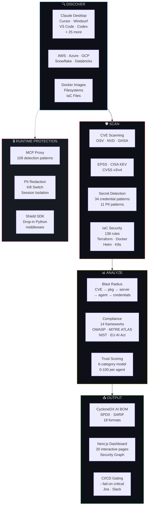
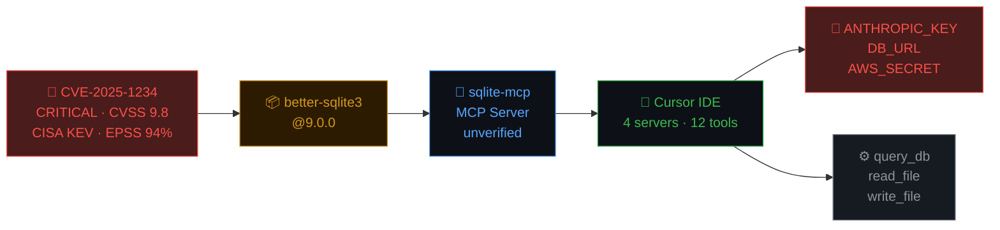
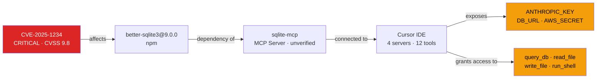
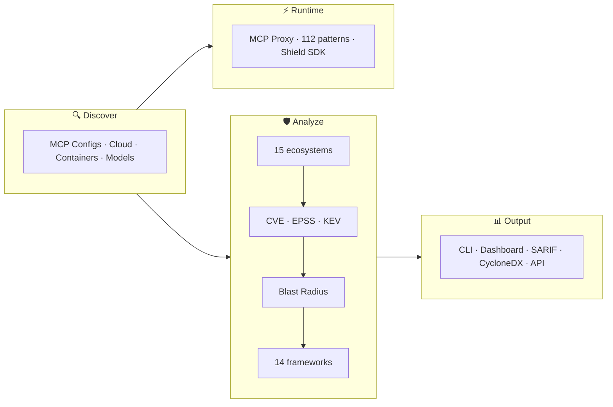

<p align="center">
  <picture>
    <source media="(prefers-color-scheme: dark)" srcset="https://raw.githubusercontent.com/msaad00/agent-bom/main/docs/images/logo-dark.svg">
    
  </picture>
</p>

<p align="center">
  <a href="https://github.com/msaad00/agent-bom/actions/workflows/ci.yml"></a>
  <a href="https://pypi.org/project/agent-bom/"></a>
  <a href="https://hub.docker.com/r/agentbom/agent-bom"></a>
  <a href="https://github.com/msaad00/agent-bom/blob/main/LICENSE"></a>
  <a href="https://securityscorecards.dev/viewer/?uri=github.com/msaad00/agent-bom"></a>
  <a href="https://www.bestpractices.dev/projects/12114"></a>
<a href="https://github.com/msaad00/agent-bom/stargazers"></a>
  <a href="https://github.com/msaad00/agent-bom/discussions"></a>
</p>
<!-- mcp-name: io.github.msaad00/agent-bom -->

<p align="center"><b>Your AI agent's dependencies have a CVE. Which credentials leak?</b></p>

```
CVE-2025-1234  (CRITICAL · CVSS 9.8 · CISA KEV)
  |── better-sqlite3@9.0.0  (npm)
       |── sqlite-mcp  (MCP Server · unverified · root)
            |── Cursor IDE  (Agent · 4 servers · 12 tools)
            |── ANTHROPIC_KEY, DB_URL, AWS_SECRET  (Credentials exposed)
            |── query_db, read_file, write_file, run_shell  (Tools at risk)

 Fix: upgrade better-sqlite3 → 11.7.0
```

**agent-bom maps the blast radius**: CVE → package → MCP server → AI agent → credentials → tools.

```bash
pip install agent-bom
agent-bom agents
```

<p align="center">
  
</p>

---

## How it works


```mermaid
flowchart TB
    subgraph DISCOVER["🔍 DISCOVER"]
        direction LR
        D1["Claude Desktop\nCursor · Windsurf\nVS Code · Codex\n+ 25 more"]
        D2["AWS · Azure · GCP\nSnowflake · Databricks"]
        D3["Docker Images\nFilesystems\nIaC Files"]
    end

    subgraph SCAN["🛡️ SCAN"]
        direction LR
        S1["CVE Scanning\nOSV · NVD · GHSA"]
        S2["EPSS · CISA KEV\nCVSS v3/v4"]
        S3["Secret Detection\n34 credential patterns\n11 PII patterns"]
        S4["IaC Security\n138 rules\nTerraform · Docker\nHelm · K8s"]
    end

    subgraph ANALYZE["📊 ANALYZE"]
        direction LR
        A1["Blast Radius\nCVE → pkg → server\n→ agent → credentials"]
        A2["Compliance\n14 frameworks\nOWASP · MITRE ATLAS\nNIST · EU AI Act"]
        A3["Trust Scoring\n6-category model\n0-100 per agent"]
    end

    subgraph OUTPUT["📤 OUTPUT"]
        direction LR
        O1["CycloneDX AI BOM\nSPDX · SARIF\n18 formats"]
        O2["Next.js Dashboard\n20 interactive pages\nSecurity Graph"]
        O3["CI/CD Gating\n--fail-on critical\nJira · Slack"]
    end

    subgraph PROTECT["🔒 RUNTIME PROTECTION"]
        direction LR
        P1["MCP Proxy\n109 detection patterns"]
        P2["PII Redaction\nKill Switch\nSession Isolation"]
        P3["Shield SDK\nDrop-in Python\nmiddleware"]
    end

    DISCOVER --> SCAN --> ANALYZE --> OUTPUT
    DISCOVER -.-> PROTECT

    style DISCOVER fill:#0d1117,stroke:#58a6ff,color:#c9d1d9
    style SCAN fill:#0d1117,stroke:#f85149,color:#c9d1d9
    style ANALYZE fill:#0d1117,stroke:#d29922,color:#c9d1d9
    style OUTPUT fill:#0d1117,stroke:#3fb950,color:#c9d1d9
    style PROTECT fill:#161b22,stroke:#f778ba,color:#c9d1d9
```

### Blast Radius — what makes agent-bom different


```mermaid
flowchart LR
    CVE["🔴 CVE-2025-1234\nCRITICAL · CVSS 9.8\nCISA KEV · EPSS 94%"]
    PKG["📦 better-sqlite3\n@9.0.0"]
    SRV["🔧 sqlite-mcp\nMCP Server\nunverified"]
    AGT["🤖 Cursor IDE\n4 servers · 12 tools"]
    CRED["🔑 ANTHROPIC_KEY\nDB_URL\nAWS_SECRET"]
    TOOL["⚙️ query_db\nread_file\nwrite_file"]

    CVE --> PKG --> SRV --> AGT --> CRED
    AGT --> TOOL

    style CVE fill:#4a1c1c,stroke:#f85149,color:#f85149
    style PKG fill:#2d1b00,stroke:#d29922,color:#d29922
    style SRV fill:#0d1117,stroke:#58a6ff,color:#58a6ff
    style AGT fill:#0d1117,stroke:#3fb950,color:#3fb950
    style CRED fill:#4a1c1c,stroke:#f85149,color:#f85149
    style TOOL fill:#161b22,stroke:#8b949e,color:#8b949e
```

---

## What it does

Security scanner purpose-built for AI infrastructure and supply chain.

**AI Supply Chain Security:**
1. **Discovers** AI agents + MCP servers — 30 client types, auto-detected from config files
2. **Scans source code** — AST analysis extracts system prompts, guardrails, tool signatures from Python AI frameworks (LangChain, CrewAI, OpenAI Agents SDK, and 7 more)
3. **Generates an AI BOM** — CycloneDX 1.6 with native ML extensions (modelCard, datasets, training metadata)
4. **Scans for CVEs** — 15 ecosystems checked against OSV + NVD + GHSA + EPSS + CISA KEV
5. **Maps blast radius** — CVE → package → MCP server → AI agent → credentials → tools
6. **Detects secrets** — 34 credential patterns + 11 PII patterns across source, config, and .env files
7. **Enforces at runtime** — MCP proxy with 112 detection patterns, PII redaction, zero-trust session isolation
8. **Verifies supply chain** — SLSA provenance (npm), PEP 740 attestations (PyPI), Go checksum DB

**Also scans:** container images, filesystems, IaC (138 rules), cloud posture (AWS/Azure/GCP CIS benchmarks).

**Shield SDK** — drop-in Python middleware for any AI agent pipeline:
```python
from agent_bom.shield import Shield
shield = Shield(deep=True)
alerts = shield.check_tool_call("exec", {"command": "rm -rf /"})
safe = shield.redact(response_text)  # [REDACTED:OpenAI API Key]
```

Read-only. Agentless. No secrets leave your machine.

---

## Quick start

```bash
pip install agent-bom
```

```bash
# AI agent discovery + vulnerability scanning + blast radius
agent-bom agents

# Pre-install CVE gate
agent-bom check flask@2.0.0

# MCP security proxy (112 patterns, 7 detectors, PII redaction)
agent-bom proxy "npx @mcp/server-filesystem /tmp"

# Container image scan
agent-bom image nginx:latest

# IaC misconfigurations (138 rules: Dockerfile, K8s, Terraform, CloudFormation, Helm)
agent-bom iac Dockerfile k8s/ infra/main.tf

# Cloud posture + CIS benchmarks
agent-bom cloud aws

# Dependency graph export (Neo4j, GraphML, Graphviz, Mermaid)
agent-bom graph report.json --format cypher --output import.cypher

# Red team — test your defenses (100% detection, 0% false positives)
python -c "from agent_bom.red_team import run_red_team; print(run_red_team()['detection_rate'])"
```

<details>
<summary><b>All commands</b></summary>

```
Scanning:     agents, image, fs, iac, sbom, secrets, code, cloud, check, verify
Runtime:      proxy, audit
MCP:          mcp [inventory|introspect|registry|server|where|validate]
Reporting:    graph, report [history|diff|rescan|analytics|dashboard]
Governance:   policy [check|template|apply], fleet [sync|list|stats], serve, api, schedule
Database:     db [update|status]
Utility:      completions, upgrade
```

</details>

<details>
<summary><b>CI/CD usage</b></summary>

```yaml
# GitHub Actions
- run: agent-bom agents --format sarif --output results.sarif
- run: agent-bom image myapp:latest --fail-on-severity critical
- run: agent-bom iac infra/ --format sarif
- run: agent-bom cloud aws --format json
- run: agent-bom check flask@2.0.0
```

</details>

---

## Instruction file trust

AI agents run on instruction files — CLAUDE.md, .cursorrules, AGENTS.md. A malicious instruction file is a supply chain attack with full agent permissions.

```
agent-bom agents --skill-only

CLAUDE.md  →  SUSPICIOUS (high confidence)
  [CRITICAL] Credential/secret file access
             "cat ~/.aws/credentials" detected — reads secret files
  [HIGH]     Safety confirmation bypass
             "--dangerously-skip-permissions" found — disables all guardrails
  [HIGH]     Typosquatting risk: server name "filessystem" (→ filesystem)
```

---

## MCP server

33 security tools available inside any MCP-compatible AI assistant.

```bash
pip install 'agent-bom[mcp-server]'
agent-bom mcp server
```

```json
{
  "mcpServers": {
    "agent-bom": {
      "command": "agent-bom",
      "args": ["mcp", "server"]
    }
  }
}
```

Also on [Glama](https://glama.ai/mcp/servers/@msaad00/agent-bom), [Smithery](integrations/smithery.yaml), [MCP Registry](integrations/mcp-registry/server.json), and [OpenClaw](integrations/openclaw/SKILL.md).

---

## Install & deploy

```bash
pip install agent-bom                  # CLI
docker run --rm agentbom/agent-bom agents  # Docker (linux/amd64 + arm64)
```

| Mode | Command | Best for |
|------|---------|----------|
| CLI | `agent-bom agents` | Local audit |
| GitHub Action | `uses: msaad00/agent-bom@v0.74.1 | CI/CD + SARIF |
| Docker | `docker run agentbom/agent-bom agents` | Isolated scans |
| MCP Server | `agent-bom mcp server` | Inside any AI assistant |
| Runtime proxy | `agent-bom proxy` | MCP traffic enforcement |
| Shield SDK | `from agent_bom.shield import Shield` | In-process protection |
| Dashboard | `agent-bom serve` | API + Next.js UI |

<details>
<summary><b>GitHub Action</b></summary>

```yaml
- uses: msaad00/agent-bom@v0.74.1
  with:
    severity-threshold: high
    upload-sarif: true
    enrich: true
    fail-on-kev: true
```

</details>

<details>
<summary><b>Install extras</b></summary>

| Extra | Command |
|-------|---------|
| Cloud (all) | `pip install 'agent-bom[cloud]'` |
| MCP server | `pip install 'agent-bom[mcp-server]'` |
| REST API | `pip install 'agent-bom[api]'` |
| Dashboard | `pip install 'agent-bom[ui]'` |

</details>

---

## How it works

<p align="center">
  <picture>
    <source media="(prefers-color-scheme: dark)" srcset="https://raw.githubusercontent.com/msaad00/agent-bom/main/docs/images/scan-pipeline-dark.svg">
    
  </picture>
</p>

1. **Discover** — auto-detect MCP configs, Docker images, K8s pods, cloud resources, model files
2. **Scan** — package names + versions sent to OSV.dev, NVD, EPSS, CISA KEV (no secrets leave your machine)
3. **Analyze** — blast radius mapping, tool poisoning detection, compliance tagging, posture scoring
4. **Report** — JSON, SARIF, CycloneDX 1.6, SPDX 3.0, HTML, JUnit XML, and more

<details>
<summary><b>What it scans</b></summary>

| Source | How |
|--------|-----|
| MCP configs | Auto-discover (30 clients + Docker Compose) |
| Docker images | Grype / Syft / Docker CLI fallback |
| Kubernetes | kubectl across namespaces |
| Cloud providers | AWS, Azure, GCP, Databricks, Snowflake |
| AI platforms | OpenAI, HuggingFace, W&B, MLflow, Ollama |
| IaC files | Dockerfile, K8s, Terraform, CloudFormation, Helm (138 rules) |
| Model files | 13 formats (.gguf, .safetensors, .pkl, ...) |
| Instruction files | CLAUDE.md, .cursorrules, AGENTS.md |
| Existing SBOMs | CycloneDX / SPDX import |
| 15 ecosystems | Python, Node.js, Go, Rust, Java, .NET, Ruby, PHP, Swift, Conda, Alpine, Debian, RPM, Hex, Pub |

</details>

<details>
<summary><b>Output formats</b></summary>

JSON, SARIF, CycloneDX 1.6 (with ML BOM), SPDX 3.0, HTML, GraphML, Neo4j Cypher, JUnit XML, CSV, Markdown, Mermaid, SVG, Graph HTML, Prometheus, Badge, OCSF v1.1 — 18 formats.

```bash
agent-bom agents -f sarif -o results.sarif     # GitHub Security tab
agent-bom agents -f html -o report.html        # Interactive dashboard
agent-bom agents -f cyclonedx -o sbom.json     # CycloneDX 1.6
```

</details>

---

## Compliance (16 frameworks)

Every finding is tagged with applicable controls across 16 security and compliance frameworks:

| Framework | Coverage |
|-----------|----------|
| OWASP LLM Top 10 | 7/10 categories (3 out of scope) |
| OWASP MCP Top 10 | 10/10 categories |
| OWASP Agentic Top 10 | 10/10 categories |
| MITRE ATLAS | 30+ techniques mapped |
| MITRE ATT&CK | Enterprise technique mapping |
| NIST AI RMF | All subcategories |
| NIST CSF 2.0 | All functions |
| NIST 800-53 Rev 5 | 24 controls |
| FedRAMP Moderate | Baseline controls |
| CIS Controls v8 | 12 controls |
| ISO 27001:2022 | 9 controls |
| SOC 2 TSC | All 5 criteria |
| EU AI Act | 6 articles |
| CMMC 2.0 Level 2 | 17 practices |

Policy-as-code enforcement: write rules against any framework tag in YAML/JSON expressions.

---

## Trust & transparency

| When | What's sent | Where | Opt out |
|---|---|---|---|
| `agent-bom agents` | Package names + versions only | OSV API | `--offline` |
| `--enrich` | CVE IDs only | NVD, EPSS, KEV APIs | Don't use `--enrich` |
| Everything else | **Nothing** | Nowhere | N/A |

No source code, no secrets, no telemetry ever leave your machine. Every release is [Sigstore-signed](docs/PERMISSIONS.md). See [SECURITY_ARCHITECTURE.md](docs/SECURITY_ARCHITECTURE.md) for the full trust model.

---

## Blast radius — how it maps


```mermaid
graph LR
    CVE["CVE-2025-1234<br/>CRITICAL · CVSS 9.8"]
    PKG["better-sqlite3@9.0.0<br/>npm"]
    SRV["sqlite-mcp<br/>MCP Server · unverified"]
    AGT["Cursor IDE<br/>4 servers · 12 tools"]
    CRED["ANTHROPIC_KEY<br/>DB_URL · AWS_SECRET"]
    TOOL["query_db · read_file<br/>write_file · run_shell"]

    CVE -->|affects| PKG
    PKG -->|dependency of| SRV
    SRV -->|connected to| AGT
    AGT -->|exposes| CRED
    AGT -->|grants access to| TOOL

    style CVE fill:#dc2626,color:#fff
    style CRED fill:#f59e0b,color:#000
    style TOOL fill:#f59e0b,color:#000
```

Traditional scanners stop at `CVE → Package`. agent-bom maps the full chain to show which credentials and tools are actually at risk.

## AI supply chain — what we scan

```
Model weights ─── HuggingFace, Ollama ──── provenance + hash verification
     │
AI Framework ─── LangChain, CrewAI, OpenAI ── AST analysis: prompts, guardrails, tools
     │
MCP Server ───── npx @mcp/server-fs ──────── config parsing + tool poisoning detection
     │
Packages ─────── express@4.17.1 ───────────── 15 ecosystems, CVE/EPSS/KEV scanning
     │
AI Agent ─────── Claude Desktop, Cursor ───── 30 MCP clients auto-detected
     │
Credentials ──── API keys, tokens ──────────── exposure mapping + PII redaction
     │
Tools ────────── read_file, exec_cmd ──────── capability classification + blast radius
```

**Also scans:** container images, filesystems, IaC (Dockerfile/K8s/Terraform/CloudFormation/Helm), cloud infrastructure (AWS/Azure/GCP CIS benchmarks), secrets in source code.

## Architecture


```mermaid
graph LR
    subgraph D["🔍 Discover"]
        D1["MCP Configs · Cloud · Containers · Models"]
    end
    subgraph A["🛡 Analyze"]
        A1["15 ecosystems"] --> A2["CVE · EPSS · KEV"] --> A3["Blast Radius"] --> A4["14 frameworks"]
    end
    subgraph O["📊 Output"]
        O1["CLI · Dashboard · SARIF · CycloneDX · API"]
    end
    subgraph R["⚡ Runtime"]
        R1["MCP Proxy · 112 patterns · Shield SDK"]
    end
    D --> A --> O
    D --> R
```

<details>
<summary><b>Architecture stack diagram</b></summary>

<p align="center">
  <picture>
    <source media="(prefers-color-scheme: dark)" srcset="https://raw.githubusercontent.com/msaad00/agent-bom/main/docs/images/architecture-stack-dark.svg">
    
  </picture>
</p>

</details>

See [docs/ARCHITECTURE.md](docs/ARCHITECTURE.md) for full diagrams. New to MCP security? [docs/MCP_SECURITY_MODEL.md](docs/MCP_SECURITY_MODEL.md) explains attack vectors and how agent-bom addresses them.

---

## Contributing

```bash
git clone https://github.com/msaad00/agent-bom.git && cd agent-bom
pip install -e ".[dev]"
pytest && ruff check src/
```

See [CONTRIBUTING.md](CONTRIBUTING.md) | [SECURITY.md](SECURITY.md) | [CODE_OF_CONDUCT.md](CODE_OF_CONDUCT.md)

---

Apache 2.0 — [LICENSE](LICENSE)
