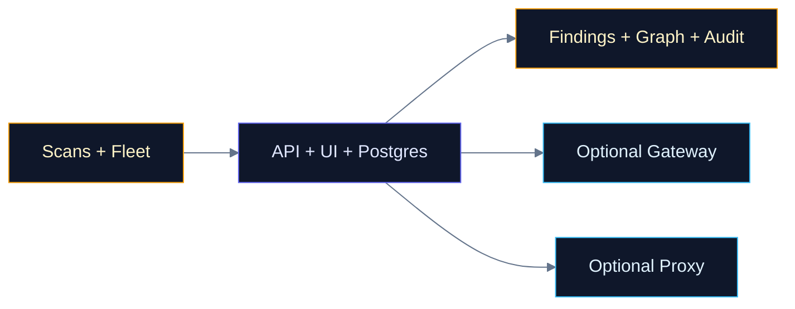

<p align="center">
  <picture>
    <source media="(prefers-color-scheme: dark)" srcset="https://raw.githubusercontent.com/msaad00/agent-bom/main/docs/images/logo-dark.svg">
    
  </picture>
</p>

<p align="center">
  <a href="https://github.com/msaad00/agent-bom/actions/workflows/ci.yml"></a>
  <a href="https://pypi.org/project/agent-bom/"></a>
  <a href="https://hub.docker.com/r/agentbom/agent-bom"></a>
  <a href="https://github.com/msaad00/agent-bom/blob/main/LICENSE"></a>
  <a href="https://securityscorecards.dev/viewer/?uri=github.com/msaad00/agent-bom"></a>
</p>
<!-- mcp-name: io.github.msaad00/agent-bom -->

<p align="center"><b>Open security scanner for AI supply chain and infrastructure — agents, MCP servers, packages, containers, cloud (AWS, Azure, GCP, Snowflake, Databricks, CoreWeave, Nebius), GPU, and runtime.</b></p>

<p align="center">Every CVE in your AI stack is a credential leak waiting to happen. <code>agent-bom</code> follows the chain end-to-end and tells you exactly which fix collapses it.</p>

<p align="center">
  <picture>
    <source media="(prefers-color-scheme: dark)" srcset="https://raw.githubusercontent.com/msaad00/agent-bom/main/docs/images/blast-radius-dark.svg">
    
  </picture>
</p>

```text
CVE-2025-1234  (CRITICAL · CVSS 9.8 · CISA KEV)
  |── better-sqlite3@9.0.0  (npm)
       |── sqlite-mcp  (MCP Server · unverified · root)
            |── Cursor IDE  (Agent · 4 servers · 12 tools)
            |── ANTHROPIC_KEY, DB_URL, AWS_SECRET  (Credentials exposed)
            |── query_db, read_file, write_file, run_shell  (Tools at risk)

 Fix: upgrade better-sqlite3 → 11.7.0
```

Blast radius is the core idea: `CVE -> package -> MCP server -> agent -> credentials -> tools`. CWE-aware impact keeps a DoS from being reported like credential compromise.

## Try the demo

```bash
agent-bom agents --demo --offline
```

The demo uses a curated sample so the output stays reproducible across releases. Every CVE shown is a real OSV/GHSA match against a genuinely vulnerable package version — no fabricated findings (locked in by [`tests/test_demo_inventory_accuracy.py`](tests/test_demo_inventory_accuracy.py)). For a real scan, run `agent-bom agents`, or add `-p .` to fold project manifests and lockfiles into the same result.

Want an inspectable sample before scanning your own repo? Run the bundled
first-run AI stack:

```bash
agent-bom samples first-run
agent-bom agents --inventory agent-bom-first-run/inventory.json -p agent-bom-first-run --enrich
```

That sample includes agent inventory, MCP server definitions, placeholder
credential environment variable names, Python/npm manifests, and a prompt file.
See [`docs/FIRST_RUN.md`](docs/FIRST_RUN.md) for the guided path from CLI to
dashboard.

<p align="center">
  
</p>

## Quick start

```bash
pip install agent-bom                  # CLI
# pipx install agent-bom               # isolated global install
# uvx agent-bom --help                 # ephemeral run

agent-bom agents                              # discover + scan local AI agents and MCP servers
agent-bom agents -p .                         # add project lockfiles + manifests
agent-bom samples first-run                   # write an inspectable sample AI stack
agent-bom check flask@2.0.0 --ecosystem pypi  # pre-install CVE gate
agent-bom image nginx:latest                  # container image scan
agent-bom iac Dockerfile k8s/ infra/main.tf   # IaC scan, optionally `--k8s-live`
```

Recommended pilot on one workstation:

```bash
curl -fsSL https://raw.githubusercontent.com/msaad00/agent-bom/main/deploy/docker-compose.pilot.yml -o docker-compose.pilot.yml
docker compose -f docker-compose.pilot.yml up -d
# Dashboard -> http://localhost:3000
```

Recommended full self-hosted path in your own AWS / EKS:

```bash
export AWS_REGION="<your-aws-region>"
scripts/deploy/install-eks-reference.sh \
  --cluster-name corp-ai \
  --region "$AWS_REGION" \
  --hostname agent-bom.internal.example.com \
  --enable-gateway
```

Advanced/manual path from a checked-out repo:

```bash
helm upgrade --install agent-bom deploy/helm/agent-bom \
  --namespace agent-bom --create-namespace \
  --set controlPlane.enabled=true \
  -f deploy/helm/agent-bom/examples/eks-production-values.yaml
```

> **Note:** `controlPlane.enabled` defaults to `false` (scanner-only render). The
> API, dashboard, gateway, proxy, firewall, and Postgres only deploy when
> `controlPlane.enabled=true`. The bundled example values files set this for
> you; if you build your own values file, set the flag explicitly.

After the first scan:

```bash
agent-bom agents -p . --remediate remediation.md                  # fix-first plan
agent-bom agents -p . --compliance-export fedramp -o evidence.zip # tamper-evident evidence bundle
pip install 'agent-bom[ui]' && agent-bom serve                    # API + bundled local UI
```

<details open>
<summary><b>Product views</b> — dashboard, remediation, and graph surfaces</summary>

## Product views

These come from the live product path, using the built-in demo data pushed through the API. See [`docs/CAPTURE.md`](docs/CAPTURE.md) for the canonical capture protocol.
They are captured from the packaged Next.js dashboard served by `agent-bom serve`, not from the Snowflake Streamlit compatibility path.

### Dashboard — Risk overview

The landing page is the **Risk overview**: a letter-grade gauge, the four headline counters (actively exploited · credentials exposed · reachable tools · top attack-path risk), the security-posture grade with sub-scores (policy + controls, open evidence, packages + CVEs, reach + exposure, MCP configuration), and the score breakdown for each driver.


### Dashboard — Attack paths and exposure

The second dashboard frame focuses on the fix-first path list and the coverage / backlog KPIs below it, so the attack-path drilldown stays readable without a tall stitched screenshot.


### Fix-first remediation

Risk, reach, fix version, and framework context in one review table — operators act without jumping between pages.


### Agent mesh

Agent-centered shared-infrastructure graph — selected agents, their shared MCP servers, tools, packages, and findings.


</details>

<details>
<summary><b>How a scan moves through the system</b> — five stages, no source code or credentials leave your machine</summary>

<p align="center">
  <picture>
    <source media="(prefers-color-scheme: dark)" srcset="https://raw.githubusercontent.com/msaad00/agent-bom/main/docs/images/scan-pipeline-dark.svg">
    
  </picture>
</p>

Inside the engine: parsers, taint, call graph, blast-radius scoring. External calls are limited to package metadata, version lookups, and CVE enrichment.

</details>

---

# Enterprise self-hosted deployment

**`agent-bom` runs inside your infrastructure: your VPC, your EKS cluster, your Postgres, your SSO, your KMS. No hosted control plane. No mandatory vendor backend. No mandatory telemetry.**

The recommended motion is simple:

- **start with inventory** using scans and fleet sync
- **prove findings, graph, and blast radius**
- **add runtime later** with proxy or gateway only where enforcement is worth it

That keeps the day-1 path easy while still giving you a full runtime story later.

Two diagrams explain the self-hosted shape without collapsing into one overloaded chart:

- [Enterprise Self-Hosted Topology](site-docs/deployment/overview.md#enterprise-self-hosted-topology)
- [Enterprise Self-Hosted Data and Runtime Flow](site-docs/deployment/overview.md#enterprise-self-hosted-data-and-runtime-flow)


```mermaid
%%{init: {"theme":"base","themeVariables":{"primaryColor":"#0f172a","primaryBorderColor":"#6366f1","primaryTextColor":"#e0e7ff","lineColor":"#64748b"}}}%%
flowchart LR
    classDef ctrl fill:#0f172a,stroke:#6366f1,color:#e0e7ff
    classDef data fill:#0f172a,stroke:#f59e0b,color:#fef3c7
    classDef edge fill:#0f172a,stroke:#38bdf8,color:#e0f2fe

    Scan["Scans + Fleet"]:::data --> API["API + UI + Postgres"]:::ctrl
    API --> Graph["Findings + Graph + Audit"]:::data
    API --> Gateway["Optional Gateway"]:::edge
    API --> Proxy["Optional Proxy"]:::edge
```

Deployment truth:

- the **browser UI drives workflows**
- the **API owns auth, RBAC, tenant scope, graph, audit, and policy**
- **workers do scans and ingest**
- **fleet gives inventory without proxy**
- **proxy and gateway are peer runtime surfaces**, not a required serial chain

## One product, two deployable images

- `agentbom/agent-bom` = CLI, API, jobs, gateway, proxy, MCP server mode
- `agentbom/agent-bom-ui` = browser control-plane UI

Use this split:

| Goal | Recommended path | Default choice |
|---|---|---|
| **Fastest pilot** | [`deploy/docker-compose.pilot.yml`](deploy/docker-compose.pilot.yml) | one machine, API + UI |
| **Production self-hosted** | [`scripts/deploy/install-eks-reference.sh`](scripts/deploy/install-eks-reference.sh) | EKS + Postgres |
| **Advanced/manual** | Helm + your own values layering | only when you intentionally want to diverge |

Runtime choices:

| Need | Use |
|---|---|
| **Inventory first** | scans + fleet |
| **Shared remote MCP traffic** | `agent-bom gateway serve` |
| **Workload-local inline enforcement** | selected `agent-bom proxy` sidecars or local wrappers |
| **Node-wide runtime coverage** | optional monitor only if your platform team explicitly wants a DaemonSet |

Current graph scale boundary:

- the graph is strong for pilot and mid-market investigation flows, but larger tenants should stay windowed by snapshot, page, search, and blast-radius drilldown instead of expecting one giant browser canvas to stay smooth
- operator sizing guidance and the shipped benchmark harness live in [Performance, Sizing, and Benchmarks](site-docs/deployment/performance-and-sizing.md)

Backend defaults:

| Layer | Default | Add later only if needed |
|---|---|---|
| **control plane** | Postgres | Snowflake only when the published backend parity is the reason to choose it |
| **analytics / archive** | none required | ClickHouse, OTEL, S3 |

## Start here by scenario

| Need | Start here |
|---|---|
| fastest local pilot | [Deployment Overview](site-docs/deployment/overview.md) |
| self-host in vanilla AWS / EKS | [Vanilla EKS Quickstart](site-docs/deployment/eks-vanilla-quickstart.md) |
| self-host with mesh / ESO / cert-manager | [Deploy In Your Own AWS / EKS Infrastructure](site-docs/deployment/own-infra-eks.md) |
| endpoint inventory and laptop rollout | [Endpoint Fleet](site-docs/deployment/endpoint-fleet.md) |
| proxy and gateway runtime operations | [Runtime Operations](site-docs/deployment/runtime-operations.md) |
| trust model, auth, tenant isolation | [ENTERPRISE_SECURITY_PLAYBOOK.md](docs/ENTERPRISE_SECURITY_PLAYBOOK.md) |
| procurement security posture | [ENTERPRISE_SECURITY_POSTURE.md](docs/ENTERPRISE_SECURITY_POSTURE.md) |
| procurement evidence packet | [ENTERPRISE_PROCUREMENT_PACKET.md](docs/ENTERPRISE_PROCUREMENT_PACKET.md) |
| support, patch, and disclosure model | [ENTERPRISE_SUPPORT_MODEL.md](docs/ENTERPRISE_SUPPORT_MODEL.md) |
| SOC 2 / ISO / CIS control mapping | [CONTROL_MAPPING.md](docs/CONTROL_MAPPING.md) |

<details>
<summary><b>Advanced deployment notes</b></summary>

### What becomes visible before proxy rollout

With scans and fleet sync alone, teams can already see:

- which endpoints have MCP clients or collectors
- which MCP servers are configured
- transport: `stdio`, `sse`, or `http`
- declared tools
- command or URL
- credential-backed environment variables
- last seen and last synced state
- package, image, IaC, and related finding context

### Discovery confidence boundaries

- configured MCP clients, transports, declared tools, command paths, URLs, auth mode, and credential-backed environment references are high-confidence inventory surfaces
- source-code agent and tool extraction still mixes static parsing and heuristics, so indirect or runtime-only registrations can under-report today
- inventory is a strong operator baseline now, not a claim that every dynamic framework registration path is fully captured already

### What each surface owns

| Surface | Owns | Does not own |
|---|---|---|
| **UI** | run-now actions, review, export, policy workflows | direct collection |
| **API / control plane** | auth, RBAC, tenant scope, orchestration, persistence, graph, audit, policy | inline MCP enforcement |
| **Workers** | scans, ingest, normalization, imports | browser sessions |
| **Fleet** | endpoint and collector inventory | runtime blocking |
| **Proxy** | local inline MCP inspection and audit relay | central policy storage |
| **Gateway** | shared remote MCP traffic and shared runtime policy evaluation | full control-plane persistence |

### Advanced references

- full deployment overview: [site-docs/deployment/overview.md](site-docs/deployment/overview.md)
- self-hosted AWS / EKS rollout: [site-docs/deployment/own-infra-eks.md](site-docs/deployment/own-infra-eks.md)
- endpoint inventory and fleet: [site-docs/deployment/endpoint-fleet.md](site-docs/deployment/endpoint-fleet.md)
- proxy / gateway / fleet choice guide: [site-docs/deployment/proxy-vs-gateway-vs-fleet.md](site-docs/deployment/proxy-vs-gateway-vs-fleet.md)
- runtime operations: [site-docs/deployment/runtime-operations.md](site-docs/deployment/runtime-operations.md)
- EKS production values: [deploy/helm/agent-bom/examples/eks-production-values.yaml](deploy/helm/agent-bom/examples/eks-production-values.yaml)
- focused pilot values: [deploy/helm/agent-bom/examples/eks-mcp-pilot-values.yaml](deploy/helm/agent-bom/examples/eks-mcp-pilot-values.yaml)
- regulated/zero-trust example: [deploy/helm/agent-bom/examples/eks-istio-kyverno-values.yaml](deploy/helm/agent-bom/examples/eks-istio-kyverno-values.yaml)
- Snowflake example: [deploy/helm/agent-bom/examples/eks-snowflake-values.yaml](deploy/helm/agent-bom/examples/eks-snowflake-values.yaml)

</details>

---

## Hermetic Python scanner

agent-bom is a **single-language stack** from CLI through API through MCP server through scanner. The scanner — every ecosystem parser, every CVE matcher, every blast-radius and reachability walker — is pure Python. No Rust toolchain, no Go binaries, no CGo bindings, no platform-specific wheels for the scanner path. `pip install agent-bom` and you have a working scanner.

What this gets you:

- **One language to audit.** Security teams reviewing the scanner code don't context-switch between Python, Rust, and Go.
- **Reproducible findings.** Identical output across macOS, Linux glibc, Linux musl, and Alpine — no native parser version drift.
- **Disk-image scans without `syft`.** Native Debian (`dpkg`) and RPM (`rpm` / SQLite RPM DB) parsers ship in-process; the [`syft`](https://github.com/anchore/syft) Go binary is opt-in only as a tar-archive fallback (`src/agent_bom/filesystem.py`).

What it costs (honest tradeoffs):

- Slower than Rust/Go scanners on huge fanouts. Mitigated by the adaptive backpressure + scanner concurrency knobs (`AGENT_BOM_BACKPRESSURE_*`, `AGENT_BOM_SCANNER_MAX_CONCURRENT`); still real at the high end.
- Higher per-package memory than tightly-packed Go structs.
- For VM disk-image scanning at scale, `syft` is the practical fallback — opt in by installing the `syft` binary on `PATH`.

The dashboard UI under `ui/` is TypeScript / Next.js / React 19 — that's the only non-Python surface, and it's strictly the operator-facing dashboard, not the scanner.

## Trust & transparency

agent-bom is a **read-only scanner**. It never writes configs, never executes MCP servers, never stores credential values. No telemetry. No analytics. Releases are [Sigstore-signed](docs/PERMISSIONS.md) with SLSA provenance and self-published SBOMs.

| When | What's sent | Where | Opt out |
|---|---|---|---|
| Default CVE lookups | Package names + versions | OSV API | `--offline` |
| Floating version resolution | Names + requested version | npm / PyPI / Go proxy | `--offline` |
| `--enrich` | CVE IDs | NVD, EPSS, CISA KEV | omit `--enrich` |
| `--deps-dev` | Package names + versions | deps.dev | omit `--deps-dev` |
| `verify` | Package + version | PyPI / npm integrity endpoints | don't run `verify` |
| Optional integrations | Finding summaries | Slack / Jira / Vanta / Drata | don't pass those flags |

Full trust model: [SECURITY_ARCHITECTURE.md](docs/SECURITY_ARCHITECTURE.md) · [PERMISSIONS.md](docs/PERMISSIONS.md) · [Data Access Boundaries](site-docs/deployment/data-access-boundaries.md) · [SUPPLY_CHAIN.md](docs/SUPPLY_CHAIN.md) · [RELEASE_VERIFICATION.md](docs/RELEASE_VERIFICATION.md) · [ENTERPRISE_SECURITY_POSTURE.md](docs/ENTERPRISE_SECURITY_POSTURE.md) · [CONTROL_MAPPING.md](docs/CONTROL_MAPPING.md).

## Compliance

Bundled mappings across 15 tag-mapped frameworks — OWASP LLM/MCP/Agentic Top 10s, MITRE ATLAS, MITRE ATT&CK Enterprise, NIST AI RMF, NIST CSF, NIST 800-53, FedRAMP Moderate, EU AI Act, ISO 27001, SOC 2, CIS Controls v8, CMMC 2.0, and PCI DSS — plus an OWASP AISVS benchmark surface. The bundled control set per framework is a curated subset focused on AI/MCP/agent risk, not a full catalog — see [docs/ARCHITECTURE.md § Coverage per framework](docs/ARCHITECTURE.md#coverage-per-framework) for honest counts. Export tamper-evident evidence packets in one command.

<p align="center">
  <picture>
    <source media="(prefers-color-scheme: dark)" srcset="https://raw.githubusercontent.com/msaad00/agent-bom/main/docs/images/compliance-dark.svg">
    
  </picture>
</p>

```bash
agent-bom agents -p . --compliance-export fedramp -o fedramp-evidence.zip
agent-bom agents -p . --compliance-export nist-ai-rmf -o evidence.zip
```

The audit log itself is HMAC-chained and exportable as a signed JSON/JSONL bundle at `GET /v1/audit/export`. JSON exports include `filters`, `integrity`, and entry-level `hmac_signature` / `prev_signature` fields.

## Install & deploy

```bash
pip install agent-bom                        # CLI
docker run --rm agentbom/agent-bom agents    # Docker
```

For published containers, the packaging model is:

- one product, two deployable images — the second is **optional**
- `agentbom/agent-bom` = the main runtime image for CLI, API, jobs, gateway,
  proxy-related entrypoints, and MCP server mode. The Next.js dashboard is
  bundled inside the wheel and served from the same process, so single-host
  pilots only need this image.
- `agentbom/agent-bom-ui` = the same Next.js dashboard packaged as its own
  Node container, for Kubernetes deployments that scale / restrict / ingress
  the UI tier independently of the API tier.

See [docs/ENTERPRISE_DEPLOYMENT.md § Container images — do I need both?](docs/ENTERPRISE_DEPLOYMENT.md#container-images--do-i-need-both)
for the full split-vs-single-image guidance.

| Mode | Best for |
|------|----------|
| CLI (`agent-bom agents`) | local audit + project scan |
| Endpoint fleet (`--push-url …/v1/fleet/sync`) | employee laptops pushing into self-hosted fleet |
| GitHub Action (`uses: msaad00/agent-bom@v0.86.0`) | CI/CD + SARIF |
| Docker (`agentbom/agent-bom`) | isolated scans, API jobs, and non-browser self-hosted entrypoints |
| Browser UI image (`agentbom/agent-bom-ui`) | the dashboard image paired with the same self-hosted control plane |
| Kubernetes / Helm (`helm install agent-bom deploy/helm/agent-bom`) | self-hosted API + dashboard, scheduled discovery |
| REST API (`agent-bom api`) | platform integration, self-hosted control plane |
| MCP server (`agent-bom mcp server`) | Claude Desktop, Claude Code, Cursor, Codex, Windsurf, Cortex |
| Runtime proxy (`agent-bom proxy`) | MCP traffic enforcement |
| Shield SDK (`from agent_bom.shield import Shield`) | in-process protection |

Backend choices stay explicit and optional:

- `SQLite` for local and single-node use
- `Postgres` / `Supabase` for the primary transactional control plane
- `ClickHouse` for analytics and event-scale persistence
- `Snowflake` for warehouse-native governance and selected backend paths

Six ways to run agent-bom — locally, in CI, self-hosted, cloud-read-only,
pushed inventory, or through your AI agent — chosen by your security boundary,
not ours. agent-bom holds only the credentials your chosen mode requires and
reaches only the systems your chosen mode permits. The discovery skills work
standalone too: use them for inventory, and route to agent-bom only when you
want findings, graph, policy, or exports.

References: [PRODUCT_BRIEF.md](docs/PRODUCT_BRIEF.md) · [PRODUCT_METRICS.md](docs/PRODUCT_METRICS.md) · [ENTERPRISE.md](docs/ENTERPRISE.md) · [How agent-bom works](site-docs/architecture/how-agent-bom-works.md).

<details>
<summary><b>CI/CD in 60 seconds</b></summary>

```yaml
- uses: msaad00/agent-bom@v0.86.0
  with:
    scan-type: scan
    severity-threshold: high
    upload-sarif: true
    enrich: true
    fail-on-kev: true
```

Container image gate, IaC gate, air-gapped CI, MCP scan, and the SARIF / SBOM examples are documented in [site-docs/getting-started/quickstart.md](site-docs/getting-started/quickstart.md).

</details>

## MCP server

36 read-only security tools, 6 resources, and 6 workflow prompts available inside any MCP-compatible AI assistant:

```json
{
  "mcpServers": {
    "agent-bom": {
      "command": "uvx",
      "args": ["agent-bom", "mcp", "server"]
    }
  }
}
```

Marketplace and agentic surfaces: [Glama](https://glama.ai/mcp/servers/@msaad00/agent-bom), [OpenClaw skills](integrations/openclaw/README.md), the [Smithery manifest](integrations/smithery.yaml), and the [MCP Registry manifest](integrations/mcp-registry/server.json).

<details>
<summary><b>Install extras + output formats</b></summary>

| Extra | Command |
|-------|---------|
| Cloud providers | `pip install 'agent-bom[cloud]'` |
| MCP server | `pip install 'agent-bom[mcp-server]'` |
| REST API | `pip install 'agent-bom[api]'` |
| Dashboard | `pip install 'agent-bom[ui]'` |
| SAML SSO | `pip install 'agent-bom[saml]'` |

JSON · SARIF · CycloneDX 1.6 (with ML BOM) · SPDX 3.0 · HTML · Graph JSON · Graph HTML · GraphML · Neo4j Cypher · JUnit XML · CSV · Markdown · Mermaid · SVG · Prometheus · Badge · Attack Flow · plain text. OCSF is used for runtime / SIEM event delivery, not as a general report format.

</details>

## Contributing

```bash
git clone https://github.com/msaad00/agent-bom.git && cd agent-bom
pip install -e ".[dev-all]"
pytest && ruff check src/
```

[CONTRIBUTING.md](CONTRIBUTING.md) · [docs/CLI_DEBUG_GUIDE.md](docs/CLI_DEBUG_GUIDE.md) · [SECURITY.md](SECURITY.md) · [CODE_OF_CONDUCT.md](CODE_OF_CONDUCT.md)

---

Apache 2.0 — [LICENSE](LICENSE)
