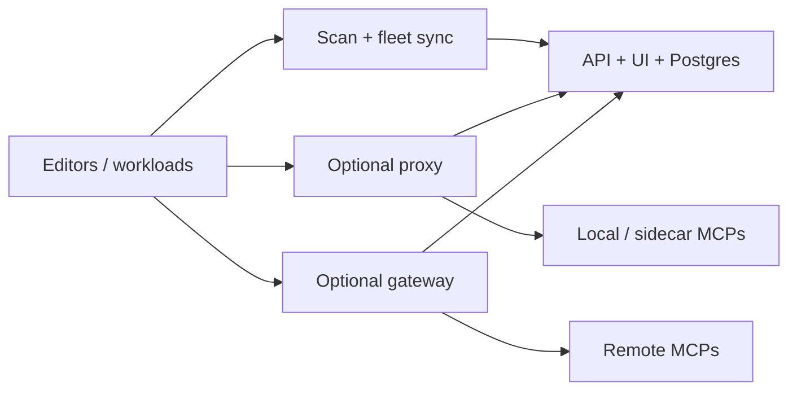

<p align="center">
  <picture>
    <source media="(prefers-color-scheme: dark)" srcset="https://raw.githubusercontent.com/msaad00/agent-bom/main/docs/images/logo-dark.svg">
    
  </picture>
</p>

<p align="center">
  <a href="https://github.com/msaad00/agent-bom/actions/workflows/ci.yml"></a>
  <a href="https://pypi.org/project/agent-bom/"></a>
  <a href="https://hub.docker.com/r/agentbom/agent-bom"></a>
  <a href="https://github.com/msaad00/agent-bom/blob/main/LICENSE"></a>
  <a href="https://securityscorecards.dev/viewer/?uri=github.com/msaad00/agent-bom"></a>
</p>
<!-- mcp-name: io.github.msaad00/agent-bom -->

<p align="center"><b>Open security scanner for AI supply chain — agents, MCP servers, packages, containers, cloud, GPU, and runtime.</b></p>

<p align="center">Every CVE in your AI stack is a credential leak waiting to happen. <code>agent-bom</code> follows the chain end-to-end and tells you exactly which fix collapses it.</p>

<p align="center">
  <picture>
    <source media="(prefers-color-scheme: dark)" srcset="https://raw.githubusercontent.com/msaad00/agent-bom/main/docs/images/blast-radius-dark.svg">
    
  </picture>
</p>

```text
CVE-2025-1234  (CRITICAL · CVSS 9.8 · CISA KEV)
  |── better-sqlite3@9.0.0  (npm)
       |── sqlite-mcp  (MCP Server · unverified · root)
            |── Cursor IDE  (Agent · 4 servers · 12 tools)
            |── ANTHROPIC_KEY, DB_URL, AWS_SECRET  (Credentials exposed)
            |── query_db, read_file, write_file, run_shell  (Tools at risk)

 Fix: upgrade better-sqlite3 → 11.7.0
```

Blast radius is the core idea: `CVE -> package -> MCP server -> agent -> credentials -> tools`. CWE-aware impact keeps a DoS from being reported like credential compromise.

## Try the demo

```bash
agent-bom agents --demo --offline
```

The demo uses a curated sample so the output stays reproducible across releases. Every CVE shown is a real OSV/GHSA match against a genuinely vulnerable package version — no fabricated findings (locked in by [`tests/test_demo_inventory_accuracy.py`](tests/test_demo_inventory_accuracy.py)). For a real scan, run `agent-bom agents`, or add `-p .` to fold project manifests and lockfiles into the same result.

<p align="center">
  
</p>

## Pick your entrypoint

| Goal | Run | What you get |
|---|---|---|
| Find what is installed and reachable | `agent-bom agents -p .` | Agent discovery, MCP mapping, project dependency findings, blast radius |
| Turn findings into a fix plan | `agent-bom agents -p . --remediate remediation.md` | Prioritized remediation with fix versions and reachable impact |
| Check a package before install | `agent-bom check flask@2.2.0 --ecosystem pypi` | Machine-readable pre-install verdict |
| Scan a container image | `agent-bom image nginx:latest` | OS and package CVEs with fixability |
| Audit IaC or cloud posture | `agent-bom iac Dockerfile k8s/ infra/main.tf` | Misconfigurations, manifest hardening, optional live cluster posture |
| Review findings in a persistent graph | `agent-bom serve` | API plus bundled local UI on one machine; Kubernetes and Compose split the API image (`agentbom/agent-bom`) from the browser UI image (`agentbom/agent-bom-ui`) |
| Inspect live MCP traffic | `agent-bom proxy "<server command>"` | Inline runtime inspection, detector chaining, response/argument review |

## Quick start

```bash
pip install agent-bom                  # CLI
# pipx install agent-bom               # isolated global install
# uvx agent-bom --help                 # ephemeral run

agent-bom agents                              # discover + scan local AI agents and MCP servers
agent-bom agents -p .                         # add project lockfiles + manifests
agent-bom check flask@2.0.0 --ecosystem pypi  # pre-install CVE gate
agent-bom image nginx:latest                  # container image scan
agent-bom iac Dockerfile k8s/ infra/main.tf   # IaC scan, optionally `--k8s-live`
```

Self-hosted pilot:

```bash
curl -fsSL https://raw.githubusercontent.com/msaad00/agent-bom/main/deploy/docker-compose.pilot.yml -o docker-compose.pilot.yml
docker compose -f docker-compose.pilot.yml up -d
# Dashboard -> http://localhost:3000
```

Production chart from a checked-out repo:

```bash
helm upgrade --install agent-bom deploy/helm/agent-bom \
  --namespace agent-bom --create-namespace \
  -f deploy/helm/agent-bom/examples/eks-production-values.yaml
```

After the first scan:

```bash
agent-bom agents -p . --remediate remediation.md                  # fix-first plan
agent-bom agents -p . --compliance-export fedramp -o evidence.zip # tamper-evident evidence bundle
pip install 'agent-bom[ui]' && agent-bom serve                    # API + bundled local UI
```

## Product views

These come from the live product path, using the built-in demo data pushed through the API. See [`docs/CAPTURE.md`](docs/CAPTURE.md) for the canonical capture protocol.

### Dashboard — Risk overview

The landing page is the **Risk overview**: a letter-grade gauge, the four headline counters (actively exploited · credentials exposed · reachable tools · top attack-path risk), the security-posture grade with sub-scores (policy + controls, open evidence, packages + CVEs, reach + exposure, MCP configuration), and the score breakdown for each driver.


### Dashboard — Attack paths and exposure

The second dashboard frame focuses on the fix-first path list and the coverage / backlog KPIs below it, so the attack-path drilldown stays readable without a tall stitched screenshot.


### Fix-first remediation

Risk, reach, fix version, and framework context in one review table — operators act without jumping between pages.


### Agent mesh

Agent-centered shared-infrastructure graph — selected agents, their shared MCP servers, tools, packages, and findings.


<details>
<summary><b>How a scan moves through the system</b> — five stages, no source code or credentials leave your machine</summary>

<p align="center">
  <picture>
    <source media="(prefers-color-scheme: dark)" srcset="https://raw.githubusercontent.com/msaad00/agent-bom/main/docs/images/scan-pipeline-dark.svg">
    
  </picture>
</p>

Inside the engine: parsers, taint, call graph, blast-radius scoring.

<p align="center">
  <picture>
    <source media="(prefers-color-scheme: dark)" srcset="https://raw.githubusercontent.com/msaad00/agent-bom/main/docs/images/engine-internals-dark.svg">
    
  </picture>
</p>

External calls are limited to package metadata, version lookups, and CVE enrichment.

</details>

---

# Enterprise self-hosted deployment

**`agent-bom` runs inside your infrastructure: your VPC, your EKS cluster, your Postgres, your SSO, your KMS. No hosted control plane. No mandatory vendor backend. No mandatory telemetry.**

The easiest way to understand the product is:

- **start with inventory** using scans and fleet sync
- **add runtime later** with proxy or gateway where you actually need enforcement

That is the adoption wedge behind the product:

- inventory-first teams can see which MCP servers are running, what tools they expose, and which credentials back them
- runtime-focused teams can layer in proxy or gateway without changing the control plane

## Deployment modes

| Mode | Deploy | Use when | Adds |
|---|---|---|---|
| **Local scan** | CLI or CI only | You want discovery, CVEs, IaC, image, and MCP config analysis | no persistent control plane |
| **Inventory-first self-hosted** | API + UI + Postgres + scan jobs + fleet sync | You want endpoint and MCP inventory without rolling out runtime enforcement first | `/fleet`, `/agents`, findings, graph, remediation, audit |
| **Selective runtime enforcement** | inventory-first, plus `proxy` on chosen workloads | You need inline MCP inspection near stdio or workload-local MCPs | policy enforcement, runtime audit, local blocking |
| **Shared remote MCP control** | inventory-first, plus `gateway` | You want a central HTTP traffic plane for shared remote MCPs | central relay, shared rate limits, remote MCP policy/audit |
| **Full self-hosted platform** | control plane + scan + fleet + selected proxy + selected gateway | You want one operator plane across inventory, findings, runtime, and evidence | the full product stack in your own infra |

## Runtime model

`proxy` and `gateway` are **peer runtime surfaces**, not a required serial chain.

| Runtime surface | Best fit | What it is not |
|---|---|---|
| **`agent-bom proxy`** | local stdio MCPs, sidecars, workload-local enforcement | a mandatory dependency for inventory or the whole platform |
| **`agent-bom gateway serve`** | shared remote MCP traffic over HTTP/SSE | a replacement for local proxy where stdio or sidecar enforcement is the right fit |


```mermaid
flowchart LR
    Client["Editors / workloads"] --> Inventory["Scan + fleet sync"]
    Inventory --> API["API + UI + Postgres"]
    Client --> Proxy["Optional proxy"]
    Client --> Gateway["Optional gateway"]
    Proxy --> API
    Gateway --> API
    Proxy --> Local["Local / sidecar MCPs"]
    Gateway --> Remote["Remote MCPs"]
```

Deployment truth:

- the **browser UI drives workflows**
- the **API owns state, auth, RBAC, graph, audit, and policy**
- **workers do scans and ingest**
- **fleet gives inventory without proxy**
- **proxy and gateway add runtime depth later**

## What becomes visible before proxy rollout

With scans and fleet sync alone, teams can already see:

- which endpoints have MCP clients or collectors
- which MCP servers are configured
- transport: `stdio`, `sse`, or `http`
- declared tools
- command or URL
- credential-backed environment variables
- last seen and last synced state
- package, image, IaC, and related finding context

That is why the inventory story matters: adoption should not require teams to
start with a runtime rollout.

## Self-hosted shape in one table

| Layer | Usually deploy first | Notes |
|---|---|---|
| **Ingress + auth** | yes | OIDC or SAML in front of the control plane |
| **API + UI** | yes | one operator plane, same-origin browser app |
| **Workers / scan jobs** | yes | discovery, scans, imports, scheduled jobs |
| **Fleet sync** | yes for endpoint visibility | gives MCP inventory without proxy |
| **Proxy** | optional | add only where inline local enforcement is needed |
| **Gateway** | optional | add only where shared remote MCP traffic needs a central plane |
| **Postgres** | yes | primary transactional store |
| **ClickHouse / S3** | optional | analytics and backup/export scale |

## One product, two deployable images

- `agentbom/agent-bom` = CLI, API, jobs, gateway, proxy, MCP server mode
- `agentbom/agent-bom-ui` = browser control-plane UI

Users should not think about that split directly:

- **pilot**: one Compose file
- **production**: one Helm chart

## Start here by scenario

| Need | Start here |
|---|---|
| fastest local pilot | [Deployment Overview](site-docs/deployment/overview.md) |
| self-host in your AWS / EKS | [Deploy In Your Own AWS / EKS Infrastructure](site-docs/deployment/own-infra-eks.md) |
| reference AWS rollout from cluster creation onward | [AWS Company Rollout](site-docs/deployment/aws-company-rollout.md) |
| endpoint inventory and laptop rollout | [Endpoint Fleet](site-docs/deployment/endpoint-fleet.md) |
| proxy and gateway runtime operations | [Runtime Operations](site-docs/deployment/runtime-operations.md) |
| trust model, auth, tenant isolation | [ENTERPRISE_SECURITY_PLAYBOOK.md](docs/ENTERPRISE_SECURITY_PLAYBOOK.md) |

<details>
<summary><b>Deep deployment notes</b></summary>

### What each surface owns

| Surface | Owns | Does not own |
|---|---|---|
| **UI** | run-now actions, review, export, policy workflows | direct collection |
| **API / control plane** | auth, RBAC, tenant scope, orchestration, persistence, graph, audit, policy | inline MCP enforcement |
| **Workers** | scans, ingest, normalization, imports | browser sessions |
| **Fleet** | endpoint and collector inventory | runtime blocking |
| **Proxy** | local inline MCP inspection and audit relay | central policy storage |
| **Gateway** | shared remote MCP traffic and shared runtime policy evaluation | full control-plane persistence |

### Backend choices

| Backend | Best for |
|---|---|
| **SQLite** | laptops and single-node local use |
| **Postgres / Supabase** | default self-hosted control plane |
| **ClickHouse** | audit/event analytics at higher scale |
| **Snowflake** | warehouse-native governance workflows where the published backend parity fits |

### Shipped Helm examples

| File | Use when |
|---|---|
| [`eks-mcp-pilot-values.yaml`](deploy/helm/agent-bom/examples/eks-mcp-pilot-values.yaml) | focused MCP and fleet pilot |
| [`eks-production-values.yaml`](deploy/helm/agent-bom/examples/eks-production-values.yaml) | production rollout |
| [`eks-istio-kyverno-values.yaml`](deploy/helm/agent-bom/examples/eks-istio-kyverno-values.yaml) | zero-trust / regulated rollout |
| [`eks-snowflake-values.yaml`](deploy/helm/agent-bom/examples/eks-snowflake-values.yaml) | Snowflake-backed deployment |

</details>

---

## Trust & transparency

agent-bom is a **read-only scanner**. It never writes configs, never executes MCP servers, never stores credential values. No telemetry. No analytics. Releases are [Sigstore-signed](docs/PERMISSIONS.md) with SLSA provenance and self-published SBOMs.

| When | What's sent | Where | Opt out |
|---|---|---|---|
| Default CVE lookups | Package names + versions | OSV API | `--offline` |
| Floating version resolution | Names + requested version | npm / PyPI / Go proxy | `--offline` |
| `--enrich` | CVE IDs | NVD, EPSS, CISA KEV | omit `--enrich` |
| `--deps-dev` | Package names + versions | deps.dev | omit `--deps-dev` |
| `verify` | Package + version | PyPI / npm integrity endpoints | don't run `verify` |
| Optional integrations | Finding summaries | Slack / Jira / Vanta / Drata | don't pass those flags |

Full trust model: [SECURITY_ARCHITECTURE.md](docs/SECURITY_ARCHITECTURE.md) · [PERMISSIONS.md](docs/PERMISSIONS.md) · [SUPPLY_CHAIN.md](docs/SUPPLY_CHAIN.md) · [RELEASE_VERIFICATION.md](docs/RELEASE_VERIFICATION.md).

## Compliance

Bundled mappings for FedRAMP, CMMC, NIST AI RMF, ISO 27001, SOC 2, OWASP LLM Top-10, MITRE ATLAS, and EU AI Act. Export tamper-evident evidence packets in one command.

<p align="center">
  <picture>
    <source media="(prefers-color-scheme: dark)" srcset="https://raw.githubusercontent.com/msaad00/agent-bom/main/docs/images/compliance-dark.svg">
    
  </picture>
</p>

```bash
agent-bom agents -p . --compliance-export fedramp -o fedramp-evidence.zip
agent-bom agents -p . --compliance-export nist-ai-rmf -o evidence.zip
```

The audit log itself is HMAC-chained and exportable as a signed JSON/JSONL bundle at `GET /v1/audit/export`.

## Install & deploy

```bash
pip install agent-bom                        # CLI
docker run --rm agentbom/agent-bom agents    # Docker
```

For published containers, the packaging model is:

- one product, two deployable images
- `agentbom/agent-bom` = the main runtime image for CLI, API, jobs, gateway,
  proxy-related entrypoints, and MCP server mode
- `agentbom/agent-bom-ui` = the browser dashboard image for the same
  self-hosted control plane

| Mode | Best for |
|------|----------|
| CLI (`agent-bom agents`) | local audit + project scan |
| Endpoint fleet (`--push-url …/v1/fleet/sync`) | employee laptops pushing into self-hosted fleet |
| GitHub Action (`uses: msaad00/agent-bom@v0.81.0`) | CI/CD + SARIF |
| Docker (`agentbom/agent-bom`) | isolated scans, API jobs, and non-browser self-hosted entrypoints |
| Browser UI image (`agentbom/agent-bom-ui`) | the dashboard image paired with the same self-hosted control plane |
| Kubernetes / Helm (`helm install agent-bom deploy/helm/agent-bom`) | self-hosted API + dashboard, scheduled discovery |
| REST API (`agent-bom api`) | platform integration, self-hosted control plane |
| MCP server (`agent-bom mcp server`) | Claude Desktop, Claude Code, Cursor, Codex, Windsurf, Cortex |
| Runtime proxy (`agent-bom proxy`) | MCP traffic enforcement |
| Shield SDK (`from agent_bom.shield import Shield`) | in-process protection |

Backend choices stay explicit and optional:

- `SQLite` for local and single-node use
- `Postgres` / `Supabase` for the primary transactional control plane
- `ClickHouse` for analytics and event-scale persistence
- `Snowflake` for warehouse-native governance and selected backend paths

Run locally, in CI, in Docker, in Kubernetes, as a self-hosted API + dashboard, or as an MCP server — no mandatory hosted control plane, no mandatory cloud vendor.

References: [PRODUCT_BRIEF.md](docs/PRODUCT_BRIEF.md) · [PRODUCT_METRICS.md](docs/PRODUCT_METRICS.md) · [ENTERPRISE.md](docs/ENTERPRISE.md) · [How agent-bom works](site-docs/architecture/how-agent-bom-works.md).

<details>
<summary><b>CI/CD in 60 seconds</b></summary>

```yaml
- uses: msaad00/agent-bom@v0.81.0
  with:
    scan-type: scan
    severity-threshold: high
    upload-sarif: true
    enrich: true
    fail-on-kev: true
```

Container image gate, IaC gate, air-gapped CI, MCP scan, and the SARIF / SBOM examples are documented in [site-docs/getting-started/quickstart.md](site-docs/getting-started/quickstart.md).

</details>

## MCP server

36 security tools available inside any MCP-compatible AI assistant:

```json
{
  "mcpServers": {
    "agent-bom": {
      "command": "uvx",
      "args": ["agent-bom", "mcp", "server"]
    }
  }
}
```

Also on [Glama](https://glama.ai/mcp/servers/@msaad00/agent-bom), [Smithery](integrations/smithery.yaml), [MCP Registry](integrations/mcp-registry/server.json), and [OpenClaw](integrations/openclaw/README.md).

<details>
<summary><b>Install extras + output formats</b></summary>

| Extra | Command |
|-------|---------|
| Cloud providers | `pip install 'agent-bom[cloud]'` |
| MCP server | `pip install 'agent-bom[mcp-server]'` |
| REST API | `pip install 'agent-bom[api]'` |
| Dashboard | `pip install 'agent-bom[ui]'` |
| SAML SSO | `pip install 'agent-bom[saml]'` |

JSON · SARIF · CycloneDX 1.6 (with ML BOM) · SPDX 3.0 · HTML · Graph JSON · Graph HTML · GraphML · Neo4j Cypher · JUnit XML · CSV · Markdown · Mermaid · SVG · Prometheus · Badge · Attack Flow · plain text. OCSF is used for runtime / SIEM event delivery, not as a general report format.

</details>

## Contributing

```bash
git clone https://github.com/msaad00/agent-bom.git && cd agent-bom
pip install -e ".[dev-all]"
pytest && ruff check src/
```

[CONTRIBUTING.md](CONTRIBUTING.md) · [docs/CLI_DEBUG_GUIDE.md](docs/CLI_DEBUG_GUIDE.md) · [SECURITY.md](SECURITY.md) · [CODE_OF_CONDUCT.md](CODE_OF_CONDUCT.md)

---

Apache 2.0 — [LICENSE](LICENSE)
