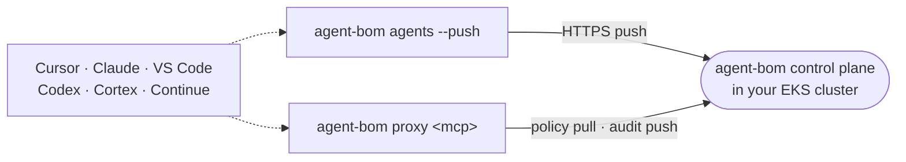
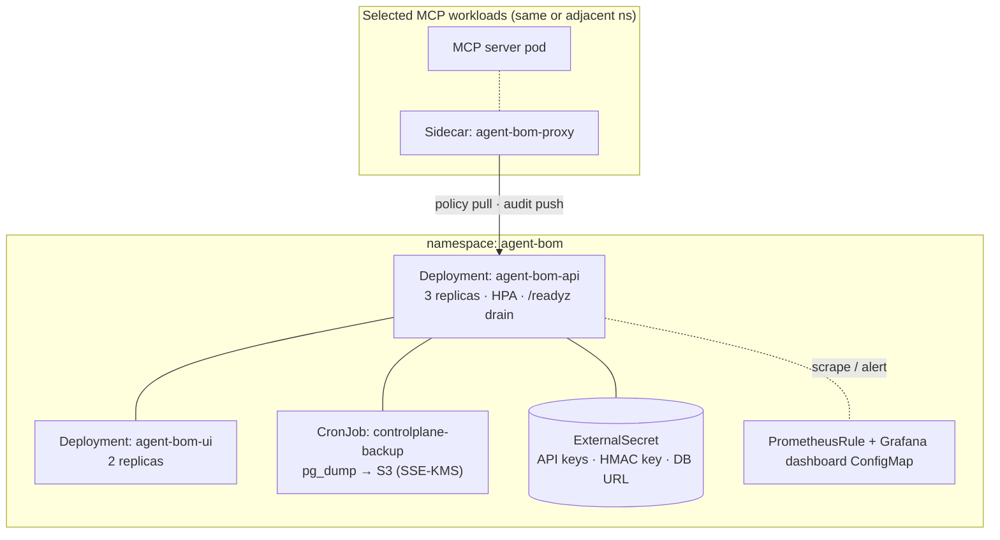
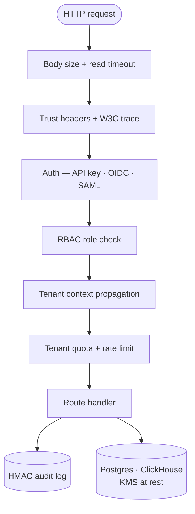

<p align="center">
  <picture>
    <source media="(prefers-color-scheme: dark)" srcset="https://raw.githubusercontent.com/msaad00/agent-bom/main/docs/images/logo-dark.svg">
    
  </picture>
</p>

<p align="center">
  <a href="https://github.com/msaad00/agent-bom/actions/workflows/ci.yml"></a>
  <a href="https://pypi.org/project/agent-bom/"></a>
  <a href="https://hub.docker.com/r/agentbom/agent-bom"></a>
  <a href="https://github.com/msaad00/agent-bom/blob/main/LICENSE"></a>
  <a href="https://securityscorecards.dev/viewer/?uri=github.com/msaad00/agent-bom"></a>
</p>
<!-- mcp-name: io.github.msaad00/agent-bom -->

<p align="center"><b>Open security scanner for AI supply chain — agents, MCP servers, packages, containers, cloud, GPU, and runtime.</b></p>

<p align="center">Every CVE in your AI stack is a credential leak waiting to happen. <code>agent-bom</code> follows the chain end-to-end and tells you exactly which fix collapses it.</p>

<p align="center">
  <picture>
    <source media="(prefers-color-scheme: dark)" srcset="https://raw.githubusercontent.com/msaad00/agent-bom/main/docs/images/blast-radius-dark.svg">
    
  </picture>
</p>

```text
CVE-2025-1234  (CRITICAL · CVSS 9.8 · CISA KEV)
  |── better-sqlite3@9.0.0  (npm)
       |── sqlite-mcp  (MCP Server · unverified · root)
            |── Cursor IDE  (Agent · 4 servers · 12 tools)
            |── ANTHROPIC_KEY, DB_URL, AWS_SECRET  (Credentials exposed)
            |── query_db, read_file, write_file, run_shell  (Tools at risk)

 Fix: upgrade better-sqlite3 → 11.7.0
```

Blast radius is the core idea: `CVE -> package -> MCP server -> agent -> credentials -> tools`. CWE-aware impact keeps a DoS from being reported like credential compromise.

## Try the demo

```bash
agent-bom agents --demo --offline
```

The demo uses a curated sample so the output stays reproducible across releases. Every CVE shown is a real OSV/GHSA match against a genuinely vulnerable package version — no fabricated findings (locked in by [`tests/test_demo_inventory_accuracy.py`](tests/test_demo_inventory_accuracy.py)). For a real scan, run `agent-bom agents`, or add `-p .` to fold project manifests and lockfiles into the same result.

<p align="center">
  
</p>

## Pick your entrypoint

| Goal | Run | What you get |
|---|---|---|
| Find what is installed and reachable | `agent-bom agents -p .` | Agent discovery, MCP mapping, project dependency findings, blast radius |
| Turn findings into a fix plan | `agent-bom agents -p . --remediate remediation.md` | Prioritized remediation with fix versions and reachable impact |
| Check a package before install | `agent-bom check flask@2.2.0 --ecosystem pypi` | Machine-readable pre-install verdict |
| Scan a container image | `agent-bom image nginx:latest` | OS and package CVEs with fixability |
| Audit IaC or cloud posture | `agent-bom iac Dockerfile k8s/ infra/main.tf` | Misconfigurations, manifest hardening, optional live cluster posture |
| Review findings in a persistent graph | `agent-bom serve` | API, dashboard, unified graph, current-state and diff views |
| Inspect live MCP traffic | `agent-bom proxy "<server command>"` | Inline runtime inspection, detector chaining, response/argument review |

## Quick start

```bash
pip install agent-bom                  # CLI
# pipx install agent-bom               # isolated global install
# uvx agent-bom --help                 # ephemeral run

agent-bom agents                              # discover + scan local AI agents and MCP servers
agent-bom agents -p .                         # add project lockfiles + manifests
agent-bom check flask@2.0.0 --ecosystem pypi  # pre-install CVE gate
agent-bom image nginx:latest                  # container image scan
agent-bom iac Dockerfile k8s/ infra/main.tf   # IaC scan, optionally `--k8s-live`
```

After the first scan:

```bash
agent-bom agents -p . --remediate remediation.md                  # fix-first plan
agent-bom agents -p . --compliance-export fedramp -o evidence.zip # auditor-ready bundle
pip install 'agent-bom[ui]' && agent-bom serve                    # API + dashboard
```

## Product views

These come from the live product path, using the built-in demo data pushed through the API. See [`docs/CAPTURE.md`](docs/CAPTURE.md) for the canonical capture protocol.

### Dashboard — Risk overview

The landing page is the **Risk overview**: a letter-grade gauge, the four headline counters (actively exploited · credentials exposed · reachable tools · top attack-path risk), the security-posture grade with sub-scores (policy + controls, open evidence, packages + CVEs, reach + exposure, MCP configuration), the score breakdown for each driver, and the top attack paths with one-click drilldown.


### Fix-first remediation

Risk, reach, fix version, and framework context in one review table — operators act without jumping between pages.


### Agent mesh

Agent-centered shared-infrastructure graph — selected agents, their shared MCP servers, tools, packages, and findings.


<details>
<summary><b>How a scan moves through the system</b> — five stages, no source code or credentials leave your machine</summary>

<p align="center">
  <picture>
    <source media="(prefers-color-scheme: dark)" srcset="https://raw.githubusercontent.com/msaad00/agent-bom/main/docs/images/scan-pipeline-dark.svg">
    
  </picture>
</p>

Inside the engine: parsers, taint, call graph, blast-radius scoring.

<p align="center">
  <picture>
    <source media="(prefers-color-scheme: dark)" srcset="https://raw.githubusercontent.com/msaad00/agent-bom/main/docs/images/engine-internals-dark.svg">
    
  </picture>
</p>

External calls are limited to package metadata, version lookups, and CVE enrichment.

</details>

## Deploy in your own AWS / EKS

Self-hosted is a first-class path. Employee endpoints push fleet discovery into your control plane; selected MCP workloads run the proxy in-cluster; Postgres, audit, secrets, ingress, and logs stay in your infra.

### 1. External flow — where the data comes from


```mermaid
flowchart LR
    clients["Cursor · Claude · VS Code<br/>Codex · Cortex · Continue"]
    cli["agent-bom agents --push"]
    prx["agent-bom proxy &lt;mcp&gt;"]
    cp(["agent-bom control plane<br/>in your EKS cluster"])

    clients -.-> cli
    clients -.-> prx
    cli -->|HTTPS push| cp
    prx -->|policy pull · audit push| cp
```

### 2. Inside your EKS cluster — what actually deploys

The Helm chart installs a single namespace with the control plane, its backup job, and the operator surface. Selected MCP workloads run alongside with an `agent-bom-proxy` sidecar that pulls gateway policy and pushes audit events back.


```mermaid
flowchart TB
    subgraph ns["namespace: agent-bom"]
        direction TB
        api["Deployment: agent-bom-api<br/>3 replicas · HPA · /readyz drain"]
        ui["Deployment: agent-bom-ui<br/>2 replicas"]
        cron["CronJob: controlplane-backup<br/>pg_dump → S3 (SSE-KMS)"]
        es[("ExternalSecret<br/>API keys · HMAC key · DB URL")]
        obs["PrometheusRule + Grafana dashboard ConfigMap"]
    end

    subgraph work["Selected MCP workloads (same or adjacent ns)"]
        direction LR
        mcpsvc["MCP server pod"]
        proxy["Sidecar: agent-bom-proxy"]
        mcpsvc -.- proxy
    end

    api --- ui
    api --- es
    api -. scrape / alert .- obs
    api --- cron
    proxy -->|policy pull · audit push| api
```

Outside the namespace but in your VPC: **Postgres** (primary state), **ClickHouse** (optional analytics), **External Secrets** wired to **KMS**, and **Prometheus + Grafana + OTel** scraping the API. The restore round-trip is exercised in CI (`backup-restore.yml`).

### 3. How a request flows through the control plane


```mermaid
flowchart TB
    REQ([HTTP request])
    BODY[Body size + read timeout]
    TRACE[Trust headers + W3C trace]
    AUTH["Auth — API key · OIDC · SAML"]
    RBAC[RBAC role check]
    TENANT[Tenant context propagation]
    QUOTA[Tenant quota + rate limit]
    ROUTE[Route handler]
    AUDIT[(HMAC audit log)]
    STORE[(Postgres · ClickHouse<br/>KMS at rest)]

    REQ --> BODY --> TRACE --> AUTH --> RBAC --> TENANT --> QUOTA --> ROUTE
    ROUTE --> AUDIT
    ROUTE --> STORE
```

Every layer is testable on its own; failures emit Prometheus metrics. Operators introspect a live request via `GET /v1/auth/debug` and see rotation status via `GET /v1/auth/policy`.

### 4. What you get, and how to install it

Inside the control plane: **OIDC + SAML SSO** with RBAC, **enforced API-key rotation policy**, **tenant-scoped quotas + rate limits**, **HMAC-chained audit log** with signed export, **KMS-encrypted Postgres backups** with a verified restore round-trip in CI, and **signed compliance evidence bundles** (`/v1/compliance/{framework}/report` — nonce + expiry inside the signature).

<details>
<summary><b>Helm install + fleet sync + local proxy</b></summary>

```bash
# control plane in your cluster
helm install agent-bom deploy/helm/agent-bom \
  --set controlPlane.enabled=true \
  --set db.backend=postgres

# endpoint fleet sync
agent-bom agents --preset enterprise --introspect \
  --push-url https://agent-bom.example.com/v1/fleet/sync

# local MCP enforcement on a laptop or workstation
agent-bom proxy --policy ./policy.json -- <editor-mcp-command>
```

Operator guides: [Own AWS / EKS](site-docs/deployment/own-infra-eks.md) · [Enterprise pilot](site-docs/deployment/enterprise-pilot.md) · [Endpoint fleet](site-docs/deployment/endpoint-fleet.md) · [EKS MCP pilot](site-docs/deployment/eks-mcp-pilot.md) · [Helm control plane](site-docs/deployment/control-plane-helm.md) · [Grafana](site-docs/deployment/grafana.md) · [Performance + sizing](site-docs/deployment/performance-and-sizing.md) · [Restore script](deploy/ops/restore-postgres-backup.sh).

Self-hosted SSO uses **OIDC or SAML**; SAML admins fetch SP metadata at `/v1/auth/saml/metadata`. Control-plane API keys follow an enforced lifetime policy (`AGENT_BOM_API_KEY_DEFAULT_TTL_SECONDS`, `AGENT_BOM_API_KEY_MAX_TTL_SECONDS`); rotate in place at `/v1/auth/keys/{key_id}/rotate`.

</details>

## Trust & transparency

agent-bom is a **read-only scanner**. It never writes configs, never executes MCP servers, never stores credential values. No telemetry. No analytics. Releases are [Sigstore-signed](docs/PERMISSIONS.md) with SLSA provenance and self-published SBOMs.

| When | What's sent | Where | Opt out |
|---|---|---|---|
| Default CVE lookups | Package names + versions | OSV API | `--offline` |
| Floating version resolution | Names + requested version | npm / PyPI / Go proxy | `--offline` |
| `--enrich` | CVE IDs | NVD, EPSS, CISA KEV | omit `--enrich` |
| `--deps-dev` | Package names + versions | deps.dev | omit `--deps-dev` |
| `verify` | Package + version | PyPI / npm integrity endpoints | don't run `verify` |
| Optional integrations | Finding summaries | Slack / Jira / Vanta / Drata | don't pass those flags |

Full trust model: [SECURITY_ARCHITECTURE.md](docs/SECURITY_ARCHITECTURE.md) · [PERMISSIONS.md](docs/PERMISSIONS.md) · [SUPPLY_CHAIN.md](docs/SUPPLY_CHAIN.md) · [RELEASE_VERIFICATION.md](docs/RELEASE_VERIFICATION.md).

## Compliance

Bundled mappings for FedRAMP, CMMC, NIST AI RMF, ISO 27001, SOC 2, OWASP LLM Top-10, MITRE ATLAS, and EU AI Act. Export auditor-ready evidence packets in one command.

<p align="center">
  <picture>
    <source media="(prefers-color-scheme: dark)" srcset="https://raw.githubusercontent.com/msaad00/agent-bom/main/docs/images/compliance-dark.svg">
    
  </picture>
</p>

```bash
agent-bom agents -p . --compliance-export fedramp -o fedramp-evidence.zip
agent-bom agents -p . --compliance-export nist-ai-rmf -o evidence.zip
```

The audit log itself is HMAC-chained and exportable as a signed JSON/JSONL bundle at `GET /v1/audit/export`.

## Install & deploy

```bash
pip install agent-bom                        # CLI
docker run --rm agentbom/agent-bom agents    # Docker
```

| Mode | Best for |
|------|----------|
| CLI (`agent-bom agents`) | local audit + project scan |
| Endpoint fleet (`--push-url …/v1/fleet/sync`) | employee laptops pushing into self-hosted fleet |
| GitHub Action (`uses: msaad00/agent-bom@v0.77.1`) | CI/CD + SARIF |
| Docker (`agentbom/agent-bom`) | isolated scans, containerized self-hosting |
| Kubernetes / Helm (`helm install agent-bom deploy/helm/agent-bom`) | self-hosted API + dashboard, scheduled discovery |
| REST API (`agent-bom api`) | platform integration, self-hosted control plane |
| MCP server (`agent-bom mcp server`) | Claude Desktop, Claude Code, Cursor, Codex, Windsurf, Cortex |
| Runtime proxy (`agent-bom proxy`) | MCP traffic enforcement |
| Shield SDK (`from agent_bom.shield import Shield`) | in-process protection |

Backend choices stay explicit and optional:

- `SQLite` for local and single-node use
- `Postgres` / `Supabase` for the primary transactional control plane
- `ClickHouse` for analytics and event-scale persistence
- `Snowflake` for warehouse-native governance and selected backend paths

Run locally, in CI, in Docker, in Kubernetes, as a self-hosted API + dashboard, or as an MCP server — no mandatory hosted control plane, no mandatory cloud vendor.

References: [PRODUCT_BRIEF.md](docs/PRODUCT_BRIEF.md) · [PRODUCT_METRICS.md](docs/PRODUCT_METRICS.md) · [ENTERPRISE.md](docs/ENTERPRISE.md) · [How agent-bom works](site-docs/architecture/how-agent-bom-works.md).

<details>
<summary><b>CI/CD in 60 seconds</b></summary>

```yaml
- uses: msaad00/agent-bom@v0.77.1
  with:
    scan-type: scan
    severity-threshold: high
    upload-sarif: true
    enrich: true
    fail-on-kev: true
```

Container image gate, IaC gate, air-gapped CI, MCP scan, and the SARIF / SBOM examples are documented in [site-docs/getting-started/ci-cd.md](site-docs/getting-started/ci-cd.md).

</details>

## MCP server

36 security tools available inside any MCP-compatible AI assistant:

```json
{
  "mcpServers": {
    "agent-bom": {
      "command": "uvx",
      "args": ["agent-bom", "mcp", "server"]
    }
  }
}
```

Also on [Glama](https://glama.ai/mcp/servers/@msaad00/agent-bom), [Smithery](integrations/smithery.yaml), [MCP Registry](integrations/mcp-registry/server.json), and [OpenClaw](integrations/openclaw/README.md).

<details>
<summary><b>Install extras + output formats</b></summary>

| Extra | Command |
|-------|---------|
| Cloud providers | `pip install 'agent-bom[cloud]'` |
| MCP server | `pip install 'agent-bom[mcp-server]'` |
| REST API | `pip install 'agent-bom[api]'` |
| Dashboard | `pip install 'agent-bom[ui]'` |
| SAML SSO | `pip install 'agent-bom[saml]'` |

JSON · SARIF · CycloneDX 1.6 (with ML BOM) · SPDX 3.0 · HTML · Graph JSON · Graph HTML · GraphML · Neo4j Cypher · JUnit XML · CSV · Markdown · Mermaid · SVG · Prometheus · Badge · Attack Flow · plain text. OCSF is used for runtime / SIEM event delivery, not as a general report format.

</details>

## Contributing

```bash
git clone https://github.com/msaad00/agent-bom.git && cd agent-bom
pip install -e ".[dev-all]"
pytest && ruff check src/
```

[CONTRIBUTING.md](CONTRIBUTING.md) · [docs/CLI_DEBUG_GUIDE.md](docs/CLI_DEBUG_GUIDE.md) · [SECURITY.md](SECURITY.md) · [CODE_OF_CONDUCT.md](CODE_OF_CONDUCT.md)

---

Apache 2.0 — [LICENSE](LICENSE)
