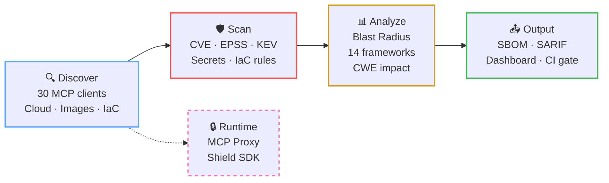
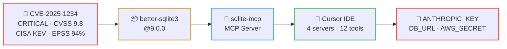

<p align="center">
  <picture>
    <source media="(prefers-color-scheme: dark)" srcset="https://raw.githubusercontent.com/msaad00/agent-bom/main/docs/images/logo-dark.svg">
    
  </picture>
</p>

<p align="center">
  <a href="https://github.com/msaad00/agent-bom/actions/workflows/ci.yml"></a>
  <a href="https://pypi.org/project/agent-bom/"></a>
  <a href="https://hub.docker.com/r/agentbom/agent-bom"></a>
  <a href="https://github.com/msaad00/agent-bom/blob/main/LICENSE"></a>
  <a href="https://securityscorecards.dev/viewer/?uri=github.com/msaad00/agent-bom"></a>
</p>
<!-- mcp-name: io.github.msaad00/agent-bom -->

<p align="center"><b>Your AI agent's dependencies have a CVE. Which credentials leak?</b></p>

```text
CVE-2025-1234  (CRITICAL · CVSS 9.8 · CISA KEV)
  |── better-sqlite3@9.0.0  (npm)
       |── sqlite-mcp  (MCP Server · unverified · root)
            |── Cursor IDE  (Agent · 4 servers · 12 tools)
            |── ANTHROPIC_KEY, DB_URL, AWS_SECRET  (Credentials exposed)
            |── query_db, read_file, write_file, run_shell  (Tools at risk)

 Fix: upgrade better-sqlite3 → 11.7.0
```

**agent-bom maps the blast radius**: CVE → package → MCP server → AI agent → credentials → tools.

Traditional scanners stop at `CVE → Package`. agent-bom shows which credentials and tools are actually at risk — with CWE-aware impact classification so a DoS vuln doesn't falsely claim credential exposure.

<p align="center">
  
</p>

## Quick start

```bash
pip install agent-bom

agent-bom agents                        # Discover + scan AI agents and MCP servers
agent-bom check flask@2.0.0             # Pre-install CVE gate
agent-bom image nginx:latest            # Container image scan
agent-bom iac Dockerfile k8s/ main.tf   # IaC misconfigurations
```

<details>
<summary><b>More commands</b></summary>

```bash
agent-bom cloud aws                     # Cloud AI posture + CIS benchmarks
agent-bom agents -f cyclonedx -o bom.json  # AI BOM / SBOM export
agent-bom proxy "npx @mcp/server-fs /ws"   # MCP security proxy
agent-bom secrets src/                  # Hardcoded secrets + PII
agent-bom verify requests@2.33.0        # Package integrity verification
agent-bom serve                         # API + Next.js dashboard
```

</details>

---

## How it works


```mermaid
flowchart LR
    DISCOVER["🔍 Discover\n30 MCP clients\nCloud · Images · IaC"] --> SCAN["🛡️ Scan\nCVE · EPSS · KEV\nSecrets · IaC rules"]
    SCAN --> ANALYZE["📊 Analyze\nBlast Radius\n14 frameworks\nCWE impact"]
    ANALYZE --> OUTPUT["📤 Output\nSBOM · SARIF\nDashboard · CI gate"]
    DISCOVER -.-> PROTECT["🔒 Runtime\nMCP Proxy\nShield SDK"]

    style DISCOVER stroke:#58a6ff,stroke-width:2px
    style SCAN stroke:#f85149,stroke-width:2px
    style ANALYZE stroke:#d29922,stroke-width:2px
    style OUTPUT stroke:#3fb950,stroke-width:2px
    style PROTECT stroke:#f778ba,stroke-width:2px,stroke-dasharray: 5 5
```

### Blast radius — what makes agent-bom different


```mermaid
flowchart LR
    CVE["🔴 CVE-2025-1234\nCRITICAL · CVSS 9.8\nCISA KEV · EPSS 94%"]
    PKG["📦 better-sqlite3\n@9.0.0"]
    SRV["🔧 sqlite-mcp\nMCP Server"]
    AGT["🤖 Cursor IDE\n4 servers · 12 tools"]
    CRED["🔑 ANTHROPIC_KEY\nDB_URL · AWS_SECRET"]

    CVE --> PKG --> SRV --> AGT --> CRED

    style CVE stroke:#f85149,stroke-width:2px
    style PKG stroke:#d29922,stroke-width:2px
    style SRV stroke:#58a6ff,stroke-width:2px
    style AGT stroke:#3fb950,stroke-width:2px
    style CRED stroke:#f85149,stroke-width:2px
```

Blast radius is **CWE-aware**: an RCE (CWE-94) shows full credential exposure, a DoS (CWE-400) does not. Impact categories: code-execution, credential-access, file-access, injection, ssrf, data-leak, availability, client-side.

---

## What it scans

| Source | Details |
|--------|---------|
| **MCP agents** | 30 client types auto-detected (Claude Desktop, Cursor, Windsurf, VS Code, Codex CLI, Gemini CLI, and more) |
| **Packages** | 15 ecosystems — Python, Node.js, Go, Rust, Java, .NET, Ruby, PHP, Swift, Conda, Alpine, Debian, RPM |
| **Vulnerabilities** | OSV + NVD + GHSA + EPSS + CISA KEV, CWE impact classification |
| **Container images** | Native OCI parser — no Syft/Grype needed |
| **IaC** | Dockerfile, Terraform, CloudFormation, Helm, Kubernetes (138 rules) |
| **Cloud AI** | AWS, Azure, GCP, Databricks, Snowflake, HuggingFace, W&B, Ollama, OpenAI |
| **AI code** | AST analysis: prompts, guardrails, tool signatures from 10+ Python AI frameworks |
| **Secrets** | 34 credential patterns + 11 PII patterns across source, config, and .env files |
| **Model files** | 13 formats (.gguf, .safetensors, .pkl, ...) — provenance + hash verification |
| **Instruction files** | CLAUDE.md, .cursorrules, AGENTS.md — trust analysis + tool poisoning detection |

**Read-only. Agentless. No secrets leave your machine.**

---

## Runtime protection

MCP security proxy with 112 detection patterns, 8 detectors, PII redaction, and kill switch:

```bash
agent-bom proxy "npx @mcp/server-filesystem /workspace"
```

**Shield SDK** — drop-in Python middleware:
```python
from agent_bom.shield import Shield
shield = Shield(deep=True)
alerts = shield.check_tool_call("exec", {"command": "rm -rf /"})
safe = shield.redact(response_text)  # [REDACTED:OpenAI API Key]
```

---

## Compliance (14 frameworks)

Every finding is tagged with applicable controls:

| Framework | Coverage |
|-----------|----------|
| OWASP LLM Top 10 | 7/10 categories |
| OWASP MCP Top 10 | 10/10 categories |
| OWASP Agentic Top 10 | 10/10 categories |
| MITRE ATLAS | 30+ techniques |
| MITRE ATT&CK Enterprise | Technique mapping |
| NIST AI RMF 1.0 | All subcategories |
| NIST CSF 2.0 | All functions |
| NIST 800-53 Rev 5 | 24 controls |
| FedRAMP Moderate | Baseline controls |
| ISO 27001:2022 | 9 controls |
| SOC 2 TSC | All 5 criteria |
| CIS Controls v8 | 12 controls |
| EU AI Act | 6 articles |
| CMMC 2.0 Level 2 | 17 practices |

---

## Install & deploy

```bash
pip install agent-bom                        # CLI
docker run --rm agentbom/agent-bom agents    # Docker
```

| Mode | Command | Best for |
|------|---------|----------|
| CLI | `agent-bom agents` | Local audit |
| GitHub Action | `uses: msaad00/agent-bom@v0.75.10` | CI/CD + SARIF |
| Docker | `docker run agentbom/agent-bom` | Isolated scans |
| MCP Server | `agent-bom mcp server` | Inside AI assistants |
| Runtime proxy | `agent-bom proxy` | MCP traffic enforcement |
| Shield SDK | `from agent_bom.shield import Shield` | In-process protection |
| Dashboard | `agent-bom serve` | API + Next.js UI (20 pages) |

<details>
<summary><b>GitHub Action</b></summary>

```yaml
- uses: msaad00/agent-bom@v0.75.10
  with:
    scan-type: scan
    severity-threshold: high
    upload-sarif: true
    enrich: true
    fail-on-kev: true
```

</details>

<details>
<summary><b>Install extras</b></summary>

| Extra | Command |
|-------|---------|
| Cloud providers | `pip install 'agent-bom[cloud]'` |
| MCP server | `pip install 'agent-bom[mcp-server]'` |
| REST API | `pip install 'agent-bom[api]'` |
| Dashboard | `pip install 'agent-bom[ui]'` |

</details>

<details>
<summary><b>Output formats (19)</b></summary>

JSON, SARIF, CycloneDX 1.6 (with ML BOM), SPDX 3.0, HTML, Graph JSON, Graph HTML, GraphML, Neo4j Cypher, JUnit XML, CSV, Markdown, Mermaid, SVG, Prometheus, Badge, OCSF, Attack Flow, plain text.

</details>

---

## MCP server

33 security tools available inside any MCP-compatible AI assistant:

```json
{
  "mcpServers": {
    "agent-bom": {
      "command": "uvx",
      "args": ["agent-bom", "mcp", "server"]
    }
  }
}
```

Also on [Glama](https://glama.ai/mcp/servers/@msaad00/agent-bom), [Smithery](integrations/smithery.yaml), [MCP Registry](integrations/mcp-registry/server.json), and [OpenClaw](integrations/openclaw/SKILL.md).

---

## Trust & transparency

| When | What's sent | Where | Opt out |
|---|---|---|---|
| `agent-bom agents` | Package names + versions | OSV API | `--offline` |
| `--enrich` | CVE IDs | NVD, EPSS, KEV | Don't use `--enrich` |
| Everything else | **Nothing** | Nowhere | N/A |

No source code, no secrets, no telemetry. [Sigstore-signed](docs/PERMISSIONS.md) releases. See [SECURITY_ARCHITECTURE.md](docs/SECURITY_ARCHITECTURE.md) for the full trust model.

---

## Contributing

```bash
git clone https://github.com/msaad00/agent-bom.git && cd agent-bom
pip install -e ".[dev]"
pytest && ruff check src/
```

See [CONTRIBUTING.md](CONTRIBUTING.md) | [SECURITY.md](SECURITY.md) | [CODE_OF_CONDUCT.md](CODE_OF_CONDUCT.md)

---

Apache 2.0 — [LICENSE](LICENSE)
