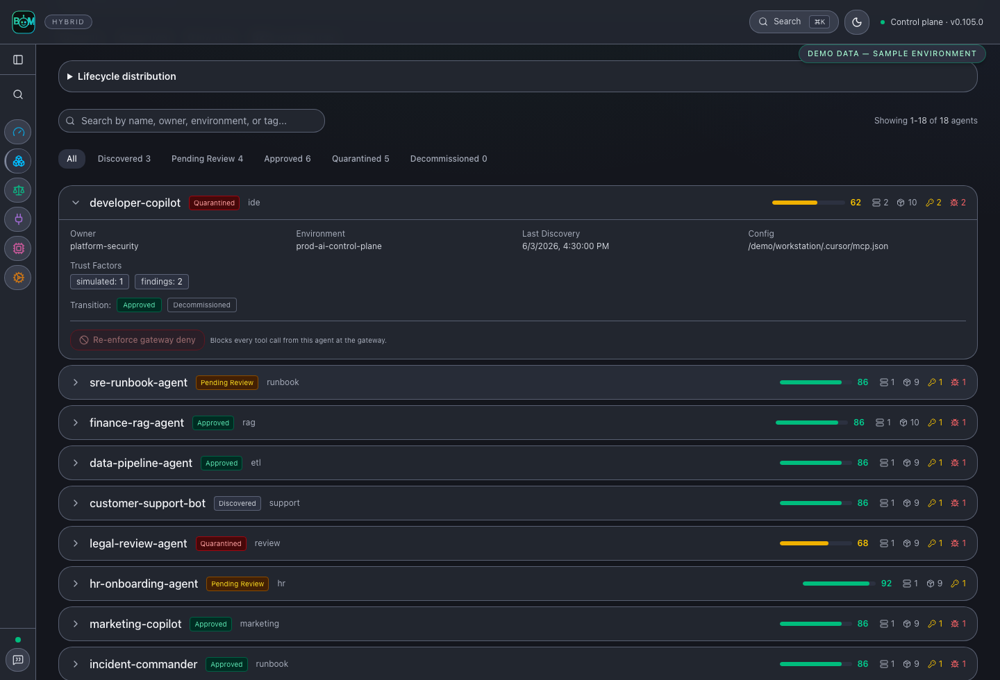
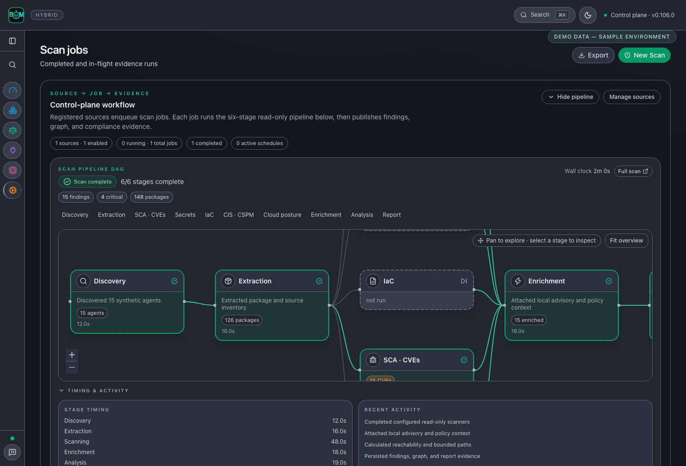
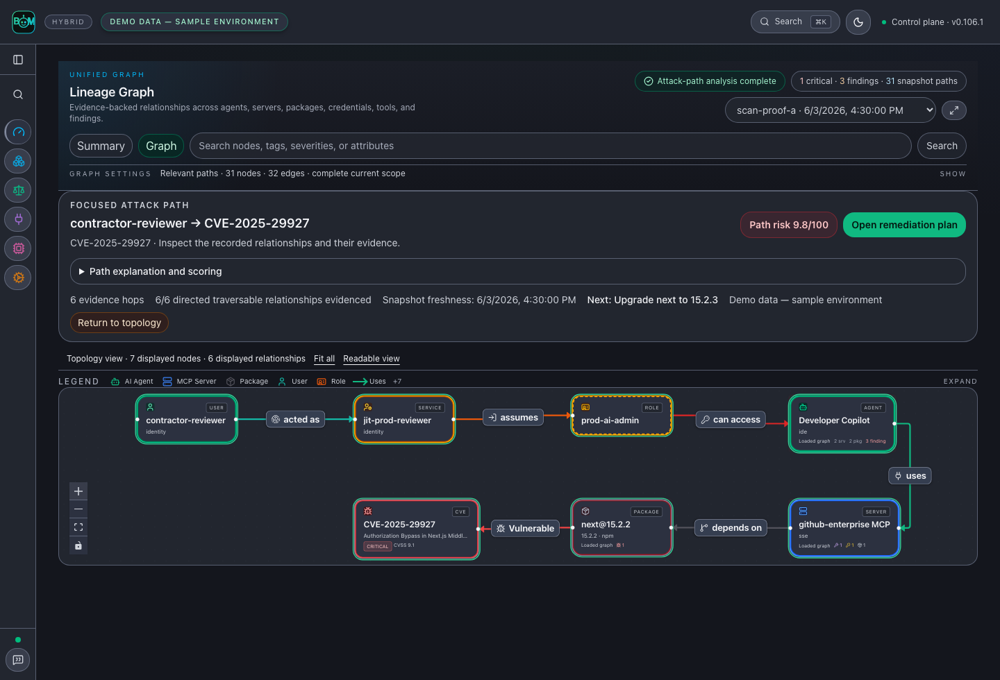
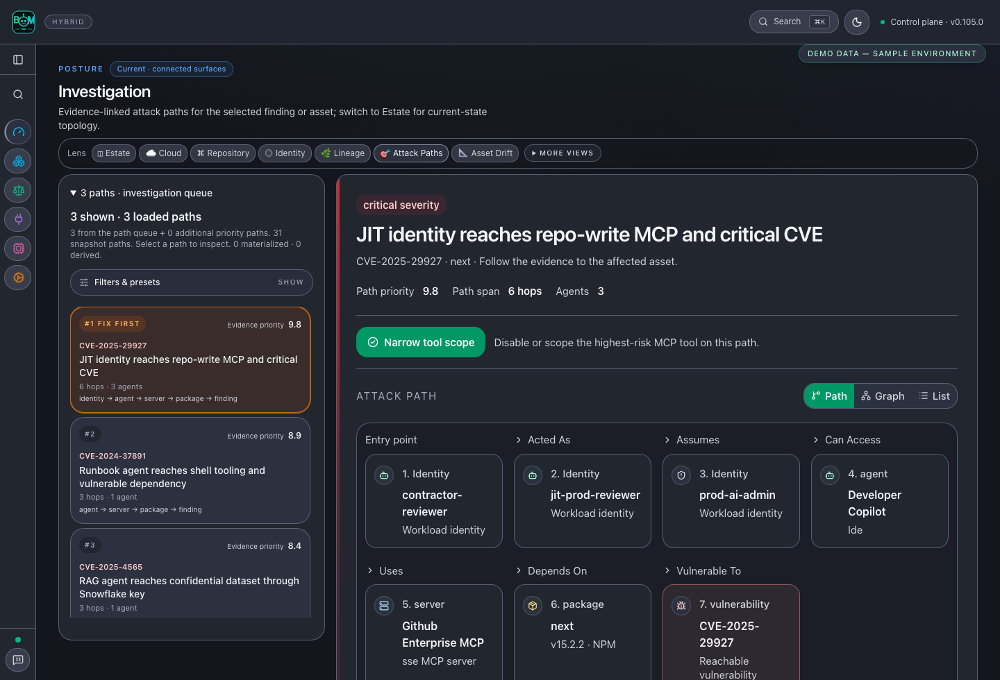
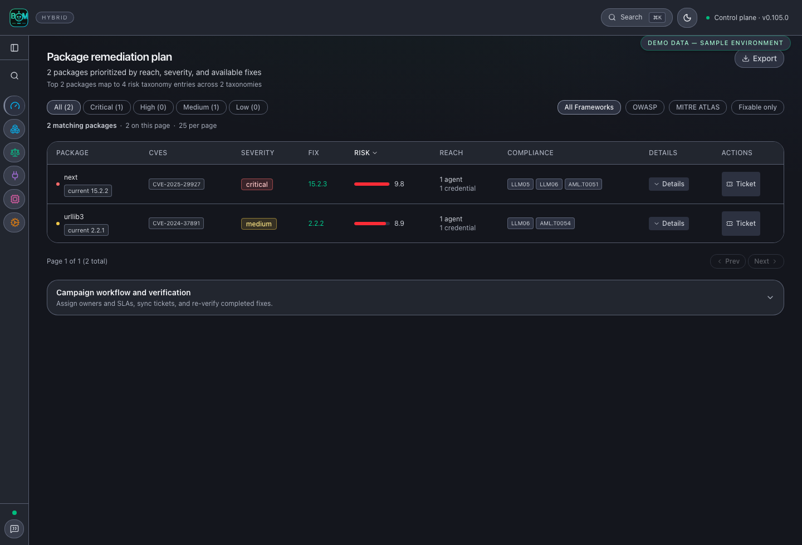

<p align="center">
  
</p>

<p align="center"><sub>Supported backends — connector depth varies. <a href="docs/INTEGRATIONS.md">See the capability matrix.</a></sub></p>

<p align="center">
  <a href="https://github.com/msaad00/agent-bom/actions/workflows/ci.yml"></a>
  <a href="https://pypi.org/project/agent-bom/"></a>
  <a href="https://pypi.org/project/agent-bom/"></a>
  <a href="https://hub.docker.com/r/agentbom/agent-bom"></a>
  <a href="LICENSE"></a>
  <a href="https://securityscorecards.dev/viewer/?uri=github.com/msaad00/agent-bom"></a>
  <a href="https://glama.ai/mcp/servers/msaad00/agent-bom"></a>
  <a href="https://smithery.ai/servers/agent-bom/agent-bom"></a>
</p>
<!-- mcp-name: io.github.msaad00/agent-bom -->

<p align="center"><b>Open security scanner and self-hosted control plane for AI, MCP, and cloud infrastructure.</b></p>

<p align="center">
  <b>15</b> package ecosystems · <b>16</b> compliance surfaces · <b>84</b> MCP tools · no account required<br />
  <a href="#quick-start"><b>Quick start</b></a> ·
  <a href="https://agent-bom-demo-82102570041.us-central1.run.app">Live demo</a> ·
  <a href="https://msaad00.github.io/agent-bom/">Docs</a>
</p>

## Discover → Scan → Correlate → Act

`agent-bom` scans repositories and software supply chains across SCA, secrets,
IaC, and containers; inventories AI agents, MCP, models, and datasets; and connects
read-only cloud, identity, Snowflake, and data sources. It normalizes that evidence
into one Finding + UnifiedGraph model, correlates reachable risk, then carries
work through owner, fix, verification, compliance evidence, or runtime policy.

`agent or tool entrypoint → MCP server → package → finding → impact → owner → fix → verify`

Run ad hoc locally or in CI, or use your self-hosted control plane for
scheduled or connected scans, history, assignments, and runtime enforcement.
Raw source and credentials stay inside the customer-controlled execution boundary;
collected, inferred, static, and runtime relationships stay distinct; incomplete evidence stays explicit.

[Quick start](#quick-start) · [Evidence workflow](docs/HOW_IT_WORKS.md) · [Integration capability matrix](docs/INTEGRATIONS.md) · [Measured matcher proof](docs/CVE_MATCHING_ACCURACY.json) · [Control-plane architecture](docs/ARCHITECTURE.md)

## Who it is for

| Role | Start here | Primary outcome |
|---|---|---|
| AppSec / product security | `agent-bom scan . -f sarif -o findings.sarif` | Scan repository dependencies, secrets, IaC, and images; gate CI with reachable findings |
| AI / ML engineer | `agent-bom scan .` | Inventory agents, MCP clients and servers, skills, models, and datasets before they ship |
| Cloud security | `agent-bom connect aws` | Connect a read-only cloud or Snowflake source, then evaluate inventory, posture, and identity evidence |
| Platform / DevOps | `pip install 'agent-bom[ui]' && agent-bom serve` | Centralize evidence, assign an owner and SLA, remediate, and verify |
| GRC / audit | `agent-bom report compliance-narrative scan.json` | Review control mappings and export evidence with explicit gaps |
| Leadership / CISO | `pip install 'agent-bom[ui]' && agent-bom serve` | Review posture, coverage, material risk, and change over time |

Security engineering and GRC remain separate workflows: findings and reachability are not
presented as audit certification. See [product boundaries](docs/PRODUCT_BOUNDARIES.md).

### Product journey

The captures below use a visibly labeled sample estate; live scans use the same
Finding + UnifiedGraph contracts. Select any image for the full-size proof.

<table>
  <tr>
    <th>1 · Discover inventory</th>
    <th>2 · Scan</th>
  </tr>
  <tr>
    <td><a href="docs/images/fleet-state-live.png"></a></td>
    <td><a href="docs/images/jobs-pipeline-live.png"></a></td>
  </tr>
  <tr>
    <th>3 · Reachable graph</th>
    <th>4 · Ranked path</th>
  </tr>
  <tr>
    <td><a href="docs/images/lineage-graph-live.png"></a></td>
    <td><a href="docs/images/security-graph-live.png"></a></td>
  </tr>
  <tr>
    <th colspan="2">5 · Act and verify</th>
  </tr>
  <tr>
    <td colspan="2" align="center"><a href="docs/images/remediation-live.png"></a></td>
  </tr>
</table>

[Continue to runtime enforcement in the full product gallery](docs/GALLERY.md) ·
[Capture protocol](docs/CAPTURE.md)

## Quick start

**Start here. This is the front door — two commands, no account, no config.**
The offline sample completes without downloading an advisory database and
shows the inventory, finding, and blast-radius output shape.

```bash
pip install agent-bom
agent-bom scan --demo --offline
```

The sample intentionally contains a known-malicious package, so exit status `1` is expected
and the printed report is complete. Scan a repository next:

```bash
agent-bom scan .
```

The repository scan shows inventory, findings, and reachable impact.
`agent-bom scan .` and `agent-bom scan -p .` are the same command; `PATH` is an
alias for `--project`.

Need a disconnected scan? Seed the smallest package-advisory database first:

```bash
agent-bom db update --osv-ecosystem PyPI
agent-bom scan . --offline
```

If that database is missing or unreadable, the scan writes a partial artifact
when `-o` is set and exits `1`; CI therefore cannot mistake unavailable
advisory coverage for a clean scan.

On a fresh database, that command covers only the selected ecosystem; packages
from other ecosystems remain explicit offline coverage gaps. Repeat
`--osv-ecosystem` for a polyglot repository, or use
`agent-bom db update --source osv` for OSV's all-ecosystems archive. The full
archive can exceed 1 GB, may take several minutes, and shows live progress with
the exact total when the server supplies it. Run the broader
`agent-bom db update` when you also need distro, exploit-probability, and
known-exploited-vulnerability feeds.

**A non-zero exit is a verdict, not a crash.** `scan` exits `0` when nothing
matched a gate, and `1` when one did — a `--fail-on-*` threshold you set, a
known-malicious package, or a scan that did not complete. The report is printed
in full either way, and the last line names the gate that matched. Full
[exit-code contract](site-docs/reference/exit-codes.md).

Save an artifact with `agent-bom scan . -f sarif -o findings.sarif`, or follow
the [first-run guide](docs/FIRST_RUN.md) for formats and CI use.

### Daily developer loop

Try the scanner without installing it, then check a package before adding it:

```bash
uvx agent-bom scan .
uvx agent-bom check requests@2.33.0 --ecosystem pypi
```

`check` returns an allow/unsafe/incomplete pre-install verdict; `scan` covers the
repository plus discovered AI/MCP configuration. To make both dependency and
secret gates automatic for a team, pin the shipped consumer hooks:

```yaml
repos:
  - repo: https://github.com/msaad00/agent-bom
    rev: v0.102.0
    hooks:
      - id: agent-bom-secrets
      - id: agent-bom-scan
```

Run `pre-commit install` once. The hooks install agent-bom into their own
isolated environment, so contributors do not need a separate global install.
[Hook behavior and CI examples](docs/DEPLOYMENT.md#pre-commit-hook).

<details>
<summary><b>Expansion paths — pick one only after the front door works</b></summary>

| You want to | Go to |
|---|---|
| Scan your repository | `agent-bom scan .` |
| A dashboard on your laptop | [Self-host](#self-host) |
| A shared deployment (Docker, Helm, EKS, Snowflake) | [Self-host](#self-host) table |
| Gate a pull request | [first-run guide §5](docs/FIRST_RUN.md#5-gate-ci-on-the-result) |
| Give an AI agent the tools | `agent-bom mcp server` — [MCP server](docs/MCP_SERVER.md) |
| Connect a cloud account | `agent-bom connect aws` — [cloud connections](docs/CLOUD_CONNECT.md) |

</details>

<details>
<summary><b>Try without a repository</b></summary>

Use the curated, explicitly synthetic sample when you only want to inspect the
output shape:

```bash
agent-bom scan --demo --offline
```

The sample intentionally contains a known-malicious package, which fails closed.

<p align="center">
  
</p>

</details>

## Self-host

Start the loopback control plane:

```bash
pip install 'agent-bom[ui]'
agent-bom serve
```

For a shared deployment, use the documented Docker or Helm path and configure
real identity, TLS, PostgreSQL, encryption, and audit keys before exposing it.

| Target | Start here |
|---|---|
| Docker Compose | [Platform compose](deploy/docker-compose.platform.yml) — PostgreSQL, split secrets, migration job |
| Docker Compose (evaluation) | [Pilot compose](deploy/docker-compose.pilot.yml) — loopback only, SQLite, no auth |
| Helm / Kubernetes | `helm install agent-bom oci://ghcr.io/msaad00/charts/agent-bom --version 0.102.0` |
| EKS | [Terraform module](deploy/terraform/platform-eks) |
| Snowflake SPCS / Native App | `scripts/deploy/install.sh snowflake-native` · [install guide](docs/snowflake-native-app/INSTALL.md) |
| Air-gapped | [Image bundle guide](site-docs/deployment/airgapped-image-bundle.md) |

> Examples target this release candidate; confirm release availability before copying an
> exact pin. Otherwise, use the latest version shown on PyPI.

[Deployment overview](site-docs/deployment/overview.md) ·
[Enterprise configuration](docs/ENTERPRISE.md) ·
[Cloud connections](docs/CLOUD_CONNECT.md)

<details>
<summary><b>Advanced integrations and runtime entry points</b></summary>

| Need | First action | Artifact or next step |
|---|---|---|
| GitHub CI | `uses: msaad00/agent-bom@v0.102.0` | SARIF, PR summary, and a policy exit code |
| Cloud evidence | `agent-bom connect aws` | Stored connection reference; run scans from the control plane |
| Runtime gateway | `agent-bom gateway serve --from-control-plane http://127.0.0.1:8422 --bind 127.0.0.1:8090` | Allow, warn, and block audit events |
| Agent interface | `agent-bom mcp server` | 84 MCP tools, 6 resources, and 8 workflow prompts |
| Agent distribution | [Smithery manifest](integrations/smithery.yaml) · [Glama](glama.json) · [MCP registry](integrations/mcp-registry) · [Docker MCP](integrations/docker-mcp-registry) | Registry-specific installation metadata |

MCP server mode exposes 84 MCP tools, 6 resources, and 8 workflow prompts, all
read-first: discovery and analysis never mutate a scanned target.

Set `YDC_API_KEY` to enable the optional `youcom_search` MCP tool for live web
and news context alongside the local threat-intel database. It is the only tool
that sends your query to a third party, it is off unless the key is set, and the
request is pinned to the You.com origin over TLS — so the key cannot be
redirected to another host by configuration.

The CLI, Docker, API, Helm chart, MCP server, gateway, and SDK are distribution
surfaces of the same product. The Snowflake SPCS / Native App lane runs inside
the customer's Snowflake account; it is a customer-owned deployment target,
not an agent-bom-hosted service. Snowflake and Snowpark also remain connector
and runtime integrations for the other deployment profiles.

</details>

<details>
<summary><b>Every way to install it</b></summary>

| Surface | Get it |
|---|---|
| Python package | `pip install agent-bom` — [PyPI](https://pypi.org/project/agent-bom/) |
| Container | `docker pull agentbom/agent-bom` — [Docker Hub](https://hub.docker.com/r/agentbom/agent-bom) |
| Kubernetes | `helm install agent-bom oci://ghcr.io/msaad00/charts/agent-bom` |
| GitHub Action | [`msaad00/agent-bom`](action.yml) |
| MCP server | `pip install 'agent-bom[mcp-server]' && agent-bom mcp server` |
| MCP registries | [Smithery manifest](integrations/smithery.yaml) · [Glama](glama.json) · [MCP registry](integrations/mcp-registry) · [Docker MCP](integrations/docker-mcp-registry) |
| SDKs | [Python](sdks/python) · [TypeScript](sdks/typescript) · [Go](sdks/go) |

</details>

## Trust

- Read-only discovery by default; runtime write decisions are separate and explicit.
- Credentials are write-only where stored, encrypted at rest, and never returned by API responses.
- API and control-plane routes are tenant scoped and auth protected outside explicit local mode.
- Missing evidence is shown as unavailable or partial, never converted into a factual zero.
- Public examples and screenshots use deterministic synthetic identifiers only.

[Threat model](docs/THREAT_MODEL.md) ·
[Release verification](docs/RELEASE_VERIFICATION.md) ·
[Security policy](SECURITY.md) ·
[MCP security model](docs/MCP_SECURITY_MODEL.md)

## Contributing and support

Stuck, or not sure where a question belongs? [SUPPORT.md](SUPPORT.md) has the
routing and an honest statement of what response to expect.

To contribute, start with [CONTRIBUTING.md](CONTRIBUTING.md), [AGENTS.md](AGENTS.md),
and the [open issues](https://github.com/msaad00/agent-bom/issues).

Apache-2.0 licensed.
