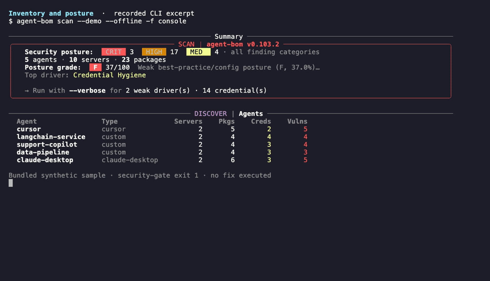

<p align="center">
  
</p>

<p align="center"><sub>Supported backends vary by capability. <a href="docs/INTEGRATIONS.md">Capability matrix.</a></sub></p>

<p align="center">
  <a href="https://github.com/msaad00/agent-bom/actions/workflows/ci.yml"></a>
  <a href="https://pypi.org/project/agent-bom/"></a>
  <a href="https://pypi.org/project/agent-bom/"></a>
  <a href="https://hub.docker.com/r/agentbom/agent-bom"></a>
  <a href="LICENSE"></a>
  <a href="https://securityscorecards.dev/viewer/?uri=github.com/msaad00/agent-bom"></a>
  <a href="https://glama.ai/mcp/servers/msaad00/agent-bom"></a>
  <a href="https://smithery.ai/servers/agentbom/agent-bom"></a>
</p>
<!-- mcp-name: io.github.msaad00/agent-bom -->

<p align="center"><b>Open security scanner and self-hosted control plane for AI, MCP, and cloud infrastructure.</b></p>

Scan your software and AI infrastructure, trace findings to affected services,
and carry the evidence into remediation, compliance and runtime policy.

<p align="center">
  <a href="#quick-start"><b>Quick start</b></a> ·
  <a href="https://msaad00.github.io/agent-bom/">Docs</a>
</p>

## Quick start

Scan a repository without an account or control plane:

```bash
pip install agent-bom
agent-bom scan .
```

Save the findings for CI with `agent-bom scan . -f sarif -o findings.sarif`.
Use `agent-bom doctor` if the scan cannot start.

**Try the CLI without a repository:** `agent-bom scan --demo --offline`.
The bundled synthetic sample deliberately triggers a security gate (exit `1`).

<p align="center">
  
</p>

The recording runs the real offline command and pages its output for readability.
Sample findings are not evidence about your environment.
[First-run guide](docs/FIRST_RUN.md) · [Exit codes](site-docs/reference/exit-codes.md)

### Connect a source, then scan

For AWS, Azure, GCP or Snowflake, start a durable local control plane:

```bash
pip install 'agent-bom[ui,aws]'
AGENT_BOM_NO_AUTH_ROLE=analyst agent-bom serve --persist ~/.agent-bom/control-plane.db
```

Open **Connections**, add the provider's read-only grant, then run an
explicit first scan after verification. Install the matching provider extra
(`azure`, `gcp` or `snowflake`) before connecting. This loopback example grants
scan access to the local operator; shared listeners require configured authentication.
[Cloud connection guide](docs/CLOUD_CONNECT.md)

<details>
<summary>Offline databases and developer workflow</summary>

Need a disconnected scan? `agent-bom db update --osv-ecosystem PyPI` seeds
advisories for Python. It covers only the selected ecosystem; add other ecosystems
or use `agent-bom db update --source osv` for the full archive, which can exceed 1 GB;
the command shows live progress.
Then run `agent-bom scan . --offline`.

**A non-zero exit** can indicate a security gate or incomplete assessment;
inspect the report and its coverage. Missing advisory data is not a clean scan.

Use `uvx agent-bom scan .` without a global install, or
`uvx agent-bom check requests@2.33.0 --ecosystem pypi` before adding a package.
For package checks and automatic dependency/secret gates, see
[pre-commit and CI setup](docs/DEPLOYMENT.md#pre-commit-hook).

</details>

## From evidence source to verified action

Start with a repository, image, SBOM or MCP config — no connection required.
Or **add a read-only connection** for AWS, Azure, GCP or Snowflake and collect a
scoped snapshot. Inventory is the output of a scan.

The shared security graph connects packages, workloads, agents, tools, identities,
and data assets through typed relationships with source evidence and explicit completeness.

| Scan | Centralize | Enforce |
|---|---|---|
| Inventory, findings and exportable evidence from CLI or CI | Correlate services, agents, identities and data in your self-hosted control plane | Apply runtime policy to MCP tool calls through the proxy or gateway |

### See what needs fixing — and why

Follow `pillow@9.0.0` and `CVE-2023-4863` from a finding to the affected image
processing service, then inspect its graph to assess reachable risk. Each
relationship needs a source receipt; matching labels alone never prove a path.
Vulnerable package → advisory finding → affected asset is an investigation path;
credential names alone do not prove permission or exploitability.

<p align="center">
  <picture>
    <source media="(prefers-color-scheme: light)" srcset="docs/images/correlation-receipts-light-live.png">
    
  </picture>
</p>

Assign an owner, apply the fix, and re-scan to verify it. A recommended upgrade
or a blocked tool call alone does not establish that the exposure is resolved.

**Reference evidence lab — modeled local infrastructure:** real parsers,
a pinned advisory scan and local authenticated gateway calls. Infrastructure
relationships connect observed or modeled entities. Deployed remediation and
live-cloud validation are not claimed. A gateway block can contain one tool call;
it does not prove the underlying package was fixed.

[Run the reference lab](examples/reference-evidence-lab/README.md) ·
[Inspect the path](docs/GALLERY.md#follow-an-image-processing-exposure) ·
[Explore reproducible product scenarios](docs/GALLERY.md)

[Evidence workflow](docs/HOW_IT_WORKS.md) ·
[Control-plane architecture](docs/ARCHITECTURE.md) ·
[Integration capability matrix](docs/INTEGRATIONS.md) ·
[Measured matcher proof](site-docs/features/scanning.md#reproducible-matching-evidence)

## Value by role

<details>
<summary>Find the starting point for your team</summary>

| Role | Start here | Primary outcome |
|---|---|---|
| Developer / AI engineer | `agent-bom scan .` | Inspect dependencies, secrets, IaC and AI/MCP configuration |
| AppSec / product security | Open **Overview**, then inspect a prioritized finding | Trace affected workloads and assign a fix |
| Cloud security | Add a read-only connection, then run a scan | Collect scoped cloud and identity evidence |
| Platform / DevOps | `pip install 'agent-bom[ui]' && AGENT_BOM_NO_AUTH_ROLE=analyst agent-bom serve --persist ~/.agent-bom/control-plane.db` | Centralize scans, owners and SLAs |
| GRC / audit | `agent-bom report compliance-narrative scan.json` | Export OWASP LLM Top 10, MITRE ATLAS, EU AI Act and NIST AI RMF mappings; retain unavailable, partial, and not-assessed evidence |
| CISO / engineering leader | Open **Overview** in the self-hosted control plane | Review priorities and evidence coverage |
| AI assistant / automation | `agent-bom mcp server` | Scan, inspect evidence and plan fixes |

</details>

## Self-host

Keep evidence, credentials, identity and audit in your own environment.
For local evaluation, use `pip install 'agent-bom[ui]'`, then
`AGENT_BOM_NO_AUTH_ROLE=analyst agent-bom serve --persist ~/.agent-bom/control-plane.db`.
Open **New Scan** or **Connections** to produce inventory.

| Deployment | Start here |
|---|---|
| Docker Compose | [Platform compose](deploy/docker-compose.platform.yml) — PostgreSQL, split secrets and migrations |
| Kubernetes / Helm | [Deployment guide](site-docs/deployment/overview.md) |
| EKS | [Terraform module](deploy/terraform/platform-eks) |
| Snowflake Native App | [Install guide](docs/snowflake-native-app/INSTALL.md) |
| Air-gapped | [Image bundle guide](site-docs/deployment/airgapped-image-bundle.md) |

For shared deployments, configure identity, TLS, PostgreSQL, encryption and
audit keys. [Enterprise configuration](docs/ENTERPRISE.md)

### Give agents the same evidence

```bash
pip install 'agent-bom[mcp-server]'
agent-bom mcp server
```

Start with eight focused tools. Select a graph, cloud, runtime or audit profile
when needed. The full compatibility catalog has 86 MCP tools, 7 resources, and 8 workflow prompts.
[Client setup](docs/MCP_CLIENT_GUIDES.md) · [MCP workflows](docs/MCP_WORKFLOWS.md) ·
[Smithery manifest](site-docs/integrations/smithery.md) (configuration, not live catalog proof) ·
[Proxy and gateway](site-docs/deployment/proxy-vs-gateway-vs-fleet.md)

## Trust

Read-only discovery by default. Missing evidence stays unavailable or partial.
Mapped findings and reachability are not presented as audit certification.

[Product boundaries](docs/PRODUCT_BOUNDARIES.md) · [Permissions](docs/PERMISSIONS.md) ·
[Threat model](docs/THREAT_MODEL.md) · [Security policy](SECURITY.md) ·
[Release verification](docs/RELEASE_VERIFICATION.md); confirm release availability before copying an
exact version pin from a deployment guide.

## Contributing and support

[Contributing](CONTRIBUTING.md) · [Support](SUPPORT.md) ·
[Open issues](https://github.com/msaad00/agent-bom/issues) · [Apache-2.0 license](LICENSE)
