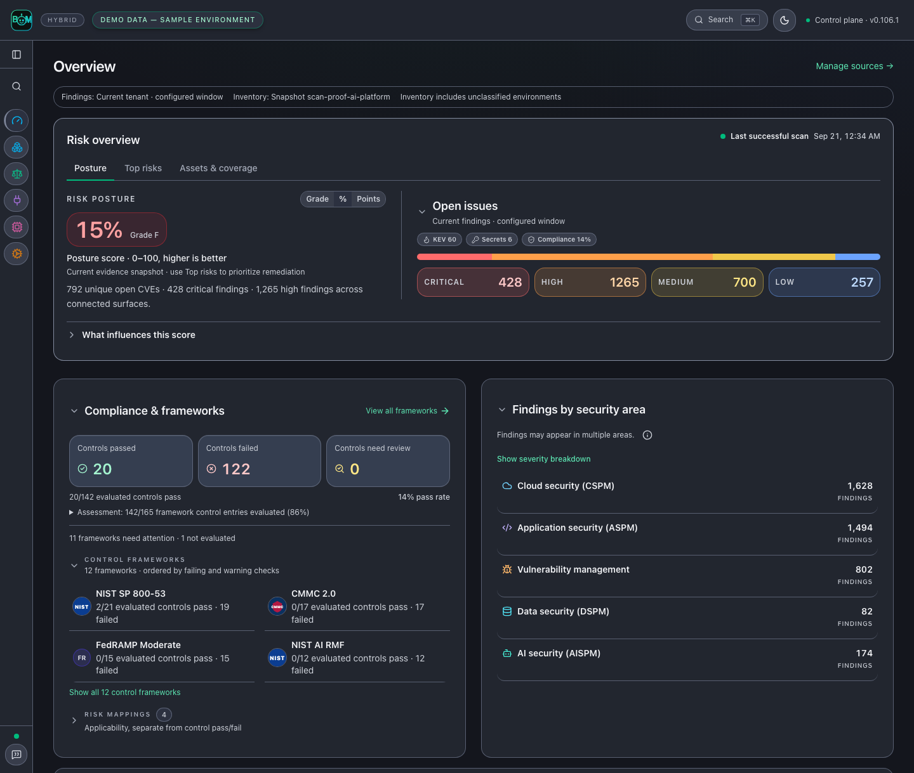
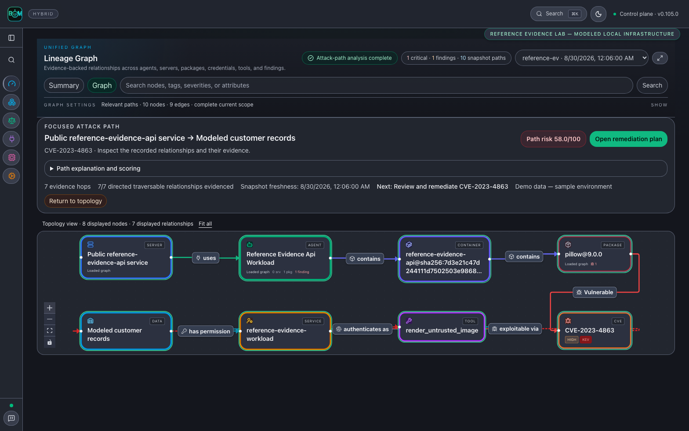
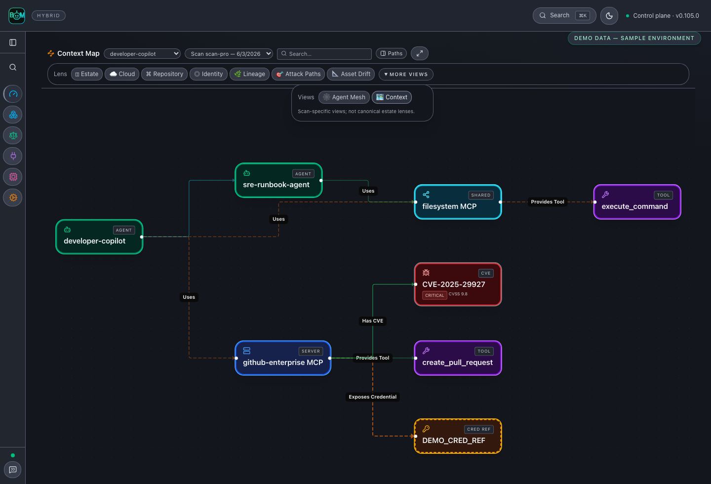
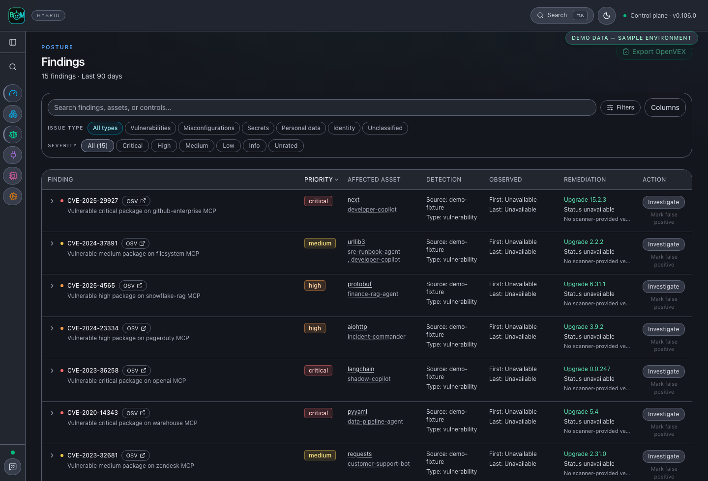

<p align="center">
  
</p>

<p align="center">
  <a href="https://github.com/msaad00/agent-bom/actions/workflows/ci.yml"></a>
  <a href="https://pypi.org/project/agent-bom/"></a>
  <a href="https://pypi.org/project/agent-bom/"></a>
  <a href="https://hub.docker.com/r/agentbom/agent-bom"></a>
  <a href="LICENSE"></a>
  <a href="https://securityscorecards.dev/viewer/?uri=github.com/msaad00/agent-bom"></a>
  <a href="https://glama.ai/mcp/servers/msaad00/agent-bom"></a>
  <a href="https://smithery.ai/servers/agentbom/agent-bom"></a>
</p>
<!-- mcp-name: io.github.msaad00/agent-bom -->

<p align="center"><b>Open security scanner and self-hosted control plane for AI, MCP, and cloud infrastructure.</b></p>

<p align="center">
  <a href="#product-tour"><b>Product tour</b></a> ·
  <a href="#self-host-in-your-environment"><b>Self-host</b></a> ·
  <a href="#quick-start">Quick start</a> ·
  <a href="https://msaad00.github.io/agent-bom/">Docs</a>
</p>

## Built for the teams that build, secure and govern AI

| Your team | What you can do |
|---|---|
| **Developers & AI engineers** | Inspect repositories, dependencies and MCP configuration; bring findings into CI and coding assistants. |
| **AppSec & cloud security** | Connect cloud accounts, trace findings through workloads and identities, and prioritize fixes by reachable impact. |
| **Platform & DevOps** | Run a shared control plane, collect fleet evidence, and apply policy to MCP traffic through the proxy or gateway. |
| **GRC & audit** | Open **Compliance** to review mappings and [export scan evidence](docs/GALLERY.md#scan-a-repository-before-shipping) with its source, freshness and assessment gaps. |
| **Security & engineering leaders** | Open **Overview** to review posture, remediation priorities and tracked AI spend across connected sources. |
| **AI assistants & automation** | Use [MCP workflows](docs/MCP_WORKFLOWS.md) to query evidence and inspect findings within the caller’s permissions. |

## Product tour

### Security, engineering and GRC: prioritize risk and assessment gaps

Start with **Posture**, inspect evidence in **Top risks**, and scope inventory in **Assets & coverage**.
**Compliance** separates evaluated-control pass rate from assessment coverage.
OWASP and MITRE ATLAS risk mappings describe applicability, not control pass/fail.
The offline synthetic enterprise estate includes evaluated checks; results do not establish certification or an audit opinion.

<p align="center">
  <a href="docs/images/dashboard-live.png"></a>
</p>

Explore [Top risks](docs/images/dashboard-risks-live.png), [scoped Inventory](docs/images/inventory-live.png), and [framework controls and evidence](site-docs/features/compliance.md).

### AppSec and cloud teams: explain why a finding matters

Follow **CVE-2023-4863 in pillow@9.0.0** through recorded relationships between the service, container, tool, workload identity and modeled data asset.
Inspect the source receipts and carry the selected finding into remediation. A recorded path does not by itself prove exploitation or successful data access.

<a href="docs/images/correlation-graph-live.png"></a>

Inspect each hop’s source evidence, permissions and remediation. This reference lab uses modeled infrastructure; select the image for full-size detail.

<details>
<summary>Explore an agent’s connected assets</summary>

<a href="docs/images/context-map-live.png"></a>

Expand connections, focus an entity, then return to the loaded overview. This example uses labeled sample data.

</details>

<details>
<summary>Explore graph navigation, permissions and evidence</summary>

Choose a scope in **Summary**, then **Inspect** an entity. Filter by type or severity, set direction and hop limits, and expand bounded pages; incomplete views are labeled.
In **Context**, use **Focus here**, **Back**, or an exact identifier. Select a node or arrow to inspect its evidence, freshness and unknowns. **Investigate reach & permissions**
opens permission receipts, CVE prerequisites and related activity; missing exploitability
stays **not assessed**. [Investigation workflow](site-docs/architecture/security-graph-model.md#investigate-an-agent-from-context).

**Connect data locations to security evidence.** Explore recorded stores and datasets alongside identities and findings.
Distinguish storage, access evidence and collection sources; derived classifications do not prove contents or successful reads. [Data and evidence model](site-docs/architecture/security-graph-model.md#data-locations-access-and-evidence-sources).
</details>

### Engineers and GRC: prioritize findings and verify fixes

Review findings by priority, affected asset and evidence. Open remediation for package
upgrades and mapped controls, assign owners, set SLAs and re-scan to verify fixes.

<p align="center">
  <a href="docs/images/dependency-map-live.png"></a>
</p>

<details>
<summary>See package remediation and verification</summary>

<p align="center">
  <a href="docs/images/remediation-live.png"></a>
</p>

</details>

These are application captures, not mockups. Overview, Findings and remediation use
labeled sample data. The graph uses the reproducible reference lab: real parsers,
a pinned advisory scan and authenticated gateway calls, with modeled infrastructure.
A blocked call does not establish that the underlying package was fixed.

[Discover and scan](docs/GALLERY.md) · [Runtime policy and agent workflows](site-docs/deployment/proxy-vs-gateway-vs-fleet.md) ·
[Run the reference evidence lab](examples/reference-evidence-lab/README.md) ·
[Evidence workflow](docs/HOW_IT_WORKS.md) · [Control-plane architecture](docs/ARCHITECTURE.md)

## Self-host in your environment

**Your infrastructure, your identity, your database, your audit boundary.**
Run on a workstation, VM or Kubernetes cluster; add sources, fleet collection and
runtime enforcement as needed. The guides cover credentials, persistence and access.

For a workstation pilot, run from a [published release checkout](https://github.com/msaad00/agent-bom/releases):

```bash
docker compose up -d
```

Open **http://localhost:3000**, then **Connections** or **New Scan**.
For cloud accounts, add a scoped read-only connection, verify access, then start a scan.
The pilot binds to loopback and retains state in a Docker volume. Use the
authenticated deployment guide below for a shared instance.

| Where you run it | Start here |
|---|---|
| **Workstation evaluation** | [Docker pilot](docs/DEPLOY_QUICKSTART.md) — packaged API, dashboard and persistent state |
| **Shared VM / private cloud** | [Authenticated deployment](site-docs/deployment/authenticated-hosted-instance.md) · [Compose profile](deploy/docker-compose.platform.yml) — PostgreSQL and configured identity |
| **Kubernetes** | [Helm deployment](site-docs/deployment/control-plane-helm.md) · [EKS Terraform](deploy/terraform/platform-eks) |
| **Snowflake** | [Native App preview](docs/snowflake-native-app/INSTALL.md) |
| **Restricted networks** | [Air-gapped image bundle](site-docs/deployment/airgapped-image-bundle.md) |

[Choose a deployment](site-docs/deployment/overview.md) · [Enterprise configuration](docs/ENTERPRISE.md) ·
[Connect cloud accounts](docs/CLOUD_CONNECT.md)

<details>
<summary>Work with your existing tools</summary>

Use **CLI or GitHub Action**, **REST API**, or **MCP**; export **SARIF, CycloneDX, SPDX, JSON and HTML**.
Cloud connectors and fleet sync collect inventory; proxy and gateway deployments add runtime evidence.

[Integration capability matrix](docs/INTEGRATIONS.md) · [MCP client setup](docs/MCP_CLIENT_GUIDES.md) ·
[Proxy, gateway and fleet](site-docs/deployment/proxy-vs-gateway-vs-fleet.md) · [Smithery setup and manifest](site-docs/integrations/smithery.md)

</details>

## Quick start

**Scan a repository:**

```bash
pip install agent-bom
agent-bom scan .
```

Save CI evidence with `agent-bom scan . -f sarif -o findings.sarif`.
Use `agent-bom doctor` to check setup. [First-run guide](docs/FIRST_RUN.md)

**Try the CLI demo:** `agent-bom scan --demo --offline`.
The synthetic sample deliberately triggers a security gate (exit `1`).

<p align="center">
  
</p>

The recording runs the offline command and pages its output for readability.

**Give assistants access to the same evidence:**

```bash
pip install 'agent-bom[mcp-server]'
agent-bom mcp server
```

Source version: **v0.106.0**. Start with eight focused tools, then select a graph, cloud, runtime or audit
profile. The full catalog has 86 MCP tools, 7 resources, and 8 workflow prompts.
[MCP workflows](docs/MCP_WORKFLOWS.md)

<details>
<summary>Developer gates and offline scans</summary>

Use `uvx agent-bom scan .` without a global install, or
`uvx agent-bom check requests@2.33.0 --ecosystem pypi` before adding a package.
For automatic dependency and secret gates, see
[pre-commit and CI setup](docs/DEPLOYMENT.md#pre-commit-hook).

`agent-bom db update --osv-ecosystem PyPI` covers only the selected ecosystem;
add the ecosystems you need before running `agent-bom scan . --offline`.
The full `agent-bom db update --source osv` archive can exceed 1 GB; the command shows live progress.
A non-zero exit can mean a security gate or incomplete assessment: inspect the
report and coverage. [Exit codes](site-docs/reference/exit-codes.md)

</details>

## Trust and evidence

Discovery uses read-only access by default. Explicit disk side-scans create
temporary cloud resources; runtime enforcement acts on selected tool calls.
Missing evidence stays unavailable or partial. Control mappings are not audit certification.

[Product boundaries](docs/PRODUCT_BOUNDARIES.md) · [Permissions](docs/PERMISSIONS.md) ·
[Threat model](docs/THREAT_MODEL.md) · [Security policy](SECURITY.md) ·
[Release verification](docs/RELEASE_VERIFICATION.md) ·
[Measured matcher proof](site-docs/features/scanning.md#reproducible-matching-evidence)

## Contributing and support

[Contributing](CONTRIBUTING.md) · [Support](SUPPORT.md) ·
[Open issues](https://github.com/msaad00/agent-bom/issues) · [Apache-2.0 license](LICENSE)
