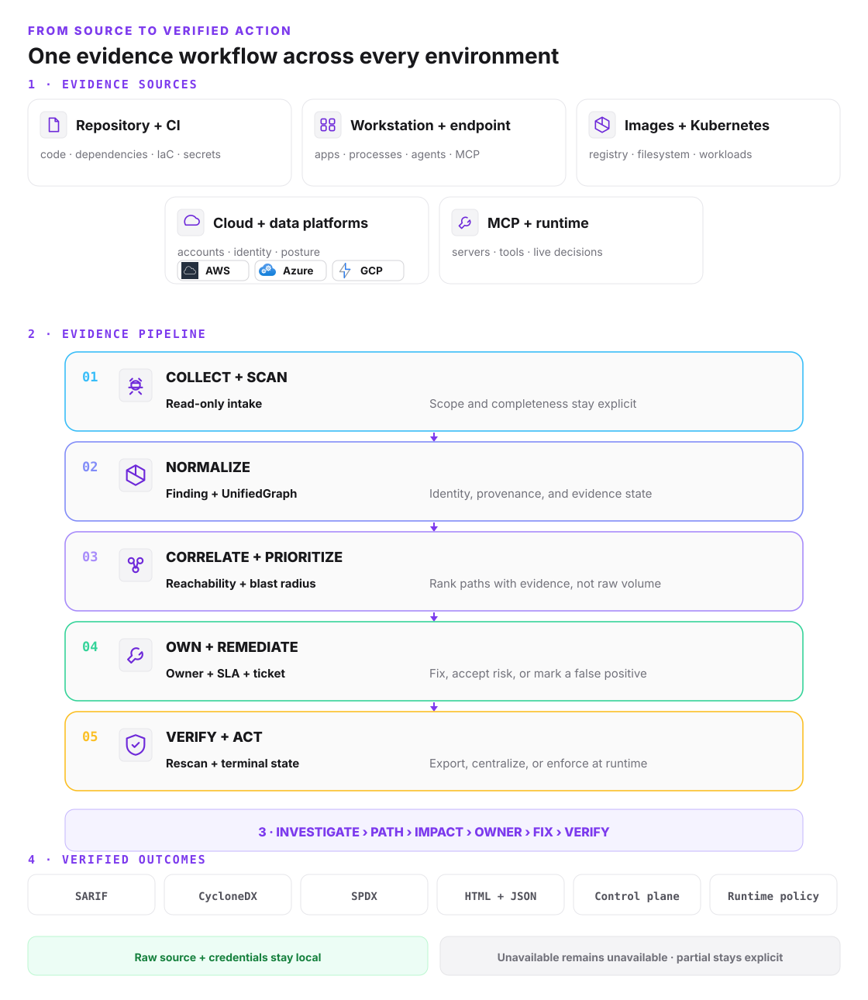
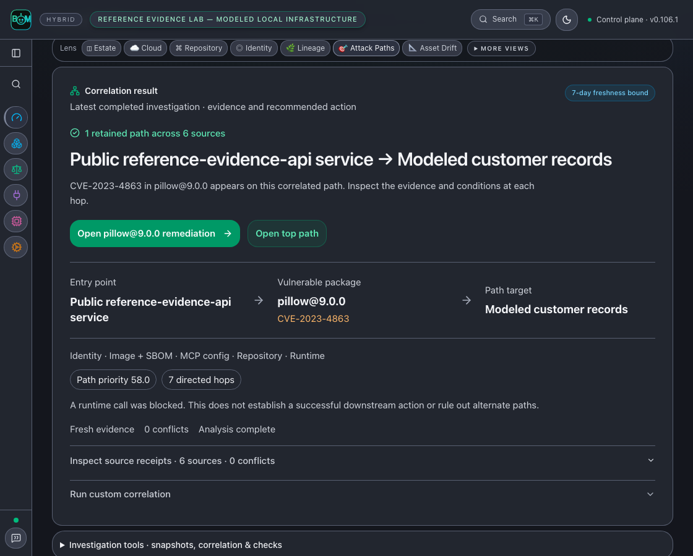

<p align="center">
  
</p>

<p align="center"><sub>Supported backends vary by capability. <a href="docs/INTEGRATIONS.md">Capability matrix.</a></sub></p>

<p align="center">
  <a href="https://github.com/msaad00/agent-bom/actions/workflows/ci.yml"></a>
  <a href="https://pypi.org/project/agent-bom/"></a>
  <a href="https://pypi.org/project/agent-bom/"></a>
  <a href="https://hub.docker.com/r/agentbom/agent-bom"></a>
  <a href="LICENSE"></a>
  <a href="https://securityscorecards.dev/viewer/?uri=github.com/msaad00/agent-bom"></a>
  <a href="https://glama.ai/mcp/servers/msaad00/agent-bom"></a>
  <a href="https://smithery.ai/servers/agentbom/agent-bom"></a>
</p>
<!-- mcp-name: io.github.msaad00/agent-bom -->

<h1 align="center">Turn scattered infrastructure evidence into prioritized, correlated, and verifiable action</h1>

<p align="center"><b>Open security scanner and self-hosted control plane for AI, MCP, and cloud infrastructure.</b></p>

Security teams rarely lack scanners. They lack one trustworthy view of what was
scanned, what was discovered, which findings are actually connected to critical
systems, who owns the fix, and whether the fix held.

<p align="center">
  <a href="#quick-start"><b>Quick start</b></a> ·
  <a href="https://msaad00.github.io/agent-bom/">Docs</a>
</p>

## From evidence source to verified action

`agent-bom` closes that loop with two honest entry paths:

| Start from | First action | What produces inventory |
|---|---|---|
| A repository, image, SBOM, workstation, or MCP config | Run a local or CI scan—no connection required | The scanner reads the target and emits inventory, findings, provenance, and graph evidence together |
| AWS, Azure, GCP, Snowflake, Kubernetes, or another managed source | Add a read-only connection in the self-hosted control plane, then run or schedule a scan | The connection defines scope and credentials; the scan collects the source and creates the inventory snapshot |

Both paths converge after collection: normalize evidence into the same Finding +
UnifiedGraph contracts, correlate reachable risk, assign an owner and SLA, then
re-scan to verify the result. Inventory is always the output of a named target or
connected source—never unexplained preloaded data.

<p align="center">
  <picture>
    <source media="(prefers-color-scheme: dark)" srcset="docs/images/workflow-dark.svg">
    <source media="(prefers-color-scheme: light)" srcset="docs/images/workflow-light.svg">
    
  </picture>
</p>

**The product promise:** start with one useful artifact today; keep the same
evidence model as you add CI, connected sources, history, assignments,
compliance exports, and runtime enforcement in your own environment.

[Quick start](#quick-start) · [Evidence workflow](docs/HOW_IT_WORKS.md) · [Integration capability matrix](docs/INTEGRATIONS.md) · [Measured matcher proof](docs/CVE_MATCHING_ACCURACY.json) · [Control-plane architecture](docs/ARCHITECTURE.md)

The shared security graph connects packages, workloads, agents, tools, identities, and data assets through typed relationships with source evidence and explicit completeness.

### Read the blast radius

```text
Vulnerable package → advisory finding
        ↑ depends on
     MCP server → exposed tools
        ↑ uses
       Agent → credential references → permitted resources
```

This schematic explains the questions to investigate. Actual paths require
matching directed relationships and source evidence; credential names alone
do not prove permission or exploitability.

### See what needs fixing — and why

**Discover the estate.** Scan a repository or image, or collect a connected
account. The inventory shows which packages, workloads, agents, tools, and
identities were actually covered. Start with `agent-bom scan .`; save the
result as JSON or SARIF before expanding the scope.

**Find the consequential exposure.** In the reference scenario, an image
processing service uses `pillow@9.0.0`, matched to `CVE-2023-4863`. Correlation
connects its package evidence to a modeled workload, MCP tool, identity, and
data asset. The question becomes: which service needs attention, and why?

<p align="center">
  <picture>
    <source media="(prefers-color-scheme: light)" srcset="docs/images/correlation-receipts-light-live.png">
    
  </picture>
</p>

**Inspect the evidence.** Open the ordered path to inspect each relationship
and its source receipt. The graph connects observed or modeled entities with
named, directed relationships; matching labels alone never prove a path.
[Inspect this scenario's path](docs/GALLERY.md#follow-an-image-processing-exposure).

**Remediate and verify.** Assign the package fix to its owner, rebuild the
image, and re-scan the deployed workload. Compare fresh evidence before closing
the finding. A gateway block can contain one tool call while the underlying
exposure remains.

The **Reference evidence lab — modeled local infrastructure** runs real
parsers, a pinned advisory scanner, and authenticated local gateway calls.
Its package replay demonstrates the advisory match disappearing after a
manifest change. Infrastructure and access relationships remain modeled;
deployed remediation and live-cloud validation are not claimed.

[Run the reference lab](examples/reference-evidence-lab/README.md) ·
[Explore reproducible product scenarios](docs/GALLERY.md)

## Value by role

| Role | Start here | Primary outcome |
|---|---|---|
| Developer / AI engineer | `agent-bom scan .` | See dependencies, secrets, IaC, agents, MCP, and whether Click, Flask, or FastAPI entry points can reach vulnerable packages before shipping |
| AppSec / product security | `agent-bom scan . --gha . --offline` | Inventory remote actions and reusable workflows with their refs, source provenance, and CI-hardening findings |
| Cloud security | Add a read-only connection, then run a scan | Build scoped cloud, identity, and posture inventory with explicit coverage and provenance |
| Platform / DevOps | `pip install 'agent-bom[ui]' && AGENT_BOM_NO_AUTH_ROLE=analyst agent-bom serve --persist ~/.agent-bom/control-plane.db` | Schedule scans, centralize evidence, assign owners and SLAs, and verify remediation |
| GRC / audit | `agent-bom report compliance-narrative scan.json` | Export mapped evidence for OWASP LLM Top 10, MITRE ATLAS, EU AI Act, and NIST AI RMF; preserve unavailable, partial, and not-assessed states |
| CISO / engineering leader | Open **Architecture** in the self-hosted graph | Compare observed **Current** state with modeled **Proposed** and **Difference** views; proposals remain labeled as not observed or deployed |

Security engineering and GRC remain separate workflows: findings and
reachability are not presented as audit certification. See
[product boundaries](docs/PRODUCT_BOUNDARIES.md). GitHub Actions collection and
credential requirements are documented in [permissions](docs/PERMISSIONS.md);
scenario truth boundaries are defined by the [graph contract](docs/graph/CONTRACT.md).

## Quick start

Choose the smallest path that proves value. No account or control plane is
required for repository, image, SBOM, workstation, or MCP configuration scans.

### Path A — scan now, no connection

Scan the current repository first. The console shows inventory, findings,
reachable impact, evidence coverage, and the next remediation step.

```bash
pip install agent-bom
agent-bom scan .
```

Save the same result for CI with
`agent-bom scan . -f sarif -o findings.sarif`. If the first scan cannot start,
run `agent-bom doctor` for dependency, database, and environment checks.

To inspect a deterministic sample, use the bundled offline demo. It deliberately
contains blocking findings, so status `1` is the expected security verdict; the
printed report is complete.

```bash
agent-bom scan --demo --offline
```

`agent-bom scan .` and `agent-bom scan -p .` are the same command; `PATH` is an
alias for `--project`.

### Path B — connect a source, then scan

Use this path when the source is an account or platform rather than a local
target. Start the customer-controlled control plane, open **Connections**, add
the provider's read-only grant, and run the first scan. The browser flow
defaults to an explicit first scan after verification; scheduled scans are an
explicit operator opt-in.

```bash
pip install 'agent-bom[ui,aws]'
AGENT_BOM_NO_AUTH_ROLE=analyst agent-bom serve --persist ~/.agent-bom/control-plane.db
```

The explicit role applies to the generated loopback API key and browser sessions.
`analyst` can run scans but cannot manage API keys. With no explicit role, the
local bootstrap retains its admin default; non-loopback listeners still require
configured authentication. Restart after changing the bootstrap role.

The example installs AWS collection support on the control-plane server. For
Azure, GCP, or Snowflake, install `agent-bom[ui,azure]`, `agent-bom[ui,gcp]`, or
`agent-bom[ui,snowflake]` instead. Install the selected provider extra before
entering credentials; `agent-bom[ui]` alone does not include provider SDKs.

The explicit SQLite path keeps scan jobs, findings, compliance history, and
graph inventory available together after a restart. Omit `--persist` only for
an intentionally ephemeral process. The explicit local `analyst` role permits
this loopback operator to run scans; the server's default anonymous role remains
read-only.

For headless onboarding, `agent-bom connect <provider>` prints the exact grant,
credential boundary, verification step, and next scan command. The
[cloud connection guide](docs/CLOUD_CONNECT.md) documents AWS, Azure, GCP, and
Snowflake, including organization scope and scheduler behavior.

Need a disconnected scan? Seed the smallest package-advisory database first:

```bash
agent-bom db update --osv-ecosystem PyPI
agent-bom scan . --offline
```

If that database is missing or unreadable, the scan writes a partial artifact
when `-o` is set and exits `1`; CI therefore cannot mistake unavailable
advisory coverage for a clean scan.

On a fresh database, that command covers only the selected ecosystem; packages
from other ecosystems remain explicit offline coverage gaps. Repeat
`--osv-ecosystem` for a polyglot repository, or use
`agent-bom db update --source osv` for OSV's all-ecosystems archive. The full
archive can exceed 1 GB, may take several minutes, and shows live progress with
the exact total when the server supplies it. Run the broader
`agent-bom db update` when you also need distro, exploit-probability, and
known-exploited-vulnerability feeds.

**A non-zero exit is a verdict, not a crash.** `scan` exits `0` when nothing
matched a gate, and `1` when one did — a `--fail-on-*` threshold you set, a
known-malicious package, or a scan that did not complete. The report is printed
in full either way, and the last line names the gate that matched. Full
[exit-code contract](site-docs/reference/exit-codes.md).

Save an artifact with `agent-bom scan . -f sarif -o findings.sarif`, or follow
the [first-run guide](docs/FIRST_RUN.md) for formats and CI use.

### Daily developer loop

Try the scanner without installing it, then check a package before adding it:

```bash
uvx agent-bom scan .
uvx agent-bom check requests@2.33.0 --ecosystem pypi
```

`check` returns an allow/unsafe/incomplete pre-install verdict; `scan` covers the
repository plus discovered AI/MCP configuration. To make both dependency and
secret gates automatic for a team, pin the shipped consumer hooks:

```yaml
repos:
  - repo: https://github.com/msaad00/agent-bom
    rev: v0.103.2
    hooks:
      - id: agent-bom-secrets
      - id: agent-bom-scan
```

Run `pre-commit install` once. The hooks install agent-bom into their own
isolated environment, so contributors do not need a separate global install.
[Hook behavior and CI examples](docs/DEPLOYMENT.md#pre-commit-hook).

<details>
<summary><b>Expansion paths — pick one only after the front door works</b></summary>

| You want to | Go to |
|---|---|
| Scan your repository | `agent-bom scan .` |
| A dashboard on your laptop | [Self-host](#self-host) |
| A shared deployment (Docker, Helm, EKS, Snowflake) | [Self-host](#self-host) table |
| Gate a pull request | [first-run guide §5](docs/FIRST_RUN.md#5-gate-ci-on-the-result) |
| Give an AI agent the tools | `agent-bom mcp server` — [MCP server](docs/MCP_SERVER.md) |
| Connect a cloud account | `agent-bom connect aws --emit --out agent-bom-aws-readonly.json` — [cloud connections](docs/CLOUD_CONNECT.md) |

</details>

<details>
<summary><b>Try without a repository</b></summary>

Use the curated, explicitly synthetic sample when you only want to inspect the
output shape:

```bash
agent-bom scan --demo --offline
```

The sample intentionally contains a known-malicious package, which fails closed.

<p align="center">
  
</p>

</details>

## Self-host

The control plane is the growth path, not a prerequisite. Use it when one-off
artifacts need to become a durable team workflow: registered sources, scheduled
scans, history, inventory snapshots, finding ownership, graph investigation,
compliance evidence, and runtime policy—all inside the customer's cloud,
cluster, database, identity, and audit boundary.

Start the loopback evaluation profile:

```bash
pip install 'agent-bom[ui]'
AGENT_BOM_NO_AUTH_ROLE=analyst agent-bom serve --persist ~/.agent-bom/control-plane.db
```

Then open **Connections** to add a source or **New Scan** to target a repository,
image, SBOM, MCP configuration, or IaC path. A scan produces the inventory;
inventory is not populated merely by starting the server.

For a shared deployment, use the production-shaped Docker or Helm path and
configure real identity, TLS, PostgreSQL, encryption, and audit keys before
exposing it.

| Target | Start here |
|---|---|
| Docker Compose | [Platform compose](deploy/docker-compose.platform.yml) — PostgreSQL, split secrets, migration job |
| Docker Compose (evaluation) | `docker compose up -d` from a repository checkout — loopback only, SQLite, no auth; then open `http://localhost:3000` |
| Helm / Kubernetes | `helm install agent-bom oci://ghcr.io/msaad00/charts/agent-bom --version 0.103.2` |
| EKS | [Terraform module](deploy/terraform/platform-eks) |
| Snowflake SPCS / Native App | `scripts/deploy/install.sh snowflake-native` · [install guide](docs/snowflake-native-app/INSTALL.md) |
| Air-gapped | [Image bundle guide](site-docs/deployment/airgapped-image-bundle.md) |

> Examples target this release candidate; confirm release availability before copying an
> exact pin. Otherwise, use the latest version shown on PyPI.

[Deployment overview](site-docs/deployment/overview.md) ·
[Enterprise configuration](docs/ENTERPRISE.md) ·
[Cloud connections](docs/CLOUD_CONNECT.md)

<details>
<summary><b>Advanced integrations and runtime entry points</b></summary>

| Need | First action | Artifact or next step |
|---|---|---|
| GitHub CI | `uses: msaad00/agent-bom@v0.103.2` | SARIF, PR summary, and a policy exit code |
| Cloud evidence | `agent-bom connect aws --emit --out agent-bom-aws-readonly.json` | Deploy the read-only grant, then connect and scan |
| Runtime gateway | `agent-bom gateway serve --from-control-plane http://127.0.0.1:8422 --bind 127.0.0.1:8090` | Allow, warn, and block audit events |
| Agent interface | `agent-bom mcp server` | 8 focused tools: scan, check, inspect exposure, and plan fixes |
| Agent distribution | [Smithery manifest](integrations/smithery.yaml) · [Glama](glama.json) · [MCP registry](integrations/mcp-registry) · [Docker MCP](integrations/docker-mcp-registry) | Registry-specific installation metadata |

MCP server mode starts with 8 tools and 3 workflow prompts. Select `--profile graph`,
`cloud`, `runtime`, or `audit` for specialized work. Read `profiles://catalog` for
commands without loading every tool schema. See [MCP workflows](docs/MCP_WORKFLOWS.md).

The explicit `--profile full` compatibility catalog contains 86 MCP tools, 7 resources, and 8 workflow prompts.
Profiles select capabilities; existing authentication, tenant scope and write authorization still apply.

With `--profile full`, set `YDC_API_KEY` to enable the optional `youcom_search` MCP tool for live web
and news context alongside the local threat-intel database. It is the only tool
that sends your query to a third party, it is off unless the key is set, and the
request is pinned to the You.com origin over TLS — so the key cannot be
redirected to another host by configuration.

The CLI, Docker, API, Helm chart, MCP server, gateway, and SDK are distribution
surfaces of the same product. The Snowflake SPCS / Native App lane runs inside
the customer's Snowflake account; it is a customer-owned deployment target,
not an agent-bom-hosted service. Snowflake and Snowpark also remain connector
and runtime integrations for the other deployment profiles.

</details>

<details>
<summary><b>Every way to install it</b></summary>

| Surface | Get it |
|---|---|
| Python package | `pip install agent-bom` — [PyPI](https://pypi.org/project/agent-bom/) |
| Container | `docker pull agentbom/agent-bom:0.103.2` — signed release image on [Docker Hub](https://hub.docker.com/r/agentbom/agent-bom) |
| Kubernetes | `helm install agent-bom oci://ghcr.io/msaad00/charts/agent-bom` |
| GitHub Action | [`msaad00/agent-bom`](action.yml) |
| MCP server | `pip install 'agent-bom[mcp-server]' && agent-bom mcp server` |
| MCP registries | [Smithery manifest](integrations/smithery.yaml) · [Glama](glama.json) · [MCP registry](integrations/mcp-registry) · [Docker MCP](integrations/docker-mcp-registry) |
| SDKs | [Python](sdks/python) · [TypeScript](sdks/typescript) · [Go](sdks/go) |

</details>

## Trust

- Read-only discovery by default; runtime write decisions are separate and explicit.
- Credentials are write-only where stored, encrypted at rest, and never returned by API responses.
- API and control-plane routes are tenant scoped and auth protected outside explicit local mode.
- Missing evidence is shown as unavailable or partial, never converted into a factual zero.
- Public examples and screenshots use deterministic synthetic identifiers only.

[Threat model](docs/THREAT_MODEL.md) ·
[Release verification](docs/RELEASE_VERIFICATION.md) ·
[Security policy](SECURITY.md) ·
[MCP security model](docs/MCP_SECURITY_MODEL.md)

## Contributing and support

Stuck, or not sure where a question belongs? [SUPPORT.md](SUPPORT.md) has the
routing and an honest statement of what response to expect.

To contribute, start with [CONTRIBUTING.md](CONTRIBUTING.md), [AGENTS.md](AGENTS.md),
and the [open issues](https://github.com/msaad00/agent-bom/issues).

Apache-2.0 licensed.
