# agent-bom

[](https://github.com/agent-bom/agent-bom/actions/workflows/ci.yml)
[](https://pypi.org/project/agent-bom/)
[](https://github.com/agent-bom/agent-bom/blob/main/LICENSE)
[](https://hub.docker.com/r/agentbom/agent-bom)
[](https://securityscorecards.dev/viewer/?uri=github.com/agent-bom/agent-bom)

**AI supply chain security scanner — CVE scanning, blast radius analysis, and OWASP LLM Top 10 tagging for AI agents, MCP servers, containers, and IaC.**

> *"If this CVE is exploited, which AI agents are compromised, which credentials are exposed, and which tools can an attacker reach?"*

---

## What agent-bom does

agent-bom is a **read-only security scanner**. It does not deploy or run MCP servers — it audits the packages they depend on, maps credential and tool exposure, and tells you exactly how a vulnerability propagates through your AI stack.

```mermaid
flowchart TD
    subgraph S["📥 What you scan"]
        S1["Local MCP configs\n(Claude, Cursor, Windsurf, Cline,\nVS Code, Continue, Zed)"]
        S2["Docker images\n(Grype → Syft → Docker CLI)"]
        S3["Kubernetes pods\n(kubectl get pods -o json)"]
        S4["Terraform / IaC\n(Bedrock, Vertex AI, Azure OpenAI)"]
        S5["GitHub Actions\n(AI SDK usage + credential exposure)"]
        S6["Python agent projects\n(10 frameworks: LangChain, CrewAI,\nOpenAI Agents SDK, Google ADK…)"]
        S7["Existing SBOMs\n(CycloneDX / SPDX from Syft/Grype/Trivy)"]
    end

    subgraph I["🔍 Intelligence layer"]
        I1["OSV.dev — batch CVE lookup"]
        I2["NVD / NIST — CVSS v4 scores"]
        I3["FIRST EPSS — exploit probability"]
        I4["CISA KEV — known exploited vulns"]
        I5["MCP Registry — 100 known servers\nwith risk levels + provenance"]
    end

    subgraph B["💥 Blast radius engine"]
        B1["Which agents are affected"]
        B2["Which credentials are exposed"]
        B3["Which MCP tools are reachable"]
        B4["OWASP LLM Top 10 tags\n(LLM05 Supply Chain,\nLLM06 Credential Disclosure,\nLLM08 Excessive Agency…)"]
    end

    subgraph O["📤 Outputs"]
        O1["Console (rich) + HTML dashboard"]
        O2["SARIF → GitHub Security tab"]
        O3["CycloneDX 1.6 + SPDX 3.0 AI-BOM"]
        O4["Prometheus metrics + OTLP export"]
        O5["REST API + SSE streaming"]
    end

    S --> I
    I --> B
    B --> O
```



---

## Why agent-bom?

### For individual developers

- **Before you install** — `agent-bom check express@4.18.2 -e npm` — CVE check in one command before you run any MCP server
- **See your real attack surface** — not just "this package has a CVE" but "this CVE exposes your API keys and gives an attacker access to `execute_code` and `write_file`"
- **Works on what you already use** — auto-discovers Claude Desktop, Cursor, Windsurf, Cline, VS Code configs with zero config
- **Trust, not promises** — `--dry-run` shows every file read and API call before it happens; nothing is stored

### For security and platform teams

- **Continuous AI supply chain visibility** — run in CI/CD, push metrics to Prometheus/Grafana, alert on KEV hits
- **Policy-as-code** — `--policy policy.json` with registry-aware rules: block unverified servers, flag excessive agency (>N tools), enforce risk-level thresholds
- **SARIF output** — blast radius findings appear directly in GitHub Advanced Security with OWASP codes as properties
- **Kubernetes-wide** — scan every pod image across all namespaces in one command; metrics scraped by node_exporter
- **Terraform/IaC** — catch hardcoded API keys and provider CVEs before they reach production
- **REST API** — integrate into any dashboard, SIEM, or internal tool via `POST /v1/scan`

### agent-bom vs ToolHive

These tools solve different problems and work well together.

| | agent-bom | ToolHive |
|---|---|---|
| **What it does** | Scans + audits the AI supply chain | Deploys + manages MCP servers in containers |
| **Core output** | CVE findings, blast radius, OWASP tags | Isolated MCP server runtime |
| **Read-only** | Yes — never writes configs or runs servers | No — it manages running processes |
| **SBOM / CVE scanning** | Yes — full pipeline with OSV/NVD/EPSS | No |
| **Blast radius analysis** | Yes — agents × credentials × tools | No |
| **OWASP LLM Top 10 tagging** | Yes | No |
| **MCP server isolation** | No — scanner only | Yes — containers + seccomp |
| **Secret injection** | No | Yes — Vault, AWS Secrets Manager |
| **K8s operator** | Scan only (read pods) | Deploy + manage servers |
| **Typical workflow** | `agent-bom scan` in CI to block CVEs | `thv run` to start isolated servers |

**Together:** use ToolHive to run your MCP servers securely, use agent-bom to continuously audit whether the packages those servers depend on have known CVEs and what the blast radius would be if they were exploited.

---

## Get Started in 30 Seconds

```bash
pip install agent-bom

# Scan local AI agents (Claude Desktop, Cursor, Windsurf, Cline, VS Code...)
agent-bom scan

# HTML dashboard — severity donut, blast radius chart, risk graph
agent-bom scan -f html -o report.html && open report.html

# CI gate — fail if any critical/high CVE is found
agent-bom scan --fail-on-severity high -q
```

No config needed. Auto-discovers agent configs on macOS, Linux, and Windows.

---

## Install

| Mode | Command |
|------|---------|
| Core CLI + scanner | `pip install agent-bom` |
| REST API server | `pip install agent-bom[api]` |
| Streamlit dashboard | `pip install agent-bom[ui]` |
| OpenTelemetry export | `pip install agent-bom[otel]` |
| All extras | `pip install agent-bom[api,ui,otel]` |

**Docker:**
```bash
docker run --rm -v ~/.config:/root/.config:ro agentbom/agent-bom:latest scan
```

---

## Deployment Models

| Mode | Command | Best for |
|------|---------|----------|
| **Developer CLI** | `agent-bom scan` | Local audit, pre-commit checks |
| **Pre-install check** | `agent-bom check express@4.18.2` | CVE check before running any MCP server |
| **CI/CD gate** | `agent-bom scan --fail-on-severity high -q` | Block PRs/deploys on critical CVEs |
| **Docker** | `docker run agentbom/agent-bom scan` | Isolated, reproducible scans |
| **REST API** | `agent-bom api` → port 8422 | Dashboards, SIEM integration, scripting |
| **Streamlit dashboard** | `agent-bom serve` | Team-visible security dashboard |
| **Prometheus / Grafana** | `--push-gateway` or `--otel-endpoint` | Continuous monitoring + alerting |
| **Kubernetes CronJob** | Helm chart + CronJob | Cluster-wide continuous auditing |

---

## What It Scans

| Source | Flag | Detected |
|--------|------|----------|
| Local MCP configs | *(auto)* | Claude Desktop, Cursor, Windsurf, Cline, VS Code, Continue, Zed, Snowflake Cortex |
| Manual inventory | `--inventory agents.json` | Any agent/MCP server in JSON |
| Existing SBOM | `--sbom sbom.json` | CycloneDX / SPDX from Syft, Grype, Trivy, cdxgen |
| Docker image | `--image nginx:1.25` | All-ecosystem packages from image layers (Grype → Syft → Docker CLI) |
| Kubernetes pods | `--k8s` | Running container images via `kubectl get pods` |
| Terraform / IaC | `--tf-dir infra/` | Bedrock, Vertex AI, Azure OpenAI resources; provider CVEs; hardcoded API keys |
| GitHub Actions | `--gha /repo` | AI credentials in `env:`, SDK usage in `run:` steps |
| Python agent project | `--agent-project .` | LangChain, OpenAI Agents SDK, CrewAI, AutoGen, Google ADK, Pydantic AI + 4 more |

All sources produce the same output pipeline: **packages → OSV CVE scan → enrichment → blast radius → report**.

---

## OWASP LLM Top 10 Tagging

Every blast radius finding is automatically tagged with applicable
[OWASP Top 10 for LLM Applications](https://owasp.org/www-project-top-10-for-large-language-model-applications/) codes:

| Code | Name | When triggered |
|------|------|---------------|
| **LLM05** | Supply Chain Vulnerabilities | Any package CVE — always |
| **LLM06** | Sensitive Information Disclosure | Credential env var exposed alongside vulnerable package |
| **LLM08** | Excessive Agency | Server with >5 tools + CRITICAL/HIGH CVE |
| **LLM02** | Insecure Output Handling | Tool with shell/exec semantics |
| **LLM07** | System Prompt Leakage | Tool that reads files or prompts |
| **LLM04** | Data and Model Poisoning | AI framework (torch, transformers, langchain…) + HIGH+ CVE |

Tags appear in the console table, in `owasp_tags` in JSON output, and in SARIF `result.properties` for GitHub Advanced Security.

---

## MCP Server Registry (100 servers)

agent-bom ships a registry of known MCP servers with provenance, risk level, package metadata, and verification status. Unverified servers in your agent configs trigger a warning.

| Category | Examples |
|----------|---------|
| Official (modelcontextprotocol) | filesystem, github, gitlab, slack, postgres, sqlite, fetch, memory, puppeteer, google-maps, gdrive, git, sentry, sequentialthinking |
| Cloud providers | AWS (core, Bedrock), Cloudflare, Vercel |
| Databases | MongoDB, Supabase, Redis, Elasticsearch, Qdrant, Neo4j |
| Developer tools | Stripe, Linear, Jira, Confluence, GitHub Copilot, JetBrains IDE |
| AI / ML | HuggingFace Hub, LangSmith, Weights & Biases, OpenAI |
| Productivity | Notion, Zapier, Twilio, SendGrid |
| Search & data | Exa, Tavily, Firecrawl, DuckDuckGo, Apify |
| Observability | Grafana, Datadog |

**Each entry includes:** package name + version pin, ecosystem, risk level (low/medium/high), verified status, tool names (for excessive agency detection), credential env vars (for exposure analysis), license, and source URL.

**Policy integration:** block unverified servers, enforce risk-level ceilings, flag excessive agency:
```json
{"id": "no-unverified-high", "unverified_server": true, "severity_gte": "HIGH", "action": "fail"}
{"id": "warn-excessive-agency", "min_tools": 6, "action": "warn"}
{"id": "no-high-risk-cve", "registry_risk_gte": "high", "severity_gte": "CRITICAL", "action": "fail"}
```

Full registry: [`data/mcp-registry.yaml`](https://github.com/agent-bom/agent-bom/blob/main/data/mcp-registry.yaml)

---

## Key Commands

```bash
# Discovery
agent-bom scan                                          # auto-discover local agents
agent-bom scan --inventory agents.json                  # manual inventory
agent-bom scan --image myapp:latest --image redis:7     # Docker images
agent-bom scan --k8s --all-namespaces                   # Kubernetes cluster
agent-bom scan --tf-dir infra/prod --tf-dir infra/staging
agent-bom scan --gha /path/to/repo
agent-bom scan --agent-project /path/to/python-project
agent-bom scan --sbom syft-output.cdx.json --inventory agents.json
agent-bom check express@4.18.2 -e npm                  # single package CVE check

# Enrichment & CI gates
agent-bom scan --enrich                                 # NVD CVSS + EPSS + CISA KEV
agent-bom scan --fail-on-severity high -q               # exit 1 on high+
agent-bom scan --fail-on-kev --enrich                   # exit 1 on KEV findings
agent-bom scan --fail-if-ai-risk                        # exit 1 on AI vuln + creds
agent-bom scan --policy policy.json                     # declarative policy rules

# Output formats
agent-bom scan -f html      -o report.html              # Grafana-style dashboard
agent-bom scan -f json      -o report.json              # machine-readable
agent-bom scan -f cyclonedx -o bom.cdx.json             # CycloneDX 1.6
agent-bom scan -f sarif     -o results.sarif            # GitHub Security tab
agent-bom scan -f spdx      -o bom.spdx.json            # SPDX 3.0 AI-BOM JSON-LD
agent-bom scan -f prometheus -o metrics.prom             # Prometheus textfile

# Trust & transparency
agent-bom scan --dry-run                                # show all file reads + API calls, then exit 0
agent-bom where                                         # show config search paths
agent-bom validate agents.json                          # validate inventory schema
agent-bom diff baseline.json                            # diff vs saved baseline
agent-bom serve                                         # Streamlit dashboard
agent-bom api                                           # REST API (port 8422)
```

---

## CI Integration

```yaml
# Option A — direct AI-BOM scan
- name: AI supply chain scan
  run: |
    pip install agent-bom
    agent-bom scan --inventory agents.json --enrich --fail-on-severity high \
      -f sarif -o results.sarif

- name: Upload to GitHub Security tab
  uses: github/codeql-action/upload-sarif@v3
  with:
    sarif_file: results.sarif

# Option B — pipe an existing Syft/Grype SBOM into agent-bom for blast radius
- name: Generate SBOM with Syft
  uses: anchore/sbom-action@v0
  with:
    image: myapp:latest
    format: cyclonedx-json
    output-file: sbom.cdx.json

- name: Blast radius analysis
  run: |
    pip install agent-bom
    agent-bom scan --sbom sbom.cdx.json --inventory agents.json \
      --enrich --fail-on-kev -f sarif -o results.sarif
```

---

## Observability

```bash
# Prometheus Pushgateway
agent-bom scan --push-gateway http://localhost:9091

# node_exporter textfile collector
agent-bom scan -f prometheus -o /var/lib/node_exporter/textfile/agent-bom.prom

# OpenTelemetry OTLP (Grafana Cloud, Honeycomb, Jaeger…)
pip install agent-bom[otel]
agent-bom scan --otel-endpoint http://localhost:4318
```

**Metrics exported:** `agent_bom_vulnerabilities_total{severity}`, `agent_bom_agents_total`, `agent_bom_blast_radius_credentials`, `agent_bom_blast_radius_tools`, `agent_bom_kev_findings_total`

**One-command monitoring stack:**
```bash
docker compose -f docker-compose-monitoring.yml up -d
agent-bom scan --push-gateway http://localhost:9091
open http://localhost:3000   # import grafana-dashboard.json
```

---

## REST API

```bash
pip install agent-bom[api]
agent-bom api   # http://127.0.0.1:8422  |  /docs for Swagger UI
```

| Endpoint | Description |
|----------|-------------|
| `GET /health` | Liveness — returns `X-Agent-Bom-Read-Only: true` |
| `POST /v1/scan` | Start async scan (returns `job_id`) |
| `GET /v1/scan/{job_id}` | Poll status + results |
| `GET /v1/scan/{job_id}/stream` | SSE real-time scan progress |
| `GET /v1/registry` | Full MCP server registry (100 entries) |
| `GET /v1/registry/{id}` | Single registry entry |
| `GET /v1/agents` | Agent discovery without CVE scan |

---

## Trust & Permissions

agent-bom is **read-only**. Three layers of evidence:

1. **`--dry-run`** — prints every file path and API URL that would be accessed, then exits without reading anything
2. **[PERMISSIONS.md](https://github.com/agent-bom/agent-bom/blob/main/PERMISSIONS.md)** — auditable contract: what is read, what external APIs are called, what is never done
3. **API headers** — every HTTP response includes `X-Agent-Bom-Read-Only: true`
4. **Open source** — all scanning logic is auditable in [`src/agent_bom/`](https://github.com/agent-bom/agent-bom/tree/main/src/agent_bom)

Credential values are never read — only env var **names** appear in reports as `***REDACTED***`.

Releases v0.7.0+ are signed via [Sigstore/cosign](https://www.sigstore.dev/):

```bash
cosign verify-blob agent_bom-0.7.0-py3-none-any.whl \
  --bundle agent_bom-0.7.0-py3-none-any.whl.bundle \
  --certificate-oidc-issuer https://token.actions.githubusercontent.com \
  --certificate-identity-regexp "https://github.com/agent-bom/agent-bom"
```

---

## Inventory Format

```json
{
  "agents": [{
    "name": "my-production-agent",
    "agent_type": "custom",
    "mcp_servers": [{
      "name": "database-server",
      "command": "npx",
      "args": ["-y", "@my-org/mcp-database-server"],
      "env": { "DB_PASSWORD": "...", "API_KEY": "..." },
      "tools": [{"name": "query_database"}, "list_tables"],
      "packages": [
        {"name": "express", "version": "4.18.2", "ecosystem": "npm"},
        "axios@1.6.0"
      ]
    }]
  }]
}
```

```bash
agent-bom validate agents.json
agent-bom scan --inventory agents.json --enrich -f html -o report.html
```

See [example-inventory.json](https://github.com/agent-bom/agent-bom/blob/main/example-inventory.json) for a full example.

---

## Roadmap

- [ ] AWS Bedrock — live agent + action group discovery via boto3
- [ ] Snowflake Cortex — `CREATE MCP SERVER` / `CREATE OR REPLACE AGENT` history scanning
- [ ] Google Vertex AI — agent + extension discovery
- [ ] Jupyter notebook scanning — AI library usage in `.ipynb` files
- [ ] Live MCP server introspection — enumerate tools/resources without executing
- [ ] MITRE ATLAS mapping for AI/ML threats
- [ ] MCP registry growth toward 100+ entries with version pinning

---

## Contributing

```bash
git clone https://github.com/agent-bom/agent-bom.git && cd agent-bom
pip install -e ".[dev]"
pytest && ruff check src/
```

See [CONTRIBUTING.md](https://github.com/agent-bom/agent-bom/blob/main/CONTRIBUTING.md). To report a vulnerability see [SECURITY.md](https://github.com/agent-bom/agent-bom/blob/main/SECURITY.md).

---

Apache 2.0 — see [LICENSE](https://github.com/agent-bom/agent-bom/blob/main/LICENSE).

*Not affiliated with Anthropic, Cursor, or any MCP client vendor.*
