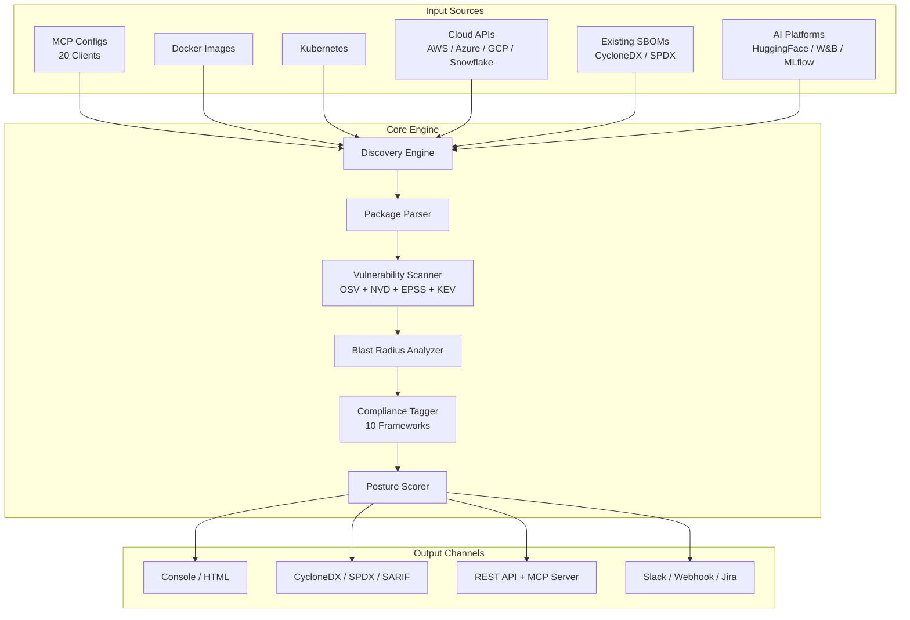
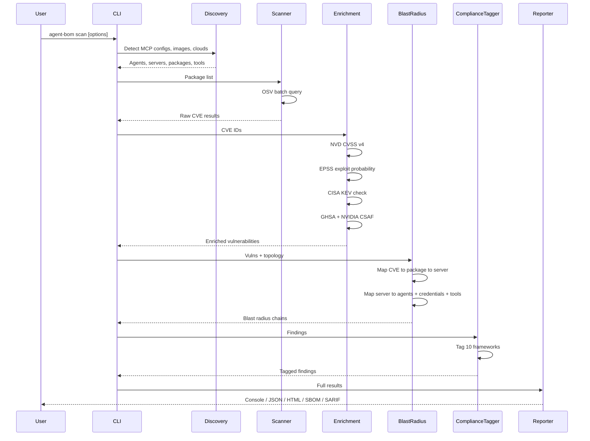
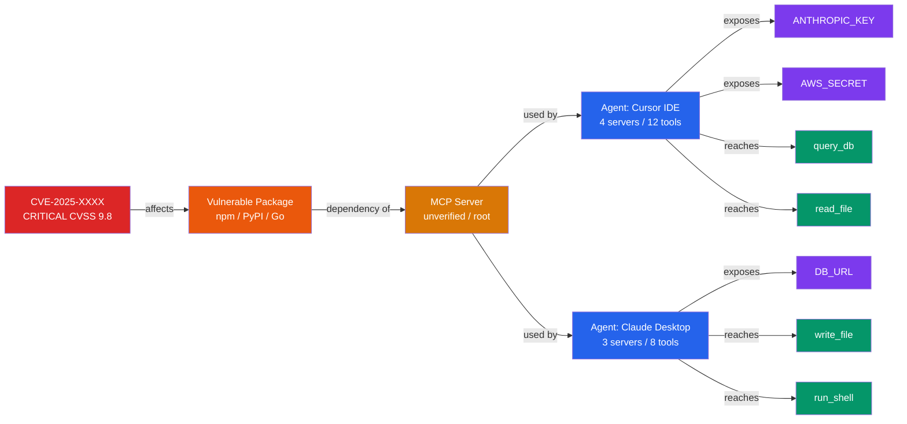
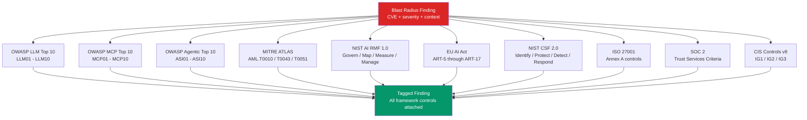
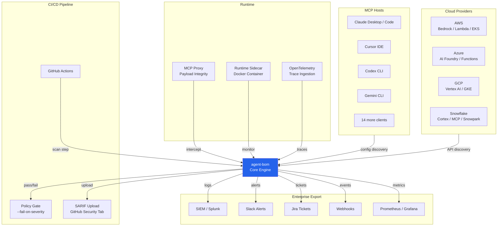

# Architecture

This document describes the architecture of agent-bom through five diagrams covering the system overview, data flow pipeline, blast radius propagation, compliance framework mapping, and integration architecture.

---

## 1. System Architecture Overview

High-level view of input sources, the core processing engine, and output channels.

---

## 2. Data Flow Pipeline

Sequence of operations from user invocation through enrichment to final report generation.

---

## 3. Blast Radius Propagation

How a single CVE propagates through the AI agent stack, exposing credentials and tools.

**Color key:** Red = CVE, Orange = Package, Amber = Server, Blue = Agent, Purple = Credential, Green = Tool

---

## 4. Compliance Framework Mapping

Every blast radius finding is tagged against 10 compliance frameworks simultaneously.

---

## 5. Integration Architecture

How agent-bom integrates with CI/CD pipelines, runtime environments, cloud providers, and enterprise systems.

---

## Key modules

| Module | Path | Responsibility |
|--------|------|----------------|
| CLI | `src/agent_bom/cli.py` | Click entry point, flag parsing |
| Discovery | `src/agent_bom/discovery/__init__.py` | MCP client config discovery (20 clients) |
| Parsers | `src/agent_bom/parsers/__init__.py` | Package extraction + MCP registry lookup |
| Scanners | `src/agent_bom/scanners/__init__.py` | OSV batch scan + CVSS + AI risk tagging |
| Output | `src/agent_bom/output/__init__.py` | JSON, CycloneDX, SARIF, SPDX, console output |
| Policy | `src/agent_bom/policy.py` | Policy-as-code engine |
| SBOM | `src/agent_bom/sbom.py` | SBOM ingestion (CycloneDX, SPDX) |
| Image | `src/agent_bom/image.py` | Docker image scanning |
| MCP Server | `src/agent_bom/mcp_server.py` | FastMCP server (18 tools) |
| Context Graph | `src/agent_bom/context_graph.py` | Lateral movement analysis |
| Cloud | `src/agent_bom/cloud/` | AWS, Azure, GCP, Snowflake, Databricks, Nebius |
| Logging | `src/agent_bom/logging_config.py` | Structured JSON/console logging, env var config |
| Guard | `src/agent_bom/guard.py` | Pre-install CVE scan for pip/npm packages |
| Glama | `src/agent_bom/glama.py` | Glama.ai registry sync (18,000+ MCP servers) |
