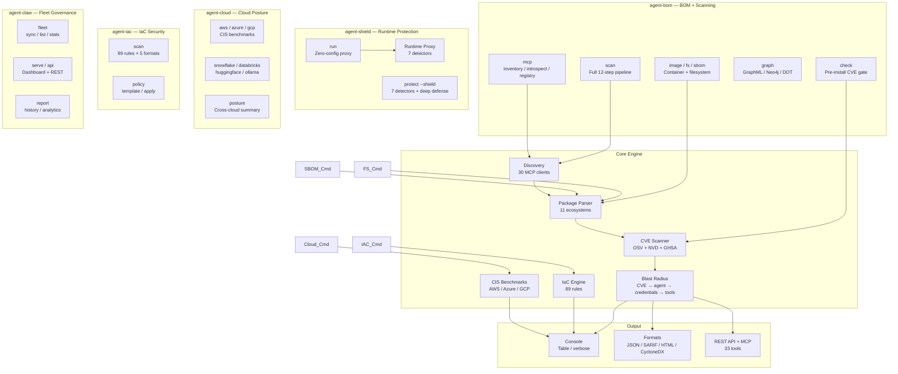
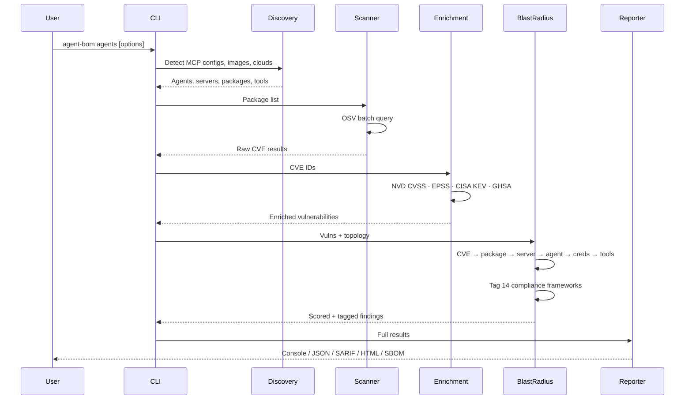
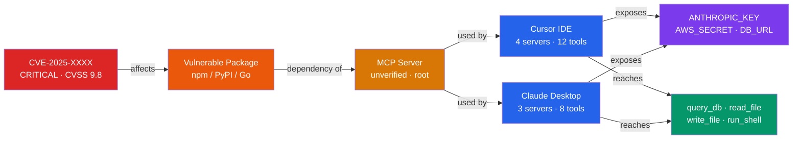
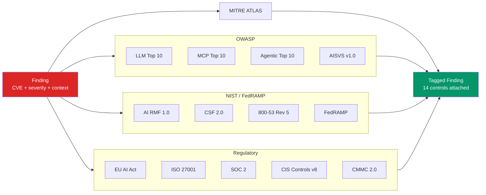
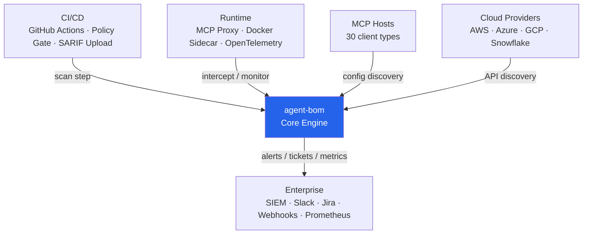

# Architecture

Five products, one package. System overview, scan pipeline, blast radius, compliance, and integration.

---

## 1. System Overview — 5 Products

```
pip install agent-bom    → 5 CLI entry points, shared core engine
```



---

## 2. Scan Pipeline

Sequence of operations from invocation to report.



---

## 3. Blast Radius Propagation

How one CVE propagates through the AI agent stack.



**Color key:** Red = CVE · Orange = Package · Amber = Server · Blue = Agent · Purple = Credentials · Green = Tools

---

## 4. Compliance Tagging

Every finding is tagged against 14 frameworks, grouped into four families.



---

## 5. Integration

How agent-bom fits into CI/CD, runtime, cloud, and enterprise tooling.



---

## Key modules

| Module | Path | Responsibility |
|--------|------|----------------|
| CLI | `src/agent_bom/cli/` | Click entry point, command dispatch |
| Discovery | `src/agent_bom/discovery/__init__.py` | MCP client config discovery (30 clients) |
| Parsers | `src/agent_bom/parsers/__init__.py` | Package extraction + MCP registry lookup |
| Scanners | `src/agent_bom/scanners/__init__.py` | OSV batch scan + CVSS + compliance tagging |
| Enrichment | `src/agent_bom/enrichment.py` | NVD + EPSS + CISA KEV enrichment |
| Models | `src/agent_bom/models.py` | Core data models (Package, Vulnerability, Agent, BlastRadius) |
| Output | `src/agent_bom/output/__init__.py` | JSON, CycloneDX, SARIF, SPDX, console |
| Policy | `src/agent_bom/policy.py` | Policy-as-code engine (17 conditions) |
| Proxy | `src/agent_bom/proxy.py` | Runtime MCP proxy (7 behavioral detectors) |
| MCP Server | `src/agent_bom/mcp_server.py` | FastMCP server (33 tools) |
| Cloud | `src/agent_bom/cloud/` | AWS, Azure, GCP, Snowflake, Databricks, ClickHouse |
| Asset Tracker | `src/agent_bom/asset_tracker.py` | Persistent vuln tracking — first_seen, resolved, MTTR |
| Context Graph | `src/agent_bom/context_graph.py` | Lateral movement analysis |
| Guard | `src/agent_bom/guard.py` | Pre-install CVE scan for pip/npm packages |
