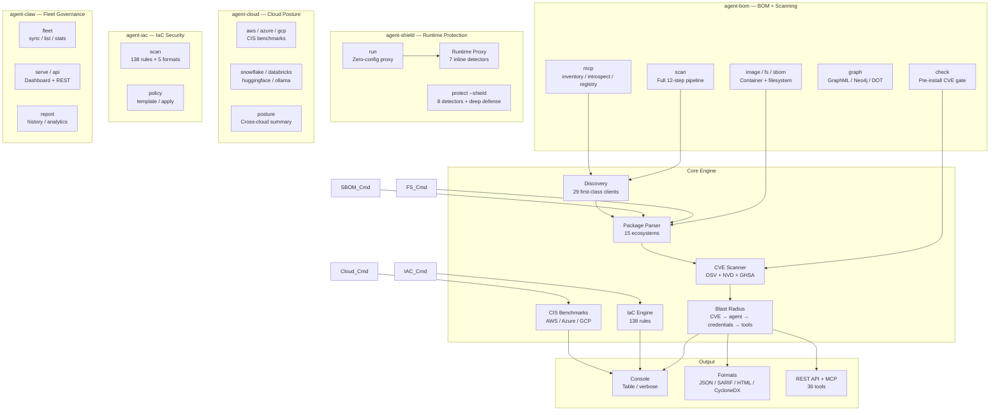
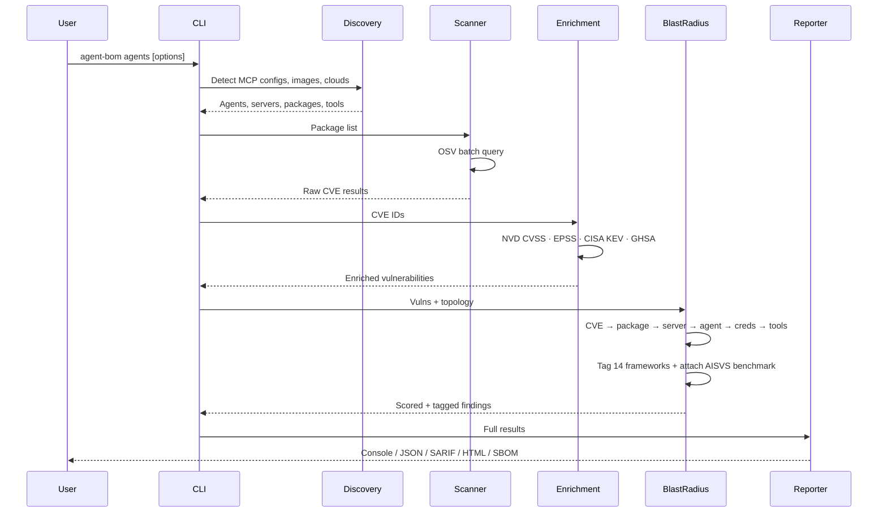
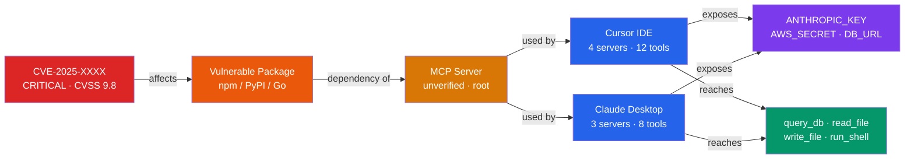
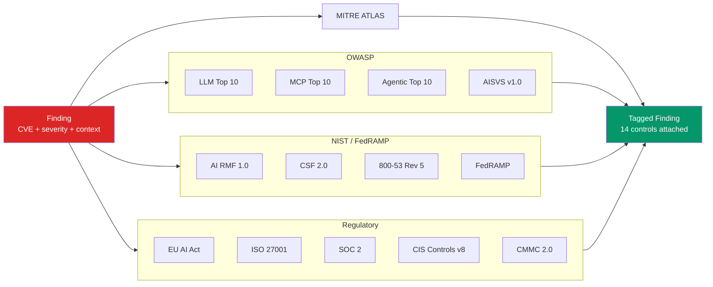
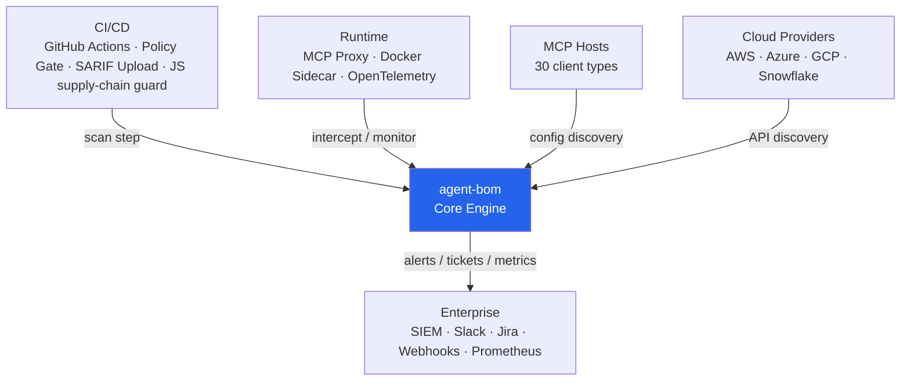

# Architecture

Five products, one package. System overview, scan pipeline, blast radius, compliance, and integration.

---

## 0. Hermetic single-language stack

agent-bom is pure Python (3.11+) end to end — CLI, FastAPI surface, MCP server, parsers, OSV/NVD/EPSS/KEV/GHSA enrichment, blast-radius scoring, IaC engine, and CIS benchmarks all live in the same interpreter. There is no Rust/Go/CGo extension on the scan path. Disk-image scans use native `dpkg` / RPM parsers (`src/agent_bom/filesystem.py`); the `syft` Go binary is opt-in only as a tar-archive fallback for VM-style images.

Operational consequences:

- One language, one dep tree, one pip-audit/SBOM surface to audit and reproduce.
- Wheels build cleanly on `linux/amd64` and `linux/arm64` — no per-arch native toolchain.
- Slower than Rust/Go scanners on huge fanouts; per-package memory is higher. For VM disk-image scanning at scale, install `syft` alongside agent-bom and let the fallback path take over.

---

## 1. System Overview — 5 Products

```
pip install agent-bom    → 5 CLI entry points, shared core engine
```



---

## 2. Scan Pipeline

Sequence of operations from invocation to report.



---

## 3. Blast Radius Propagation

How one CVE propagates through the AI agent stack.



**Color key:** Red = CVE · Orange = Package · Amber = Server · Blue = Agent · Purple = Credentials · Green = Tools

---

## 4. Compliance Tagging

Every finding is tagged against 14 tag-mapped frameworks, grouped into four families. OWASP AISVS is exposed as a separate benchmark result with per-check evidence. The bundled mappings are a curated subset of each framework focused on AI/MCP/agent risk-relevant controls — they are not a complete catalog. See [Coverage per framework](#coverage-per-framework) below for the honest control counts.



### Coverage per framework

agent-bom ships a curated control set per framework, sized to the AI/MCP/agent threat surface rather than a generic compliance scanner's full catalog. Numbers below count the controls that are **bundled and actively mapped** by the canonical metadata in `src/agent_bom/compliance_coverage.py`; AISVS is counted from the benchmark check registry. They are intentionally a subset; consult each framework's source standard for full coverage.

<!-- compliance-coverage:start -->
| Family | Framework | Bundled controls | Source-standard size (approx.) | What's covered |
|---|---|---|---|---|
| OWASP | LLM Top 10 (2025) | 10 / 10 | 10 | Full Top-10 |
| OWASP | MCP Top 10 (2025) | 10 / 10 | 10 | Full Top-10 |
| OWASP | Agentic Top 10 (2026) | 10 / 10 | 10 | Full Top-10 |
| OWASP | AISVS v1.0 | 9 checks | ~50 verification reqs | Programmatically verifiable subset (AI-4/5/6/7/8 categories) |
| NIST / FedRAMP | AI RMF 1.0 | 14 subcategories | ~70 | Govern / Map / Measure / Manage controls relevant to AI supply chain + MCP |
| NIST / FedRAMP | CSF 2.0 | 14 categories | ~108 | Supply-chain, identity, asset, monitoring categories |
| NIST / FedRAMP | 800-53 Rev 5 | 29 controls | ~1,006 | Vulnerability-driven mapping (RA-5, SI-2, etc.); not a complete catalog |
| NIST / FedRAMP | FedRAMP Moderate | 25 controls | ~325 | Subset of 800-53 controls in the Moderate baseline |
| MITRE | ATLAS | 65 techniques | ~90 | LLM/AI techniques: prompt injection, jailbreak, supply-chain, exfiltration, agent tool abuse |
| Regulatory | EU AI Act | 6 articles | ~113 | Articles 5/6/9/10/15/17 (prohibited practices, high-risk classification, risk mgmt, data governance, accuracy/cybersecurity, QMS) |
| Regulatory | ISO/IEC 27001:2022 | 9 Annex A controls | 93 | Supplier, vulnerability, cryptography, secure-dev, evidence collection |
| Regulatory | SOC 2 TSC | 9 criteria | ~64 | Common Criteria 6.x / 7.x / 8.x / 9.x (access, monitoring, change mgmt, vendor risk) |
| Regulatory | CIS Controls v8 | 10 safeguards | 153 | Software inventory, vulnerability mgmt, secure-dev (CIS 02 / 07 / 16) |
| Regulatory | CMMC 2.0 Level 2 | 17 practices | 110 | RA / SI / SC / CM / AC / IA practices most relevant to vulnerable-package risk |
| Regulatory | PCI DSS v4.0 | 12 requirements | 12 | Requirements 2/3/4/5/6/7/8/10/11/12 for vulnerable-package and evidence risk |
<!-- compliance-coverage:end -->

The bundled list is editable: see `src/agent_bom/compliance_coverage.py` for the framework metadata and `src/agent_bom/compliance_utils.py` for the `BlastRadius` field map. The UI consumes the same API response shape, so product coverage and dashboard controls should stay aligned with these catalogs.

---

## 5. Integration

How agent-bom fits into CI/CD, runtime, cloud, and enterprise tooling.



---

## Key modules

| Module | Path | Responsibility |
|--------|------|----------------|
| CLI | `src/agent_bom/cli/` | Click entry point, command dispatch |
| Discovery | `src/agent_bom/discovery/__init__.py` | MCP client config discovery (29 first-class client types plus dynamic/project surfaces) |
| Parsers | `src/agent_bom/parsers/__init__.py` | Package extraction + MCP registry lookup |
| Scanners | `src/agent_bom/scanners/__init__.py` | OSV batch scan + CVSS + compliance tagging |
| Enrichment | `src/agent_bom/enrichment.py` | NVD + EPSS + CISA KEV enrichment |
| Models | `src/agent_bom/models.py` | Core data models (Package, Vulnerability, Agent, BlastRadius) |
| Output | `src/agent_bom/output/__init__.py` | JSON, CycloneDX, SARIF, SPDX, console |
| Policy | `src/agent_bom/policy.py` | Policy-as-code engine (17 conditions) |
| Proxy | `src/agent_bom/proxy.py` | Runtime MCP proxy (7 inline detectors) |
| MCP Server | `src/agent_bom/mcp_server.py` | FastMCP server (36 tools) |
| Cloud | `src/agent_bom/cloud/` | AWS, Azure, GCP, Snowflake, Databricks, ClickHouse |
| Asset Tracker | `src/agent_bom/asset_tracker.py` | Persistent vuln tracking — first_seen, resolved, MTTR |
| Context Graph | `src/agent_bom/context_graph.py` | Lateral movement analysis |
| Guard | `src/agent_bom/guard.py` | Pre-install CVE scan for pip/npm packages |
