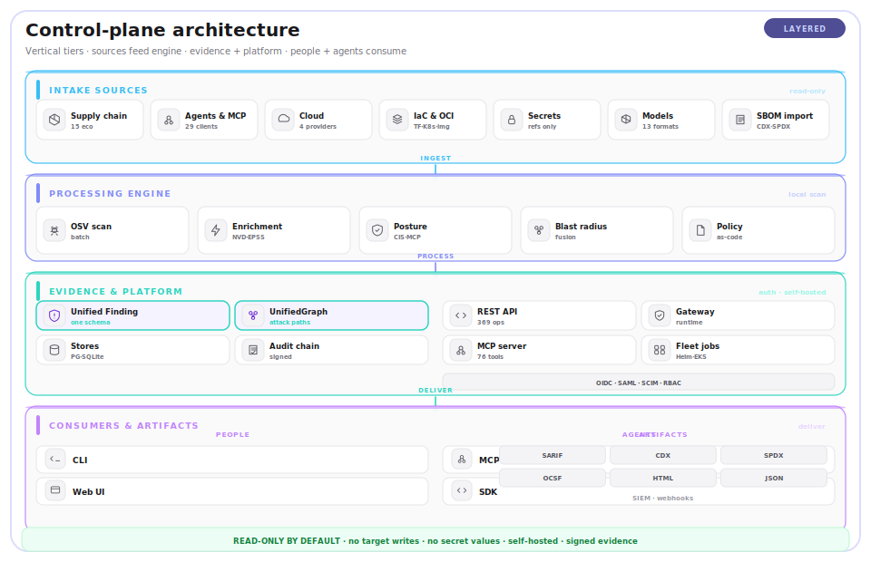
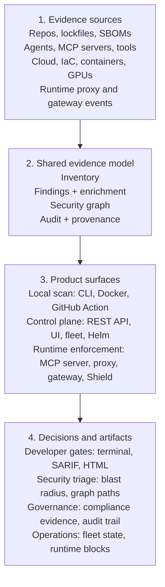
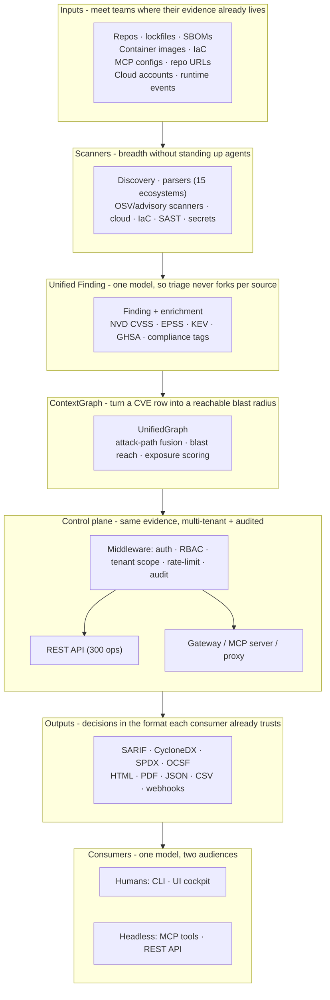
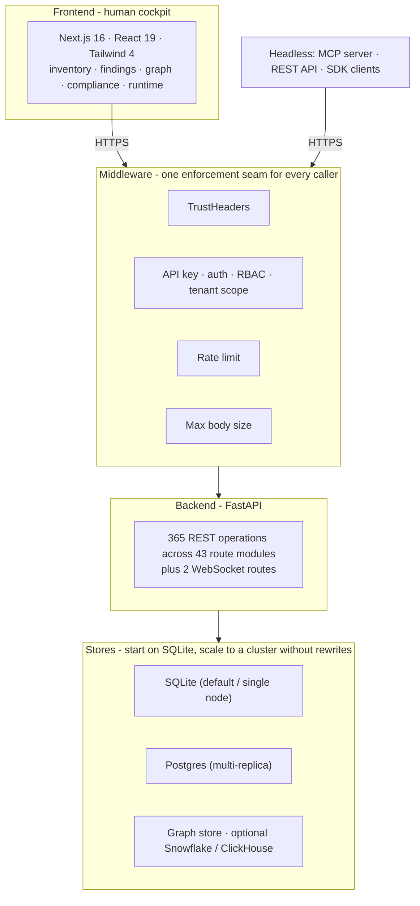
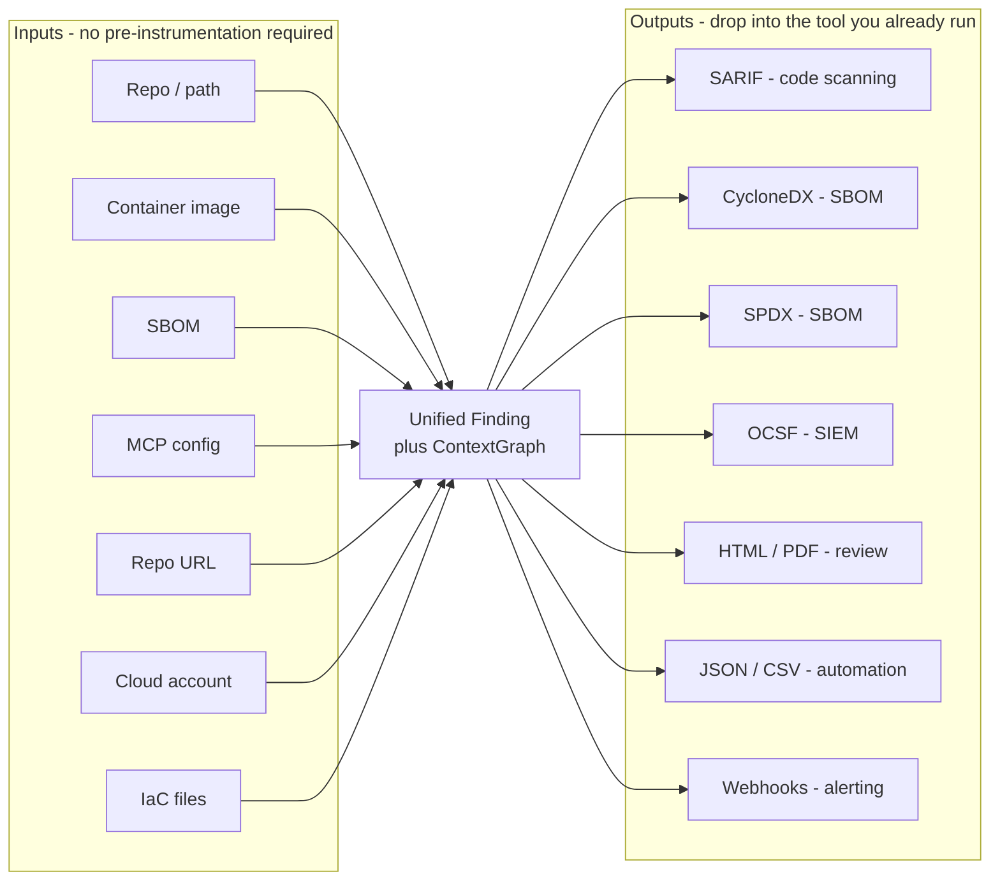
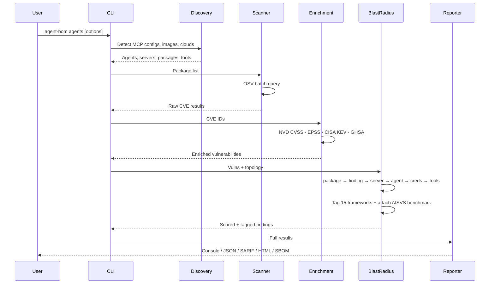
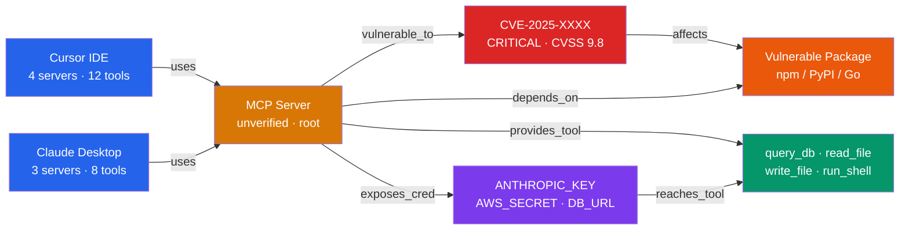
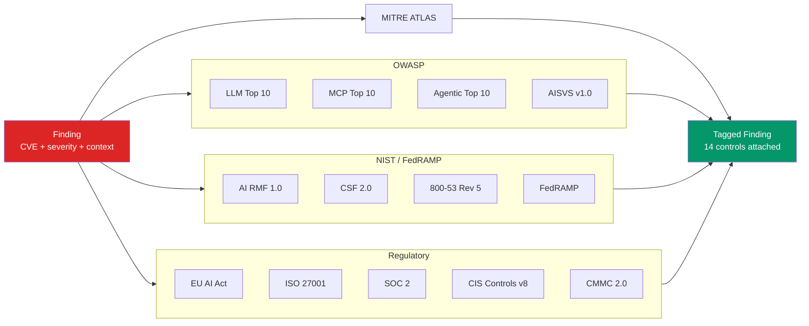
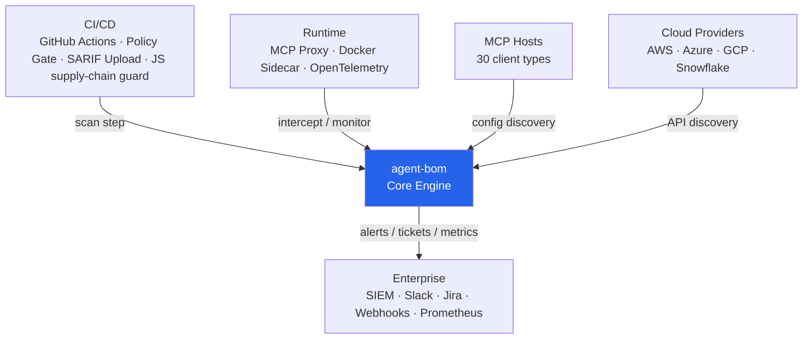

# Architecture

One `agent-bom` product, multiple operational surfaces. The package exposes
CLI entry points, API/UI, MCP server mode, runtime proxy/gateway, cloud posture,
IaC scanning, fleet, graph, reporting, and compliance workflows over the same
core evidence model.

> **Product overview lives in [`HOW_IT_WORKS.md`](HOW_IT_WORKS.md)** — the
> canonical five-stage flow (intake → scan → evidence → control → artifacts) and
> the symbol-level CVE reachability differentiator. This document is the deeper
> surface and module architecture: it leads with the product mental model, then
> the implementation stack.

---

## 1. System Overview — Product Surfaces

```
pip install agent-bom    → shared core engine plus focused CLI entry points
```

Read the architecture in one direction: collect evidence, normalize it into one
AI-BOM/security model, then use that same model for local scans, the
self-hosted control plane, runtime enforcement, and audit/compliance outputs.
This diagram is intentionally a product map, not a full module graph.

<picture>
  <source media="(prefers-color-scheme: dark)" srcset="images/architecture-dark.svg">
  
</picture>



| Surface | First command | Primary artifact | Production move |
|---|---|---|---|
| Local scan | `agent-bom agents -p .` | findings, SBOM, SARIF, HTML, graph export | GitHub Action or Docker scan in CI |
| Control plane | `agent-bom agents -p . --push-url ...` | fleet inventory, scan jobs, graph state | Helm/EKS with Postgres and tenant auth |
| Runtime enforcement | `agent-bom proxy ...` or `agent-bom mcp server` | audit JSONL, policy decisions, blocks | gateway/proxy sidecars and Shield SDK |

For a repo-level map of where each layer lives in `src/agent_bom/`, see
[`PROJECT_STRUCTURE.md`](../PROJECT_STRUCTURE.md). For role-based entry paths,
see [`START_HERE.md`](START_HERE.md).

---

## 1a. Layered Stack

The product reads top to bottom: inputs are normalized into one `Finding` and
one `ContextGraph`, the control plane serves and enforces over that evidence,
and outputs flow to both humans and headless agents. Each layer carries a single
**value** line — what it buys you, not just what it is.



---

## 1b. Implementation stack — hermetic and single-language

With the product mental model in place, the implementation detail: agent-bom is
pure Python (3.11+) end to end — CLI, FastAPI surface, MCP server, parsers,
OSV/NVD/EPSS/KEV/GHSA enrichment, blast-radius scoring, IaC engine, and CIS
benchmarks all live in the same interpreter. There is no Rust/Go/CGo extension
on the scan path. Disk-image scans use native `dpkg` / RPM parsers
(`src/agent_bom/filesystem.py`); the `syft` Go binary is opt-in only as a
tar-archive fallback for VM-style images.

Operational consequences:

- One language, one dep tree, one pip-audit/SBOM surface to audit and reproduce.
- Wheels build cleanly on `linux/amd64` and `linux/arm64` — no per-arch native toolchain.
- Slower than Rust/Go scanners on huge fanouts; per-package memory is higher. For VM disk-image scanning at scale, install `syft` alongside agent-bom and let the fallback path take over.

---

## 1c. Data Flow - one scan request

A single scan request walks discovery → extraction → scan → finding → graph →
outputs. The same lower libraries serve the CLI and the API.

```mermaid
flowchart LR
    REQ["Scan request\n(repo / path / image /\nSBOM / MCP config / URL / cloud)"]
    DISC["Discovery\nfind agents, MCP servers, targets"]
    EXT["Extraction\nparse packages, manifests, configs"]
    SCAN["Scan\nOSV batch + advisories"]
    ENR["Enrichment\nCVSS · EPSS · KEV · GHSA · compliance"]
    FIND["Unified Finding\nnormalized, deduped, scored"]
    GRAPH["ContextGraph\npackage → finding → server → tool → cred → agent"]
    OUT["Outputs\nconsole · SARIF · SBOM · HTML · graph export · webhooks"]

    REQ --> DISC --> EXT --> SCAN --> ENR --> FIND --> GRAPH --> OUT
```



**Value at each hop:** discovery finds shadow AI you did not know to ask about ·
extraction reads 15 ecosystems with one command · enrichment ranks by real-world
exploitability, not just CVSS · the graph makes "which agent does this reach?"
answerable · outputs land in the gate, ticket, or SIEM you already run.

---

## 1d. Frontend · Backend · Middleware

The dashboard is one door into the product, not the only one. The Next.js UI and
every headless caller hit the same FastAPI surface, behind the same middleware,
over the same stores.



**Value:** the middleware seam means auth, tenant isolation, and audit are
enforced once for the UI, agents, and SDKs alike — there is no privileged
"UI-only" backdoor.

---

## 1e. Auth & Connections

The identity and connection model is **connect once, act through the stored
connection** — no surface ever prompts for a per-action credential.

- **Humans** sign in via OAuth / OIDC / SAML SSO (standard providers plus a
  Snowflake OAuth authorization-code + PKCE flow), with SCIM provisioning —
  `src/agent_bom/api/{oidc,saml,scim}.py`, `src/agent_bom/api/snowflake_oauth.py`.
- **Agents / CI** use scoped API keys / tokens.
- **Sources** (AWS, Azure, GCP, Snowflake) are onboarded once via read-only,
  agentless, brokered connectors — one least-privilege managed role per source,
  short-lived brokered credentials (e.g. AWS `sts:AssumeRole`), and write-only
  secrets (encrypted at rest, never read back). Every scan then runs through that
  stored connection.

Auth mode, tenant scope, RBAC, and audit are enforced in the shared middleware
(`src/agent_bom/api/middleware.py`) for every caller. Provider grants and setup
are in [`CLOUD_CONNECT.md`](CLOUD_CONNECT.md); the enterprise auth surface and
environment knobs are in [`ENTERPRISE.md`](ENTERPRISE.md).

---

## 1f. Input / Output Formats

agent-bom is format-agnostic on both ends: ingest whatever evidence exists,
emit whatever the next tool consumes.



| Input | Value | Output | Value |
|---|---|---|---|
| Repo / path | scan source where it lives | SARIF | native code-scanning ingest |
| Container image | catch base-image + layer risk | CycloneDX / SPDX | portable SBOM for downstream tooling |
| SBOM | re-score an existing inventory | OCSF | normalized SIEM events |
| MCP config | map the agent ↔ server ↔ tool mesh | HTML / PDF | human-reviewable evidence |
| Repo URL | scan code you have not cloned | JSON / CSV | machine-readable for pipelines |
| Cloud account | read-only estate + CIS posture | Webhooks | push to alerting / ticketing |
| IaC files | block unsafe infra pre-deploy | | |

---

## 2. Scan Pipeline

Sequence of operations from invocation to report.



### Component model and extensibility direction

The pipeline is built from four component roles: **scanners** (discover and
produce raw findings), **enrichers** (add CVSS/EPSS/KEV/GHSA, compliance, cloud
and cost context), **matchers/correlators** (`correlate.py`,
`cross_env_correlation.py`, graph overlays), and a **reporter**. Scanner drivers
are already registered through `scanners/registry.py` with capability metadata
(surfaced by `agent-bom capabilities`), and `api/pipeline.py` (`ScanPipeline`,
`_run_scan_sync`) runs the stages and emits per-step DAG events.

Two seams are being formalized so new sources and detections plug in without
editing core orchestration:

- a **router** that resolves an input or connected source (path, image ref,
  cloud credential, MCP config, ingested SARIF) to the scanner and provider
  drivers that handle it, consolidating selection logic currently split across
  the CLI, the pipeline, and `scanners/__init__.py`; and
- an **orchestrator** that runs registered `scan → enrich → correlate → graph →
  findings` stages, with enrichers and matchers registered through the same
  capability-metadata pattern scanners already use.

This keeps detection-as-code rule packs and additional providers additive at the
registry boundary rather than as edits to the scan path.

---

## 3. Blast Radius Propagation

How one CVE propagates through the AI agent stack.



**Color key:** Red = CVE · Orange = Package · Amber = Server · Blue = Agent · Purple = Credentials · Green = Tools

The full contract for what the graph promises and what it does not — entity types, edge kinds, scaling tiers, re-baseline procedure, and known coverage gaps — is in [docs/graph/CONTRACT.md](graph/CONTRACT.md).

### Estate-scale roll-up

Past a few hundred nodes a flat topology graph is unreadable. The estate is
organized as a `CONTAINS` containment tree (org → account/folder/project → app
→ resource), and `src/agent_bom/graph/rollup.py` collapses the graph along that
tree to a handful of top-level container nodes — each carrying aggregate
descendant counts, a by-type breakdown, worst-severity, a per-severity
histogram, and internet-exposed / toxic-combination flags propagated from every
descendant. The UI (and `GET /v1/graph/rollup`) drills down one level at a time
instead of loading the whole estate, with an attack-path-first view that returns
the nodes on materialized attack paths first. The roll-up is a pure read over
the existing `UnifiedGraph` — no new collection. Two further overlays enrich the
same graph: an ASPM layer (`aspm_overlay.py`) that organizes AppSec findings
around `APPLICATION` nodes, and a FinOps layer (`cost_overlay.py`) that fuses
LLM spend onto nodes and rolls it up along `CONTAINS` into `subtree_cost_usd`.

---

## 4. Compliance Tagging

Every finding is tagged against curated compliance frameworks, grouped into four families. OWASP AISVS is exposed as a separate benchmark result with per-check evidence. The bundled mappings are a curated subset of each framework focused on AI/MCP/agent risk-relevant controls — they are not a complete catalog. See [Coverage per framework](#coverage-per-framework) below for the generated control counts.



### Coverage per framework

agent-bom ships a curated control set per framework, sized to the AI/MCP/agent threat surface rather than a generic compliance scanner's full catalog. Numbers below count the controls that are **bundled and actively mapped** by the canonical metadata in `src/agent_bom/compliance_coverage.py`; AISVS is counted from the benchmark check registry. They are intentionally a subset; consult each framework's source standard for full coverage.

<!-- compliance-coverage:start -->
| Family | Framework | Bundled controls | Source-standard size (approx.) | What's covered |
|---|---|---|---|---|
| OWASP | LLM Top 10 (2025) | 10 / 10 | 10 | Full Top-10 |
| OWASP | MCP Top 10 (2025) | 10 / 10 | 10 | Full Top-10 |
| OWASP | Agentic Top 10 (2026) | 10 / 10 | 10 | Full Top-10 |
| OWASP | AISVS v1.0 | 9 checks | ~50 verification reqs | Programmatically verifiable subset (AI-4/5/6/7/8 categories) |
| NIST / FedRAMP | AI RMF 1.0 | 14 subcategories | ~70 | Govern / Map / Measure / Manage controls relevant to AI supply chain + MCP |
| NIST / FedRAMP | CSF 2.0 | 14 categories | ~108 | Supply-chain, identity, asset, monitoring categories |
| NIST / FedRAMP | 800-53 Rev 5 | 29 controls | ~1,006 | Vulnerability-driven mapping (RA-5, SI-2, etc.); not a complete catalog |
| NIST / FedRAMP | FedRAMP Moderate | 25 controls | ~325 | Subset of 800-53 controls in the Moderate baseline |
| MITRE | ATLAS | 65 techniques | ~90 | LLM/AI techniques: prompt injection, jailbreak, supply-chain, exfiltration, agent tool abuse |
| MITRE | ATT&CK Enterprise | 691 techniques | ~700 | Adversary techniques tagged via CWE → CAPEC → ATT&CK on every blast-radius finding |
| Regulatory | EU AI Act | 6 articles | ~113 | Articles 5/6/9/10/15/17 (prohibited practices, high-risk classification, risk mgmt, data governance, accuracy/cybersecurity, QMS) |
| Regulatory | ISO/IEC 27001:2022 | 9 Annex A controls | 93 | Supplier, vulnerability, cryptography, secure-dev, evidence collection |
| Regulatory | SOC 2 TSC | 9 criteria | ~64 | Common Criteria 6.x / 7.x / 8.x / 9.x (access, monitoring, change mgmt, vendor risk) |
| Regulatory | CIS Controls v8 | 10 safeguards | 153 | Software inventory, vulnerability mgmt, secure-dev (CIS 02 / 07 / 16) |
| Regulatory | CMMC 2.0 Level 2 | 17 practices | 110 | RA / SI / SC / CM / AC / IA practices most relevant to vulnerable-package risk |
| Regulatory | PCI DSS v4.0 | 12 requirements | 12 | Requirements 2/3/4/5/6/7/8/10/11/12 for vulnerable-package and evidence risk |
<!-- compliance-coverage:end -->

The bundled list is editable: see `src/agent_bom/compliance_coverage.py` for the framework metadata and `src/agent_bom/compliance_utils.py` for the `BlastRadius` field map. The UI consumes the same API response shape, so product coverage and dashboard controls should stay aligned with these catalogs.

---

## 5. Integration

How agent-bom fits into CI/CD, runtime, cloud, and enterprise tooling.



---

## Key modules

| Module | Path | Responsibility |
|--------|------|----------------|
| CLI | `src/agent_bom/cli/` | Click entry point, command dispatch |
| Discovery | `src/agent_bom/discovery/__init__.py` | MCP client config discovery (29 first-class client types plus dynamic/project surfaces) |
| Parsers | `src/agent_bom/parsers/__init__.py` | Package extraction + MCP registry lookup |
| Scanners | `src/agent_bom/scanners/__init__.py` | OSV batch scan + CVSS + compliance tagging |
| Enrichment | `src/agent_bom/enrichment.py` | NVD + EPSS + CISA KEV enrichment |
| Models | `src/agent_bom/models.py` | Core data models (Package, Vulnerability, Agent, BlastRadius) |
| Output | `src/agent_bom/output/__init__.py` | JSON, CycloneDX, SARIF, SPDX, console |
| Policy | `src/agent_bom/policy.py` | Policy-as-code engine (17 conditions) |
| Proxy | `src/agent_bom/proxy.py` | Runtime MCP proxy (7 inline detectors) |
| MCP Server | `src/agent_bom/mcp_server*.py` | FastMCP server (75 tools across core, operator, runtime-catalog, and specialized modules) |
| Cloud | `src/agent_bom/cloud/` | AWS, Azure, GCP, Snowflake, Databricks, ClickHouse estate inventory; CIS posture where published and Databricks security best practices |
| Cloud side-scan | `src/agent_bom/cloud/side_scan.py`, `src/agent_bom/cloud/side_scan_targets.py`, `src/agent_bom/cloud/side_scan_lifecycle.py`, `src/agent_bom/cloud/side_scan_provider_adapters.py` | Agentless workload side-scan (CWPP) — AWS EBS CLI executor; injected-SDK Azure Managed Disk and GCP Persistent Disk lifecycle adapters with durable ownership/cleanup state; Azure/GCP scheduler/CLI wiring and live credentialed proof are not shipped |
| Registry sweep | `src/agent_bom/cloud/registry_sweep.py` | Registry-wide image enumeration + scan (ECR/ACR/GAR), digest-deduped, capped |
| Audit trail | `src/agent_bom/cloud/audit_trail.py` | Read-only CloudTrail/Activity Log/Cloud Audit ingest → behavioral `ACCESSED`/`INVOKED` graph edges (counts only) |
| Asset Tracker | `src/agent_bom/asset_tracker.py` | Persistent vuln tracking — first_seen, resolved, MTTR |
| Context Graph | `src/agent_bom/context_graph.py` | Lateral movement analysis — see [Graph Contract](graph/CONTRACT.md) for entity/edge coverage, accuracy guarantees, and scaling boundaries |
| Graph overlays | `src/agent_bom/graph/` | `rollup.py` (estate-scale `CONTAINS` roll-up + drill-down), `aspm_overlay.py` (application correlation), `cost_overlay.py` (LLM-spend fusion) |
| Remediation | `src/agent_bom/remediation.py` | Advisory-only fixes with least-privilege-to-apply (`applied`/`auto_remediation` always false) |
| Guard | `src/agent_bom/guard.py` | Pre-install CVE scan for pip/npm packages |
