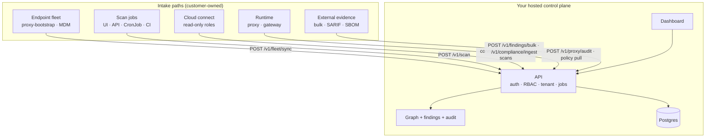

# Deploy quickstart — one product, any cloud

This is the **connect-and-scan onboarding story** for agent-bom: deploy the control
plane once, connect read-only cloud accounts and endpoints, and get inventory,
assets, scans, MCP/agents, and AI BOM evidence in one graph — without handing
credentials to a hosted SaaS.

For architecture depth see [`DEPLOY_PLATFORM.md`](DEPLOY_PLATFORM.md). For the
read-only connect model see [`CLOUD_CONNECT.md`](CLOUD_CONNECT.md). For trust
boundaries see [`TRUST.md`](TRUST.md).

---

## What you get out of the box

Once the control plane is live **and** you connect at least one source:

| Capability | Source | How it appears |
|------------|--------|----------------|
| **Cloud inventory** | AWS, Azure, GCP, Snowflake | Resources, identities, IAM/CNAPP posture in the security graph |
| **AI / MCP agents** | Workstations, K8s, fleet sync | Agents, MCP servers, tools, skills in fleet + graph |
| **Findings queue** | Scans + cloud posture | Ranked by reach, blast radius, compliance tags |
| **Auto / scheduled scans** | Helm CronJob, API, CLI | Recurring inventory + vulnerability evidence |
| **MCP runtime** | MCP server mode, gateway, proxy | Policy on tool calls; optional HITL approval queue |
| **Exports** | CLI + API | SARIF, SBOM, CSV, compliance bundles |

Nothing is mutated in your cloud. Connect modules mint **read-only** roles only.

---

## BYOC / self-hosted (the default product model)

**BYOC = Bring Your Own Cloud.** You run the control plane; agent-bom does not
require a vendor-hosted SaaS.

| Layer | You run | agent-bom provides |
|-------|---------|-------------------|
| **Control plane** | Your VM, EKS, AKS, GKE, or Snowflake Native App lane | API + UI + Postgres + graph (Helm / Compose / Terraform) |
| **Scanned estates** | Your AWS/Azure/GCP/Snowflake accounts | Read-only `connect-*` Terraform modules |
| **Endpoints** | Your laptops / golden images | `proxy-bootstrap` → fleet sync bundle |
| **Runtime** (optional) | Your MCP workloads | Proxy sidecar / gateway in your cluster |
| **Model** (optional) | Your Ollama / litellm keys on workers | `--ai-enrich` on scan jobs — not required for core product |

Managed agent-bom Cloud is **not** shipped in this repo. Hosted POC is
invite-only operator-run evaluation — see [`HOSTED_POC.md`](HOSTED_POC.md).

---

## What feeds the control plane (automatic-ish inventory)

Once hosted, data flows **into** the API from many paths — not only CLI.

```text
┌─────────────────────────────────────────────────────────┐
│              YOUR HOSTED CONTROL PLANE                   │
│         API + UI + Postgres + graph                      │
└────────▲────────▲────────▲────────▲────────▲──────────────┘
         │        │        │        │        │
    fleet sync  scans   cloud     proxy/    CI / bulk
    (endpoints) (jobs)  connect   gateway   ingest
```



### Intake reference

| Intake | How | Endpoint / mechanism |
|--------|-----|----------------------|
| **Cloud inventory** | Read-only connect + scheduled scan | `POST /v1/cloud/connections`, Helm CronJob, `GET /v1/cloud/{provider}/inventory` |
| **Endpoint / MCP agents** | Fleet push from laptops | `POST /v1/fleet/sync` via `proxy-bootstrap` bundle |
| **On-demand scans** | Dashboard or API | `POST /v1/scan` · UI `/scan` |
| **Scheduled scans** | K8s CronJob / enterprise-demo profile | Helm `scanner.enabled=true` |
| **Runtime events** | Proxy / gateway | `POST /v1/proxy/audit`, gateway policy pull |
| **External findings** | Other scanners | `POST /v1/findings/bulk` |
| **SBOM / SARIF / CSV** | Compliance hub import | `POST /v1/compliance/ingest` |
| **CLI / local dev** | Same evidence model | `agent-bom agents`, `fleet sync`, GitHub Action → API |

The browser **never** reads your cloud directly — UI triggers work; workers and
collectors execute. See
[`site-docs/architecture/self-hosted-product-architecture.md`](../site-docs/architecture/self-hosted-product-architecture.md).

### Hosted dashboard (not CLI-only)

| Area | Route | Operator action |
|------|-------|-----------------|
| Overview | `/overview` | Estate posture |
| Findings | `/findings` | Triage queue |
| Graph | `/security-graph`, `/graph` | Inventory + reach |
| Fleet | `/fleet`, `/agents` | Endpoints + MCP configs |
| Connections | `/connections` | Register cloud accounts |
| Scan | `/scan` | Run-now scans |
| Jobs | `/jobs` | Job history |
| Runtime | `/runtime`, `/proxy`, `/gateway`, `/traces` | Policy + audit + HITL queue |
| Compliance | `/compliance` | Framework evidence + exports |

Proof-path nav in the UI: **Queue · Graph · Runtime · Reports · Connections**.

---

## One script, pick your host

```bash
scripts/deploy/install.sh list          # all targets
scripts/deploy/install.sh pilot         # fastest — laptop Docker, ~2 min
```

### Local pilot (fastest proof)

```bash
scripts/deploy/install.sh pilot
# Dashboard → http://localhost:3000
# API       → http://localhost:8422/docs
```

Optional curated demo estate (showcase graph + offline scan on API start):

```bash
AGENT_BOM_DEMO_ESTATE=1 scripts/deploy/install.sh pilot
# or: agent-bom api --demo-estate
```

### Docker on a VM (team pilot)

```bash
cp .env.example .env
# Postgres secrets: write files under deploy/secrets/ (never .env) — see .env.example
scripts/deploy/install.sh docker
```

Production-shaped single host (Docker secrets, split networks):

```bash
scripts/deploy/install.sh platform-docker
```

### AWS / EKS (recommended production installer)

```bash
export AWS_REGION="<your-aws-region>"
scripts/deploy/install.sh eks --create-cluster --region "$AWS_REGION" --enable-gateway
```

Or one `terraform apply` (cluster + RDS + IRSA + Helm):

```bash
cd deploy/terraform/platform-eks
cp terraform.tfvars.example terraform.tfvars
terraform init && terraform apply
```

### Azure / AKS

agent-bom does not ship a `platform-aks` Terraform root yet. On a cluster you
already manage:

```bash
scripts/deploy/install.sh aks --profile enterprise-demo
scripts/deploy/install.sh connect azure    # per subscription
```

Helm overlay: `deploy/helm/agent-bom/examples/aks-collector-workload-identity-values.yaml`

### GCP / GKE

```bash
scripts/deploy/install.sh gke --profile enterprise-demo
scripts/deploy/install.sh connect gcp       # per project
```

Helm overlay: `deploy/helm/agent-bom/examples/gke-collector-workload-identity-values.yaml`

### Any Kubernetes (Helm profile)

```bash
python3 scripts/install_helm_profile.py --list
scripts/deploy/install.sh helm production
```

### Snowflake

**Self-hosted POV** (API + UI in your infra, Snowflake as read-only source):

```bash
scripts/deploy/install.sh snowflake
scripts/deploy/install.sh connect snowflake
```

Guide: [`site-docs/deployment/snowflake-pov.md`](../site-docs/deployment/snowflake-pov.md)

**Native App + SPCS** (customer Snowflake account, in-account scanner/MCP):

```bash
scripts/deploy/install.sh snowflake-native
# → docs/snowflake-native-app/INSTALL.md
```

---

## Onboarding flow (after control plane is live)

Same pattern as CSPM onboarding: **deploy → connect accounts → inventory → scan**.

### Fastest shareable BYOC proof

This path proves the published image can collect from a customer-owned account
without copying long-lived cloud credentials into agent-bom. Start with one
provider, then repeat the same contract for the others.

```bash
# 1. Run the control plane in your infrastructure.
cp .env.example .env
# Generate the mounted secrets once; never put their values in .env.
printf %s "$(openssl rand -hex 32)" > deploy/secrets/postgres_password
printf %s "$(openssl rand -hex 32)" > deploy/secrets/postgres_app_password
printf %s "$(openssl rand -hex 32)" > deploy/secrets/api_key
printf %s "$(openssl rand -hex 32)" > deploy/secrets/audit_hmac_key
printf %s "$(openssl rand -hex 32)" > deploy/secrets/browser_session_signing_key
printf %s "$(python -c 'from cryptography.fernet import Fernet; print(Fernet.generate_key().decode())')" > deploy/secrets/connections_key
chmod 0400 deploy/secrets/postgres_password deploy/secrets/postgres_app_password \
  deploy/secrets/api_key deploy/secrets/audit_hmac_key \
  deploy/secrets/browser_session_signing_key deploy/secrets/connections_key
scripts/deploy/install.sh platform-docker

# 2. In the account being scanned, create the provider's read-only identity.
scripts/deploy/install.sh connect aws       # or azure | gcp | snowflake

# 3. Register the printed role/principal output in Dashboard → Connections,
#    test the connection, then choose Run inventory.

# 4. Verify the control plane, authentication, and evidence path.
scripts/deploy/install.sh onboard \
  --url http://localhost:8422 \
  --api-key "$(cat deploy/secrets/api_key)"
```

The expected artifact is not merely a successful credential test: Connections
shows the source as live, the inventory job completes under Jobs, and its
resources and identities appear in Security graph. Findings remain empty when
the connected estate has no supported issue; an empty finding count must not be
presented as an empty inventory.

| Provider | Customer-owned credential boundary | First inventory evidence |
|----------|------------------------------------|--------------------------|
| AWS | STS role with external ID or workload identity | accounts, IAM, compute, storage, network |
| Azure | `DefaultAzureCredential` / workload identity with Reader grants | subscriptions, identities, resources, network |
| GCP | ADC or impersonated service account with viewer/security-review grants | projects, IAM, compute, storage, network |
| Snowflake | key-pair role with read-only metadata grants | roles, users, grants, databases, schemas, objects |

Do not paste cloud keys into the browser. Workers resolve workload identity or
mounted credential files inside the customer deployment. Baseline connect
modules are read-only; deeper content inspection is a separate explicit grant.

```
  ┌─────────────┐     read-only      ┌──────────────────┐
  │ Control     │◀──── connect ──────│ AWS / Azure /    │
  │ plane       │                    │ GCP / Snowflake  │
  │ API+UI+graph│                    └──────────────────┘
  └──────┬──────┘
         │ fleet sync (workstations, MCP configs)
         ▼
  ┌─────────────┐
  │ Endpoints   │
  │ + K8s pods  │
  └─────────────┘
```

### Step 1 — Connect cloud accounts (read-only)

```bash
scripts/deploy/install.sh connect aws
scripts/deploy/install.sh connect azure
scripts/deploy/install.sh connect gcp
scripts/deploy/install.sh connect snowflake
```

Each module prints outputs (role ARN, external ID, etc.). Register them:

- **API:** `POST /v1/cloud/connections` → test → scan
- **Helm:** `scanner.cloud.<provider>.inventory=true` in values
- **CLI:** `AGENT_BOM_AWS_INVENTORY=1` (and per-provider flags) — see [`CLOUD_CONNECT.md`](CLOUD_CONNECT.md)

### Step 2 — Auto inventory + scheduled scans

| Path | Command / config |
|------|------------------|
| Helm scheduled AWS inventory | `enterprise-demo` profile or `eks-enterprise-demo-overlay.yaml` |
| Multicloud collector | `multicloud-collector-values.yaml` — see [`deploy/RUNBOOK.md`](../deploy/RUNBOOK.md) |
| On-demand API scan | `POST /v1/scan` |
| CLI | `agent-bom agents --preset enterprise --aws` |

### Step 3 — Endpoint + MCP/agent fleet

Workstations and IDE agents push inventory without inline traffic control:

```bash
agent-bom proxy-bootstrap \
  --control-plane-url https://agent-bom.example.com \
  --push-url https://agent-bom.example.com/v1/fleet/sync \
  --push-api-key "$AGENT_BOM_API_KEY"
```

MDM bundles: `deploy/endpoints/` (Jamf, Kandji, Intune).

### Step 4 — Verify + proof path

```bash
scripts/deploy/install.sh onboard \
  --url https://agent-bom.example.com \
  --api-key "$AGENT_BOM_API_KEY"
```

Dashboard proof path: **Queue · Graph · Runtime · Reports · Connections**

Pre-tag release smoke:

```bash
scripts/release_smoke.sh
AGENT_BOM_RELEASE_SMOKE_FINDINGS_BENCH=1 scripts/release_smoke.sh   # optional read bench
```

---

## Platform chooser

| You want to host on… | Start here |
|----------------------|------------|
| Laptop / demo | `install.sh pilot` |
| Single VM | `install.sh docker` or `platform-docker` |
| **AWS EKS** | `install.sh eks` or `platform-eks` Terraform |
| **Azure AKS** | `install.sh aks` + `connect azure` |
| **GCP GKE** | `install.sh gke` + `connect gcp` |
| **Snowflake SPCS / Native App** | `install.sh snowflake-native` |
| Snowflake as inventory source | `install.sh snowflake` + `connect snowflake` |
| Invite-only hosted POC | [`HOSTED_POC.md`](HOSTED_POC.md) |

---

## Optional BYOM enrichment (your models, your keys)

Core inventory, scans, graph, and compliance **do not** require an LLM. When you want
`--ai-enrich` on scan jobs or worker-side summarization, point workers at **your**
model endpoint — nothing routes through a vendor SaaS.

| Path | When to use | Worker env |
|------|-------------|------------|
| **Ollama** (local) | Laptop, airgap, pilot VM | `AGENT_BOM_AI_PROVIDER=ollama`, `OLLAMA_HOST=http://127.0.0.1:11434` |
| **litellm** | 100+ cloud APIs via one proxy | `AGENT_BOM_AI_PROVIDER=litellm`, `LITELLM_PROXY_URL=…` |
| **OpenAI-compatible** | vLLM, TGI, custom gateway | `AGENT_BOM_AI_PROVIDER=openai`, `OPENAI_API_BASE=…` |
| **HuggingFace** | Hosted inference endpoints | `AGENT_BOM_AI_PROVIDER=huggingface`, `HF_TOKEN=…` |

**GLM / Zhipu examples** (same BYOM contract — you supply keys and base URL):

```bash
# Local Ollama
ollama pull glm4:9b
export AGENT_BOM_AI_PROVIDER=ollama OLLAMA_HOST=http://127.0.0.1:11434

# Zhipu cloud via litellm proxy
export AGENT_BOM_AI_PROVIDER=litellm LITELLM_PROXY_URL=http://litellm:4000
# litellm model id: zhipu/glm-4-plus (see litellm provider docs)

# vLLM OpenAI-compatible
export AGENT_BOM_AI_PROVIDER=openai OPENAI_API_BASE=http://vllm:8000/v1 OPENAI_API_KEY=local
```

Inventory scans detect `zhipuai` imports and `glm-*` / `chatglm*` model strings in source.
See [`docs/operations/ENV_VARS.md`](operations/ENV_VARS.md) for the full enrichment env surface.

**Runtime / MCP IdP without OIDC discovery:** legacy issuers that cannot publish
`/.well-known/openid-configuration` can use the gateway OIDC discovery shim —
[`docs/design/OIDC_DISCOVERY_SHIM.md`](design/OIDC_DISCOVERY_SHIM.md) and
[`deploy/helm/agent-bom/examples/oidc-discovery-shim-values.yaml`](../deploy/helm/agent-bom/examples/oidc-discovery-shim-values.yaml).

---

## What is not automatic yet (honest boundaries)

- **No single UI wizard** for “click Connect AWS” — today: Terraform connect modules + API `POST /v1/cloud/connections`. UI connections tab is the registration surface.
- **No agentless continuous CSPM agent** — inventory is scheduled CronJob + opt-in CLI/API scans + fleet push.
- **AKS/GKE platform Terraform** — collector Helm overlays exist; full one-apply platform modules are EKS-only today.
- **MSSP multi-tenant provider ops** — self-hosted team tenancy (OIDC/SCIM) ships; provider-style tenant automation is a later track.

---

## Related

- [`DEPLOY_PLATFORM.md`](DEPLOY_PLATFORM.md) — three-tier deploy model
- [`DEPLOYMENT.md`](DEPLOYMENT.md) — scalability and architecture reference
- [`ENTERPRISE_DEPLOYMENT.md`](ENTERPRISE_DEPLOYMENT.md) — long enterprise rollout
- [`deploy/RUNBOOK.md`](../deploy/RUNBOOK.md) — cross-cloud collector federation
- [`docs/design/OIDC_DISCOVERY_SHIM.md`](design/OIDC_DISCOVERY_SHIM.md) — legacy IdP MCP OIDC discovery
- [`site-docs/deployment/overview.md`](../site-docs/deployment/overview.md) — published chooser
