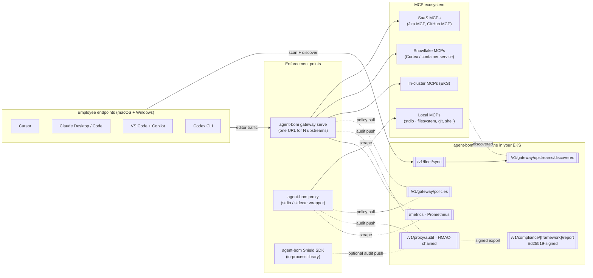

# Enterprise Security Playbook

> **Who this is for:** a security or platform team preparing to pilot
> `agent-bom` inside their own AWS / EKS (or equivalent) environment,
> with employees running Cursor / VS Code / Claude / Codex / Copilot on
> macOS + Windows against a mix of local, SaaS, and Snowflake-hosted
> MCPs. Every claim below links to the code path that implements it —
> nothing aspirational, nothing scaffold.

The doc is organised as **enterprise concern → agent-bom capability →
concrete code + test**. You can trace any statement to a file and a
test.

---

## 1. End-to-end enterprise flow



**Three enforcement points, one control plane, one audit trail:**

| Enforcement point | Code | When to use |
|---|---|---|
| Multi-MCP gateway | [`src/agent_bom/gateway_server.py`](../src/agent_bom/gateway_server.py) · [`cli/_gateway.py`](../src/agent_bom/cli/_gateway.py) | Laptops point at one URL for every remote MCP. Snowflake MCPs, SaaS MCPs, in-cluster MCPs. |
| Per-MCP proxy | [`src/agent_bom/proxy.py`](../src/agent_bom/proxy.py) (`run_proxy`, `_proxy_sse_server`) | stdio MCPs on a laptop; K8s sidecar next to a specific workload. |
| In-process Shield SDK | [`src/agent_bom/shield.py`](../src/agent_bom/shield.py) | Agent framework that wants to check tool calls + responses without a network hop. |

Every enforcement point calls the same [`check_policy`](../src/agent_bom/proxy_policy.py) evaluator and can push to the same [`/v1/proxy/audit`](../src/agent_bom/api/routes/proxy.py) sink. The audit log is HMAC-chained ([`api/audit_log.py`](../src/agent_bom/api/audit_log.py)) and evidence bundles are **Ed25519-signed** ([`api/compliance_signing.py`](../src/agent_bom/api/compliance_signing.py) + [`COMPLIANCE_SIGNING.md`](COMPLIANCE_SIGNING.md)).

---

## 2. What a pilot team worries about — mapped to code

### 2.1 Discovery: "Will agent-bom see every MCP my employees use?"

agent-bom scans laptop editor configs for **30+ MCP client surfaces** (Cursor, Claude Desktop, Claude Code, VS Code, Copilot, Codex, Continue, Cline, Roo, Amazon Q, Cortex Code, Windsurf, …) from [`src/agent_bom/discovery/config_parsers.py`](../src/agent_bom/discovery/config_parsers.py). Each discovered MCP server is serialised with its transport + URL ([`models.py:509 MCPServer`](../src/agent_bom/models.py)) and pushed to the control plane via `agent-bom agents --push-url`.

**End-to-end:**
1. `agent-bom agents --preset enterprise --introspect --push-url https://agent-bom.example.com/v1/fleet/sync`
2. Control plane ingest → [`api/routes/fleet.py:127 POST /v1/fleet/sync`](../src/agent_bom/api/routes/fleet.py)
3. Remote MCPs surfaced at [`api/routes/gateway.py GET /v1/gateway/upstreams/discovered`](../src/agent_bom/api/routes/gateway.py) — tenant-scoped, tested in [`tests/test_gateway_upstream_discovery_route.py`](../tests/test_gateway_upstream_discovery_route.py).
4. Gateway auto-loads at startup via `--from-control-plane` → [`cli/_gateway.py`](../src/agent_bom/cli/_gateway.py).

**No blank YAML.** The operator's local overlay only adds bearer/OAuth2 tokens to what discovery already found.

### 2.2 Credential + PII leakage: "What if an MCP response leaks our AWS keys or customer PII?"

Two channels — text and visual — both covered:

**Text channel — [`CredentialLeakDetector`](../src/agent_bom/runtime/detectors.py)** scans every tool-call response for **AWS access keys, GitHub tokens, OpenAI keys, generic bearer tokens, SSH keys, database URLs with embedded credentials, email addresses, phone numbers, SSNs, credit card numbers**. Pattern list in [`runtime/patterns.py`](../src/agent_bom/runtime/patterns.py).

- Detect + alert — called inside `run_proxy` on every response.
- Redact in place — `Shield.redact(text)` returns a sanitized string.
- Severity-tagged — credentials are `CRITICAL`, PII is `HIGH`.
- Tests: [`tests/test_runtime_credential_leak.py`](../tests/test_runtime_credential_leak.py).

**Visual channel — [`VisualLeakDetector`](../src/agent_bom/runtime/visual_leak_detector.py)** (opt-in: `pip install 'agent-bom[visual]'`). MCPs wrapping browsers or screen-capture tools (Playwright-MCP, Puppeteer-MCP, Cursor/Claude screen-read) can leak creds + PII through pixels the text scanner misses.

- OCRs every image block in an MCP `content: [{"type": "image", ...}]` response via pytesseract.
- Feeds extracted text through the *same* patterns the text scanner uses — one source of truth.
- Paints black boxes over matched OCR bounding rectangles; returns a new content-block list without mutating the original.
- Degrades gracefully when pytesseract / tesseract binary are absent.
- Policy hook: `deny_tool_classes: ["screen_capture"]` in a gateway policy blocks any tool whose name matches `screenshot` / `page_screenshot` / `take_screenshot` / `capture_screen` before the upstream is touched. Classifier in [`proxy_policy.py _classify_tool_classes`](../src/agent_bom/proxy_policy.py).
- Tests: [`tests/test_visual_leak_detector.py`](../tests/test_visual_leak_detector.py).

### 2.3 Malicious packages: "What if an employee installs a typosquat or OSSF-flagged malicious package?"

Two signals, both explicit:

| Signal | Code | Source |
|---|---|---|
| OpenSSF `MAL-` IDs in OSV results | [`malicious.py:is_malicious_vuln`](../src/agent_bom/malicious.py) | OSV.dev (already batch-queried by the scanner) |
| Typosquat heuristic against popular-package list | [`malicious.py flag_typosquats`](../src/agent_bom/malicious.py) | `difflib.SequenceMatcher` distance to curated top-N |

Every scan emits `package.is_malicious` + `package.malicious_reason` on the `Package` model ([`models.py`](../src/agent_bom/models.py)). Flagged in CLI output as `!! MALICIOUS` and surfaced in the dashboard `/findings` view.

### 2.4 Malicious / misconfigured MCP servers: "What if a vendor ships a compromised MCP?"

- **Package-level:** the MCP server's implementing package goes through the same OSV + KEV + EPSS pipeline as every other dependency ([`enrichment.py`](../src/agent_bom/enrichment.py)).
- **Registry verification:** MCPServer.registry_verified / .registry_id ([`models.py:524`](../src/agent_bom/models.py)) — servers found in the curated MCP registry get a trust boost; unknowns don't.
- **Permission profile:** [`models.py:PermissionProfile`](../src/agent_bom/models.py) classifies capabilities (`network_access`, `filesystem_write`, `shell_access`, `runs_as_root`) and scores as `critical / high / medium / low`. `critical` ≈ root + shell + network.
- **Tool drift:** [`ToolDriftDetector`](../src/agent_bom/runtime/detectors.py) — alerts when a server advertises a tool it didn't declare in `tools/list`. Catches post-install tool injection.
- **Trust assessment:** [`parsers/trust_assessment.py`](../src/agent_bom/parsers/trust_assessment.py) + [`parsers/skill_audit.py`](../src/agent_bom/parsers/skill_audit.py) — static analysis of MCP skill manifests.

### 2.5 Prompt injection / vector-DB poisoning

- [`VectorDBInjectionDetector`](../src/agent_bom/runtime/detectors.py) — watches responses from RAG / vector-store tool calls for instruction-injection patterns.
- [`ArgumentAnalyzer`](../src/agent_bom/runtime/detectors.py) — inspects arguments for path-traversal, command injection, server-side request forgery targets.
- [`ResponseInspector`](../src/agent_bom/runtime/detectors.py) — generic response-shape anomalies.
- [`parsers/prompt_scanner.py`](../src/agent_bom/parsers/prompt_scanner.py) — offline scanner for prompt-injection patterns in datasets and MCP resource responses.

### 2.6 Policy: "Can we block tools, require allowlists, rate-limit?"

One policy engine, shared across all three enforcement points: [`proxy_policy.py check_policy`](../src/agent_bom/proxy_policy.py) (line 144). Supported rule shapes (all in-tree with tests):

- `block_tools: [tool_name, ...]` / `tool_name` / `tool_name_pattern` — name-based blocks
- `allow_tools: [...]` with `mode: allowlist` — allowlist gate
- `deny_tool_classes: [write, execute, destructive, network, admin]` — capability-class deny
- `read_only: true` — deny any tool that writes / executes / is destructive
- `block_secret_paths: true` — deny arguments referencing `/etc/passwd`, `~/.aws/credentials`, `id_rsa`, etc. Patterns in [`proxy_policy.py _matches_secret_path`](../src/agent_bom/proxy_policy.py).
- `block_unknown_egress: true` + `allowed_hosts: [...]` — DNS allowlist for outbound arguments
- `rate_limit: <int>` — per-tool calls-per-minute

Central policy management at [`/v1/gateway/policies`](../src/agent_bom/api/routes/gateway.py). Sidecars + gateway pull every 30 s and cache by ETag. Policy audit trail persists every create / update / delete with actor + tenant.

### 2.7 Audit + compliance: "Can I hand an external auditor evidence that stands up in a SOC 2 / ISO / PCI review?"

- **HMAC-chained audit log** — [`api/audit_log.py`](../src/agent_bom/api/audit_log.py). Every entry signs the previous entry's signature; tampering with any row invalidates the chain from that point forward.
- **Ed25519-signed evidence bundles** — [`api/compliance_signing.py`](../src/agent_bom/api/compliance_signing.py). Auditor fetches the public key from [`/v1/compliance/verification-key`](../src/agent_bom/api/routes/compliance.py) once, pins it, verifies every bundle offline. Cookbook: [COMPLIANCE_SIGNING.md](COMPLIANCE_SIGNING.md).
- **14 compliance frameworks** mapped to findings inline — OWASP LLM Top 10, OWASP MCP Top 10, OWASP Agentic Top 10, MITRE ATLAS, NIST AI RMF, NIST CSF 2.0, NIST 800-53, FedRAMP, ISO 27001, SOC 2, CIS Controls v8, CMMC, EU AI Act, PCI DSS. Per-control + per-finding trace.
- **Tenant isolation on every export** — evidence bundle only carries scans + audit events from the authed tenant. Cross-tenant tests: [`tests/test_api_cross_tenant_matrix.py`](../tests/test_api_cross_tenant_matrix.py), [`tests/test_cross_tenant_leakage.py`](../tests/test_cross_tenant_leakage.py).

### 2.8 Scale: "Will this hold up at 50k packages and a 5k-agent fleet?"

Measured numbers from [`docs/PERFORMANCE_BENCHMARKS.md`](PERFORMANCE_BENCHMARKS.md):

- Blast-radius tag indexing: 50k findings → **44 ms mean**
- HMAC-sign canonical compliance bundle at 10k controls: **19.4 ms mean**
- 50k-finding bundle export budget: **~104 ms p50** vs 500 ms p99 target
- Fleet-agent quotas per tenant: `AGENT_BOM_API_MAX_FLEET_AGENTS_PER_TENANT=5000` (default).

Horizontal scale via Helm HPA on both control plane and gateway. ClickHouse is the analytics store for >100k-event/day tenants; Snowflake is a unified backend option for customers who already govern data there ([`snowflake-backend.md`](../site-docs/deployment/snowflake-backend.md)).

### 2.9 Tenant isolation: "Can tenant A ever see tenant B's data?"

**No.** Three layers:

- Row level — every ClickHouse insert carries `tenant_id`; every query emits `tenant_id = '<scope>'`. Contract: [`tests/test_clickhouse_tenant_isolation.py`](../tests/test_clickhouse_tenant_isolation.py).
- Concurrent-write race — [`tests/test_cross_tenant_leakage.py`](../tests/test_cross_tenant_leakage.py) (2 tenants, 100 rows each, no mixing).
- API level — [`tests/test_api_cross_tenant_matrix.py`](../tests/test_api_cross_tenant_matrix.py) (TestClient, every RBAC-guarded endpoint, zero cross-visibility).

### 2.10 Auth: "What identity surfaces work?"

- **API keys** with enforced lifetime policy (`AGENT_BOM_API_KEY_DEFAULT_TTL_SECONDS`, `AGENT_BOM_API_KEY_MAX_TTL_SECONDS`) and zero-downtime rotation (`POST /v1/auth/keys/{key_id}/rotate`) — [`api/auth.py`](../src/agent_bom/api/auth.py), [`api/middleware.py`](../src/agent_bom/api/middleware.py).
- **OIDC** — any IdP (Okta, Auth0, Azure AD, Google). Config in [`api/oidc.py`](../src/agent_bom/api/oidc.py).
- **SAML** — SP metadata at [`/v1/auth/saml/metadata`](../src/agent_bom/api/saml.py). Install `pip install 'agent-bom[saml]'`.
- **Trusted proxy headers** — RBAC via `X-Agent-Bom-Role` + `X-Agent-Bom-Tenant-ID` when an authed reverse proxy terminates client identity. [`rbac.py require_authenticated_permission`](../src/agent_bom/rbac.py).
- **Gateway upstream auth** — `none`, `bearer` (env), `oauth2_client_credentials` with token cache + early refresh — [`gateway_upstreams.py UpstreamConfig.resolve_auth_headers`](../src/agent_bom/gateway_upstreams.py). Snowflake MCPs use the OAuth2 path.

### 2.11 Secrets never touch agent-bom's disk

- API keys: bcrypt-hashed + timing-safe-compared at lookup.
- Bearer / OAuth client secrets: **referenced by env var name** in `upstreams.yaml`; the secret itself lives in your Kubernetes Secret / AWS Secrets Manager. The YAML never contains the secret.
- Audit HMAC key + Ed25519 evidence-signing key: mounted from Secrets Manager via External Secrets. Rotation = update the secret + `kubectl rollout restart`. Old compliance bundles remain verifiable against the old public key; auditors retain it offline.

---

## 3. What the pilot team actually deploys

### 3.1 Control plane (EKS)

Helm chart: [`deploy/helm/agent-bom/`](../deploy/helm/agent-bom/). Shipped example values:

| File | For |
|---|---|
| [`eks-mcp-pilot-values.yaml`](../deploy/helm/agent-bom/examples/eks-mcp-pilot-values.yaml) | Focused MCP + agents + fleet pilot |
| [`eks-production-values.yaml`](../deploy/helm/agent-bom/examples/eks-production-values.yaml) | Production-tuned Postgres pool + HPA |
| [`eks-istio-kyverno-values.yaml`](../deploy/helm/agent-bom/examples/eks-istio-kyverno-values.yaml) | Zero-trust service mesh |
| [`eks-snowflake-values.yaml`](../deploy/helm/agent-bom/examples/eks-snowflake-values.yaml) | Unified backend on Snowflake |

Every template is PSA-restricted (non-root, read-only root FS, drop ALL caps, seccomp RuntimeDefault). Ingress restricted by NetworkPolicy. Backup / restore round-tripped nightly in [`.github/workflows/backup-restore.yml`](../.github/workflows/backup-restore.yml).

### 3.2 Endpoint fleet

Every laptop runs one command:

```bash
agent-bom agents --preset enterprise --introspect \
  --push-url https://agent-bom.example.com/v1/fleet/sync
```

Windows + macOS behave identically — the scan, the config parsers, and the push client are all pure Python.

### 3.3 Multi-MCP gateway

```bash
# Fleet-driven: pulls the live inventory of remote MCPs from the control plane
agent-bom gateway serve \
  --from-control-plane https://agent-bom.example.com \
  --control-plane-token "$CP_TOKEN" \
  --upstreams /etc/agent-bom/gateway/overlay.yaml  # operator overlay for auth
```

Overlay schema: [`gateway-upstreams.example.yaml`](../deploy/helm/agent-bom/examples/gateway-upstreams.example.yaml). Laptops point editors at `https://agent-bom-gateway.example.com/mcp/{server-name}` — one URL template, no per-MCP client config.

### 3.4 Per-MCP proxy (for local / stdio)

```bash
# Wraps any stdio MCP server on a laptop
agent-bom proxy --policy ./policy.json -- /usr/local/bin/your-stdio-mcp --arg ...
```

Used for local MCPs the gateway can't front (stdio-only).

### 3.5 Shield SDK (for agent frameworks)

```python
from agent_bom.shield import Shield

shield = Shield()
alerts = shield.check_tool_call("read_file", {"path": "/etc/passwd"})
if alerts:
    raise RuntimeError(alerts[0]["message"])

alerts = shield.check_response("read_file", raw_response_text)
clean = shield.redact(raw_response_text)
```

Zero external deps beyond agent-bom. Works in any Python agent framework (Anthropic SDK, OpenAI, LangChain, CrewAI). File: [`src/agent_bom/shield.py`](../src/agent_bom/shield.py).

---

## 4. Pilot Day-1 smoke test — prove it works in 5 minutes

```bash
kubectl -n agent-bom port-forward svc/agent-bom-api 8080:8080 &
./scripts/pilot-verify.sh http://localhost:8080 "$API_KEY"
```

Exit non-zero on any failure. Six checks:
`/healthz`, authentication, fleet ingest, scan submit, public-key fetch for verification, and offline signature check of the compliance evidence bundle. Source: [`scripts/pilot-verify.sh`](../scripts/pilot-verify.sh).

---

## 5. What we deliberately don't do

Honest scope — these are on the roadmap but not shipped today:

- **Streamable-HTTP / SSE bidirectional relay in the gateway.** MVP handles the dominant request/response shape (`tools/call`, `tools/list`). Long-lived streaming is v2 — tracked in [`docs/design/MULTI_MCP_GATEWAY.md`](design/MULTI_MCP_GATEWAY.md).
- **Dynamic upstream reload.** Today a redeploy picks up `upstreams.yaml` changes. Fleet-discovery auto-refreshes on gateway restart.
- **Full OAuth2 auth-code / PKCE for per-user laptop → gateway** auth. Supported today: API key, OIDC, SAML, trusted proxy headers. User-scoped OAuth is the v2 auth surface.
- **A managed hosted control plane.** By design — `agent-bom` is self-hosted first. There is no telemetry home-phone.

Anything not listed above is implemented and tested. If you find a scaffold, open an issue — we treat it as a P0.

---

## 6. The EKS deployment story — end-to-end for a company piloting inside their infra

A single scripted walkthrough for a security / platform team running the
pilot inside **their own AWS account, VPC, EKS cluster, IAM boundary,
Postgres / Snowflake, SSO**. Every piece here maps to code that's on
disk and tests that pass on `main`.

### 6.1 What the team is deploying

```mermaid
flowchart TB
  subgraph AWS["Your AWS account · your VPC"]
    subgraph EKS["Your EKS cluster"]
      subgraph NS["namespace: agent-bom"]
        api["control-plane API<br/>3 replicas + HPA"]
        ui["control-plane UI<br/>2 replicas"]
        gw["agent-bom-gateway<br/>2 replicas + HPA"]
        cron["scanner CronJob<br/>cluster-wide MCP + agent discovery"]
        backup["Postgres backup CronJob<br/>→ S3 SSE-KMS"]
        metrics["PrometheusRule + Grafana<br/>ConfigMap"]
      end
      subgraph WORK["namespace: your-mcp-workloads"]
        mcp["MCP server pod"]
        sc["agent-bom proxy sidecar"]
        mcp -. stdio / local HTTP .- sc
      end
    end
    pg[(RDS Postgres<br/>primary state)]
    ch[(ClickHouse<br/>optional analytics)]
    snow[(Snowflake<br/>optional unified backend)]
    sm[(Secrets Manager<br/>API keys · HMAC · Ed25519 · OAuth2)]
  end

  subgraph Endpoints["Employees (macOS + Windows)"]
    ed[Cursor / VS Code / Claude / Codex / Copilot]
  end

  subgraph SaaS["Remote MCPs"]
    jira["Jira MCP"]
    gh["GitHub MCP"]
    cortex["Snowflake Cortex MCP"]
  end

  ed -- agent-bom agents --push-url --> api
  ed -- "editor → /mcp/{name}" --> gw
  sc -. policy pull · audit push .- api
  gw -. policy pull · audit push .- api
  gw -->|bearer| jira
  gw -->|bearer| gh
  gw -->|OAuth2 client-creds| cortex
  api --- pg
  api -. optional .- ch
  api -. optional .- snow
  api --- sm
  api --- metrics
  api --- backup
  cron --- api
```

### 6.2 Day-1 install script (copy-paste)

```bash
# ─── 0. Secrets in AWS Secrets Manager (ExternalSecrets wires them into pods)
aws secretsmanager create-secret --name agent-bom/api-key          --secret-string "$(openssl rand -hex 32)"
aws secretsmanager create-secret --name agent-bom/audit-hmac       --secret-string "$(openssl rand -hex 32)"
aws secretsmanager create-secret --name agent-bom/postgres-url     --secret-string "postgres://..."

# Ed25519 key pair for compliance evidence signing (private stays in Secrets Manager;
# public key is auto-exposed at /v1/compliance/verification-key for auditors).
openssl genpkey -algorithm ed25519 -out /tmp/evidence-priv.pem
aws secretsmanager create-secret --name agent-bom/evidence-signing --secret-string "$(cat /tmp/evidence-priv.pem)"
rm /tmp/evidence-priv.pem

# Upstream-MCP bearer / OAuth secrets (replace with your real tokens).
aws secretsmanager create-secret --name agent-bom/gateway-upstream-tokens --secret-string '{
  "JIRA_MCP_TOKEN": "...",
  "GITHUB_MCP_TOKEN": "...",
  "SNOWFLAKE_OAUTH_CLIENT_ID": "...",
  "SNOWFLAKE_OAUTH_CLIENT_SECRET": "..."
}'

# ─── 1. Author the gateway upstream overlay (auth for discovered MCPs)
cp deploy/helm/agent-bom/examples/gateway-upstreams.example.yaml my-upstreams.yaml
# edit my-upstreams.yaml — replace hostnames + token_env names with yours.

# ─── 2. Helm install: control plane + gateway + scanner CronJob in one go
helm install agent-bom deploy/helm/agent-bom \
  -n agent-bom --create-namespace \
  -f deploy/helm/agent-bom/examples/eks-mcp-pilot-values.yaml \
  --set gateway.enabled=true \
  --set-file gateway.upstreamsYaml=./my-upstreams.yaml

# ─── 3. Smoke-test the control plane (6 checks; fails fast)
kubectl -n agent-bom port-forward svc/agent-bom-api 8080:8080 &
./scripts/pilot-verify.sh http://localhost:8080 "$API_KEY"
```

**What now exists in the cluster**: control-plane API + UI, multi-MCP
gateway fronting the 4 example upstreams, scanner CronJob running
every 6 h, Postgres backup CronJob, PrometheusRule + Grafana dashboard
ConfigMap, External Secrets pulling from Secrets Manager. Helm template
under [`deploy/helm/agent-bom/templates/`](../deploy/helm/agent-bom/templates/).

### 6.3 Day-1 endpoint rollout (MDM script)

Push to every macOS + Windows laptop via your existing MDM
(Intune, Jamf, Kandji — the CLI is pure Python; no native code):

```bash
pipx install agent-bom
agent-bom agents --preset enterprise --introspect \
  --push-url https://agent-bom.example.com/v1/fleet/sync \
  --auth-bearer "$AGENT_BOM_USER_TOKEN"
```

Each laptop's scan ends up in:
- `/v1/fleet/sync` → [`api/routes/fleet.py`](../src/agent_bom/api/routes/fleet.py)
- `/v1/results/push` → [`api/routes/observability.py`](../src/agent_bom/api/routes/observability.py)

Within minutes the control plane has the full MCP inventory across every
employee's laptop. The gateway picks up the discovered MCPs on its next
startup / HPA scale event (or on a manual `kubectl rollout restart`).

### 6.4 Day-1 laptop editor redirect

Hand out **one** MCP config snippet to every team:

```jsonc
{
  "mcpServers": {
    "jira":   { "transport": "http", "url": "https://agent-bom-gateway.example.com/mcp/jira" },
    "github": { "transport": "http", "url": "https://agent-bom-gateway.example.com/mcp/github" },
    "snowflake": { "transport": "http", "url": "https://agent-bom-gateway.example.com/mcp/snowflake" },
    "filesystem": { "command": "agent-bom", "args": ["proxy", "--", "/usr/local/bin/your-stdio-mcp", "--arg", "..."] }
  }
}
```

Remote MCPs go through the gateway (central policy + audit). Local
stdio MCPs stay wrapped with the per-MCP proxy (stdio only). Both push
to the same audit trail.

### 6.5 Day-2 enforce

Policies live in the control plane and every gateway + sidecar pulls
them every 30 s. Starter policy bundles shipped:

```bash
# Block shell execution + path traversal + secret paths across every MCP
curl -X POST https://agent-bom.example.com/v1/gateway/policies \
  -H "Authorization: Bearer $ADMIN_TOKEN" \
  -H "Content-Type: application/json" \
  -d '{
    "name": "enterprise-baseline",
    "mode": "enforce",
    "enabled": true,
    "rules": [
      {"id": "no-shell",        "action": "block", "deny_tool_classes": ["execute"]},
      {"id": "no-secrets",      "action": "block", "block_secret_paths": true},
      {"id": "no-unknown-egress","action": "block", "block_unknown_egress": true,
       "allowed_hosts": ["*.example.com", "api.github.com"]},
      {"id": "rate-limit",      "action": "block", "rate_limit": 60}
    ]
  }'
```

Evaluated by the same code on every enforcement point:
[`proxy_policy.py:check_policy`](../src/agent_bom/proxy_policy.py) (line 144).

### 6.6 Day-3 evidence for the auditor

```bash
# Auditor pins the public key once
curl -s https://agent-bom.example.com/v1/compliance/verification-key \
  -H "Authorization: Bearer $AUDITOR_TOKEN" | jq -r .public_key_pem > pinned-pub.pem

# Pull a signed evidence bundle any time
curl -sD headers.txt -o soc2-q1.json \
  "https://agent-bom.example.com/v1/compliance/soc2/report?since=2026-01-01" \
  -H "Authorization: Bearer $AUDITOR_TOKEN"

# Offline verification (any machine, no agent-bom required — only cryptography)
python - <<'PY'
import json
from cryptography.hazmat.primitives import serialization
body = json.load(open("soc2-q1.json"))
pub = serialization.load_pem_public_key(open("pinned-pub.pem").read().encode())
sig = [l.split(": ",1)[1].strip() for l in open("headers.txt")
       if l.lower().startswith("x-agent-bom-compliance-report-signature")][0]
pub.verify(bytes.fromhex(sig), json.dumps(body, sort_keys=True).encode())
print("verified ✓  key_id:", body["signature_key_id"])
PY
```

Works with any auditor who can run Python + `cryptography`. No shared
secrets, no vendor back-channel.

### 6.7 Day-N operate

| Need | Surface | Code |
|---|---|---|
| "How many MCPs are in our fleet right now?" | `GET /v1/fleet/stats` | [`api/routes/fleet.py`](../src/agent_bom/api/routes/fleet.py) |
| "Which Jira MCP tool calls got blocked today?" | Grafana `agent_bom_gateway_relays_total{upstream="jira",outcome="blocked"}` | [`api/metrics.py record_gateway_relay`](../src/agent_bom/api/metrics.py) |
| "Rotate the API key for the CI service account" | `POST /v1/auth/keys/{key_id}/rotate` | [`api/auth.py`](../src/agent_bom/api/auth.py) |
| "Tenant alpha is flagging too many critical findings" | `/v1/posture` + `/v1/compliance/owasp-llm/report` | [`api/routes/compliance.py`](../src/agent_bom/api/routes/compliance.py) |
| "A new SaaS MCP is on the market — add it" | Extend `my-upstreams.yaml` + `helm upgrade` | — |
| "The Ed25519 signing key leaked; rotate" | Update Secrets Manager, `kubectl rollout restart deploy/agent-bom-api` | [`COMPLIANCE_SIGNING.md`](COMPLIANCE_SIGNING.md) break-glass |
| "Service is under fire; pause ingest" | `kubectl scale deploy/agent-bom-api -n agent-bom --replicas=0` | [`eks-mcp-pilot.md`](../site-docs/deployment/eks-mcp-pilot.md) break-glass |

### 6.8 Why this is trustworthy

- **Every capability cited in this playbook links to a file and a test.** You can `git grep` every claim.
- **No telemetry.** The control plane makes zero outbound calls you didn't opt into (OSV for CVE lookups, NVD / EPSS / KEV for enrichment, your SIEM / Jira / Slack webhooks if you set them).
- **The scanner is read-only.** `agent-bom agents` never writes config, never launches MCP servers, never stores credential values. [`PERMISSIONS.md`](PERMISSIONS.md) enumerates every file / network op.
- **Release artifacts are signed.** PyPI + Docker Hub releases are [Sigstore-signed](PERMISSIONS.md) with SLSA provenance. You can verify before deploy.
- **Evidence is third-party-verifiable.** Ed25519 — auditors don't trust us, they verify offline.
- **Tenant isolation is continuously tested.** Three layers of cross-tenant leakage tests on every CI run.

That's the entire pilot story: a single Helm install, a single laptop
command, and a single editor config snippet give a company the full
scan + discover + gateway + proxy + runtime + policy + audit +
evidence pipeline — running in their EKS, on their data, signed with
their key.
