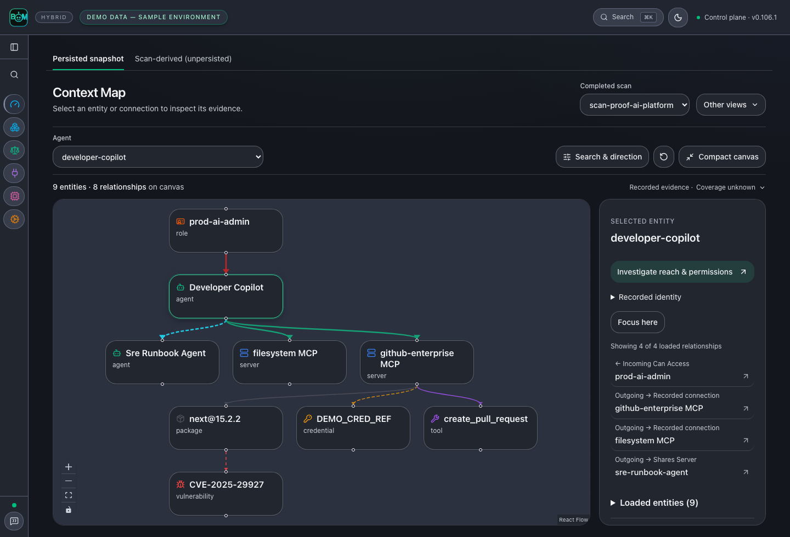
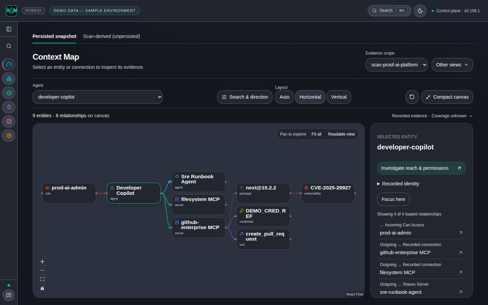

# Product scenarios

Start with a question, run the workflow, and inspect its evidence. The image
below uses the **Reference evidence lab — modeled local infrastructure**:
real parser and local gateway execution, a published advisory, and explicit
modeled infrastructure. It is not a customer incident or live-cloud proof.

## Scan a repository before shipping

From the repository you want to inspect:

```bash
agent-bom scan . -f json -o scan.json
agent-bom report compliance-narrative scan.json
```

The first command produces inventory, findings, and coverage for the selected
project. The second turns that saved evidence into a compliance narrative.
Review incomplete collectors before treating an absence of findings as a clean
result. Use the [first-run guide](FIRST_RUN.md) for SARIF and CI gates.

## Follow an image-processing exposure

An AppSec engineer receives an advisory affecting an image-processing service.
The actionable question is whether the affected package belongs to a workload
with a route to a sensitive asset.

The [reference lab](../examples/reference-evidence-lab/README.md) follows
`CVE-2023-4863` through a pinned Pillow dependency, image SBOM, Kubernetes
manifest, MCP configuration, and modeled identity. The ordered path shows the
relationship and evidence behind every step. Open a hop to inspect its source;
use Graph or List to investigate the same selected path.


This is a structural exposure supported by the lab inputs, not execution of an
exploit. The lab observes an allowed local gateway call, then checks that graph
enforcement blocks another call before the upstream tool runs. That proves the
local enforcement decision, not removal of the vulnerable deployment.

The upstream [Pillow 10.0.1 release notes](https://pillow.readthedocs.io/en/stable/releasenotes/10.0.1.html)
document updated wheels containing libwebp 1.3.2 for this advisory. The lab
matches package versions; it does not inspect a running service's libwebp binary.

## Verify the package change

From a repository checkout, run the offline before/after replay:

```bash
uv run python scripts/replay_package_remediation.py --output /tmp/package-replay.json
```

The real dependency parser and scanner read two isolated manifests. Pillow
9.0.0 matches the pinned advisory; 10.0.1 crosses that advisory's fixed-version
boundary. Neither package is installed or executed. The JSON receipt records
both results and the limited advisory coverage. This historical version pair
is a reproducible test case, not a current upgrade recommendation.

In an actual environment, rebuild and redeploy using a supported version,
collect a fresh SBOM and runtime identity, and re-run correlation. Close the
exposure only when the new evidence supports that decision. Retain the prior
scan and receipts for the audit trail.

[Run the complete lab](../examples/reference-evidence-lab/README.md) ·
[Start a self-hosted control plane](registry/DOCKER_HUB_UI_README.md) ·
[Evidence and graph contract](graph/CONTRACT.md)

Synthetic layout fixtures remain in the [capture protocol](CAPTURE.md) for UI
regression coverage. They are separate from these reproducible scenario claims.

## Compare recorded scan history

In a self-hosted control plane, run repeated scans of the same explicit target,
then open **Overview → Changes over time**. Select the history window and scan
scope to see newly detected findings, findings no longer detected, and median
open-finding and evidence ages. The table links each observation to its scan's
findings. History loads when this section opens.

Comparisons require compatible scope, measurement version and complete collection.
Partial scans and legacy records without comparison metadata show unavailable
changes. A missing finding does not prove remediation: verification remains a
separate audited workflow. Ages use recorded timestamps; evidence age is measured
at scan completion, and missing timestamps remain unavailable. Imported standalone
reports do not establish historical trends. Scan history has a separate scope from
the aggregate posture summary.

## Follow one component

Open **Inventory → Packages**, select a component, then follow **Findings →
Compliance**. The component identifier and retained snapshot stay in scope.
The captures below are synthetic UI states from the packaged product routes.

| Step | Inspect | Captures |
|---|---|---|
| Component | Recorded relationships, sources, timestamps and unknown collection coverage | [Light](images/component-detail-light-live.png) · [Dark](images/component-detail-dark-live.png) |
| Findings | Directly linked finding records in this component snapshot | [Light](images/component-findings-light-live.png) · [Dark](images/component-findings-dark-live.png) |
| Controls | Applicability mapping marked **Mapped · Not evaluated**, with exportable evidence | [Light](images/component-controls-light-live.png) · [Dark](images/component-controls-dark-live.png) |

For a parser-backed scan and changed-input rescan, run the
[connected-BOM example](../examples/connected-bom/README.md). It uses a different
bounded advisory fixture and explicitly synthetic cloud topology. A finding no
longer present after the input change is not proof that a deployment was repaired.

## Explore the same graph in both directions

Open **Context**, choose an agent, expand its recorded connections, then switch
**Vertical / Horizontal**. Both layouts retain the same selected entities and
relationships; changing direction does not add evidence or change risk.

**Vertical — follow dependencies from identity to finding.** The role sits above
the agent; MCP servers branch into tools, credentials and packages below it.

<picture><source media="(prefers-color-scheme: light)" srcset="images/context-map-light-live.png"></picture>

**Horizontal — trace the same chain from left to right.** Select a node or
connection to inspect its source in the adjacent evidence panel.

<picture><source media="(prefers-color-scheme: light)" srcset="images/context-map-horizontal-light-live.png"></picture>

These are labeled synthetic UI fixtures. Recorded connections do not establish
execution, successful access or complete collection coverage.
