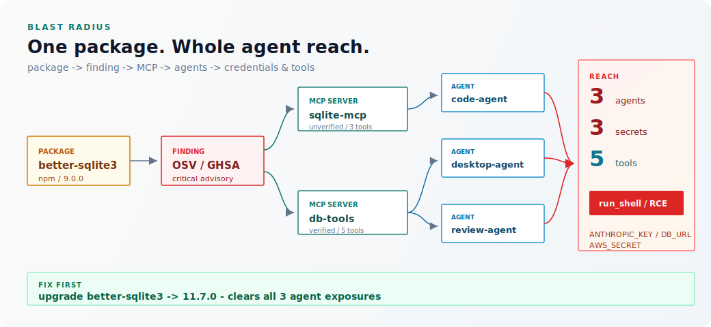
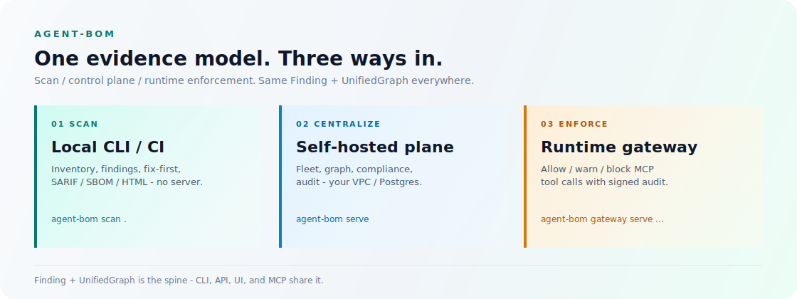

# How agent-bom works, and why it's different

This is the single canonical overview of the product flow. Other docs link here
instead of re-deriving the stages with their own counts. If you are choosing
what to run, start with [`START_HERE.md`](START_HERE.md); if you are choosing
what to deploy, use the
[deployment decision matrix](../site-docs/deployment/overview.md).

## Why it's different: symbol-level CVE reachability

Most scanners stop at "this package has a CVE." `agent-bom` joins the
CVE-affected symbols from OSV/GHSA advisories to your call graph, so you see the
subset that is actually reachable from your code — typically a fraction of the
raw match count — and then fuses that verdict into the agent graph. A reachable
CVE in a package an MCP server exposes to an agent that holds a credential is a
different risk than the same CVE sitting in dead code, and the product treats it
that way.

<picture>
  <source media="(prefers-color-scheme: dark)" srcset="images/blast-radius-dark.svg">
  
</picture>

That drilldown — package to finding to MCP server to agent to credentials and
reachable tools — is the product's center of gravity. Everything else exists to
produce and act on it. Function-level de-noising joins OSV/GHSA affected symbols
to Python, npm, Go, Java, Rust, and Ruby call graphs when `--project` AST
analysis is available; the CVE/CWE/CPE identifiers ride along on the
reachability verdict. See [`VULNERABILITY_MATCHING.md`](VULNERABILITY_MATCHING.md)
for the mechanics.

## The three product lanes

Read it as the shipped commands and the sidebar graph lenses: **scan**
(`agents` / CI / Docker), normalize into one **graph** (`Finding` +
`ContextGraph` with blast radius), then **serve** (`agent-bom serve`) as one
pane of glass. Sidebar **Findings** is the triage queue inside serve — not a
lane name. Vuln matching runs in scan and lands on the graph.

<picture>
  <source media="(prefers-color-scheme: dark)" srcset="images/how-it-works-dark.svg">
  
</picture>

| Lane | What happens | Key output |
|---|---|---|
| **1. Scan** | Read-only intake from repos, CI, images, IaC, MCP configs, and cloud accounts, then the six-step engine (discover → extract → scan → enrich → analyze → report). Enrichment joins OSV / GHSA / NVD / KEV / EPSS and scores symbol-level CVE reachability. | matched, enriched, reachability-scored evidence |
| **2. Graph** | Evidence normalizes into one `Finding` model and one `ContextGraph` (blast radius: agent → MCP → package → CVE) shared by CLI, CI, API, UI, and MCP tools — the same story as Lineage / Agent Mesh / Context in the sidebar. | one evidence graph |
| **3. Serve** | `agent-bom serve` is the self-hosted one pane of glass: dashboard, Findings queue, REST API, MCP server, fleet, audit — plus report formats and optional runtime gateway / proxy. | reviewed posture + exports + optional allow/warn/block |

Stage 1's "analyze" step is where symbol-level reachability is computed; stage 2
is where it becomes blast radius on the agent/MCP graph. That pairing is the
differentiator — the rest of the flow is table stakes done cleanly.

## Where to go next

- Deeper module and surface architecture: [`ARCHITECTURE.md`](ARCHITECTURE.md)
- Service lanes and backend choices: [`PRODUCT_MAP.md`](PRODUCT_MAP.md)
- Positioning and shipped-vs-not: [`PRODUCT_BRIEF.md`](PRODUCT_BRIEF.md)
- Lanes and cost posture: [`EDITIONS.md`](EDITIONS.md)
- What to deploy first: [deployment overview](../site-docs/deployment/overview.md)
