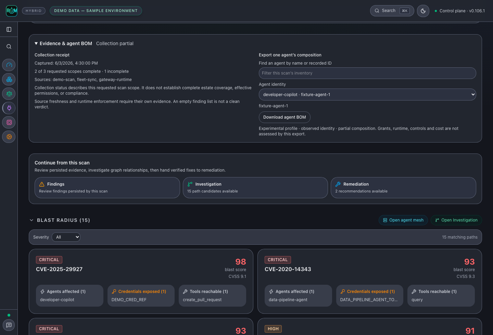

# Inspect scan evidence and an agent BOM

This preview requires matching dashboard and control-plane builds containing
per-agent scan export. For CLI support, check that `agent-bom manifest --help`
includes `--scan-result`; a package release can lag the source build.

Run a scan, open its result, and expand **Evidence & agent BOM**. The collection
receipt shows the recorded time, source list, and completed/incomplete requested
scopes. Missing denominators remain unknown. A completed job does not establish
complete estate coverage or compliance.

Filter the recorded agents by name or ID, then choose a specific identity and
select **Download agent BOM**. Display names help search; the recorded ID selects
the subject. Records with missing, conflicting or duplicate IDs cannot be
exported through this picker. Recollect them with scoped identity evidence.
The export is an experimental composition profile, not a control verdict or
industry-standard certification. Its source timestamp is preserved; downloading
it again does not collect new evidence.

Use **Investigation** to follow the scan into a graph. Expand **Snapshot evidence**
to inspect its ID, source kind and capture time. The lineage view reports loaded
nodes against the current query scope and separately reports snapshot size.
Neither graph completeness nor a recent capture time establishes source
freshness, executed actions, effective privileges or assessed coverage.

Inspect relationship evidence before taking action. Scan snapshots link to
findings for that exact scope; correlated snapshots do not fabricate a source
scan link. Compare the original findings and missing assessments with the BOM.

The screenshot uses labeled synthetic evidence. The browser fixture demonstrates
selection and presentation; it does not establish authenticated provider coverage.
