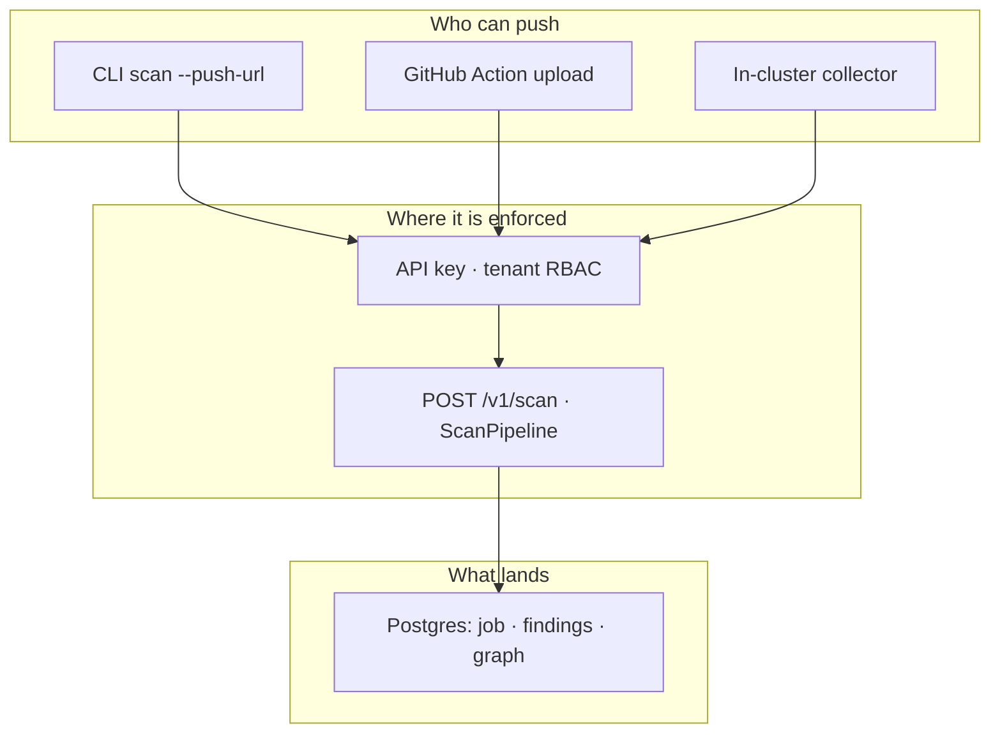
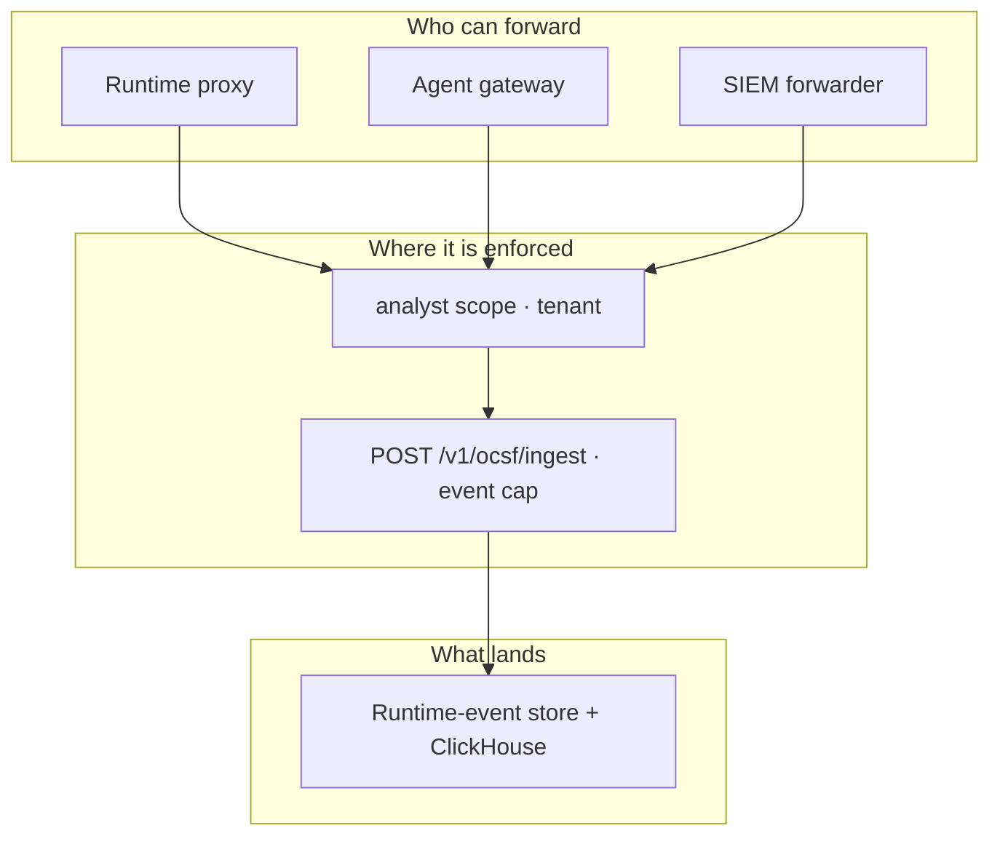
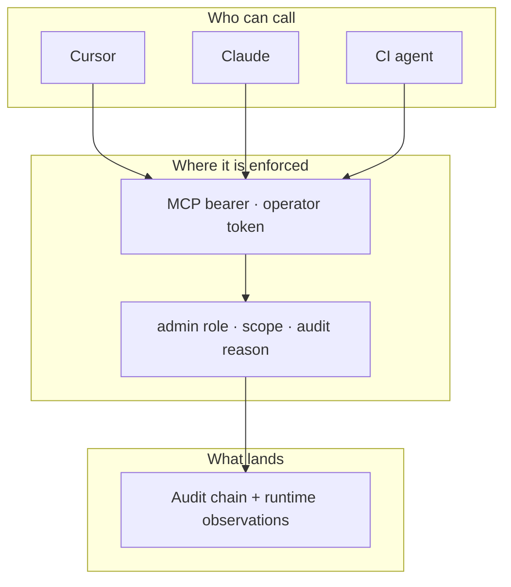
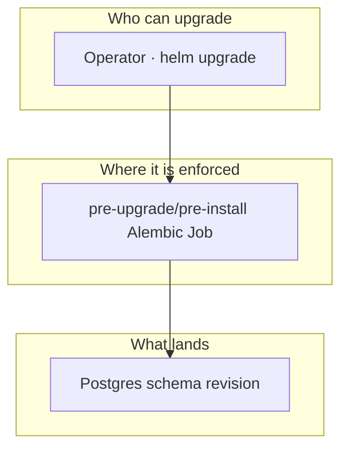
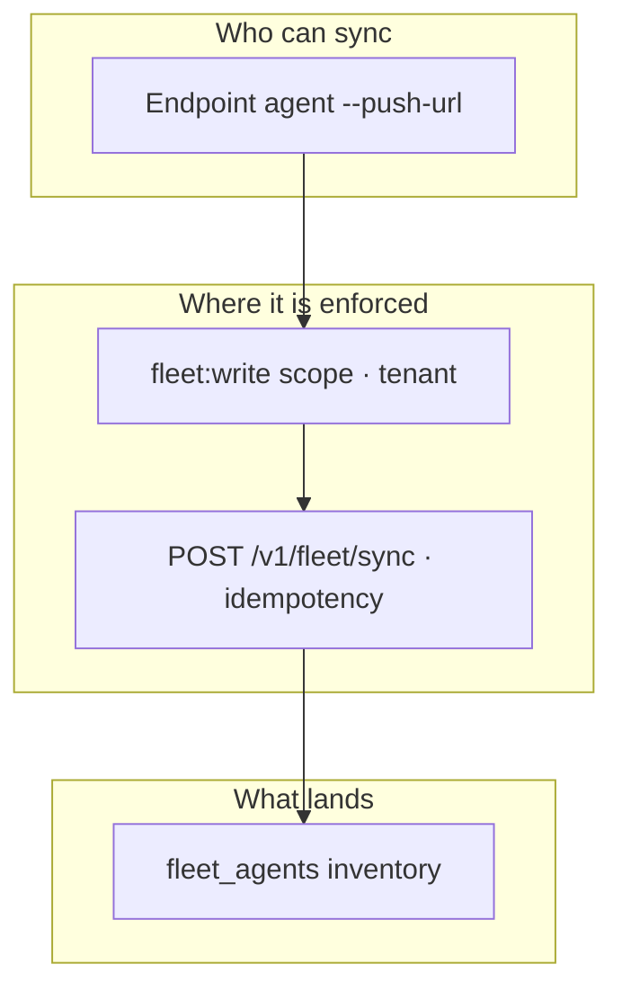
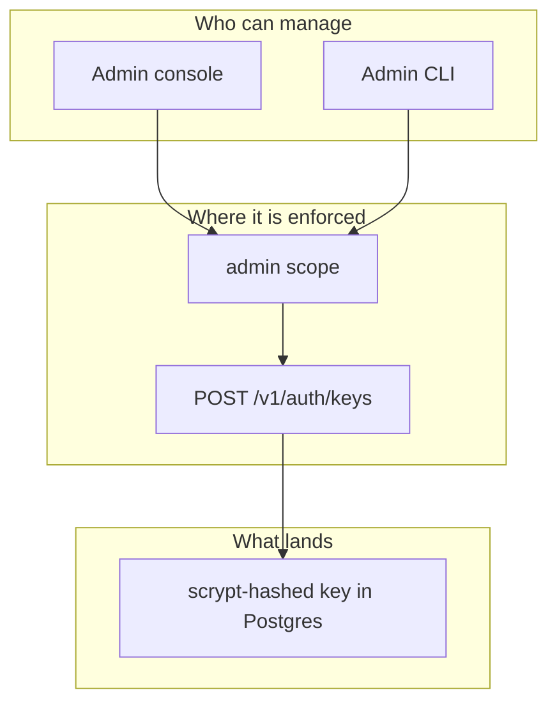

# Session & enforcement flows

Compact, vertically stacked diagrams for the end-to-end workflows that move
evidence into (and out of) the control plane: **who can act, where the action
is enforced, and what gets persisted.** They follow the
[layered session / enforcement flow pattern](VISUAL_LANGUAGE.md#layered-session--enforcement-flows-compact-tb)
— `flowchart TB`, three bands (`Who → Enforced → Lands`), ≤3 nodes per band,
overflow in the prose beneath each fence. Everything wider than a full estate
map stays an `LR` inventory diagram elsewhere; these are session truth.

Each diagram links to the owning code paths in the prose below it. When a route,
scope, or store moves, update the diagram and the links together.

---

## Scan push

CLI, CI, and in-cluster collectors push scan evidence through the same
authenticated pipeline.

- **Who:** the CLI (`agent-bom scan ... --push-url`), the packaged GitHub
  Action, and in-cluster collectors all POST the same payload.
- **Enforced at:** scrypt-hashed API key + per-request tenant scoping in
  [`api/middleware.py`](../src/agent_bom/api/middleware.py), then
  [`POST /v1/scan`](../src/agent_bom/api/routes/scan.py) (`scan.py:829`) runs the
  scan through `ScanPipeline`.
- **Lands in:** the tenant-scoped scan job, findings, and graph snapshot in the
  scan/graph stores (`api/store.py`, `api/postgres_store.py`).

---

## OCSF / runtime ingest

Runtime proxies, the gateway, and SIEM forwarders normalize OCSF events onto the
canonical runtime-event path.

- **Who:** the runtime proxy, the agent gateway, and external SIEM/CSP
  forwarders emit OCSF-shaped events.
- **Enforced at:** [`POST /v1/ocsf/ingest`](../src/agent_bom/api/routes/observability.py)
  (`observability.py:579`) requires the `analyst` scope
  ([`middleware.py:849`](../src/agent_bom/api/middleware.py)), rejects batches over
  `API_MAX_OCSF_INGEST_EVENTS`, and normalizes every event under the caller's
  tenant before persistence.
- **Lands in:** the canonical runtime-event store
  ([`api/runtime_event_store.py`](../src/agent_bom/api/runtime_event_store.py),
  `runtime_observations`) and the ClickHouse analytics projection. OCSF stays an
  export/interop shape only — see [`OCSF_BOUNDARY.md`](OCSF_BOUNDARY.md).

---

## MCP tool call

Agent clients call governed MCP tools; write tools fail closed without operator
authority.

- **Who:** MCP clients (Cursor, Claude, CI agents) connect over the configured
  bearer transport.
- **Enforced at:** the `_StaticBearerTokenVerifier`
  ([`mcp_server.py:157`](../src/agent_bom/mcp_server.py)) authenticates read
  callers with one token and mutating tools with a **separate operator token**,
  so a tool argument cannot self-assert admin authority; write tools additionally
  require an `admin` role, the matching write scope (e.g. `shield:write`), and an
  audit reason (`mcp_server.py:416`).
- **Lands in:** the tamper-evident control-plane audit chain plus
  `runtime_observations`, both tenant-scoped.

---

## Helm upgrade

Operators upgrade the chart; schema migrations run as a pre-upgrade hook before
new pods start.

- **Who:** a cluster operator runs `helm upgrade` on the `agent-bom` chart.
- **Enforced at:** the Alembic migration Job
  ([`controlplane-alembic-migration-job.yaml`](../deploy/helm/agent-bom/templates/controlplane-alembic-migration-job.yaml))
  is annotated `helm.sh/hook: pre-upgrade,pre-install` with `hook-weight -10`
  (defaults in [`values.yaml`](../deploy/helm/agent-bom/values.yaml)), so the DB
  revision applies before the API rollout.
- **Lands in:** the upgraded Postgres schema revision, atomically ahead of the
  new application pods.

---

## Fleet sync

Endpoint agents push local discovery into the tenant fleet registry.

- **Who:** an endpoint agent (`agent-bom agents ... --push-url .../v1/fleet/sync`)
  runs local discovery and pushes the result. The local-only `agent-claw fleet
  sync` subcommand intentionally redirects operators to this API path rather than
  syncing offline.
- **Enforced at:** [`POST /v1/fleet/sync`](../src/agent_bom/api/routes/fleet.py)
  (`fleet.py:268`) requires the `fleet:write` scope
  ([`middleware.py:897`](../src/agent_bom/api/middleware.py)), scopes writes to
  the caller's tenant, and honors an idempotency key for safe retries.
- **Lands in:** the `fleet_agents` registry
  ([`api/fleet_store.py`](../src/agent_bom/api/fleet_store.py)); new agents enter
  `DISCOVERED` and trust scores are recomputed on each sync.

---

## API key lifecycle

Admins mint and rotate short-lived API keys; only the scrypt hash is stored.

- **Who:** an admin (dashboard or CLI) creates, rotates, and revokes keys.
- **Enforced at:** [`POST /v1/auth/keys`](../src/agent_bom/api/routes/enterprise.py)
  (`enterprise.py:531`) requires the `admin` scope
  ([`middleware.py:813`](../src/agent_bom/api/middleware.py)); the raw key is
  returned exactly once and the actor is derived from the authenticated principal.
- **Lands in:** the key store as a **scrypt hash** — the plaintext key is never
  persisted or logged (`api/auth.py`, `create_api_key`).

---

## Adding a flow

1. Confirm the route, scope, and store exist in code before drawing them — these
   diagrams are session truth, not aspiration.
2. Keep it `flowchart TB`, three bands, ≤3 nodes per band. Push extra actors or
   destinations into the bullet list, not the canvas.
3. Link every band to its owning file/line in the prose.
4. Verify it renders without horizontal scroll at ~800px on GitHub and the docs
   site before shipping.
