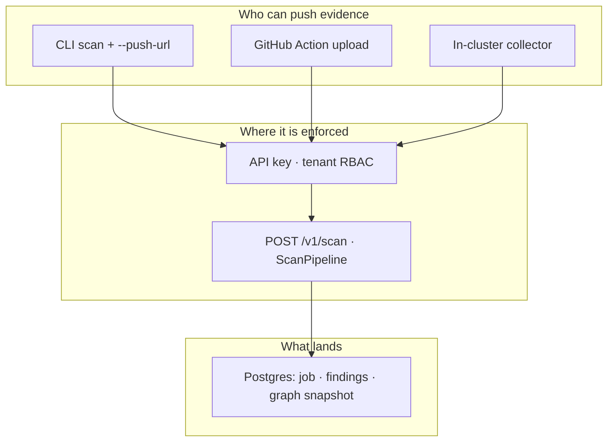

# Visual language for agent-bom docs

## Brand basics (canonical — locked)

One product name, one mark, one accent. Do not rename the product to “BOM”
alone — BOM is the **logo**, not the installable/searchable name. Do not put a
tagline under the nav lockup — the wordmark is enough.

| Layer | Canonical form | Where |
|---|---|---|
| **Product name** | `agent-bom` | CLI, packages, URLs, docs titles, UI wordmark `alt`, metadata |
| **Mark (logo)** | **BOM** with agent HUD in the **O** | Favicon, nav icon, avatars, social icon-only |
| **Wordmark** | `agent·bom` | Nav lockup beside the mark |
| **Spoken nickname** | “BOM” | Optional in conversation / tight chrome — never as the sole product name in docs, CLI, or packages |

### Name rules

- **Name:** `agent-bom` — always lowercase and hyphenated, even at the start of a
  sentence or in a Title Case heading. Never `Agent-BOM`, `AgentBOM`,
  `Agent-Bom`, or bare `BOM` as the product name (the title-cased
  `X-Agent-Bom-*` HTTP headers are a separate wire convention and are
  intentionally left as-is).
- **Why not rename to BOM:** “BOM” alone collides with SBOM/CBOM and every
  bill-of-materials; `agent-bom` stays distinct for PyPI, npm, GitHub, and search.
- **Feature labels:** The inventory artifact may be called **AI BOM** /
  **agent-bom manifest** in UI (nav: “AI BOM”). Prefer `agent-bom` or “AI BOM”
  over title-cased “Agent BOM” in new UI copy.
- **No lockup tagline:** Do not ship “BOM for humans & agents” (or similar) under
  the mark/wordmark. Human UI and headless/agent surfaces are both first-class;
  that is product behavior, not a subtitle.
- **Meta / prose description:** "Open security scanner and self-hosted control
  plane for AI, MCP, and cloud infrastructure."
- **Positioning line (README hero):** "Open security scanner and self-hosted control
  plane for AI, MCP, and cloud infrastructure."
- **Accent (product UI / lockup):** emerald → cyan. Light `#059669 → #0891b2`;
  dark `#34d399 → #06b6d4` / `#22d3ee`. Ink `#1f2937` (light) / `#e6edf3` (dark);
  muted `#6b7280` / `#8b949e`.
- **Mark (locked):** **BOM** wordmark-as-icon where the **O** is an agent HUD
  (filled head + visor slots + status bar + antenna — not an emoji smile), with
  three materials ticks under the letters so the glyph reads as agent-in-BOM.
  Canonical product mark — do not replace with lettermarks or clipboard
  variants. Same mark appears in the dashboard lockup and the CLI no-args
  splash (`agent_bom.output.brand_tokens`).

Brand assets live in `docs/images/brand/` (self-contained SVG, no external fonts or
network refs, light + dark pairs):

| Asset | Use |
|---|---|
| `logo-{light,dark}.svg` | Horizontal lockup (mark + wordmark) — README/docs hero |
| `mark-{light,dark}.svg` | Icon-only mark — square avatars, favicons, tight spaces |
| `wordmark-{light,dark}.svg` | Wordmark only — inline headers where the mark is redundant |

`docs/images/logo-{light,dark}.svg` are kept as compatibility aliases of the lockup.
The MkDocs site uses `site-docs/assets/brand/mark-mono.svg` (white, for the colored
header bar) as `theme.logo` and `mark.svg` as the favicon.

Three media, used deliberately. agent-bom is one product with multiple
surfaces; images should show the surface being discussed without implying a
separate product or unshipped capability. Picking the right medium keeps the README
readable, mobile-friendly, and easy to keep in sync with code.

For product screenshots, the source of truth is the packaged Next.js
dashboard. Snowflake Streamlit views may still exist for Snowflake-native
deployments, but they are not the primary product visuals for README or docs.

Diagrams should center the interoperable evidence model: sources and connectors
feed `Finding` + `ContextGraph`, then humans and agents consume the same
evidence through CLI, API, UI, MCP, CI, reports, and gateway controls. AWS,
Azure, GCP, Snowflake, registries, repos, IaC, SBOMs, and runtime streams are
connector lanes. None should be drawn as the product center unless the page is
specifically about that connector.

## SVG — for hero visuals + dense product imagery

Use when:
- the diagram is the *story* of the section (blast-radius, scan pipeline, engine internals, compliance mapping)
- you need typographic control, color hierarchy, or dense info per pixel
- it does not change every PR

Files live in `docs/images/`, always shipped as `*-light.svg` + `*-dark.svg`
with `<picture>`+`prefers-color-scheme` switching. Hand-tuned, no auto-layout.
Regenerate `how-it-works` and `architecture` pairs from
`scripts/generate_doc_architecture_svgs.py` when lane content or counts change.

Regenerate `how-it-works`, `architecture`, and `persona-value` SVGs from
`scripts/generate_doc_architecture_svgs.py` after changing lane content or counts.
The generator escapes XML text (`&` → `&amp;`) so GitHub can render diffs.
Every generated visual must keep text inside its parent shape at README scale:
no clipped labels, no text crossing card borders, no arrows covering text, and
no stale visible version stamp.

Current SVG inventory:

| File | What it shows | Where it lives in the README |
|---|---|---|
| `brand/logo-{light,dark}.svg` | Brand lockup (mark + wordmark); see Brand basics above | hero |
| `architecture-{light,dark}.svg` | End-to-end LR data flow: sources → scan/ingest → unified Finding + ContextGraph → control plane (API / Gateway / MCP) → consumers (humans + headless agents) + artifacts | `docs/ARCHITECTURE.md` System Overview; README "What Is agent-bom", collapsed detail |
| `how-it-works-{light,dark}.svg` | Three product lanes — Scan → Graph → Serve — vuln/advisories in scan, ContextGraph + blast radius at center, `agent-bom serve` as one pane of glass; cloud row uses official marks from `ui/public/logos/` | README "How It Works" |
| `persona-value-{light,dark}.svg` | Four buyer personas in a compact single-row band — neutral cards, one restrained accent hue and person-with-role-badge icon per persona, value proof pill per card (larger body copy for README scale) | README "What Is agent-bom", collapsed "Who it's for" detail |
| `blast-radius-{light,dark}.svg` | CVE, package, MCP server, agent, credentials, and tools in one blast-radius path | README "What Is agent-bom", collapsed drilldown |
| `scan-pipeline-{light,dark}.svg` | 5-stage pipeline (discover → scan → analyze → report → enforce) | "How a scan moves" |
| `engine-internals-{light,dark}.svg` | Inside the scanner | available for deeper architecture docs; not currently embedded in the README |
| `compliance-{light,dark}.svg` | Finding → control → evidence packet | Compliance section |
| `demo-latest.gif` | Terminal demo (453KB after compression) | "Try the demo" |

Current PNG inventory:

| File | What it shows | Where it lives in the README |
|---|---|---|
| `dashboard-live.png` | Packaged Next.js dashboard risk overview | Product views |
| `dashboard-paths-live.png` | Packaged Next.js attack paths and exposure view | Product views |
| `mesh-live.png` | Focused agent mesh graph across agents, MCP servers, packages, tools, credentials, and findings | Product views |
| `security-graph-live.png` | Fix-first attack-path queue with export controls and remediation handoff | Product views |
| `lineage-graph-live.png` | Expanded but bounded topology across environment, identity, MCP, package, credential, model, dataset, and finding nodes | Product views |
| `context-map-live.png` | Focused lateral context map with MCP reachability, shared infrastructure, credentials, tools, and findings | Product views |
| `fleet-state-live.png` | Fleet lifecycle review state with owner, environment, trust factors, and quarantine context | Product views |
| `gateway-policies-live.png` | Runtime gateway posture with enforcement, firewall decisions, policy rules, and bound agents | Product views |
| `dependency-map-live.png` | Supply chain dependency map with scan pipeline counts and package risk distribution | Product views |
| `remediation-live.png` | Fix-first remediation surface | Product views |

Public README, Docker Hub, and marketplace screenshots should not duplicate the
same graph in dark and light themes. Use one focused, readable product capture
for graph proof; keep theme-specific screenshots in release QA notes only when a
theme regression is being verified.

## Mermaid — for code-true flows that evolve

Use when:
- the diagram mirrors a piece of code or config that changes (helm templates, middleware stack, deployment topology)
- editing it as text in a PR is more honest than re-rendering an SVG
- the layout is naturally **linear or single-radial** (no crossing edges)

Rules to avoid spaghetti:
1. Pick one direction (`LR` or `TB`), don't mix
2. Maximum one level of `subgraph` nesting; flatten the rest into siblings
3. Maximum 4–6 nodes per inner cluster — overflow goes into a paragraph below the diagram, not into the diagram
4. Edges should radiate from a single hub OR flow linearly — never form a mesh
5. Drop modifier nodes (logos, decorations) — Mermaid is structure, not decoration

Current Mermaid surface:
- `## Deploy in your own AWS / EKS` — 3-tier hub-and-spoke (endpoints → control plane → workloads + state + observability)
- `### How a request flows through the control plane` — linear left-to-right pipeline of middleware classes

## ASCII / monospace — for terminal output only

Use when the block is literally a terminal artifact (CLI output, code snippet,
config file). Do not use ASCII for architecture diagrams — every drift makes
it harder to read.

Current ASCII surface:
- The CVE blast-radius tree at the top of the README — it is what
  `agent-bom agents --offline` actually prints
- All `bash` / `yaml` / `json` code blocks — those are commands, not diagrams

## When in doubt

If the diagram is going to be referenced by an enterprise buyer's procurement
deck, ship SVG. If it's going to drift faster than the next release, ship
Mermaid. If a junior engineer would type it into a terminal, ship ASCII inside
a fenced code block.

## Layered session / enforcement flows (compact TB)

Use this pattern when explaining **who can do what, where it is enforced, and
what gets persisted** — auth scopes, scan push, OCSF ingest, MCP tool calls,
Helm upgrade hooks, fleet sync. The goal matches a readable chat or doc card:
**nothing too wide to pan, nothing so tall it needs endless scroll.**

### Layout rules

1. **Direction `TB` only** — three stacked bands, not `LR` meshes.
2. **Three bands max:** `Who / sources` → `Where enforced` → `What persisted`.
3. **≤3 nodes per band** — overflow becomes a bullet list under the diagram.
4. **One enforcement spine** — a single vertical chain through the middle band
   (`require_scope` → route → store), not parallel crossing edges.
5. **Narrow subgraph titles** — short labels (`Who can push`, `Enforced at`,
   `Lands in`), not paragraph subtitles inside nodes.
6. **Repo and docs only** — these diagrams belong in README, `docs/`, and
   `site-docs/`; the dashboard stays operator chrome (no floating workflow
   banners on graph canvases).

### Template

Ship one compact diagram per workflow page; link to code paths in prose below
the fence. Regenerate wide `flowchart LR` inventory diagrams only when the
buyer deck needs the full estate map — use compact TB for session truth.

The shipped rollout of this pattern lives in
[`SESSION_FLOWS.md`](SESSION_FLOWS.md): scan push, OCSF/runtime ingest, MCP tool
call, Helm upgrade, fleet sync, and API-key lifecycle, each linked to its owning
route, scope, and store.
