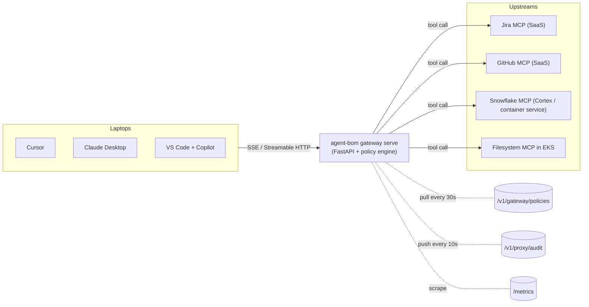

# Design: multi-MCP gateway — `agent-bom gateway serve`

**Status:** design, not yet implemented. Tracked for the current pilot cycle.

**Problem statement:** a pilot team wants to front-door every MCP connection in their environment through a single host so they can apply policy + audit centrally without touching every laptop's editor config. Today, `agent-bom proxy` is **per-MCP** — one instance per upstream server, either as a K8s sidecar next to a workload or as a stdio wrapper on a developer laptop. Central policy + audit already exist (`/v1/gateway/policies`, `/v1/proxy/audit`); central *traffic* does not.

**Concrete pilot mix the gateway must cover:**
- SaaS MCPs (Jira, GitHub, etc.) — bearer-token auth, remote HTTPS.
- Snowflake-hosted MCPs (Cortex functions / container services) — OAuth2 client-credentials against the Snowflake IdP.
- In-cluster MCPs running alongside the gateway — no external auth; NetworkPolicy is the perimeter.
- stdio-only local MCPs — out of scope for this gateway; keep using `agent-bom proxy` per-MCP wrappers.

## Goal

Add a new CLI mode: `agent-bom gateway serve`.

One FastAPI service that:

1. Accepts MCP client connections (HTTP + SSE, Streamable HTTP transport).
2. Routes each client connection to one of N configured upstream MCP servers (local or remote), keyed by server name.
3. Applies gateway policy (from the existing `/v1/gateway/policies` store) inline, on every `tools/call`, `tools/list`, `resources/read`, `prompts/get`.
4. Pushes every call into the existing HMAC-chained audit log via the existing `/v1/proxy/audit` contract.
5. Exposes per-upstream and per-tenant metrics on the existing `/metrics` endpoint.

Non-goals (explicitly):

- Proxying **stdio** MCPs — clients that only speak stdio still use per-MCP `agent-bom proxy` wrappers. This gateway is HTTP/SSE-only.
- A new transport or policy language. Re-uses `GatewayPolicy` + `check_policy` from [`src/agent_bom/gateway.py`](../../src/agent_bom/gateway.py).
- Replacing the sidecar mode. Both modes coexist; teams pick per workload.

## User-visible surface

### CLI

```bash
agent-bom gateway serve \
  --bind 0.0.0.0:8090 \
  --upstreams upstreams.yaml \
  --control-plane-url https://agent-bom.example.com \
  --control-plane-token "$CP_TOKEN" \
  --policy-refresh-seconds 30 \
  --audit-push-interval 10 \
  --response-signing-key /var/run/secrets/gateway/ed25519.pem
```

### `upstreams.yaml`

```yaml
upstreams:
  - name: jira
    url: https://snowflake.example.internal/mcp/jira
    auth: oauth2_client_credentials
    scopes: ["jira.read"]
  - name: github
    url: https://mcp.github.example.com/sse
    auth: bearer
    token_env: GITHUB_MCP_TOKEN
  - name: filesystem-review-env
    url: http://review-fs.agent-bom-workloads.svc.cluster.local:8100
    auth: none
```

### Client config

Laptop editors point at **one** URL for every MCP, using the gateway's server-routing discriminator:

```jsonc
// Cursor / VS Code / Claude MCP config — one entry, not N
{
  "mcpServers": {
    "gateway": {
      "transport": "sse",
      "url": "https://agent-bom-gateway.example.com/mcp/{server-name}",
      "headers": { "Authorization": "Bearer ${AGENT_BOM_USER_TOKEN}" }
    }
  }
}
```

`{server-name}` is replaced by the desired upstream (e.g. `/mcp/jira`, `/mcp/github`). Servers the user is not authorised for 403.

## Data flow



## Reuse map — don't rewrite what exists

| Requirement | Existing code | Change |
|---|---|---|
| Policy evaluation | [`check_policy`](../../src/agent_bom/proxy.py) | Reuse unchanged — pure function |
| Policy fetch from control plane | `control_plane_url` / `control_plane_token` path in [`run_proxy`](../../src/agent_bom/proxy.py:527) | Extract into a module both `run_proxy` and `gateway serve` call |
| Runtime detectors | [`agent_bom.runtime.detectors`](../../src/agent_bom/runtime/detectors.py) | Reuse unchanged |
| Audit-push client | Proxy's current HTTPX POST to `/v1/proxy/audit` | Extract |
| Response signing | `response_signing_key` path already in `run_proxy` | Reuse |
| `GatewayPolicy` format | [`agent_bom.api.policy_store`](../../src/agent_bom/api/policy_store.py) | Unchanged |
| Metrics | [`agent_bom.api.metrics`](../../src/agent_bom/api/metrics.py) | Add per-upstream labelled counters |
| Auth (API key / OIDC / SAML) | [`agent_bom.api.middleware`](../../src/agent_bom/api/middleware.py) | Gateway must accept the same auth methods the control plane does |

Net new code:

- `src/agent_bom/gateway_server.py` — the FastAPI app, upstream registry, per-connection SSE relay
- `src/agent_bom/cli/gateway.py` — `agent-bom gateway serve` entry point
- `src/agent_bom/gateway_upstreams.py` — upstream config loader + auth injector
- `tests/test_gateway_server.py` — real upstream + real policy + TestClient integration

## Security guarantees

- **Tenant isolation** — every upstream request carries the authenticated tenant's context; per-tenant rate limits + audit scoping (same path as the main API).
- **mTLS-ready** — gateway accepts a client cert at ingress for zero-trust environments; upstream TLS verification is mandatory (not optional like current proxy dev-mode).
- **No credential forwarding** — per-upstream credentials are injected by the gateway, never read from the client request. This is the whole point of putting a gateway in front: the laptop doesn't hold the Jira token.
- **Audit non-repudiation** — gateway calls are signed with the same Ed25519 key path the compliance bundle uses ([`docs/COMPLIANCE_SIGNING.md`](../COMPLIANCE_SIGNING.md)).
- **Replay protection** — same nonce + expiry envelope as the compliance bundle for every `tools/call` audit record.
- **Pod Security Admission restricted** — gateway runs as non-root, read-only root FS, no privilege escalation. Helm template ships this.

## Performance targets

| Metric | Target | Source |
|---|---|---|
| p50 added latency per `tools/call` | < 15 ms | existing proxy benchmarks |
| p99 added latency | < 60 ms | |
| Concurrent clients per pod | 500 SSE connections | FastAPI + uvloop |
| Policy refresh staleness | < 45 s (30 s pull + 15 s slack) | `policy_refresh_seconds` |
| Audit push queue backlog | alerts at > 10k events | `AuditDeliveryController` DLQ |

Horizontal scale via HPA; session affinity needed on ingress (SSE is long-lived).

## Rollout plan

1. **Day 1 (merge of this doc):** design published; pilot team can read the target architecture.
2. **Day 2–3:** extract policy-fetch + audit-push helpers from `run_proxy` into shared modules. Land with existing proxy still working (regression guard).
3. **Day 4–5:** `agent-bom gateway serve` MVP — HTTP/SSE, 1 upstream, policy + audit + metrics wired.
4. **Day 6:** N upstreams, per-upstream auth injection, upstream config hot-reload.
5. **Day 7:** Helm chart `gateway` Deployment + HPA + NetworkPolicy + PrometheusRule + Grafana panel.
6. **Day 8:** pilot team installs, points editors at the gateway URL, validates policy enforcement on a SaaS MCP (Jira or GitHub) and a Snowflake-hosted MCP (Cortex function).

Every stage is behind a flag until the gateway-serve tests and the pilot team sign off — sidecars remain the documented default.

## Open questions

- **Upstream auth refresh**: OAuth2 client-credentials token rotation schedule. Day-1 answer: per-upstream auth policy in the config; background refresher with 80% jitter.
- **Client authentication**: do we require a per-user token (OIDC), a per-tenant API key, or both? Day-1 answer: per-user OIDC for laptop traffic, per-service API key for machine-to-machine.
- **Snowflake-hosted MCP specifics**: Snowflake MCPs today expose HTTP/SSE endpoints via Cortex functions or container services, authenticated against the Snowflake IdP. We assume stock MCP over HTTPS and support OAuth2 client-credentials at the gateway — the `snowflake` example in `gateway-upstreams.example.yaml` is the shape.
