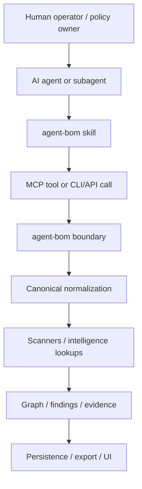
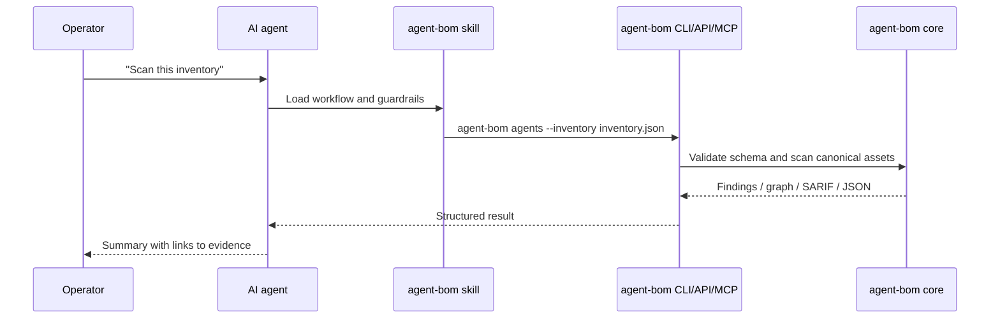
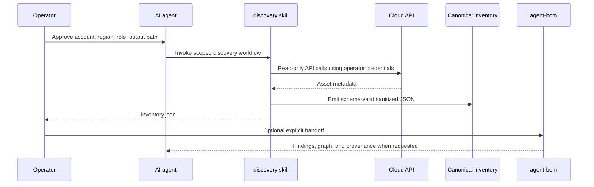
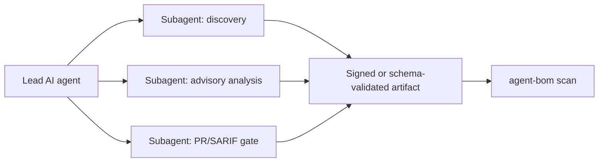
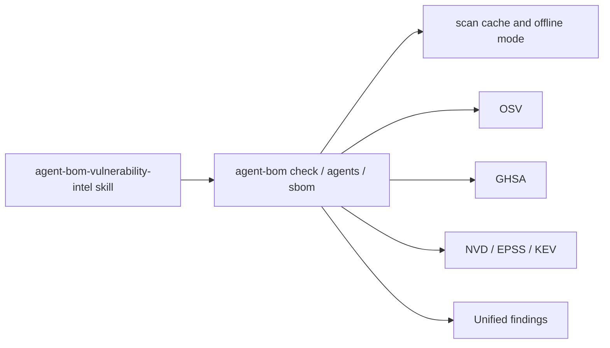

# Agentic Skills Architecture

`agent-bom` can be used as a CLI, API, UI, MCP server, and skill library. The
agentic surfaces are invocation layers over the same product contracts; they do
not create a second scanner or a second data model.

The design goal is simple: let teams ask an AI agent to perform security work
while keeping collection, normalization, scanning, persistence, and export
inside the same audited `agent-bom` boundaries.

Skills are standalone workflow surfaces, not hidden ingestion. A discovery
skill may stop after producing canonical inventory JSON. Data enters an
`agent-bom` scan, API, or control plane only when the operator explicitly
chooses a handoff mode.

## Layer Model

Each layer has a narrow responsibility.

| Layer | Responsibility | Must not do |
|------|----------------|-------------|
| Human operator | Approves scope, credentials, output location, and action mode | Delegate unbounded cloud or filesystem access |
| AI agent or subagent | Plans and invokes approved skills/tools | Treat prose as evidence or bypass schema validation |
| Skill | Encodes the repeatable workflow and guardrails | Reimplement scanners, normalize ad hoc JSON, or store secrets |
| MCP/CLI/API | Calls the supported product interface | Call internal modules as a private side channel |
| agent-bom boundary | Auth, RBAC, redaction, tenant scope, policy, audit | Trust tenant or credential values from payloads |
| Normalization | Converts raw/pushed evidence to canonical models | Preserve raw upstream secret values |
| Scanners | CVE, MCP intelligence, policy, graph, runtime analysis | Send source code, credentials, or private configs to advisory APIs |
| Findings/export | SARIF, JSON, graph, UI, SIEM, compliance evidence | Display raw tokens, URL credentials, or launch secrets |

## Supported Skill Families

Skills should map to product capabilities, not to one-off scripts.

| Skill family | Examples | Primary data boundary |
|--------------|----------|-----------------------|
| Discovery skills | AWS, Azure, GCP, Kubernetes, MCP fleet | Operator environment to canonical inventory |
| Vulnerability intelligence skills | OSV/GHSA/NVD/EPSS/KEV package assessment | Package identifiers to advisory sources |
| PR gate skills | SARIF generation, GitHub code scanning, severity gates | Repo checkout to SARIF/findings |
| Offline skills | Air-gapped SBOM, local inventory, cached advisories | No outbound network |
| Runtime skills | MCP proxy/gateway audit review, policy dry run | Runtime events to redacted findings |

## Data Flow Patterns

### Skill Modes

| Mode | Default? | What happens |
|------|----------|--------------|
| `explain-only` | Optional | Describe required permissions, network destinations, and data boundaries before doing work |
| `discover-only` | Yes for discovery skills | Emit canonical inventory or another schema-valid artifact and stop |
| `scan-local` | Operator-selected | Hand an artifact to the local CLI for findings, graph, policy, and exports |
| `push-ingest` | Operator-selected | Send an authenticated, sanitized payload to a configured agent-bom API endpoint |
| `export` | Operator-selected | Write JSON, SARIF, SBOM, or evidence to an operator-selected path |

No skill should default to pushing data into a control plane or scanning broad
local/cloud scope. The operator chooses the mode at invocation time.

### Direct Product Invocation

Use this for existing inventories, SBOMs, PR gates, and offline scans.

### Skill-Mediated Discovery

Use this when a team wants the AI agent to collect data without giving
`agent-bom` long-lived cloud credentials.

### Subagent Delegation

Subagents may parallelize work, but each subagent must produce a bounded
artifact: inventory JSON, SBOM, SARIF, policy file, or a read-only report. The
lead agent should not treat a subagent narrative as evidence.

## GHSA / OSV Skill Design

GHSA and OSV should be exposed through an advisory-intelligence skill, not
through separate advisory clients inside skills.

Allowed outbound payload:

- package name
- package version
- ecosystem or purl
- CVE, GHSA, or advisory identifier

Disallowed outbound payload:

- source code
- raw config files
- raw findings containing tenant data
- credential values
- launch arguments with token-like values
- private URLs with embedded credentials

The skill should choose one of three modes:

| Mode | Network | Use case |
|------|---------|----------|
| Online advisory lookup | OSV/GHSA/NVD/EPSS/KEV as configured | Normal package and SBOM assessment |
| Offline cached lookup | None | Air-gapped or regulated environments |
| PR gate | GitHub APIs only when configured by CI | SARIF and branch protection workflows |

## Guardrails for Every Skill

Every bundled `agent-bom` skill should declare:

- purpose and supported product surface
- required tools and optional tools
- required credentials, if any
- exact outbound network destinations
- file reads and file writes
- whether telemetry is used
- whether persistence is used
- whether the skill can mutate external systems
- autonomous invocation policy
- expected output artifact and schema

Every skill should follow these rules:

1. Prefer existing `agent-bom` CLI/API/MCP commands over internal imports.
2. Prefer read-only or pushed-ingest workflows.
3. Use short-lived credentials when credentials are needed.
4. Never ask users to paste raw cloud keys or tokens into chat.
5. Never print raw credential values.
6. Do not mutate cloud, repo, or endpoint resources unless the skill is
   explicitly an approved remediation skill.
7. Validate inventory, SBOM, SARIF, or policy artifacts before scanning.
8. Preserve `discovery_provenance`, `permissions_used`, and redaction status.
9. Keep raw AI prose outside compliance evidence.
10. Route final evidence through `agent-bom` outputs, not handcrafted summaries.

## Product Surfaces

The same workflows should be invocable through multiple surfaces:

| Surface | Role |
|---------|------|
| CLI | Local-first, CI, and operator-run workflows |
| API | Authenticated control-plane workflows |
| UI | Review, filtering, graph, findings, and operator control |
| MCP server | Agent-invoked tools with the same policy boundary |
| Skills | Reusable workflow instructions and guardrails |

This keeps the agentic surface scalable: each new skill composes existing
product contracts instead of adding a new persistence or scanner path.
