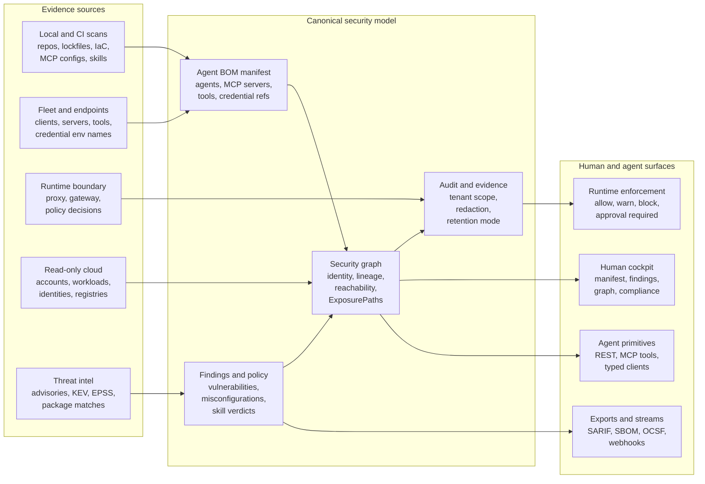

# AI Governance Control Plane

`agent-bom` treats AI governance as a security evidence problem: discover the
agents, MCP servers, tools, credentials, packages, cloud surfaces, and runtime
events; normalize them into one model; then expose that model through CLI, API,
UI, MCP, exports, and runtime controls.

The goal is not a generic AI gateway. The product wedge is security graph plus
runtime evidence plus agent/tool identity.

## Control-plane map

## Operator questions

| Question | Primary surface | Evidence expected |
|---|---|---|
| What AI agents and MCP surfaces exist? | Agent BOM manifest and dashboard | agents, MCP servers, tools, credential references, owners where known, last seen |
| What can those agents reach? | Security graph and ExposurePath APIs | reachable packages, credentials, resources, vulnerabilities, and identity edges |
| What happened at runtime? | Proxy/gateway audit and production index | authorized, blocked, data-filtered, and approval-required events without raw secrets |
| What changed? | Inventory, graph, and evidence views | first seen, last seen, source, scan id, run id, and retention mode |
| What should block a deploy? | REST/MCP deploy decision and CI gates | thresholds, matched paths, reasons, and signed or auditable evidence where configured |

## Current product contract

- **Inventory first**: local scans, CI, fleet sync, and endpoint discovery can
  build useful Agent BOM evidence before runtime enforcement is deployed.
- **Runtime deepens evidence**: proxy and gateway paths add live policy
  decisions, production-index summaries, and audit events for environments that
  choose enforcement.
- **One graph**: findings, runtime evidence, identities, packages, MCP servers,
  tools, and credential references should project into the same graph model.
- **Tenant-scoped control plane**: API and UI surfaces are expected to honor
  tenant scope, auth boundaries, and redaction semantics.
- **Customer-controlled deployment**: the shipped repository supports
  self-hosted operation; managed service and additional streaming adapters are
  roadmap lanes unless their code and tests are present.

## Visual language for product work

Future UI and docs work should use the same five-stage frame:

1. **AI visibility**: expose agents, servers, tools, models, datasets, and
   endpoint evidence.
2. **Design control**: compare observed behavior to approved manifests,
   policies, and role/profile expectations.
3. **Agentic identity**: connect humans, agents, tools, credentials, and
   resources with accountable graph edges.
4. **Runtime governance**: record allow/warn/block/approval decisions and
   surface drift.
5. **Accountability**: retain signed or auditable evidence for compliance,
   incident response, and buyer proof.

This frame should guide future cockpit, graph, and report work without
replacing the shipped evidence model.

## Related docs

- [How agent-bom Works](how-agent-bom-works.md)
- [Unified Platform Control Plane](unified-platform-control-plane.md)
- [Security Graph Model](security-graph-model.md)
- [Data Ingestion and Security](data-ingestion-and-security.md)
- [Runtime Proxy](../features/runtime-proxy.md)
