# Data Ingestion and Security

This page explains how data gets into `agent-bom`, how it is normalized and used, and which security boundaries apply to each path.

The product should support four honest intake modes:

1. `Direct scan`
2. `Read-only integration`
3. `Pushed ingest`
4. `Imported artifact`

Those are not the same thing, and the security model is different for each.

## The four intake modes

| Mode | What agent-bom does | Typical examples | Security posture |
|------|----------------------|------------------|------------------|
| `Direct scan` | Reads local or directly reachable targets itself | MCP config discovery, project scans, image scans, IaC scans, some cloud discovery | Read-only scanner behavior |
| `Read-only integration` | Connects to an existing system that already contains the data | Snowflake governance, connector-backed discovery, cloud account inventory | Read-only connected source |
| `Pushed ingest` | Accepts evidence pushed by the customer or collector | OTLP traces, runtime events, fleet sync, security-lake feeds | Inbound ingest with API/auth boundaries |
| `Imported artifact` | Parses customer-exported files without owning collection | SBOMs, inventories, JSON findings, offline exports | File import only |

## End-to-end flow

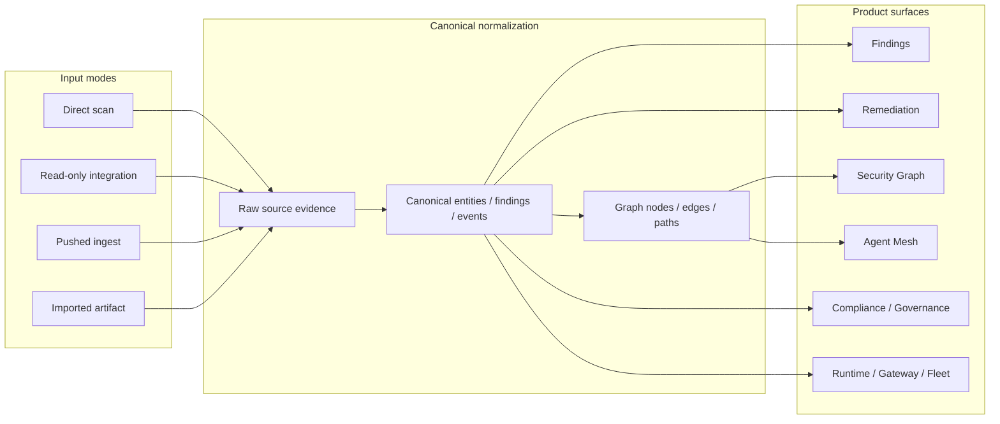

## Deployment and ingestion options

Different deployment models expose different intake paths. The point is not to force one collection model everywhere. The point is to let teams choose the path that matches how they already operate.

| Deployment model | Typical operator | Intake modes used most | What it is best for |
|---|---|---|---|
| `CLI on laptop or CI` | developer, AppSec, platform team | `Direct scan`, `Imported artifact` | repo scans, image scans, IaC scans, offline review, PR gates |
| `Central API + UI` | security team, platform engineering | `Direct scan`, `Pushed ingest`, `Imported artifact` | centralized fleet view, findings, remediation, graph, compliance |
| `API + ClickHouse analytics` | larger central security team | `Pushed ingest`, `Direct scan` | runtime event trends, posture history, analytics-heavy views |
| `Snowflake governance mode` | governance, data platform, enterprise security | `Read-only integration`, `Pushed ingest` | warehouse-backed governance, activity, account-level review |
| `Endpoint or MDM fleet` | IT, endpoint engineering, security operations | `Direct scan`, then `Pushed ingest` | local discovery with central aggregation |
| `Air-gapped or export-driven` | regulated environments | `Imported artifact`, `Direct scan` | SBOM review, offline inventory analysis, controlled evidence import |

## How to choose the intake path

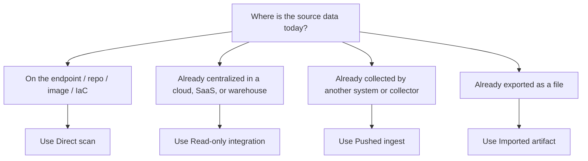

Use these rules:

- if `agent-bom` can safely gather the data itself, prefer `Direct scan`
- if the customer already has the data in a source of truth, prefer `Read-only integration`
- if another collector or platform already emits the evidence, prefer `Pushed ingest`
- if approval or network constraints dominate, prefer `Imported artifact`

## Direct scan

Direct scan is the most local-first mode. `agent-bom` reads the target itself and derives inventory, findings, and graph context.

Typical sources:

- MCP client config discovery
- project and lockfile scans
- container image scans
- Kubernetes manifests
- Terraform, Helm, CloudFormation, Dockerfile IaC
- selected agentless cloud inventory reads

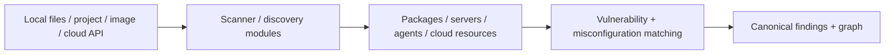

Security boundaries:

- scanner mode is read-only
- no source code or credential values are sent to third parties
- outbound lookups are limited to explicit enrichment sources unless offline mode is used
- cloud discovery remains read-only and should never mutate the provider

Relevant docs:

- [Scanning & Discovery](../features/scanning.md)
- [Cloud Normalization](../features/cloud-normalization.md)
- [Permissions](https://github.com/msaad00/agent-bom/blob/main/docs/PERMISSIONS.md)

## Read-only integration

Read-only integration is for systems that already hold the relevant evidence. `agent-bom` connects to them instead of rebuilding their collection path.

Typical sources:

- Snowflake governance data
- warehouse-backed security or activity data
- connector-backed enterprise sources
- cloud account inventory where the customer grants read-only access

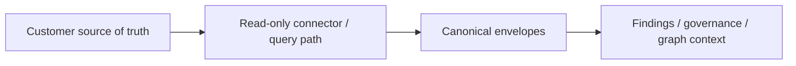

Security boundaries:

- customer-owned source systems remain authoritative
- `agent-bom` should prefer read-only access
- no write-back to the upstream platform unless the feature explicitly says otherwise
- warehouse or lake integrations should be treated as connected sources, not hidden scan jobs

Relevant docs:

- [Backend Parity](../deployment/backend-parity.md)
- [Enterprise Deployment](https://github.com/msaad00/agent-bom/blob/main/docs/ENTERPRISE_DEPLOYMENT.md)

## Pushed ingest

Pushed ingest is for evidence that is already collected elsewhere and sent into `agent-bom`.

Typical sources:

- OTLP traces to `POST /v1/traces`
- runtime events
- fleet sync submissions
- analytics or security-lake event batches

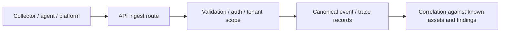

Security boundaries:

- this is not local scanner mode; it is an API ingestion surface
- API auth, RBAC, rate limits, request size limits, and audit logging matter here
- the ingest path should preserve source evidence and timestamps
- analytics backends may store summaries or events, but the canonical model still governs the product view

Relevant docs:

- [Runtime Monitoring](../deployment/runtime-monitoring.md)
- [Security Architecture](https://github.com/msaad00/agent-bom/blob/main/docs/SECURITY_ARCHITECTURE.md)

## Imported artifact

Imported artifact is the simplest enterprise-friendly path when the customer already exports data.

Typical sources:

- CycloneDX or SPDX SBOMs
- inventory JSON
- external scanner results
- offline evidence exports

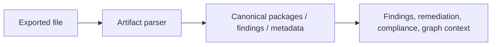

Security boundaries:

- `agent-bom` parses the artifact only; it does not manage the upstream source system
- good fit for air-gapped or approval-heavy environments
- file parsing still needs validation and bounded trust assumptions

Relevant docs:

- [SBOM Generation](../features/sbom.md)
- [Canonical Model vs OCSF](canonical-vs-ocsf.md)

## Real deployment-to-dataflow examples

### 1. Developer or CI path

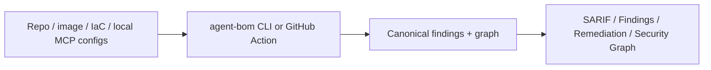

Typical use:

- PR gates
- local triage
- repo and image scanning

### 2. Central control-plane path

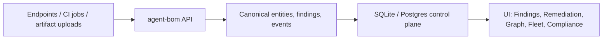

Typical use:

- centralized fleet view
- shared findings and remediation workflow
- operator dashboards

### 3. Analytics path

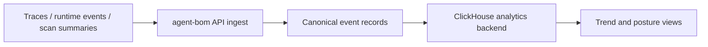

Typical use:

- event trends
- posture history
- analytics-heavy environments

### 4. Warehouse-backed governance path

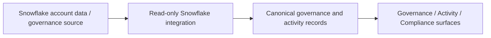

Typical use:

- governance review
- account activity inspection
- warehouse-native enterprise workflows

## Runtime, fleet, gateway, and policy surfaces

Discovery and ingest are only the front door. Once data is in the canonical model, the product exposes different operating surfaces:

| Surface | Primary purpose |
|---------|------------------|
| `Findings` | Evidence-first exploration |
| `Remediation` | Fix-first prioritization |
| `Security Graph` | Path and blast-radius analysis |
| `Agent Mesh` | Agent-centered shared-infrastructure topology |
| `Fleet` | Multi-agent operational inventory |
| `Gateway` / `Proxy` | Runtime tool-call enforcement and audit |
| `Compliance` / `Governance` | Framework and policy views |

This separation is intentional. The intake path should not be confused with the product view layered on top of it.

## Execution, sandboxing, and guardrails

The intake story is only half of the trust model. The other half is whether `agent-bom` is just reading, or actively sitting in the runtime path.

| Mode | Execution model | What it should do |
|------|------------------|-------------------|
| `Scanner mode` | Read-only | discover, parse, enrich, normalize, graph |
| `MCP server mode` | Read-only exposed tool surface | answer scan/governance requests without launching third-party MCP servers |
| `Proxy mode` | Live execution and enforcement surface | launch or connect to the target MCP server, inspect traffic, block, audit, and enforce policy |

Guardrails that apply on the runtime path:

- gateway policy evaluation
- undeclared tool blocking
- credential and PII leak detection
- replay detection
- rate limiting
- HMAC-signed audit trail
- runtime alert correlation into the product view

That is why the documentation needs to distinguish:

- `how data gets in`
- `who collects it`
- `whether agent-bom is only reading or actively enforcing`

## How data is secured

The main security rules are:

- preserve raw source evidence only as needed for audit and debugging
- normalize into canonical `agent-bom` entities, findings, and events
- do not store credential values
- keep direct discovery read-only
- treat pushed ingest as an authenticated API boundary
- treat connected sources as explicit read-only integrations
- only project to OCSF when interoperability requires it

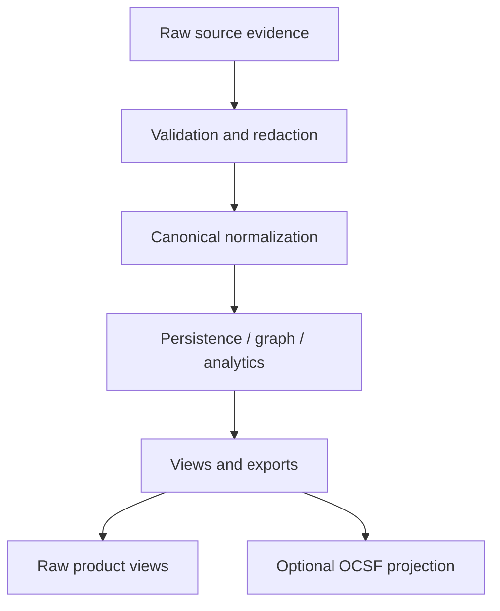

## What leaves the machine and what does not

The short version:

- local scanning and config discovery stay local-first
- offline mode can avoid external enrichment calls entirely
- direct cloud discovery uses explicit read-only provider access
- pushed ingest sends data into `agent-bom`, not from `agent-bom` to arbitrary third parties
- optional exports and SIEM integrations are explicit, not hidden defaults

For the detailed trust model:

- [Security Architecture](https://github.com/msaad00/agent-bom/blob/main/docs/SECURITY_ARCHITECTURE.md)
- [Permissions](https://github.com/msaad00/agent-bom/blob/main/docs/PERMISSIONS.md)
- [SIEM Integration](../deployment/siem-integration.md)

## Current product stance

The product should be described honestly:

- `New Scan` is for direct scan jobs
- `Data Sources` is the map of direct scans, connected sources, pushed ingest, and imported artifacts
- `Findings`, `Remediation`, `Security Graph`, `Mesh`, `Fleet`, `Gateway`, and `Compliance` are operating surfaces after the data is in the system

That keeps the architecture:

- accurate
- interoperable
- scalable
- not marketing ahead of the actual data model
