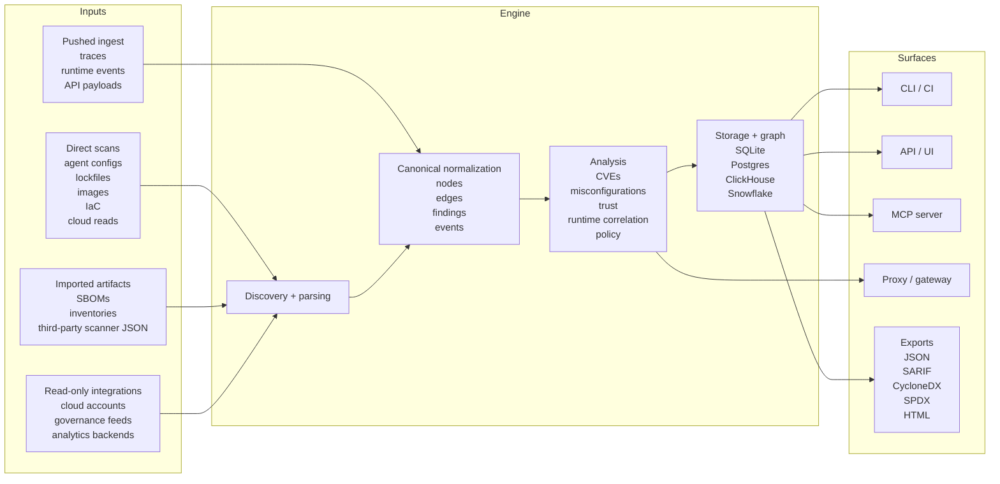

# How Agent-BOM Works

`agent-bom` discovers security-relevant AI infrastructure data, normalizes it
into one canonical model, then exposes it through the right operator surfaces.

This is the shortest accurate explanation of the product.

## End-to-end flow

## What comes in

`agent-bom` supports four intake modes.

| Intake mode | What it means | Typical inputs | Best when |
|---|---|---|---|
| Direct scan | `agent-bom` reads the target itself | agent configs, projects, lockfiles, images, IaC, read-only cloud APIs | you want local or CI-native discovery |
| Imported artifact | you hand `agent-bom` an exported file | CycloneDX, SPDX, third-party scanner JSON, inventories | collection already happens elsewhere |
| Pushed ingest | another system sends evidence in | traces, runtime events, audit payloads | runtime telemetry already exists |
| Read-only integration | `agent-bom` connects to an existing source | cloud accounts, governance systems, analytics backends | you want central review without modifying the source |

## What the engine does

The core flow stays the same regardless of how the data arrived.

1. Discovery and parsing
- local config discovery
- manifest and lockfile parsing
- SBOM and external scanner ingest
- cloud and infrastructure inventory reads

2. Canonical normalization
- assets become nodes
- relationships become edges
- package, IaC, runtime, and governance findings stay in one model
- OCSF remains an optional projection, not the source of truth

3. Analysis
- CVE and advisory enrichment
- misconfiguration and benchmark checks
- blast radius and attack-path building
- runtime correlation
- trust, drift, and policy evaluation

4. Storage and graph
- local and control-plane state in SQLite or Postgres
- analytics and event-scale paths in ClickHouse
- warehouse-native and governance paths in Snowflake

## What comes out

The same normalized model powers multiple purpose-built views.

| Surface | Primary job |
|---|---|
| Findings | evidence-first review |
| Remediation | fix-first queue |
| Security Graph | path and blast-radius context |
| Agent Mesh | agent-centered shared infrastructure view |
| Compliance | framework and evidence mapping |
| Governance / Activity / Traces | operational review surfaces |

## Supported surfaces

### Assets and evidence

- AI agent configs
- MCP servers and tools
- packages and lockfiles
- container images
- IaC: Terraform, Kubernetes, Helm, CloudFormation, Dockerfile
- cloud AI and infrastructure surfaces
- skills and instruction files
- model files and provenance
- runtime traces and correlated events
- SBOMs and external scanner exports

### Clouds and platforms

- AWS
- Azure
- GCP
- Databricks
- Snowflake
- additional AI/model ecosystem discovery surfaces where supported

### Formats

- JSON
- HTML
- SARIF
- CycloneDX
- SPDX
- Prometheus
- Mermaid and graph exports
- optional OCSF projection at the SIEM boundary

## Deployment models

| Deployment model | How it is used | Typical backend |
|---|---|---|
| Local CLI | developer audit, CI gate, one-off review | filesystem + optional SQLite |
| API + UI | central review, remediation, governance, fleet visibility | SQLite or Postgres, optional ClickHouse |
| MCP server | expose scanning and governance tools to MCP-capable clients | same backend as API or local install |
| Proxy / gateway | inspect and enforce runtime MCP traffic | runtime policy + audit path |
| Analytics / warehouse | central event and trend analysis | ClickHouse or Snowflake |

## How the packaged app gets the data

The packaged product is not “just the Node.js app.” The UI is a client of the
control plane. The actual collection paths are the API, scan jobs, proxy,
gateway, and connected sources behind it.

That means `agent-bom` does not require a local CLI for every use case:

- the UI can trigger API-backed scan jobs for repos, images, IaC, and cloud reads
- scheduled workers and CronJobs can collect data inside the customer EKS cluster
- CI pipelines can push results in without an interactive local install
- fleet sync, traces, and proxy or gateway audit routes can push runtime evidence into the control plane
- read-only integrations can pull from cloud accounts, warehouses, and governance systems with customer-managed credentials
- imported artifacts let customers upload SBOMs, inventories, or third-party scanner output when collection already happens elsewhere

So the honest model is:

- `UI` = review, remediation, graph, compliance, and job trigger surface
- `API + workers` = scan orchestration, normalization, and persistence
- `proxy + gateway` = runtime MCP inspection, policy, and audit
- `connected sources + imports` = non-CLI intake paths for enterprise deployments

What still needs a local wrapper, CLI, or proxy is anything that lives only on a
developer machine or inside a local stdio MCP session. Everything else can be
collected through the control plane, scheduled jobs, pushed ingest, or
read-only integrations.

## Hosted product architecture

For a secure, scalable hosted deployment, the product boundary should stay
clean:

- `UI` = operator workflow only: configure sources, trigger jobs, review status, and work findings
- `API / control plane` = auth, tenant scope, orchestration, graph, persistence, audit, and policy decisions
- `workers / connectors` = execute scan jobs and read from customer-approved cloud APIs or connected systems
- `proxy / gateway` = inspect and govern live MCP or runtime traffic

That leads to one implementation rule:

- never make the Node.js UI the collector
- make every supported intake path reachable through API-triggered jobs, connectors, imports, or proxy and gateway flows

In practice, that means:

- cloud inventory and posture data should come from read-only cloud APIs through backend jobs or connectors
- repo, image, and IaC scans should run as worker jobs triggered through the API
- runtime evidence should arrive through proxy, gateway, traces, fleet sync, or other authenticated ingest routes
- the UI should manage and observe those flows, not replace them

This is the same control-plane pattern used by modern hosted security products:
the web app is the operator surface, while the backend and collection paths do
the work.

## Security and trust boundaries

Mode matters.

| Mode | Execution posture |
|---|---|
| Scanner mode | read-only discovery and analysis |
| MCP server mode | read-only tool surface |
| Proxy mode | live execution and enforcement boundary |

Guardrails include:

- policy and gateway enforcement
- undeclared tool blocking
- secret and credential redaction
- audit and HMAC integrity chain
- replay and rate-limit controls
- signed releases, provenance, and published self-SBOMs

## Short answer for coworkers

If someone asks “how does it get the data?”, the answer is:

`agent-bom` either scans the target directly, reads from a connected source,
accepts pushed telemetry, or ingests exported artifacts. All of those paths are
normalized into one canonical graph and findings model, then exposed through
CLI, API/UI, MCP, proxy, and export surfaces.

## Related docs

- [Architecture Overview](overview.md)
- [Self-Hosted Product Architecture](self-hosted-product-architecture.md)
- [Hosted Product Control-Plane Spec](hosted-product-spec.md)
- [Data Ingestion and Security](data-ingestion-and-security.md)
- [Canonical Model vs OCSF](canonical-vs-ocsf.md)
- [Backend Parity](../deployment/backend-parity.md)
- [Security Policy](../security.md)
