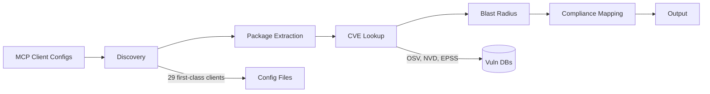

# Architecture Overview

For detailed architecture diagrams and module breakdown, see the [full architecture doc](https://github.com/msaad00/agent-bom/blob/main/docs/ARCHITECTURE.md).

For the data-model contract between native `agent-bom` objects and optional OCSF projection, see [Canonical Model vs OCSF](canonical-vs-ocsf.md).

For the end-to-end intake story across direct scans, read-only integrations, pushed ingest, and imported artifacts, see [Data Ingestion and Security](data-ingestion-and-security.md).

For the shortest operator-facing explanation of inputs, engine, outputs, deployment models, and product surfaces, see [How Agent-BOM Works](how-agent-bom-works.md).

For the next-phase hosted product plan that maps UI actions to control-plane
entities, routes, and rollout order, see [Hosted Product Control-Plane Spec](hosted-product-spec.md).

For the browser-to-API trust boundary and the current auth/session model, see
[UI, API, Auth, and Session Model](auth-and-session-model.md).

## Scanning pipeline

`agent-bom` is best read as an open security scanner and graph for AI supply chain and infrastructure: one model spanning agents, MCP, packages, cloud, GPU, runtime, and operator-owned control planes.

## Key modules

| Module | Path | Purpose |
|--------|------|---------|
| Discovery | `src/agent_bom/discovery/` | MCP client config parsing |
| Enrichment | `src/agent_bom/enrichment.py` | CVE lookup (OSV, NVD, EPSS, KEV) |
| Blast Radius | `src/agent_bom/blast_radius.py` | Impact chain mapping |
| Context Graph | `src/agent_bom/context_graph.py` | Lateral movement analysis |
| Registry | `src/agent_bom/registry.py` | 427+ server security metadata |
| Compliance | `src/agent_bom/compliance/` | 15 framework mappings plus AISVS benchmark evidence |
| Asset Tracker | `src/agent_bom/asset_tracker.py` | Persistent vuln tracking — first_seen, resolved, MTTR |
| Proxy | `src/agent_bom/proxy.py` | Runtime MCP interception |
| Protection | `src/agent_bom/runtime/` | 7-detector anomaly engine |
| Enforcement | `src/agent_bom/enforcement.py` | Tool poisoning detection |
| Security | `src/agent_bom/security.py` | Path validation, credential redaction |
| MCP Server | `src/agent_bom/mcp_server.py` | 36-tool FastMCP server |
| API | `src/agent_bom/api/` | REST API (FastAPI) |
| Output | `src/agent_bom/output/` | JSON, SARIF, CycloneDX, SPDX, OCSF, HTML, Prometheus, Mermaid, SVG |

## Security boundaries

- All scanning is local-first; outbound calls are limited to explicitly enabled enrichment, cloud/read-only discovery, push/export, or operator-configured integrations
- Config file env var values are always redacted before output
- Path validation restricts file access to user home directory
- No telemetry, no analytics, no tracking
