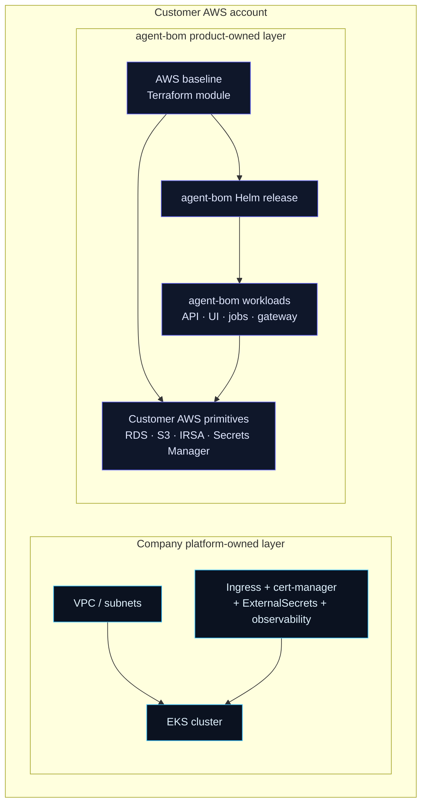
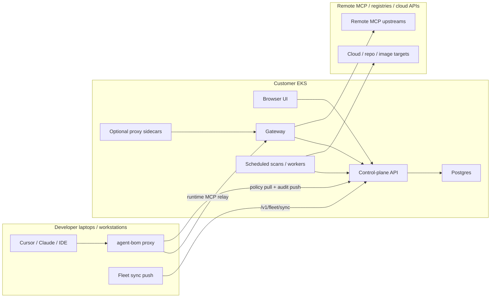

# AWS Company Rollout

Use this guide when the question is not just "how do I install `agent-bom`?" but
"how would a company deploy `agent-bom` in AWS/EKS for fleet, gateway, proxy, and
control-plane workflows?"

This is a **reference rollout path** for self-hosted `agent-bom` on AWS:

- the company platform team still owns the AWS account, VPC, EKS cluster, ingress, cert-manager, and shared controllers
- `agent-bom` owns the product-specific baseline around that platform: Postgres, IRSA, backup bucket, auth secrets, Helm release, fleet onboarding, gateway rollout, and proxy deployment patterns

For the concrete runtime gateway discovery path after fleet and cluster scans
have populated remote MCPs, see [Gateway Auto-Discovery From the Control
Plane](gateway-auto-discovery.md).

> **You do not need to read this unless** you are documenting an
> opinionated AWS / EKS rollout for a platform team — covering Postgres,
> IRSA, backup bucket, auth secrets, Helm release, fleet onboarding, and
> gateway / proxy patterns under one ownership story.
>
> If you still need to pick a path, start with [Deployment
> Overview](overview.md) and use [Deploy In Your Own AWS /
> EKS](own-infra-eks.md) for the paved production rollout.

The two-image product split (`agentbom/agent-bom` plus
`agentbom/agent-bom-ui`) and the runtime-surface defaults are documented in
[Deployment Overview](overview.md#product-surfaces). This page is the deeper
AWS-specific reference once that decision is already made.

## Reference Entry Points

Pilot on one workstation:

```bash
curl -fsSL https://raw.githubusercontent.com/msaad00/agent-bom/main/deploy/docker-compose.pilot.yml -o docker-compose.pilot.yml
docker compose -f docker-compose.pilot.yml up -d
```

Reference full self-hosted AWS / EKS rollout:

```bash
export AWS_REGION="<your-aws-region>"
scripts/deploy/install-eks-reference.sh \
  --create-cluster \
  --cluster-name corp-ai \
  --region "$AWS_REGION" \
  --hostname agent-bom.internal.example.com \
  --enable-gateway
```

If the company already has an EKS platform, reuse it with the same installer:

```bash
export AWS_REGION="<your-aws-region>"
scripts/deploy/install-eks-reference.sh \
  --cluster-name corp-ai \
  --region "$AWS_REGION" \
  --hostname agent-bom.internal.example.com \
  --enable-gateway
```

If you want browser operators behind corporate SSO on day 1, add OIDC at install
time:

```bash
export AWS_REGION="<your-aws-region>"
scripts/deploy/install-eks-reference.sh \
  --cluster-name corp-ai \
  --region "$AWS_REGION" \
  --hostname agent-bom.internal.example.com \
  --oidc-issuer https://idp.example.com \
  --oidc-audience agent-bom
```

## What The Installer Owns

The reference installer at `scripts/deploy/install-eks-reference.sh` is intentionally opinionated:

1. Optionally creates a reference EKS cluster with `eksctl`
2. Applies the `agent-bom` AWS baseline Terraform module
3. Creates the product secrets needed by the Helm release
4. Installs the packaged Helm chart with production profile defaults
5. Prints next-step commands for fleet onboarding, gateway rollout, and post-deploy verification

It does **not** try to replace a customer's full AWS platform stack. Keep these as platform-owned:

- corporate VPC topology and networking policy
- DNS and ingress controller strategy
- cert-manager and certificate issuance
- shared logging, SIEM, and OTLP collectors
- ExternalSecrets controller or other shared secret operators
- organization-wide IAM, SCP, and account guardrails

## Deployment Shape



This is the clean ownership model:

- **platform team** provides a compliant EKS landing zone
- **`agent-bom` installer** wires the product-specific AWS and Kubernetes pieces on top
- **security/platform operators** onboard endpoints and selected MCP runtimes after the control plane is live

## Product Surfaces In A Company EKS Rollout

The five product surfaces an enterprise AWS rollout cares about (control
plane, scan and discovery, fleet, gateway, proxy) are described in
[Deployment Overview — Product Surfaces](overview.md#product-surfaces) and
the "When to use" decision lives in
[Proxy vs Gateway vs Fleet](proxy-vs-gateway-vs-fleet.md). In a real EKS
rollout `gateway` and `proxy` are deployed selectively by workload and
traffic path, not to every process on day 1.

## Runtime Flow For Fleet, Proxy, And Gateway



What this means in practice:

- developer endpoints can push fleet inventory and use `agent-bom proxy` as a local MCP wrapper
- selected MCP workloads in-cluster can run with `agent-bom proxy` sidecars
- the gateway centralizes policy/audit for shared remote upstreams
- the control plane persists findings, graph, fleet state, auth, and audit inside the customer's infrastructure

## Scenario Matrix

| Company need | Deploy | What becomes visible immediately |
|---|---|---|
| Know which MCPs employees are running | control plane + scans + fleet | endpoints, agents, MCP servers, transports, command or URL, declared tools, auth mode, credential-backed env vars |
| Review risky MCP package exposure | control plane + scans + fleet | package context, vuln context, graph links, blast radius, exposed tools and credentials |
| Govern shared remote MCP traffic | control plane + gateway | shared upstream MCP inventory, gateway policy/audit, remote MCP control plane surfaces |
| Enforce inline on selected workloads | control plane + selected proxy deployment | workload-local runtime evidence, inline blocks, local audit push, selected sidecar/laptop inspection |
| Run the full self-hosted platform | control plane + scans + fleet + selected gateway + selected proxy | one correlated operator plane across discovery, inventory, runtime, graph, findings, and audit |

## Recommended Rollout Sequence

### 1. Company platform baseline

Start with one of these shapes:

- existing EKS platform: preferred for real companies
- reference EKS cluster from the installer: good for evaluation, pilot, and demos

Before installing `agent-bom`, confirm:

- `kubectl` access to the target cluster
- ingress controller strategy is known
- DNS / hostname decision is known, or accept port-forward for first bring-up
- AWS account permissions can create RDS, S3, IAM roles, and Secrets Manager entries

### 2. Product-specific AWS baseline

Run the reference installer or the Terraform module directly:

```bash
export AWS_REGION="<your-aws-region>"
scripts/deploy/install-eks-reference.sh \
  --cluster-name corp-ai \
  --region "$AWS_REGION" \
  --hostname agent-bom.internal.example.com \
  --enable-gateway
```

The installer now does two important safety checks before it mutates anything:

- verifies the minimum supported `aws`, `kubectl`, `helm`, `eksctl`, and `terraform`/`tofu` versions
- rejects OIDC installs without a stable `--hostname` same-origin entrypoint

Under the hood this uses the baseline in `deploy/terraform/aws/baseline` to create:

- RDS Postgres for the control plane
- S3 backup bucket
- IRSA roles for scan and backup jobs
- Secrets Manager containers for DB/auth wiring

### 3. Helm release on EKS

The installer then applies the production Helm profile plus generated overrides:

- UI and API/runtime images behind one same-origin entrypoint
- scheduled jobs and workers
- optional gateway
- auth and DB secrets wired from generated values

For manual control, use the packaged chart directly:

```bash
helm upgrade --install agent-bom deploy/helm/agent-bom \
  --namespace agent-bom --create-namespace \
  -f deploy/helm/agent-bom/examples/eks-production-values.yaml
```

See also:

- [Your Own AWS / EKS](own-infra-eks.md)
- [Terraform AWS Baseline](terraform-aws-baseline.md)

## Post-Deploy Verification

After install, run the reference verification script before onboarding employees
or shared upstream MCPs:

```bash
export AWS_REGION="<your-aws-region>"
scripts/deploy/verify-eks-reference.sh \
  --cluster-name corp-ai \
  --region "$AWS_REGION" \
  --namespace agent-bom \
  --release agent-bom \
  --base-url https://agent-bom.internal.example.com \
  --api-key "$AGENT_BOM_API_KEY" \
  --check-gateway
```

That check is intentionally narrow and release-focused:

1. refresh kubeconfig for the target cluster
2. confirm the Helm release exists
3. wait for API and UI rollouts
4. optionally verify the gateway rollout
5. hit `/healthz`
6. confirm the UI root is reachable
7. verify `/v1/auth/debug` with the operator API key when provided
- [Packaged API + UI Control Plane](control-plane-helm.md)

### 4. Endpoint and runtime onboarding

After the control plane is live, onboard people and workloads, not just pods:

- use `agent-bom proxy-bootstrap` to generate endpoint onboarding bundles
- package the generated bundle into `.pkg` / `.msi` artifacts when IT needs
  managed rollout instead of ad hoc shell execution
- point MCP clients at the local `agent-bom proxy` wrapper
- enable fleet sync for workstation visibility
- add proxy sidecars only to workloads that need inline MCP policy enforcement
- enable the gateway when you need shared upstream policy and audit

Typical endpoint bootstrap:

```bash
agent-bom proxy-bootstrap \
  --bundle-dir ./agent-bom-endpoint-bundle \
  --control-plane-url https://agent-bom.internal.example.com \
  --control-plane-token <api-key> \
  --push-url https://agent-bom.internal.example.com/v1/fleet/sync \
  --push-api-key <api-key>
```

For packaged endpoint rollout, reuse that same generated bundle:

```bash
bash scripts/build-pkg.sh \
  --bundle-dir ./agent-bom-endpoint-bundle \
  --output ./dist/agent-bom-endpoint.pkg \
  --dry-run
```

```powershell
./scripts/build-msi.ps1 `
  -BundleDir .\agent-bom-endpoint-bundle `
  -OutputPath .\dist\agent-bom-endpoint.msi `
  -DryRun
```

The bundle also ships Jamf, Kandji, and Intune wrapper scripts plus a
Homebrew formula renderer for organizations that distribute `agent-bom`
through a managed tap instead of direct package upload.

```bash
python3 scripts/render_homebrew_formula.py \
  --version 0.86.0 \
  --url https://github.com/msaad00/agent-bom/archive/refs/tags/v0.86.0.tar.gz \
  --sha256 <release-sha256>
```

## What Operators Get After Deploy

The goal is not just "pods are running." The goal is one coherent operator plane:

- `/` for findings, graph, remediation, and operator workflows
- `/fleet` for workstation and collector inventory
- `/audit` for signed audit and auth workflows
- `/gateway` and runtime views for policy/audit surfaces when enabled
- one deployment story for pilot and production instead of two unrelated stacks

## Dry-Run And Ownership Notes

The reference installer supports `--dry-run` so teams can see the generated
Terraform root, Helm values, and operator summary before any apply:

```bash
export AWS_REGION="<your-aws-region>"
scripts/deploy/install-eks-reference.sh \
  --cluster-name corp-ai \
  --region "$AWS_REGION" \
  --hostname agent-bom.internal.example.com \
  --enable-gateway \
  --dry-run
```

Use that mode when:

- security wants to review what the installer owns
- platform wants to compare the reference shape to their internal landing zone
- you want to adapt the installer into your own wrappers without changing the product model

## Recommended Positioning

Use this wording consistently:

> `agent-bom` is one self-hosted control plane for AI and MCP supply-chain
> security. In AWS/EKS, the company platform owns the cluster and shared
> controllers; `agent-bom` owns the product-specific baseline, Helm release,
> fleet onboarding, and optional gateway/runtime surfaces.

That keeps the architecture honest and the deployment story simple.
