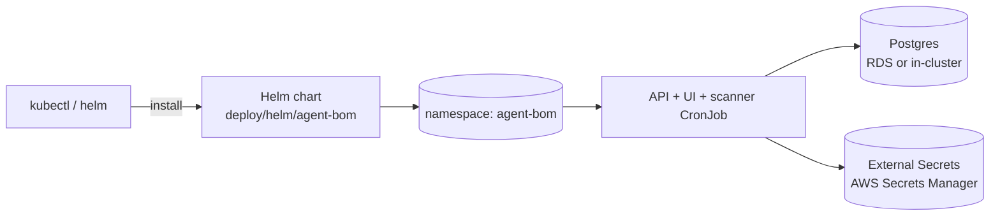
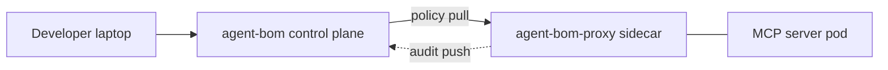

# Focused EKS MCP Pilot

This is the recommended pilot scope for a company that wants to run
`agent-bom` in its own AWS / EKS environment specifically for:

- MCP and agent discovery
- fleet and mesh visibility
- gateway policy management
- selected inline proxy enforcement

This is intentionally narrower than a full platform rollout.

If you also want employee laptops and workstations in the same pilot, pair this
with [Endpoint Fleet](endpoint-fleet.md). That is a separate endpoint scan +
push path, not the sidecar/runtime path described here.

## Pilot scope

Enable:

- Helm-packaged API + UI control plane
- Postgres-backed persistence
- same-origin ingress
- scanner CronJob focused on MCP and agent discovery
- selected workload proxy sidecars

Leave out unless you need them:

- ClickHouse
- Snowflake backend path
- broad cloud CSPM rollout
- full runtime monitor DaemonSet on every node
- every export and output surface

## What to install

Use the packaged control-plane chart with the focused pilot values file:

- [eks-mcp-pilot-values.yaml](https://github.com/msaad00/agent-bom/blob/main/deploy/helm/agent-bom/examples/eks-mcp-pilot-values.yaml)

Install:

```bash
helm install agent-bom deploy/helm/agent-bom \
  -n agent-bom --create-namespace \
  -f deploy/helm/agent-bom/examples/eks-mcp-pilot-values.yaml
```

That pilot profile gives you:

- packaged API + UI control plane
- same-origin ingress
- ingress restricted to the pilot namespace and the ingress controller namespace
- scanner CronJob running cluster-wide discovery
- enterprise-oriented MCP scan args:
  - `--k8s-mcp`
  - `--k8s-all-namespaces`
  - `--introspect`
  - `--enforce`
- monitor DaemonSet left disabled

## Selected inline enforcement

The honest runtime-enforcement path for this pilot is sidecar deployment on the
specific MCP workloads you want to guard.

Use:

- [proxy-sidecar-pilot.yaml](https://github.com/msaad00/agent-bom/blob/main/deploy/k8s/proxy-sidecar-pilot.yaml)

This manifest shows:

- a namespace labeled for Pod Security Admission `restricted`
- a starter proxy policy `ConfigMap`
- a metrics `Service`
- a sample MCP workload with `agent-bom-runtime` sidecar
- control-plane policy pull and proxy audit push
- audit logging, undeclared tool blocking, credential detection, and basic rate limiting

Important boundary:

- `agent-bom proxy` is not a generic shared network gateway service today
- it is a stdio wrapper or local proxy-to-remote-server path
- for EKS, that means selected-workload sidecars are the honest enforcement
  model today

## What the pilot surfaces

This pilot should focus operators on a short list of product surfaces:

- `/fleet`
- `/agents`
- `/mesh`
- `/security-graph`
- `/gateway`
- `/findings`

That gives the team a clean story:

1. discover agents and MCP servers
2. inventory and score them
3. review fleet and graph posture
4. define gateway policies
5. enforce selected runtime traffic through sidecars

## Required platform hardening

Before calling this pilot production-like, apply the namespace labels and run
the control-plane migrations explicitly:

```bash
kubectl label namespace agent-bom \
  pod-security.kubernetes.io/enforce=restricted \
  pod-security.kubernetes.io/audit=restricted \
  pod-security.kubernetes.io/warn=restricted \
  --overwrite

alembic -c deploy/supabase/postgres/alembic.ini upgrade head
```

If the database was already bootstrapped from
[deploy/supabase/postgres/init.sql](https://github.com/msaad00/agent-bom/blob/main/deploy/supabase/postgres/init.sql),
stamp the baseline once before future upgrades:

```bash
alembic -c deploy/supabase/postgres/alembic.ini stamp 20260416_01
```

The focused pilot values also set `networkPolicy.restrictIngress=true` and only
allow ingress from:

- the `agent-bom` namespace
- the `ingress-nginx` namespace

If your ingress controller runs elsewhere, change
[eks-mcp-pilot-values.yaml](https://github.com/msaad00/agent-bom/blob/main/deploy/helm/agent-bom/examples/eks-mcp-pilot-values.yaml)
before install.

## Recommended secrets and auth

At minimum, put these in a Kubernetes Secret referenced by the API Deployment:

- `AGENT_BOM_POSTGRES_URL`
- `AGENT_BOM_API_KEY` or OIDC settings
- `AGENT_BOM_AUDIT_HMAC_KEY` (required for pilot sign-off; do not rely on the ephemeral fallback)

For enterprise pilots, prefer:

- OIDC for user access
- explicit `AGENT_BOM_OIDC_AUDIENCE`
- optional `AGENT_BOM_OIDC_REQUIRED_NONCE` when your IdP flow includes a nonce claim
- persistent audit HMAC keys with `AGENT_BOM_REQUIRE_AUDIT_HMAC=1`
- IRSA on the scanner service account
- internal ingress / VPN-only access

## Pilot Day-1 runbook — verified end-to-end

This section is a literal script you can run in your AWS sandbox. Every
command below either lives in this repo or is a single `kubectl` /
`helm` / `curl`. Nothing hand-waved.

### Stage 1 — Control plane install (5–10 min)



```bash
# 1. Create secrets in AWS Secrets Manager (names match ExternalSecrets in the chart)
aws secretsmanager create-secret --name agent-bom/api-key --secret-string "$(openssl rand -hex 32)"
aws secretsmanager create-secret --name agent-bom/audit-hmac --secret-string "$(openssl rand -hex 32)"
aws secretsmanager create-secret --name agent-bom/postgres-url --secret-string "postgres://…"

# 2. Generate the Ed25519 key pair for compliance evidence signing
openssl genpkey -algorithm ed25519 -out /tmp/evidence-priv.pem
aws secretsmanager create-secret --name agent-bom/evidence-signing \
  --secret-string "$(cat /tmp/evidence-priv.pem)"
rm /tmp/evidence-priv.pem

# 3. Helm install with the focused pilot values
helm install agent-bom deploy/helm/agent-bom \
  -n agent-bom --create-namespace \
  -f deploy/helm/agent-bom/examples/eks-mcp-pilot-values.yaml
```

### Stage 2 — Smoke test (2 min)

Run the pilot verification script from any workstation with a
`kubectl port-forward` open to the API service:

```bash
kubectl -n agent-bom port-forward svc/agent-bom-api 8080:8080 &
./scripts/pilot-verify.sh http://localhost:8080 "$API_KEY"
```

The script exercises the five capabilities the pilot is scoped to and
fails fast with a non-zero exit if any check breaks:

1. `GET /healthz` — control plane alive
2. `GET /v1/auth/debug` — auth resolved as expected
3. `POST /v1/fleet/sync` — endpoint fleet ingest works
4. `POST /v1/scan` — a small demo scan runs end-to-end
5. `GET /v1/compliance/verification-key` — Ed25519 key is exposed
6. `GET /v1/compliance/soc2/report` — bundle comes back signed + evidence non-empty
7. Re-verifies the bundle signature with the public key from step 5

### Stage 3 — MCP proxy sidecar on one workload (10 min)



```bash
kubectl apply -f deploy/k8s/proxy-sidecar-pilot.yaml
kubectl -n agent-bom-workloads rollout status deploy/sample-mcp
```

Verify:

```bash
kubectl -n agent-bom-workloads logs deploy/sample-mcp -c agent-bom-runtime --tail=50
# expect: "policy refresh succeeded"  and an audit heartbeat to the control plane
```

### Stage 4 — Pull auditor-ready evidence (1 min)

```bash
curl -s http://localhost:8080/v1/compliance/verification-key \
  -H "X-Agent-Bom-Role: admin" -H "X-Agent-Bom-Tenant-ID: pilot-acme" \
  | jq -r .public_key_pem > pinned-pub.pem

curl -sD headers.txt -o soc2.json \
  "http://localhost:8080/v1/compliance/soc2/report" \
  -H "X-Agent-Bom-Role: admin" -H "X-Agent-Bom-Tenant-ID: pilot-acme"

python - <<'PY'
import json
from cryptography.hazmat.primitives import serialization
body = json.load(open("soc2.json"))
pub = serialization.load_pem_public_key(open("pinned-pub.pem").read().encode())
sig = [l.split(": ",1)[1].strip() for l in open("headers.txt") if l.lower().startswith("x-agent-bom-compliance-report-signature")][0]
pub.verify(bytes.fromhex(sig), json.dumps(body, sort_keys=True).encode())
print("signature verified against pinned Ed25519 key", body["signature_key_id"])
PY
```

See [docs/COMPLIANCE_SIGNING.md](../../docs/COMPLIANCE_SIGNING.md) for the full verification cookbook.

## Break-glass runbook

| Situation | Action |
|---|---|
| Leaked API key | `curl -X POST /v1/auth/keys/{key_id}/rotate` (rotates in place, zero downtime) |
| Need to block all ingest | `kubectl scale deploy/agent-bom-api -n agent-bom --replicas=0` — the gateway + fleet endpoints stop accepting traffic; scans already queued persist in Postgres |
| Need to retire Ed25519 key | Generate new pair, update `agent-bom/evidence-signing` in Secrets Manager, `kubectl rollout restart deploy/agent-bom-api`. Old bundles remain verifiable against the old public key — keep it in your auditor archive. |
| Postgres corruption | `bash deploy/ops/restore-postgres-backup.sh` — restore is round-tripped nightly in `.github/workflows/backup-restore.yml`. |
| Runtime sidecar misbehaving | `kubectl delete pod -l app=sample-mcp -n agent-bom-workloads` — the sidecar is stateless; control plane re-issues policy on next pull. |
| Need to revoke tenant access | Delete API keys for the tenant; evidence bundle audit trail retains historical access record (`compliance.report_exported`). |

## What this pilot is not

This pilot is not trying to prove every `agent-bom` surface at once.

It is not:

- a Snowflake-native backend evaluation
- a full cloud posture rollout
- a ClickHouse analytics rollout
- a node-wide runtime monitor deployment
- a benchmarked production-scale signoff

Those can come later if the MCP + agents + fleet + proxy story lands.
