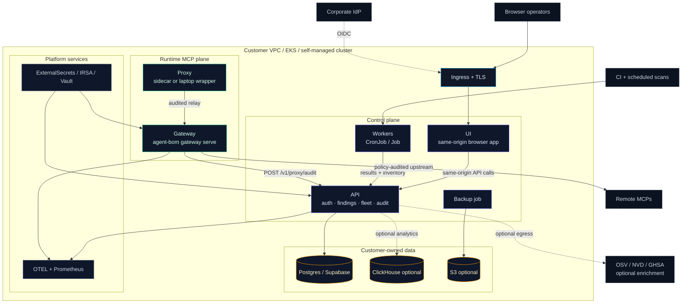
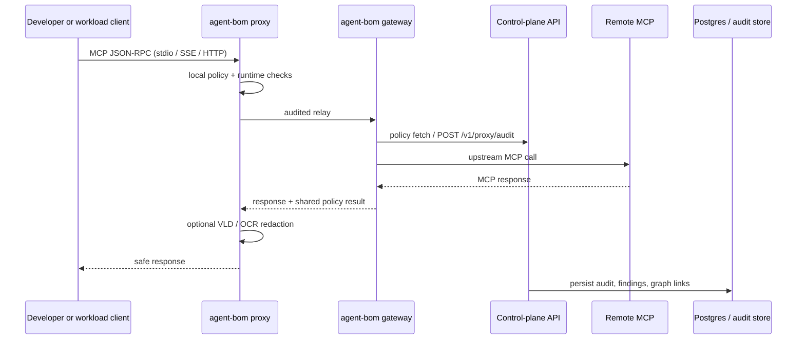

# Enterprise MCP / Endpoint Pilot

This is the canonical `agent-bom` pilot shape for a company that wants one
open-source control plane for:

- employee endpoint fleet visibility
- server-side MCP visibility in EKS
- gateway policy management
- selected inline proxy enforcement

It is intentionally not an EDR-style managed agent product. The current
contract is opt-in endpoint scans plus self-hosted control-plane and proxy
surfaces.

## Scope

This pilot keeps the product surface narrow on purpose:

- employee endpoints push fleet and discovery state into the control plane
- scheduled scan jobs cover cluster, package, image, and MCP discovery
- selected MCP workloads get `agent-bom proxy` sidecars or local wrappers
- the control plane hosts API, UI, findings, audit, and gateway policy
- Postgres is required; ClickHouse stays optional

## Enterprise deployment topology

Use two diagrams, not one overloaded graph:

- **deployment topology** for what the pilot installs in the customer's
  environment
- **runtime MCP flow** for how proxy, gateway, API, and upstream MCP traffic
  interact

Everything agent-bom ships runs inside one trust boundary: the customer's VPC,
EKS account, or self-managed cluster. The normal cross-boundary paths are
inbound OIDC and outbound, policy-audited MCP upstream calls. Enrichment to
OSV/NVD is optional and allow-listable.

| Layer | Lives in | Scales via | Talks to |
|---|---|---|---|
| **Ingress + auth** | ALB / Istio Gateway + OIDC | — | Corporate IdP (Okta / Entra / Google) |
| **Runtime MCP plane** | `gateway` + selected `proxy` sidecars / local wrappers | HPA + PDB | Remote MCPs, `/v1/proxy/audit` |
| **Control plane** | `api`, `ui`, `jobs`, `backup` (Helm) | HPA + CronJob | Data plane, OTEL, Prometheus |
| **Data plane** | Customer-owned Postgres (+ optional ClickHouse, S3) | Operator-managed | — |
| **Platform glue** | ExternalSecrets, ServiceMonitor, OTEL collector | Operator-managed | AWS Secrets Manager / Vault / Grafana |



*Deployment truth: the UI is not the collector. The browser drives workflows,
the API owns control-plane state, workers do scans, and proxy plus gateway
handle runtime MCP traffic. For the role split, see the [Self-Hosted Product
Architecture](../architecture/self-hosted-product-architecture.md).*

### MCP proxy and gateway runtime flow



1. The client talks to a local or sidecar `agent-bom proxy`.
2. The proxy applies local runtime checks and relays to the central
   `agent-bom gateway`.
3. The gateway evaluates shared policy, records audit to `/v1/proxy/audit`,
   then calls the remote MCP upstream.
4. The response returns on the same path; image responses can run through the
   visual leak detector before the client sees them.
5. The API persists audit, findings, and graph links for the UI, exports, and
   compliance surfaces.

## What is in scope

| Surface | Included in the pilot | Why |
|---|---|---|
| Endpoint fleet | Yes | Employee laptops push MCP and agent discovery into the shared control plane |
| Runtime fleet | Yes | EKS scanner + selected sidecars cover server-side MCPs |
| Gateway policies | Yes | Control-plane policy management is now linked to proxy pull |
| Proxy audit push | Yes | SOC sees blocks and warnings centrally |
| Same-origin UI | Yes | One ingress, one internal control plane |
| Postgres | Yes | Primary transactional backend for multi-replica pilots |
| ClickHouse | Optional | Bring it in once pilot event volume justifies it |
| Snowflake backend | No | Not part of the focused pilot contract |
| Managed endpoint agent | No | Still roadmap, not current product contract |
| MDM integration | No | Still roadmap |

## Security properties

- self-hosted API, UI, audit log, and Postgres stay in the company's infra
- OIDC, API keys, RBAC, and Postgres RLS are the control-plane boundary
- proxy policy pull and audit push are now real, not cosmetic
- gateway can now require an incoming bearer/API-key token for remote MCP clients
- screenshot OCR enforcement now fails closed when explicitly enabled without the visual runtime
- `AGENT_BOM_AUDIT_HMAC_KEY` is required for pilot sign-off
- the EKS pilot path assumes Pod Security Admission `restricted`
- focused pilot values lock ingress down instead of leaving it wide open

## Scale properties

- API is horizontally scalable behind Postgres-backed state
- scheduler leader election uses Postgres advisory locking
- endpoint fleet is batch-driven and scales to pilot size without a managed agent
- ClickHouse is available when pilot volume grows beyond what Postgres should carry for analytics
- sidecar proxy rollout stays workload-by-workload instead of forcing universal inline routing

For concrete sizing, autoscaling, and load-test guidance, use
[Performance, Sizing, and Benchmarks](performance-and-sizing.md).

## Required rollout steps

1. Run Postgres migrations.
2. Install the Helm control plane with the focused pilot values.
3. Label the namespace for Pod Security Admission `restricted`.
4. Start endpoint fleet scan-and-push on employee workstations.
5. Add proxy sidecars only to the MCP workloads you want inline enforcement on.

## Migration contract

Long-lived control-plane databases now have an Alembic baseline:

```bash
alembic -c deploy/supabase/postgres/alembic.ini upgrade head
```

If a database was already initialized from
[deploy/supabase/postgres/init.sql](https://github.com/msaad00/agent-bom/blob/main/deploy/supabase/postgres/init.sql),
stamp it once before future changes:

```bash
alembic -c deploy/supabase/postgres/alembic.ini stamp 20260416_01
```

Use `init.sql` for disposable bootstrap paths and local compose; use Alembic as
the authoritative migration path for long-lived enterprise control planes.
