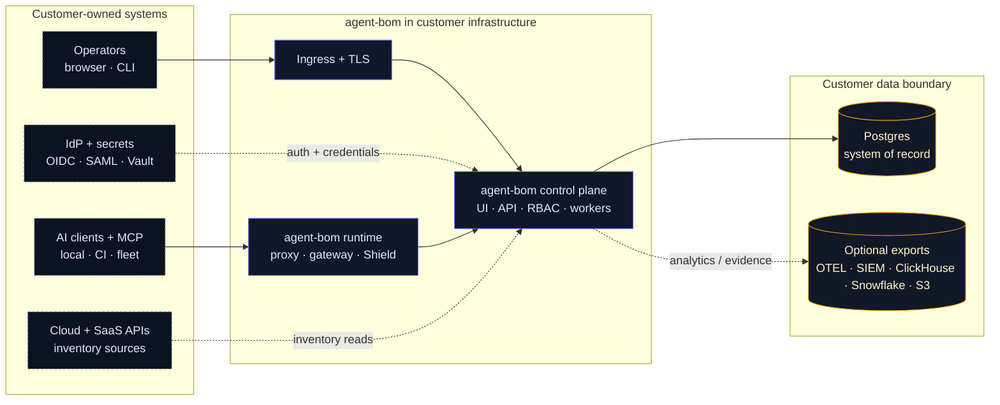
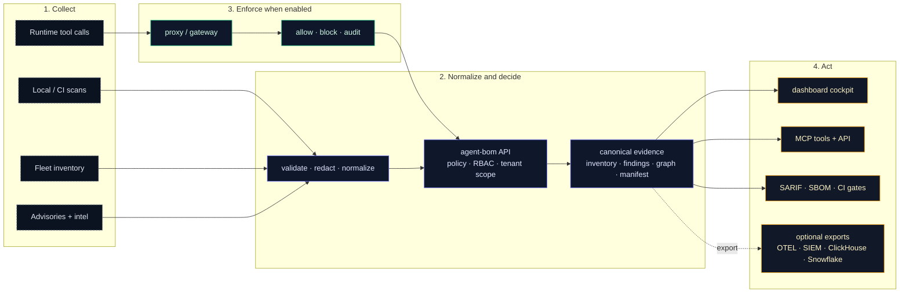

# Deployment Overview

Use this page when the question is not "how do I install `agent-bom`?" but
"what should I deploy first, what does that give me, and when do I add runtime
enforcement?"

Treat this as the primary deployment chooser. The rest of the deployment docs
either deepen one of these supported paths or act as reference material for
teams intentionally diverging from them.

`agent-bom` is one product with two deployable images:

- `agentbom/agent-bom` for scanner, API, jobs, gateway, proxy, and other non-browser runtimes
- `agentbom/agent-bom-ui` for the browser dashboard

Pilot on one workstation:

```bash
curl -fsSL https://raw.githubusercontent.com/msaad00/agent-bom/main/deploy/docker-compose.pilot.yml -o docker-compose.pilot.yml
docker compose -f docker-compose.pilot.yml up -d
# Dashboard -> http://localhost:3000
```

Production in your own cluster from a checked-out repo:

```bash
export AWS_REGION="<your-aws-region>"
scripts/deploy/install-eks-reference.sh \
  --cluster-name corp-ai \
  --region "$AWS_REGION" \
  --hostname agent-bom.internal.example.com \
  --enable-gateway
```

Advanced/manual chart install from a checked-out repo:

```bash
helm upgrade --install agent-bom deploy/helm/agent-bom \
  --namespace agent-bom --create-namespace \
  -f deploy/helm/agent-bom/examples/eks-production-values.yaml
```

## Read This Way

Do not read every deployment page. Pick one path, then open reference pages only
when your platform team needs that specific detail.

| You are trying to... | Start with | Stop there unless... |
|---|---|---|
| run a local pilot | [Docker](docker.md) | you need EKS, SSO, or fleet sync |
| deploy in vanilla EKS | [Vanilla EKS Quickstart](eks-vanilla-quickstart.md) | you need service mesh, ESO, or cert-manager |
| deploy in hardened AWS / EKS | [Your Own AWS / EKS](own-infra-eks.md) | you need a lower-level Helm or Terraform reference |
| run a Snowflake POV | [Snowflake POV](snowflake-pov.md) | you need backend-parity details |
| choose proxy vs gateway vs fleet | [Proxy vs Gateway vs Fleet](proxy-vs-gateway-vs-fleet.md) | you need runtime operations or gateway discovery |

Everything else in the deployment section is reference material.

## Product Surfaces

| Surface | Deploy when | What it gives you |
|---|---|---|
| **Scan** | day 1 | discovery, package/image/IaC/cloud checks, findings, blast radius |
| **Fleet** | day 1 for teams | endpoint and collector inventory without inline traffic control |
| **API + UI** | self-hosted pilots and production | auth, RBAC, tenant scope, graph, remediation, audit, policy |
| **Proxy** | selected local or sidecar MCPs | inline local MCP inspection, policy decisions, signed audit events |
| **Gateway** | shared remote MCP traffic | central remote MCP relay, policy distribution, audit events |
| **MCP server mode** | agent-invoked scanning | exposes `agent-bom` as read-mostly MCP tools, resources, and prompts |

Default rollout: deploy API + UI with Postgres, add scans and fleet sync, then
add proxy or gateway only where runtime enforcement is worth the extra operating
surface.

## Deployment Defaults

| Decision | Default |
|---|---|
| **first pilot** | `deploy/docker-compose.pilot.yml` |
| **production installer** | `scripts/deploy/install-eks-reference.sh` |
| **system of record** | Postgres |
| **analytics/lake** | optional ClickHouse, Snowflake, OTEL, or S3 exports |
| **runtime enforcement** | selected proxy or gateway, not all traffic by default |

## Enterprise Deployment Promise

This self-hosted shape is designed around a few explicit operating principles:

- **Customer-controlled hosting**: no mandatory vendor control plane and no mandatory SaaS dependency
- **Zero-trust access**: OIDC, SAML, API keys, RBAC, tenant propagation, quotas, and signed audit trails
- **Least privilege**: read-only discovery roles where possible, selected proxy enforcement only where needed
- **Low latency**: runtime inspection stays close to the MCP workloads instead of hairpinning through a global gateway
- **Cheap by default**: scan workers scale to zero, offline vuln DB reduces repeated network lookups, ClickHouse stays optional
- **Interoperable**: one shared graph and policy model spans scanner, proxy, gateway, fleet, and API/UI

## Self-hosted now, provider track later

The supported strength today is the self-hosted enterprise path:

- one organization running `agent-bom` in its own infrastructure
- strong tenant-aware auth, RBAC, audit, fleet, graph, and gateway routing
- customer-owned storage, telemetry, and support-sharing decisions

That should not be read as a hidden claim of turnkey MSSP maturity. Provider
surfaces such as tenant lifecycle automation, richer delegation templates, and
provider-style admin operations remain a separate product track.

## Enterprise Self-Hosted Diagrams

Use two readable views. The first explains where each service runs. The second
explains how inventory, runtime evidence, and exports move. Each diagram keeps
agent-bom in the center and leaves customer-owned systems at the edges.

Every box prefixed with `agent-bom` is code from this project running in the
customer's environment. Identity, cloud APIs, MCP servers, secret stores, and
analytics destinations stay customer-owned.

### Deployment Topology



Truth block:
- Operators enter through customer ingress and TLS; the API remains the auth,
  RBAC, tenant, and audit authority.
- Postgres is the required system of record. ClickHouse, Snowflake, S3, SIEM,
  and OTEL are optional export paths.
- agent-bom integrates with customer-owned IdP, secrets, cloud APIs, MCP
  servers, and endpoints; it does not replace or host them.

### Evidence Workflow



Truth block:
- Inventory works without runtime enforcement. Proxy and gateway add policy
  decisions and audit events when teams choose to enforce MCP/tool traffic.
- All evidence passes through validation and redaction before it becomes
  inventory, findings, graph, manifest, or compliance output.
- The same evidence model feeds humans through the dashboard and agents through
  the API/MCP surface.

## Best Self-Hosted Path

If you want the best current self-hosted rollout in your own infrastructure,
start with this shape:

1. Deploy the packaged API + UI control plane with Postgres.
2. Add scheduled scan jobs for cluster, container, and MCP discovery.
3. Add endpoint fleet sync for developer laptops and workstations.
4. Add `agent-bom proxy` only to the MCP workloads that need inline runtime
   enforcement.
5. Use the gateway surface to manage policy centrally and front shared remote
   MCPs, while proxies pull the same policies and push audit events back.

For managed endpoint rollout, `agent-bom proxy-bootstrap` now generates a
single onboarding bundle that can be:

- pushed directly as shell / PowerShell bootstrap assets
- wrapped into Jamf, Kandji, or Intune rollout scripts
- assembled into `.pkg` and `.msi` installers from the same generated bundle
- published into a Homebrew tap via the shipped formula renderer

That gives you one operator story while keeping proxy, gateway, and fleet as
separate runtime choices.

For the post-install maintenance path around proxy policy-signing key rotation
and cert-manager-backed webhook certificate renewal, see
[Runtime Operations](runtime-operations.md).

For the default self-hosted data-ownership and support-sharing boundary, see
[Customer Data and Support Boundary](customer-data-and-support-boundary.md).

## How the surfaces connect

| Path | Starts from | Ends at | Purpose |
|---|---|---|---|
| **Inventory** | scan jobs, CI, `agent-bom agents`, fleet sync | API + UI + Postgres | discover what is installed, configured, risky, and reachable |
| **Proxy runtime** | endpoint or sidecar workload | local MCP + control-plane audit/policy | workload-local stdio/runtime enforcement |
| **Gateway runtime** | shared remote MCP client | remote MCP + control-plane audit/policy | central remote MCP traffic plane |
| **Analytics / archive** | control plane | ClickHouse, S3, SIEM, OTEL | optional longer retention, analytics, and exports |

By default, the control plane, job results, fleet inventory, graph snapshots,
remediation output, and proxy audit data stay inside the customer's
infrastructure. External egress only happens when the operator explicitly enables
it for catalog refresh, enrichment, registry lookups, SIEM export, OTLP, or
webhooks.

That same self-hosted boundary also means `agent-bom` maintainers do not get
silent access to tenant data. For the full operator-facing contract, see
[Customer Data and Support Boundary](customer-data-and-support-boundary.md).

## Approved intake paths today

“Approved” here means explicit, customer-controlled backend intake paths. The
Node UI is not one of them.

| Intake path | Code-backed today | How it enters `agent-bom` |
|---|---|---|
| Direct scan | yes | CLI, CI, or API-triggered worker job reads repos, lockfiles, images, IaC, MCP configs, and selected cloud targets |
| Read-only integration | partial, source-dependent | backend connector or worker reads customer-approved cloud or warehouse APIs with customer-managed credentials |
| Pushed ingest | yes | `POST /v1/fleet/sync`, `POST /v1/traces`, `POST /v1/results/push`, `POST /v1/proxy/audit` |
| Imported artifact | yes | uploaded or provided SBOMs, inventories, and external scanner JSON are parsed by the backend |
| Proxy enforcement | yes | `agent-bom proxy` sidecar or local wrapper inspects MCP traffic and pushes audit to the API |
| Central gateway traffic plane | present, still maturing operationally | `agent-bom gateway serve` fronts remote MCP upstreams and pushes the same audit/policy signals back to the control plane |

Covered source categories today:

- repos, packages, and lockfiles
- container images
- IaC: Terraform, Kubernetes, Helm, CloudFormation, Dockerfile
- agents, MCP servers, tools, skills, and instruction files
- runtime traces and proxy/gateway audit events
- fleet inventory pushed by endpoints or collectors
- exported SBOMs and third-party scanner artifacts
- selected cloud and AI infrastructure surfaces where the scanner or connector exists

## What is live now vs still maturing

The self-hosted control-plane pattern is live now. The rough edges are mostly
operator polish, not the core trust boundary.

| Area | Live now | Still maturing |
|---|---|---|
| API + UI control plane | findings, graph, remediation, fleet, audit, compliance, auth | source/connector UX should become more explicit in the UI |
| Direct scans | repo, image, IaC, package, MCP, cloud-backed scan jobs | broader one-click source onboarding in the UI |
| Pushed ingest | fleet sync, traces, proxy audit, pushed results | clearer product-level “data sources” management surface |
| Proxy runtime path | sidecar and local wrapper deployment docs, metrics, audit, enforcement | more turnkey rollout guidance by workload type |
| Gateway | central policy and audit are real; traffic-plane shape and docs exist | still more design/runbook than a single polished operator guide |
| Hosted packaging | self-hosted API/UI and Helm control plane are real | release-path polish for every artifact path should stay under CI guard |

## Security and Data-Flow Boundaries

The deployment model is intentionally split by trust boundary:

1. **Discovery and scan paths** read from repos, images, manifests, cloud APIs, or local configs and write findings into the control plane.
2. **Fleet ingest** persists workstation and collector inventory without requiring a shared privileged daemon across every endpoint.
3. **Proxy/runtime** stays near the MCP servers so enforcement is low-latency and least-privilege.
4. **Gateway** centralizes policy definition and auditability, and can also
   front shared remote MCP traffic when that is the better fit.
5. **Control plane** owns storage, graph views, remediation, audit review, and operator workflows.

That keeps request latency low, avoids a single giant runtime chokepoint, and
lets customers adopt only the surfaces they actually need.

## Recommended Deployment Choices

| Need | Recommended path |
|---|---|
| Run one scan locally | CLI |
| Gate pull requests and releases | GitHub Action |
| Keep runtime isolated for a single job | Docker |
| Self-host the operator plane for a team | API + UI + Postgres |
| Deploy in your own AWS / EKS | Helm control plane + scheduled scan jobs + selected proxy sidecars |
| Bring developer endpoints into the same plane | Fleet sync |
| Add live MCP enforcement | Proxy + gateway policy pull |
| Expose agent-bom as a tool server | MCP server |
| Add event-scale analytics | ClickHouse alongside the control plane |
| Use warehouse-native governance workflows | Snowflake with explicit backend parity limits |

## What Operators See After Deploy

The deployment story should end in usable operator surfaces, not just pods and
YAML.

**Risk overview**


**Focused fleet and graph visibility**


**Remediation workflow**


## Where to go next

The chooser table at the top of this page is the canonical entry. After that:

- runtime surface decision lives in [When To Use Proxy vs Gateway vs Fleet](proxy-vs-gateway-vs-fleet.md)
- backend choice (Postgres / ClickHouse / Snowflake) is documented in [Backend Parity Matrix](backend-parity.md) and [Backend and Security-Lake Strategy](backend-and-security-lakes.md)
- the deeper data-model and store mapping is in [Control-Plane Data Model and Store Parity](control-plane-data-model.md)
- the API + UI control-plane image and operator split is in [Packaged API + UI Control Plane](control-plane-helm.md) and [Self-Hosted Product Architecture](../architecture/self-hosted-product-architecture.md)

Everything else in the deployment section is reference material — open it only when your platform team needs that specific detail.
