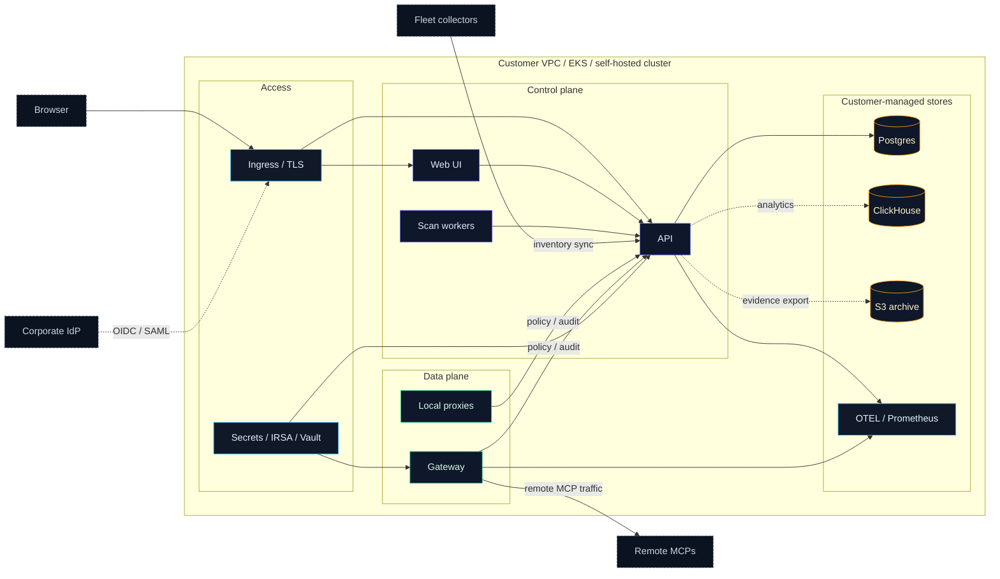
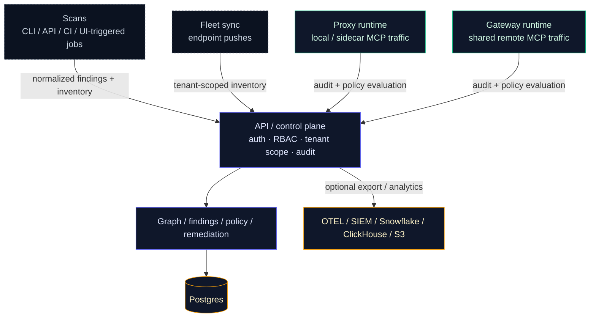

# Deployment Overview

Use this page when the question is not "how do I install `agent-bom`?" but
"what should I deploy first, what does that give me, and when do I add runtime
enforcement?"

Treat this as the primary deployment chooser. The rest of the deployment docs
either deepen one of these supported paths or act as reference material for
teams intentionally diverging from them.

`agent-bom` is one product with two deployable images:

- `agentbom/agent-bom` for scanner, API, jobs, gateway, proxy, and other non-browser runtimes
- `agentbom/agent-bom-ui` for the browser dashboard

Pilot on one workstation:

```bash
curl -fsSL https://raw.githubusercontent.com/msaad00/agent-bom/main/deploy/docker-compose.pilot.yml -o docker-compose.pilot.yml
docker compose -f docker-compose.pilot.yml up -d
# Dashboard -> http://localhost:3000
```

Production in your own cluster from a checked-out repo:

```bash
scripts/deploy/install-eks-reference.sh \
  --cluster-name corp-ai \
  --region us-east-1 \
  --hostname agent-bom.internal.example.com \
  --enable-gateway
```

Advanced/manual chart install from a checked-out repo:

```bash
helm upgrade --install agent-bom deploy/helm/agent-bom \
  --namespace agent-bom --create-namespace \
  -f deploy/helm/agent-bom/examples/eks-production-values.yaml
```

`agent-bom` is intentionally packaged as interoperable surfaces, not a forced
monolith:

- **scan** for discovery, inventory, CVE analysis, IaC, image, and cloud checks
- **fleet** for persisted endpoint and collector inventory
- **proxy / runtime** for inline MCP inspection and enforcement
- **gateway** for central runtime policy distribution and evaluation
- **API + UI** for operator review, audit, graph, remediation, and control-plane workflows
- **MCP server mode** when you want `agent-bom` itself exposed as tools

The published container split follows the same model:

- `agentbom/agent-bom` is the main runtime image for CLI, API, jobs, gateway,
  proxy-related entrypoints, and MCP server mode
- `agentbom/agent-bom-ui` is only the standalone browser UI image used when the
  control plane runs the UI separately from the API

## Adoption path

The intended product path is:

1. deploy the control plane
2. turn on scans and fleet sync
3. get MCP inventory, granted surface area, and findings
4. add proxy or gateway only where runtime enforcement is worth the extra operational surface

That is not a downgrade of runtime. It is a cleaner adoption model:

- **inventory and discovery** should already be useful on day 1
- **proxy and gateway** deepen that into live runtime control on day 2

## Official deployment entrypoints

Use these first:

| Goal | Recommended entrypoint | Why |
|---|---|---|
| One-machine pilot | `deploy/docker-compose.pilot.yml` | fastest path to API + UI with the shipped images |
| Full self-hosted deployment in your own AWS / EKS | `scripts/deploy/install-eks-reference.sh` | creates or targets EKS, wires the AWS baseline, installs Helm, and prints verify/next-step commands |

Everything else is either advanced or specialized:

| Entry point | Use when |
|---|---|
| `helm upgrade --install ... -f deploy/helm/agent-bom/examples/eks-production-values.yaml` | you already manage your own Helm layering and do not want the reference installer |
| `deploy/docker-compose.fullstack.yml` | you want a fuller local compose example on one machine, not the recommended production path |
| `deploy/docker-compose.platform.yml` / `deploy/docker-compose.runtime.yml` | you are developing or demonstrating one part of the product surface, not doing the standard install |

## Supported path map

Use these pages in this order:

| If you need... | Read this first | Then use... |
|---|---|---|
| the fastest pilot | this page | `deploy/docker-compose.pilot.yml` |
| the paved production rollout | this page | [Deploy In Your Own AWS / EKS Infrastructure](own-infra-eks.md) |
| a focused endpoint + MCP pilot | this page | [Enterprise MCP / Endpoint Pilot](enterprise-pilot.md) |
| raw Helm, Docker, Terraform, or Kubernetes details | this page | the matching reference page only after you know you are leaving the paved path |

## Deployment modes

| Mode | Deploy first | What it gives you |
|---|---|---|
| **Scan only** | CLI, CI, or scheduled scan jobs | packages, images, IaC, MCP config, findings, blast radius |
| **Inventory-first** | API + UI + Postgres + scan jobs + fleet sync | endpoints, MCP servers, transports, declared tools, credential-backed servers, last sync |
| **Runtime-upgrade** | inventory-first plus selected `proxy` or `gateway` | live MCP audit, inline policy enforcement, runtime rate limits, response inspection |

## Runtime surfaces

| Surface | Best fit | Not required for |
|---|---|---|
| **`agent-bom proxy`** | local stdio MCPs and workload-local sidecars | inventory, fleet, or findings review |
| **`agent-bom gateway serve`** | shared remote MCP traffic over HTTP/SSE | local sidecar enforcement or basic MCP inventory |
| **optional monitor DaemonSet** | node-wide runtime coverage when an operator explicitly wants a higher-trust deployment shape | scans, fleet, gateway, or selected sidecar proxy rollout |

If you need the concrete operator rule for where each one fits, see
[When To Use Proxy vs Gateway vs Fleet](proxy-vs-gateway-vs-fleet.md).

## Recommended defaults

If you do not already have a strong reason to diverge, use these defaults:

| Decision | Recommended default |
|---|---|
| **pilot path** | `deploy/docker-compose.pilot.yml` |
| **production path** | `scripts/deploy/install-eks-reference.sh` |
| **control-plane backend** | Postgres |
| **first runtime step** | scans + fleet, without runtime rollout |
| **shared remote MCP traffic** | gateway |
| **workload-local inline enforcement** | selected sidecar proxy |
| **node-wide runtime coverage** | optional monitor only when the operator explicitly accepts a DaemonSet |
| **analytics and lake add-ons** | add ClickHouse, OTEL, or Snowflake only when the Postgres-first path is no longer enough |

## What You Can Offer In Customer-Controlled Infra

This is the current code-backed self-hosted story:

| Surface | What the customer deploys | What it does |
|---|---|---|
| **agent-bom Scan** | CronJobs, CI runners, one-off jobs, endpoint CLI runs | Discovers agents, MCP servers, packages, images, IaC, Kubernetes, and cloud assets; writes findings and graph state |
| **agent-bom Fleet** | Endpoint collectors or workstation CLI pushes | Persists inventory and scan history into the control plane without requiring a separate endpoint daemon product |
| **agent-bom Proxy** | Sidecar or local wrapper near selected MCP servers | Enforces allow/warn/deny policy, detects credential exposure, blocks undeclared tools, emits signed audit logs, and can fail closed on tampered cached policy bundles |
| **agent-bom Gateway** | Shared remote MCP traffic plane plus policy/audit surface | Stores, serves, and audits the policies consumed by proxies and managed runtime paths, including in-process reload for file-backed policy bundles |
| **agent-bom Runtime** | Proxy + audit + policy pull + event persistence | Gives runtime visibility without forcing all traffic through one shared chokepoint |
| **agent-bom Control Plane** | API + UI + Postgres, with optional ClickHouse | Presents findings, graph, remediation, fleet review, audit, and policy management from one operator-owned plane |

## Enterprise Deployment Promise

This self-hosted shape is designed around a few explicit operating principles:

- **Customer-controlled hosting**: no mandatory vendor control plane and no mandatory SaaS dependency
- **Zero-trust access**: OIDC, SAML, API keys, RBAC, tenant propagation, quotas, and signed audit trails
- **Least privilege**: read-only discovery roles where possible, selected proxy enforcement only where needed
- **Low latency**: runtime inspection stays close to the MCP workloads instead of hairpinning through a global gateway
- **Cheap by default**: scan workers scale to zero, offline vuln DB reduces repeated network lookups, ClickHouse stays optional
- **Interoperable**: one shared graph and policy model spans scanner, proxy, gateway, fleet, and API/UI

## Self-hosted now, provider track later

The supported strength today is the self-hosted enterprise path:

- one organization running `agent-bom` in its own infrastructure
- strong tenant-aware auth, RBAC, audit, fleet, graph, and gateway routing
- customer-owned storage, telemetry, and support-sharing decisions

That should not be read as a hidden claim of turnkey MSSP maturity. Provider
surfaces such as tenant lifecycle automation, richer delegation templates, and
provider-style admin operations remain a separate product track.

## Enterprise Self-Hosted Diagrams

Use two diagrams, not one overloaded graph:

- **Enterprise Self-Hosted Topology** answers what runs where.
- **Enterprise Self-Hosted Data and Runtime Flow** answers how data moves and
  where policy, auth, RBAC, tenant scope, and audit are enforced.

### Enterprise Self-Hosted Topology



Truth block:
- Users enter through ingress; the API remains the single control-plane authority
  for auth, RBAC, tenant scope, graph, audit, and policy.
- Fleet sync, scan workers, and runtime surfaces all report back to the same API,
  so inventory and enforcement stay aligned.
- Gateway fronts shared remote MCP traffic; optional analytics and archive stores
  stay visually secondary to Postgres, which remains the required system of record.

### Enterprise Self-Hosted Data and Runtime Flow



Truth block:
- Auth, RBAC, tenant resolution, and audit happen in the control plane, not in
  the browser.
- Scans and fleet establish inventory first; proxy and gateway add runtime
  enforcement and runtime evidence where deployed.

## Best Self-Hosted Path

If you want the best current self-hosted rollout in your own infrastructure,
start with this shape:

1. Deploy the packaged API + UI control plane with Postgres.
2. Add scheduled scan jobs for cluster, container, and MCP discovery.
3. Add endpoint fleet sync for developer laptops and workstations.
4. Add `agent-bom proxy` only to the MCP workloads that need inline runtime
   enforcement.
5. Use the gateway surface to manage policy centrally and front shared remote
   MCPs, while proxies pull the same policies and push audit events back.

For managed endpoint rollout, `agent-bom proxy-bootstrap` now generates a
single onboarding bundle that can be:

- pushed directly as shell / PowerShell bootstrap assets
- wrapped into Jamf, Kandji, or Intune rollout scripts
- assembled into `.pkg` and `.msi` installers from the same generated bundle
- published into a Homebrew tap via the shipped formula renderer

That gives you one operator story without pretending every workload needs the
same runtime path.

For the post-install maintenance path around proxy policy-signing key rotation
and cert-manager-backed webhook certificate renewal, see
[Runtime Operations](runtime-operations.md).

For the default self-hosted data-ownership and support-sharing boundary, see
[Customer Data and Support Boundary](customer-data-and-support-boundary.md).

## How the surfaces connect

| Path | Starts from | Ends at | Purpose |
|---|---|---|---|
| **Inventory** | scan jobs, CI, `agent-bom agents`, fleet sync | API + UI + Postgres | discover what is installed, configured, risky, and reachable |
| **Proxy runtime** | endpoint or sidecar workload | local MCP + control-plane audit/policy | workload-local stdio/runtime enforcement |
| **Gateway runtime** | shared remote MCP client | remote MCP + control-plane audit/policy | central remote MCP traffic plane |
| **Analytics / archive** | control plane | ClickHouse, S3, SIEM, OTEL | optional longer retention, analytics, and exports |

This is the product split to keep in mind:

- **UI** drives workflows and review
- **API** owns auth, RBAC, graph, audit, and policy
- **workers** do scans and normalization
- **fleet** persists endpoint inventory
- **proxy and gateway** are runtime surfaces deployed where they fit

By default, the control plane, job results, fleet inventory, graph snapshots,
remediation output, and proxy audit data stay inside the customer's
infrastructure. External egress only happens when the operator explicitly enables
it for catalog refresh, enrichment, registry lookups, SIEM export, OTLP, or
webhooks.

That same self-hosted boundary also means `agent-bom` maintainers do not get
silent access to tenant data. For the full operator-facing contract, see
[Customer Data and Support Boundary](customer-data-and-support-boundary.md).

## Which Service Does What

| Surface | Deploy it when | What it owns | What it is not |
|---|---|---|---|
| **Scan** | you need discovery, CVE analysis, Kubernetes inventory, CI gates, or scheduled audits | package, container, IaC, MCP, cloud, and cluster scanning | a live enforcement layer |
| **Fleet** | you want laptops, workstations, or other collectors to persist inventory into one control plane | endpoint and collector push into `/v1/fleet/sync`, review in `/fleet` | an always-on endpoint agent or MDM product |
| **Proxy / runtime** | you need inline MCP inspection or policy enforcement on live tool traffic | `agent-bom proxy`, audit push, selected blocks/warns, local or sidecar enforcement | a generic shared network gateway for every workload |
| **Gateway** | you want central policy authoring and optional shared remote MCP traffic | `/gateway`, `/v1/gateway/policies`, policy pull for proxies, `agent-bom gateway serve` | a replacement for the proxy itself |
| **API + UI** | you want one operator control plane | findings, graph, remediation, fleet review, audit, policy management | a hosted vendor control plane |
| **MCP server** | you want `agent-bom` exposed as tools to assistants or remote clients | `agent-bom mcp server` tool surface | the same thing as the runtime proxy |

## Hosted product checklist

For the packaged product to feel end to end, the UI should drive the control
plane instead of collecting data itself.

| Operator action in UI | Backend/API owner | Data actually comes from |
|---|---|---|
| Create a scan job | `POST /v1/scan` | worker jobs that scan repos, images, IaC, MCP configs, or cloud targets |
| Poll progress / stream status | `GET /v1/scan/{job_id}`, `GET /v1/scan/{job_id}/stream`, `GET /v1/jobs` | control-plane job state |
| Export graph / licenses / VEX / reports | `GET /v1/scan/{job_id}/graph-export`, `/licenses`, `/vex`, `/skill-audit`; `GET /v1/compliance/{framework}/report` | normalized findings and graph state already stored in the control plane |
| Schedule recurring collection | `POST /v1/schedules`, `GET /v1/schedules`, `PUT /v1/schedules/{id}/toggle`, `DELETE /v1/schedules/{id}` | scheduled worker execution |
| Review fleet and endpoint inventory | `GET /v1/fleet`, `GET /v1/fleet/stats`, `GET /v1/fleet/{agent_id}` | endpoint or collector pushes to `POST /v1/fleet/sync` |
| Review traces and pushed results | `POST /v1/traces`, `POST /v1/results/push`, `GET /v1/activity`, `GET /v1/governance` | OTLP, event collectors, or customer-owned push paths |
| Manage runtime policy | `GET/POST/PUT/DELETE /v1/gateway/policies`, `POST /v1/gateway/evaluate` | proxy and gateway policy pull/evaluation |
| Review runtime audit and health | `GET /v1/proxy/status`, `GET /v1/proxy/alerts`, `GET /v1/gateway/audit`, `GET /v1/gateway/stats` | `agent-bom proxy` and gateway audit push to `/v1/proxy/audit` |
| Manage auth, keys, and audit export | `/v1/auth/*`, `/v1/audit*`, `/v1/exceptions*` | control-plane auth, RBAC, audit, and policy state |
| Review graph, findings, posture, and compliance | `/v1/graph*`, `/v1/assets*`, `/v1/compliance*`, `/v1/posture*`, `/v1/governance*` | canonical entities, findings, events, and graph state in the control plane |

That is the intended split:

- `UI` = configure, trigger, schedule, review, export
- `API / control plane` = auth, RBAC, tenant scope, orchestration, graph, persistence, audit, policy
- `workers / connectors` = do the privileged read or collection work
- `proxy / gateway` = enforce and audit runtime MCP traffic

For the concrete backend and UI rollout plan behind this split, see [Hosted
Product Control-Plane Spec](../architecture/hosted-product-spec.md).

## Approved intake paths today

“Approved” here means explicit, customer-controlled backend intake paths. The
Node UI is not one of them.

| Intake path | Code-backed today | How it enters `agent-bom` |
|---|---|---|
| Direct scan | yes | CLI, CI, or API-triggered worker job reads repos, lockfiles, images, IaC, MCP configs, and selected cloud targets |
| Read-only integration | partial, source-dependent | backend connector or worker reads customer-approved cloud or warehouse APIs with customer-managed credentials |
| Pushed ingest | yes | `POST /v1/fleet/sync`, `POST /v1/traces`, `POST /v1/results/push`, `POST /v1/proxy/audit` |
| Imported artifact | yes | uploaded or provided SBOMs, inventories, and external scanner JSON are parsed by the backend |
| Proxy enforcement | yes | `agent-bom proxy` sidecar or local wrapper inspects MCP traffic and pushes audit to the API |
| Central gateway traffic plane | present, still maturing operationally | `agent-bom gateway serve` fronts remote MCP upstreams and pushes the same audit/policy signals back to the control plane |

Covered source categories today:

- repos, packages, and lockfiles
- container images
- IaC: Terraform, Kubernetes, Helm, CloudFormation, Dockerfile
- agents, MCP servers, tools, skills, and instruction files
- runtime traces and proxy/gateway audit events
- fleet inventory pushed by endpoints or collectors
- exported SBOMs and third-party scanner artifacts
- selected cloud and AI infrastructure surfaces where the scanner or connector exists

## What is live now vs still maturing

The self-hosted control-plane pattern is live now. The rough edges are mostly
operator polish, not the core trust boundary.

| Area | Live now | Still maturing |
|---|---|---|
| API + UI control plane | findings, graph, remediation, fleet, audit, compliance, auth | source/connector UX should become more explicit in the UI |
| Direct scans | repo, image, IaC, package, MCP, cloud-backed scan jobs | broader one-click source onboarding in the UI |
| Pushed ingest | fleet sync, traces, proxy audit, pushed results | clearer product-level “data sources” management surface |
| Proxy runtime path | sidecar and local wrapper deployment docs, metrics, audit, enforcement | more turnkey rollout guidance by workload type |
| Gateway | central policy and audit are real; traffic-plane shape and docs exist | still more design/runbook than a single polished operator guide |
| Hosted packaging | self-hosted API/UI and Helm control plane are real | release-path polish for every artifact path should stay under CI guard |

## Security and Data-Flow Boundaries

The deployment model is intentionally split by trust boundary:

1. **Discovery and scan paths** read from repos, images, manifests, cloud APIs, or local configs and write findings into the control plane.
2. **Fleet ingest** persists workstation and collector inventory without requiring a shared privileged daemon across every endpoint.
3. **Proxy/runtime** stays near the MCP servers so enforcement is low-latency and least-privilege.
4. **Gateway** centralizes policy definition and auditability, and can also
   front shared remote MCP traffic when that is the better fit.
5. **Control plane** owns storage, graph views, remediation, audit review, and operator workflows.

That keeps request latency low, avoids a single giant runtime chokepoint, and
lets customers adopt only the surfaces they actually need.

## Recommended Deployment Choices

| Need | Recommended path |
|---|---|
| Run one scan locally | CLI |
| Gate pull requests and releases | GitHub Action |
| Keep runtime isolated for a single job | Docker |
| Self-host the operator plane for a team | API + UI + Postgres |
| Deploy in your own AWS / EKS | Helm control plane + scheduled scan jobs + selected proxy sidecars |
| Bring developer endpoints into the same plane | Fleet sync |
| Add live MCP enforcement | Proxy + gateway policy pull |
| Expose agent-bom as a tool server | MCP server |
| Add event-scale analytics | ClickHouse alongside the control plane |
| Use warehouse-native governance workflows | Snowflake with explicit backend parity limits |

## What Operators See After Deploy

The deployment story should end in usable operator surfaces, not just pods and
YAML.

**Risk overview**


**Fleet and graph visibility**


**Remediation workflow**


## Start Here

- [AWS Company Rollout](aws-company-rollout.md)
- [Your Own AWS / EKS](own-infra-eks.md)
- [Enterprise MCP / Endpoint Pilot](enterprise-pilot.md)
- [Endpoint Fleet](endpoint-fleet.md)
- [When To Use Proxy vs Gateway vs Fleet](proxy-vs-gateway-vs-fleet.md)
- [Focused EKS MCP Pilot](eks-mcp-pilot.md)
- [Packaged API + UI Control Plane](control-plane-helm.md)
- [Performance, Sizing, and Benchmarks](performance-and-sizing.md)
- [Visual Leak Detection](visual-leak-detection.md)
- [Worker and Scheduler Concurrency](worker-and-scheduler-concurrency.md)
- [Gateway Auto-Discovery From the Control Plane](gateway-auto-discovery.md)
- [Backend Parity](backend-parity.md)

## Hosting and Storage Boundaries

`agent-bom` is deployable in multiple honest ways:

- **Local laptop / workstation**: CLI or `agent-bom serve` with SQLite
- **Self-hosted VM / container**: `agent-bom api` or `agent-bom serve` behind
  your ingress and auth
- **Docker Compose / container platforms**: packaged API, proxy, or MCP server
- **Kubernetes / Helm**: control plane, scanner, optional runtime monitor, and
  operator surfaces
- **Postgres / Supabase**: primary transactional backend
- **ClickHouse**: analytics add-on
- **Snowflake**: warehouse-native governance surface with explicit parity
  limits, not the default full hosting contract

Default guidance:

- **Postgres** is the normal self-hosted control-plane answer
- **ClickHouse** is the first analytics add-on when event volume grows
- **Snowflake** is an explicit advanced path, not the default production recommendation

For the detailed backend matrix, see [Backend Parity Matrix](backend-parity.md).
