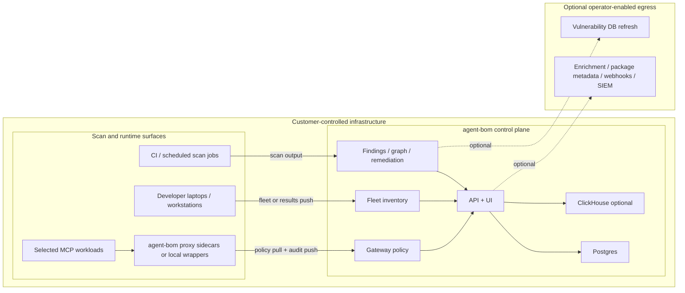

# Deployment Overview

Use this page when the question is not "how do I install `agent-bom`?" but
"what do I actually deploy in my own infrastructure, and what data path does it
create?"

`agent-bom` is intentionally packaged as interoperable surfaces, not a forced
monolith:

- **scan** for discovery, inventory, CVE analysis, IaC, image, and cloud checks
- **fleet** for persisted endpoint and collector inventory
- **proxy / runtime** for inline MCP inspection and enforcement
- **gateway** for central runtime policy distribution and evaluation
- **API + UI** for operator review, audit, graph, remediation, and control-plane workflows
- **MCP server mode** when you want `agent-bom` itself exposed as tools

## What You Can Offer In Customer-Controlled Infra

This is the current code-backed self-hosted story:

| Surface | What the customer deploys | What it does |
|---|---|---|
| **agent-bom Scan** | CronJobs, CI runners, one-off jobs, endpoint CLI runs | Discovers agents, MCP servers, packages, images, IaC, Kubernetes, and cloud assets; writes findings and graph state |
| **agent-bom Fleet** | Endpoint collectors or workstation CLI pushes | Persists inventory and scan history into the control plane without requiring a separate endpoint daemon product |
| **agent-bom Proxy** | Sidecar or local wrapper near selected MCP servers | Enforces allow/warn/deny policy, detects credential exposure, blocks undeclared tools, and emits signed audit logs |
| **agent-bom Gateway** | Central API + UI policy surface | Stores, serves, and audits the policies consumed by proxies and managed runtime paths |
| **agent-bom Runtime** | Proxy + audit + policy pull + event persistence | Gives runtime visibility without forcing all traffic through one shared chokepoint |
| **agent-bom Control Plane** | API + UI + Postgres, with optional ClickHouse | Presents findings, graph, remediation, fleet review, audit, and policy management from one operator-owned plane |

## Enterprise Deployment Promise

This self-hosted shape is designed around a few explicit operating principles:

- **Customer-controlled hosting**: no mandatory vendor control plane and no mandatory SaaS dependency
- **Zero-trust access**: OIDC, SAML, API keys, RBAC, tenant propagation, quotas, and signed audit trails
- **Least privilege**: read-only discovery roles where possible, selected proxy enforcement only where needed
- **Low latency**: runtime inspection stays close to the MCP workloads instead of hairpinning through a global gateway
- **Cheap by default**: scan workers scale to zero, offline vuln DB reduces repeated network lookups, ClickHouse stays optional
- **Interoperable**: one shared graph and policy model spans scanner, proxy, gateway, fleet, and API/UI

## Best Self-Hosted Path

If you want the best current self-hosted rollout in your own infrastructure,
start with this shape:

1. Deploy the packaged API + UI control plane with Postgres.
2. Add scheduled scan jobs for cluster, container, and MCP discovery.
3. Add endpoint fleet sync for developer laptops and workstations.
4. Add `agent-bom proxy` only to the MCP workloads that need inline runtime
   enforcement.
5. Use the gateway surface to manage policy centrally, then let proxies pull
   those policies and push audit events back.

That gives you one operator story without pretending every workload needs the
same runtime path.

By default, the control plane, job results, fleet inventory, graph snapshots,
remediation output, and proxy audit data stay inside the customer's
infrastructure. External egress only happens when the operator explicitly enables
it for catalog refresh, enrichment, registry lookups, SIEM export, OTLP, or
webhooks.

## Which Service Does What

| Surface | Deploy it when | What it owns | What it is not |
|---|---|---|---|
| **Scan** | you need discovery, CVE analysis, Kubernetes inventory, CI gates, or scheduled audits | package, container, IaC, MCP, cloud, and cluster scanning | a live enforcement layer |
| **Fleet** | you want laptops, workstations, or other collectors to persist inventory into one control plane | endpoint and collector push into `/v1/fleet/sync`, review in `/fleet` | an always-on endpoint agent or MDM product |
| **Proxy / runtime** | you need inline MCP inspection or policy enforcement on live tool traffic | `agent-bom proxy`, audit push, selected blocks/warns, local or sidecar enforcement | a generic shared network gateway for every workload |
| **Gateway** | you want central policy authoring and evaluation | `/gateway`, `/v1/gateway/policies`, policy pull for proxies | a replacement for the proxy itself |
| **API + UI** | you want one operator control plane | findings, graph, remediation, fleet review, audit, policy management | a hosted vendor control plane |
| **MCP server** | you want `agent-bom` exposed as tools to assistants or remote clients | `agent-bom mcp server` tool surface | the same thing as the runtime proxy |

## Security and Data-Flow Boundaries

The deployment model is intentionally split by trust boundary:

1. **Discovery and scan paths** read from repos, images, manifests, cloud APIs, or local configs and write findings into the control plane.
2. **Fleet ingest** persists workstation and collector inventory without requiring a shared privileged daemon across every endpoint.
3. **Proxy/runtime** stays near the MCP servers so enforcement is low-latency and least-privilege.
4. **Gateway** centralizes policy definition and auditability, not packet forwarding.
5. **Control plane** owns storage, graph views, remediation, audit review, and operator workflows.

That keeps request latency low, avoids a single giant runtime chokepoint, and
lets customers adopt only the surfaces they actually need.

## Recommended Deployment Choices

| Need | Recommended path |
|---|---|
| Run one scan locally | CLI |
| Gate pull requests and releases | GitHub Action |
| Keep runtime isolated for a single job | Docker |
| Self-host the operator plane for a team | API + UI + Postgres |
| Deploy in your own AWS / EKS | Helm control plane + scheduled scan jobs + selected proxy sidecars |
| Bring developer endpoints into the same plane | Fleet sync |
| Add live MCP enforcement | Proxy + gateway policy pull |
| Expose agent-bom as a tool server | MCP server |
| Add event-scale analytics | ClickHouse alongside the control plane |
| Use warehouse-native governance workflows | Snowflake with explicit backend parity limits |

## What Operators See After Deploy

The deployment story should end in usable operator surfaces, not just pods and
YAML.

**Risk overview**

**Fleet and graph visibility**

**Remediation workflow**

## Start Here

- [Your Own AWS / EKS](own-infra-eks.md)
- [Enterprise MCP / Endpoint Pilot](enterprise-pilot.md)
- [Endpoint Fleet](endpoint-fleet.md)
- [Focused EKS MCP Pilot](eks-mcp-pilot.md)
- [Packaged API + UI Control Plane](control-plane-helm.md)
- [Performance, Sizing, and Benchmarks](performance-and-sizing.md)
- [Backend Parity](backend-parity.md)

## Hosting and Storage Boundaries

`agent-bom` is deployable in multiple honest ways:

- **Local laptop / workstation**: CLI or `agent-bom serve` with SQLite
- **Self-hosted VM / container**: `agent-bom api` or `agent-bom serve` behind
  your ingress and auth
- **Docker Compose / container platforms**: packaged API, proxy, or MCP server
- **Kubernetes / Helm**: control plane, scanner, optional runtime monitor, and
  operator surfaces
- **Postgres / Supabase**: primary transactional backend
- **ClickHouse**: analytics add-on
- **Snowflake**: warehouse-native governance surface with explicit parity
  limits, not the default full hosting contract

For the detailed backend matrix, see [Backend Parity Matrix](backend-parity.md).
