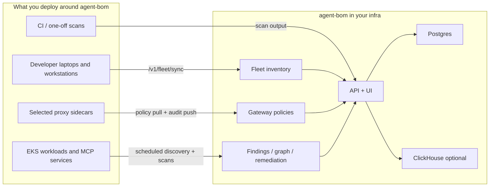

# Deployment Overview

Use this page when the question is not "how do I install agent-bom?" but
"what should I actually deploy in my environment?"

`agent-bom` is intentionally split into deployable surfaces instead of forcing
one monolithic control plane:

- scan jobs for discovery and vulnerability analysis
- fleet sync for persisted endpoint and collector inventory
- proxy/runtime enforcement for selected live MCP traffic
- gateway policy management in the control plane
- API + UI for central review, audit, remediation, and graph visibility
- MCP server mode when you want `agent-bom` itself exposed as tools

## Best Self-Hosted Path

If you want the best current self-hosted rollout in your own infrastructure,
start with this shape:

1. Deploy the packaged API + UI control plane with Postgres.
2. Add scheduled scan jobs for cluster, container, and MCP discovery.
3. Add endpoint fleet sync for developer laptops and workstations.
4. Add `agent-bom proxy` only to the MCP workloads that need inline runtime
   enforcement.
5. Use the gateway surface to manage policy centrally, then let proxies pull
   those policies and push audit events back.

That gives you one operator story without pretending every workload needs the
same runtime path.

## Which Service Does What

| Surface | Deploy it when | What it owns | What it is not |
|---|---|---|---|
| **Scan** | you need discovery, CVE analysis, Kubernetes inventory, CI gates, or scheduled audits | package, container, IaC, MCP, cloud, and cluster scanning | a live enforcement layer |
| **Fleet** | you want laptops, workstations, or other collectors to persist inventory into one control plane | endpoint and collector push into `/v1/fleet/sync`, review in `/fleet` | an always-on endpoint agent or MDM product |
| **Proxy / runtime** | you need inline MCP inspection or policy enforcement on live tool traffic | `agent-bom proxy`, audit push, selected blocks/warns, local or sidecar enforcement | a generic shared network gateway for every workload |
| **Gateway** | you want central policy authoring and evaluation | `/gateway`, `/v1/gateway/policies`, policy pull for proxies | a replacement for the proxy itself |
| **API + UI** | you want one operator control plane | findings, graph, remediation, fleet review, audit, policy management | a hosted vendor control plane |
| **MCP server** | you want `agent-bom` exposed as tools to assistants or remote clients | `agent-bom mcp server` tool surface | the same thing as the runtime proxy |

## Recommended Deployment Choices

| Need | Recommended path |
|---|---|
| Run one scan locally | CLI |
| Gate pull requests and releases | GitHub Action |
| Keep runtime isolated for a single job | Docker |
| Self-host the operator plane for a team | API + UI + Postgres |
| Deploy in your own AWS / EKS | Helm control plane + scheduled scan jobs + selected proxy sidecars |
| Bring developer endpoints into the same plane | Fleet sync |
| Add live MCP enforcement | Proxy + gateway policy pull |
| Expose agent-bom as a tool server | MCP server |
| Add event-scale analytics | ClickHouse alongside the control plane |
| Use warehouse-native governance workflows | Snowflake with explicit backend parity limits |

## What Operators See After Deploy

The deployment story should end in usable operator surfaces, not just pods and
YAML.

**Risk overview**

**Fleet and graph visibility**

**Remediation workflow**

## Start Here

- [Your Own AWS / EKS](own-infra-eks.md)
- [Enterprise MCP / Endpoint Pilot](enterprise-pilot.md)
- [Endpoint Fleet](endpoint-fleet.md)
- [Focused EKS MCP Pilot](eks-mcp-pilot.md)
- [Packaged API + UI Control Plane](control-plane-helm.md)
- [Performance, Sizing, and Benchmarks](performance-and-sizing.md)
- [Backend Parity](backend-parity.md)

## Hosting and Storage Boundaries

`agent-bom` is deployable in multiple honest ways:

- **Local laptop / workstation**: CLI or `agent-bom serve` with SQLite
- **Self-hosted VM / container**: `agent-bom api` or `agent-bom serve` behind
  your ingress and auth
- **Docker Compose / container platforms**: packaged API, proxy, or MCP server
- **Kubernetes / Helm**: control plane, scanner, optional runtime monitor, and
  operator surfaces
- **Postgres / Supabase**: primary transactional backend
- **ClickHouse**: analytics add-on
- **Snowflake**: warehouse-native governance surface with explicit parity
  limits, not the default full hosting contract

For the detailed backend matrix, see [Backend Parity Matrix](backend-parity.md).
