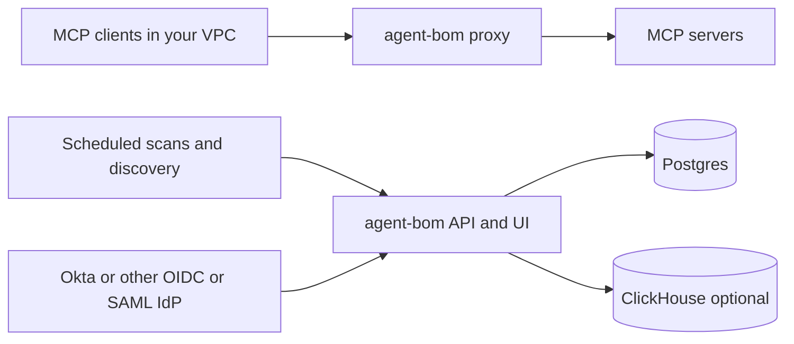

# Deploy In Your Own AWS / EKS Infrastructure

This is the self-hosted path for teams that want `agent-bom` inside their own
AWS account, VPC, EKS cluster, and databases.

If you want the narrower pilot shape for MCP discovery, fleet, mesh, gateway
policy, and selected runtime enforcement, start with
[Focused EKS MCP Pilot](eks-mcp-pilot.md).

It is a good fit when you want:

- your API, audit logs, and findings in your own infrastructure
- inline MCP policy enforcement in your own runtime path
- Kubernetes and cloud discovery under your own IAM and network controls
- no dependency on a vendor-hosted control plane

## What Is Real Today

`agent-bom` already ships the building blocks for this model:

- control-plane containers:
  - [`deploy/docker-compose.platform.yml`](/Users/mohamedsaad/Desktop/Agent-Bom/deploy/docker-compose.platform.yml)
- runtime proxy sidecar:
  - [`deploy/docker-compose.runtime.yml`](/Users/mohamedsaad/Desktop/Agent-Bom/deploy/docker-compose.runtime.yml)
  - [`deploy/k8s/sidecar-example.yaml`](/Users/mohamedsaad/Desktop/Agent-Bom/deploy/k8s/sidecar-example.yaml)
- Helm chart for scanner, runtime-monitoring, and packaged API/UI control-plane surfaces:
  - [`deploy/helm/agent-bom`](/Users/mohamedsaad/Desktop/Agent-Bom/deploy/helm/agent-bom)
- Postgres-backed control-plane path:
  - [`deploy/supabase/postgres/init.sql`](/Users/mohamedsaad/Desktop/Agent-Bom/deploy/supabase/postgres/init.sql)
- ClickHouse analytics path:
  - [`deploy/supabase/clickhouse/init.sql`](/Users/mohamedsaad/Desktop/Agent-Bom/deploy/supabase/clickhouse/init.sql)

Important boundary:

- the Helm chart now packages the API + UI control plane
- Postgres, ClickHouse, secrets, ingress-controller specifics, and autoscaling
  policy are still operator-owned
- this is now a real self-host packaging path, not just a container-and-docs story

## Reference Shape



## What Stays In Your Infra

For this deployment model, these surfaces stay inside your environment unless
you explicitly wire external destinations:

- API and dashboard traffic
- proxy audit logs
- Postgres and ClickHouse persistence
- Kubernetes discovery through your service account / IRSA role
- cloud discovery through your own IAM credentials

Potential egress still depends on operator choice:

- vulnerability and threat-intel refresh
- enrichment lookups
- explicit exports such as SARIF upload, webhooks, or OTLP

If you need a tighter posture, run with local databases, explicit outbound
policy, and only the integrations you intend to allow.

## Recommended EKS Topology

Use two layers:

1. control plane
- enable `controlPlane.enabled=true` in Helm
- back the API with `Postgres`
- add `ClickHouse` only if you want event-scale analytics
- use the packaged same-origin ingress unless you have a reason to split hosts

2. dataplane and discovery
- run `agent-bom proxy` beside or in front of MCP servers
- run the scanner CronJob for scheduled discovery and scan jobs
- use a dedicated Kubernetes service account with IRSA for discovery scope

## Helm Chart Knobs That Matter

The chart now supports the EKS wiring you actually need:

| Value | Why it matters |
|---|---|
| `controlPlane.enabled` | package the API + dashboard in-cluster |
| `controlPlane.ingress.enabled` | route `/` to UI and `/v1`, `/health`, `/docs`, `/ws` to API |
| `controlPlane.api.envFrom` | load Postgres URL, API key, OIDC issuer/audience, optional required nonce, SAML IdP/SP values, and audit settings from Secrets |
| `controlPlane.ui.env` | keep `NEXT_PUBLIC_API_URL=\"\"` for same-origin or set a full API URL for cross-origin |
| `serviceAccount.annotations` | attach an IRSA role to the scanner service account |
| `controlPlane.api.autoscaling.*` | autoscale the API deployment with HPA |
| `controlPlane.ui.autoscaling.*` | autoscale the UI deployment with HPA |
| `topologySpread.*` | spread API and UI replicas across zones and nodes |
| `controlPlane.externalSecrets.*` | map control-plane env vars from external-secrets |
| `controlPlane.externalSecrets.secrets[]` | split DB secret cadence from faster OIDC/SAML/audit-HMAC rotation |
| `controlPlane.observability.prometheusRule.*` | package alert rules for API, scanner, OIDC, and proxy backlog |
| `controlPlane.observability.grafanaDashboard.*` | package the shipped Grafana dashboard as a `ConfigMap` |
| `controlPlane.backup.*` | package Postgres backup jobs that dump and upload to S3 through IRSA with SSE or KMS |
| `scanner.extraArgs` | add `--k8s-mcp`, `--enforce`, `--introspect`, or stricter presets |
| `scanner.env` | inject operator-owned environment like API endpoints or auth context |
| `scanner.allNamespaces` | scan cluster-wide instead of one namespace |
| `rbac.create` | create cluster read access for discovery |

Example:

```bash
helm install agent-bom deploy/helm/agent-bom \
  -n agent-bom --create-namespace \
  --set controlPlane.enabled=true \
  --set controlPlane.ingress.enabled=true \
  --set serviceAccount.annotations."eks\.amazonaws\.com/role-arn"=arn:aws:iam::123456789012:role/agent-bom-discovery \
  --set scanner.allNamespaces=true \
  --set-json 'scanner.extraArgs=["--k8s-mcp","--k8s-all-namespaces","--enforce","--introspect","--preset","enterprise"]'
```

That gives you:

- Kubernetes image discovery
- Kubernetes MCP server discovery
- runtime surface introspection
- enforcement checks in the scheduled scan path

## Policy Enforcement In This Model

`agent-bom` policy enforcement is three separate layers:

1. stored policy model
- policies live in the control plane and are managed through the gateway API

2. inline proxy enforcement
- each MCP call is evaluated before relay
- allow, warn, or deny happens on the wire

3. scan-time enforcement
- introspection, description drift, undeclared tool drift, dangerous capability
  combinations, and CVE-aware checks run during scheduled scans

That means the same self-hosted deployment can:

- block risky live MCP calls
- discover unknown or unverified servers
- persist findings for later review

## Discovery In This Model

For EKS, the relevant discovery surfaces are:

- Kubernetes image discovery via `--k8s`
- Kubernetes MCP discovery via `--k8s-mcp`
- config and registry matching
- optional cloud and Snowflake discovery through your own credentials

That combination is what makes the EKS deployment useful for platform teams:

- inventory
- policy enforcement
- scanning
- graph correlation

all sit under one operator-controlled plane.

## Recommended Production Defaults

- use `Postgres`, not SQLite, for the control plane
- use Alembic as the migration path for long-lived Postgres control planes
- start from the production values example when you want HPA, cert-manager,
  topology spread, and external-secrets wiring:
  - [deploy/helm/agent-bom/examples/eks-production-values.yaml](/Users/mohamedsaad/Desktop/Agent-Bom/deploy/helm/agent-bom/examples/eks-production-values.yaml)
- keep the proxy and API internal to your VPC unless exposure is intentional
- use OIDC or SAML for user access, set `AGENT_BOM_OIDC_AUDIENCE` explicitly when using OIDC, and map roles explicitly
- enforce API key rotation with:
  - `AGENT_BOM_API_KEY_DEFAULT_TTL_SECONDS`
  - `AGENT_BOM_API_KEY_MAX_TTL_SECONDS`
  and rotate admin keys through `POST /v1/auth/keys/{key_id}/rotate`
- split external secrets by cadence in production:
  - `AGENT_BOM_POSTGRES_URL` at `1h`
  - `AGENT_BOM_OIDC_*`, `AGENT_BOM_SAML_*`, and `AGENT_BOM_AUDIT_HMAC_KEY` at `5m`
- enable the packaged PrometheusRule and Grafana dashboard when your cluster
  already runs Prometheus Operator and Grafana sidecar discovery
- enable the packaged backup CronJob only after setting a real S3 destination
- set `controlPlane.backup.destination.bucketRegion` to your real bucket region; the production example intentionally leaves a `REPLACE_ME_BUCKET_REGION` placeholder
- `controlPlane.backup.destination.region` remains as a backward-compatible fallback for older values files
- set `controlPlane.backup.destination.encryption.mode=aws:kms` and a real KMS key for production backups
- run restore drills with [`deploy/ops/restore-postgres-backup.sh`](../../deploy/ops/restore-postgres-backup.sh) and document RTO/RPO around that exact command path
- publish `GET /v1/auth/saml/metadata` to your IdP admins if you choose SAML, and keep `POST /v1/auth/saml/login` on the same internal ingress as the API
  and granting `s3:PutObject` via IRSA
- set a persistent audit HMAC key and require it
- attach the scanner service account to IRSA instead of static cloud keys
- start with audit-only policies where rollout risk is unclear, then move to deny

## What Still Needs Your Own Manifests

This path is self-hostable today, but not every enterprise primitive is encoded
 in the Helm chart yet.

You still own:

- Postgres, optional ClickHouse, and secret storage
- HPA, topology, and failover settings for your own workloads
- Secrets Manager / IRSA / ingress-controller wiring
- operator runbooks and load testing

For the UI specifically, the container now reads `NEXT_PUBLIC_API_URL` at
startup. That means:

- set a full internal or external API URL when you want cross-origin calls
- set `NEXT_PUBLIC_API_URL=` for same-origin ingress and route `/v1/*`,
  `/health`, and `/ws/*` to the API service in your ingress/controller

That is now a stronger no-lock-in story. The repo packages the control plane,
proxy surface, and scanner/discovery knobs without forcing you into a hosted
vendor plane.
