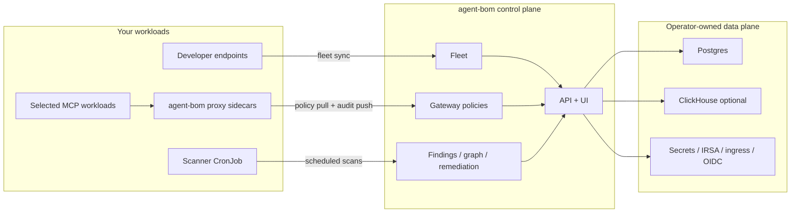

# Deploy In Your Own AWS / EKS Infrastructure

This is the self-hosted path for teams that want `agent-bom` inside their own
AWS account, VPC, EKS cluster, IAM boundary, and databases.

Use this path when you want one operator-controlled system for:

- scheduled scans and discovery
- endpoint fleet inventory
- selected live MCP proxy enforcement
- central gateway policy management
- API, UI, findings, graph, and remediation in your own infra

If you want the narrower pilot shape first, start with
[Focused EKS MCP Pilot](eks-mcp-pilot.md). If you want the broader rollout that
also covers developer endpoints, pair this page with
[Endpoint Fleet](endpoint-fleet.md).

## Best-In-Class EKS Shape

The best current EKS rollout is not "put everything behind one service." It is
a split between a control plane and the discovery/enforcement paths around it.



## Which Agent-BOM Surface Runs Where

| Surface | Where it runs | Why you deploy it |
|---|---|---|
| **API + UI** | in-cluster or on self-hosted compute behind your ingress | one operator plane for findings, graph, fleet, audit, gateway, and remediation |
| **Scan** | CronJob, CI runner, or one-off job | Kubernetes, container, package, MCP, cloud, and inventory scanning |
| **Fleet** | pushed into the control plane from endpoints or collectors | persisted workstation and collector inventory in `/fleet` |
| **Proxy / runtime** | only next to the MCP workloads you want inline enforcement on | live JSON-RPC inspection, allow/warn/deny, audit push |
| **Gateway** | central control plane API + UI | store and manage policies that proxies evaluate and pull |
| **MCP server** | wherever you expose `agent-bom` itself as a tool server | assistant-facing tool access, separate from the proxy path |

The important boundary is that `agent-bom proxy` is the inline runtime path,
while the gateway is the central policy surface. One does not replace the
other.

## What Stays In Your Infrastructure

For this model, the sensitive operator surfaces stay inside your environment
unless you explicitly wire external destinations:

- API and dashboard traffic
- fleet inventory
- proxy audit logs
- Postgres and optional ClickHouse
- Kubernetes discovery through your service account and IRSA role
- cloud discovery through your own IAM credentials
- OIDC, API-key, audit-HMAC, and ingress policy

Potential egress still depends on operator choice:

- vulnerability database refresh
- enrichment lookups
- explicit exports such as SARIF upload, OTLP, SIEM, or webhooks

## What You Actually Deploy

These are the maintained building blocks for this model:

- control plane:
  [deploy/helm/agent-bom](https://github.com/msaad00/agent-bom/tree/main/deploy/helm/agent-bom)
- Compose references:
  [deploy/docker-compose.platform.yml](https://github.com/msaad00/agent-bom/blob/main/deploy/docker-compose.platform.yml)
  and
  [deploy/docker-compose.runtime.yml](https://github.com/msaad00/agent-bom/blob/main/deploy/docker-compose.runtime.yml)
- sidecar examples:
  [deploy/k8s/sidecar-example.yaml](https://github.com/msaad00/agent-bom/blob/main/deploy/k8s/sidecar-example.yaml)
  and
  [deploy/k8s/proxy-sidecar-pilot.yaml](https://github.com/msaad00/agent-bom/blob/main/deploy/k8s/proxy-sidecar-pilot.yaml)
- Postgres bootstrap:
  [deploy/supabase/postgres/init.sql](https://github.com/msaad00/agent-bom/blob/main/deploy/supabase/postgres/init.sql)
- ClickHouse bootstrap:
  [deploy/supabase/clickhouse/init.sql](https://github.com/msaad00/agent-bom/blob/main/deploy/supabase/clickhouse/init.sql)
- production values example:
  [eks-production-values.yaml](https://github.com/msaad00/agent-bom/blob/main/deploy/helm/agent-bom/examples/eks-production-values.yaml)
- focused pilot values example:
  [eks-mcp-pilot-values.yaml](https://github.com/msaad00/agent-bom/blob/main/deploy/helm/agent-bom/examples/eks-mcp-pilot-values.yaml)

## Recommended Topology

Use two layers.

### 1. Control plane

- enable the packaged API + UI control plane
- back it with Postgres
- add ClickHouse only when you want event-scale analytics
- keep ingress same-origin unless you have a concrete reason to split hosts
- use OIDC or SAML for user access

### 2. Discovery and enforcement

- run scheduled scan jobs for Kubernetes, MCP, package, and cloud discovery
- use fleet sync for laptops and workstations
- run `agent-bom proxy` only beside the MCP workloads that need inline
  runtime enforcement
- let proxies pull gateway policy from the control plane and push audit back

That keeps scan, fleet, runtime enforcement, and gateway policy aligned
without pretending every workload needs the same enforcement model.

## Helm Knobs That Matter

| Value | Why it matters |
|---|---|
| `controlPlane.enabled` | packages the API + dashboard in-cluster |
| `controlPlane.ingress.enabled` | routes `/` to UI and `/v1`, `/health`, `/docs`, `/ws` to API |
| `controlPlane.api.envFrom` | loads Postgres URL, auth settings, audit HMAC, and other control-plane secrets |
| `controlPlane.ui.env` | keeps same-origin routing honest with `NEXT_PUBLIC_API_URL=\"\"` or sets an explicit API URL |
| `serviceAccount.annotations` | attaches IRSA to the scanner service account |
| `scanner.extraArgs` | enables `--k8s-mcp`, `--introspect`, `--enforce`, and other operator choices |
| `scanner.allNamespaces` | expands cluster scan scope |
| `controlPlane.api.autoscaling.*` | autoscales the API deployment |
| `controlPlane.ui.autoscaling.*` | autoscales the UI deployment |
| `topologySpread.*` | spreads API and UI pods across zones and nodes |
| `controlPlane.externalSecrets.*` | maps secrets from your external-secrets provider |
| `controlPlane.observability.prometheusRule.*` | packages alerts for API, scanner, OIDC, and proxy backlog |
| `controlPlane.backup.*` | packages the Postgres backup job when you are ready to wire S3 and KMS |

Example:

```bash
helm install agent-bom deploy/helm/agent-bom \
  -n agent-bom --create-namespace \
  --set controlPlane.enabled=true \
  --set controlPlane.ingress.enabled=true \
  --set serviceAccount.annotations."eks\.amazonaws\.com/role-arn"=arn:aws:iam::123456789012:role/agent-bom-discovery \
  --set scanner.allNamespaces=true \
  --set-json 'scanner.extraArgs=["--k8s-mcp","--k8s-all-namespaces","--introspect","--enforce","--preset","enterprise"]'
```

That gives you:

- packaged API + UI
- cluster-wide discovery
- MCP-oriented scheduled scans
- a clean bridge to selected proxy sidecars and gateway policy

## Runtime, Proxy, Gateway, Scan, and Fleet Together

This is the most common source of confusion in self-hosted rollouts:

- **Scan** finds and analyzes what is deployed.
- **Fleet** persists endpoint and collector inventory into the control plane.
- **Proxy / runtime** inspects and enforces live MCP traffic for selected
  workloads.
- **Gateway** stores and serves the policies that proxies use.
- **API + UI** is where operators review all of the above together.

The rollout order should normally be:

1. control plane
2. scheduled scan jobs
3. fleet sync
4. selected proxy sidecars
5. stricter gateway-backed enforcement

## Recommended Production Defaults

- use Postgres, not SQLite, for the control plane
- use Alembic for long-lived Postgres-backed deployments
- keep the proxy and API internal to your VPC unless exposure is intentional
- attach discovery jobs to IRSA instead of static cloud keys
- set a persistent `AGENT_BOM_AUDIT_HMAC_KEY` and require it for proxy audit
  sign-off
- split external secrets by rotation cadence
- enable the packaged PrometheusRule and Grafana dashboard only when your
  cluster already runs Prometheus Operator and Grafana sidecar discovery
- wire backup destinations explicitly before enabling the packaged backup CronJob
- use topology spread for multi-AZ EKS
- start with audit-only policy outcomes where rollout risk is unclear, then
  move to deny

Run database migrations explicitly:

```bash
alembic -c deploy/supabase/postgres/alembic.ini upgrade head
```

If the database was previously bootstrapped from `init.sql`, stamp the baseline
once before future upgrades:

```bash
alembic -c deploy/supabase/postgres/alembic.ini stamp 20260416_01
```

## What You Still Own

This is a real self-hosted packaging path, but not every enterprise primitive
is abstracted into the chart.

You still own:

- Postgres, optional ClickHouse, and secret storage
- ingress controller, cert-manager, and network perimeter specifics
- HPA, failover, and operator runbooks
- platform-specific logging and SIEM wiring
- workload-by-workload decisions about where proxy sidecars belong

For the narrower rollout, see [Focused EKS MCP Pilot](eks-mcp-pilot.md). For
the packaged control plane details, see
[Packaged API + UI Control Plane](control-plane-helm.md).
