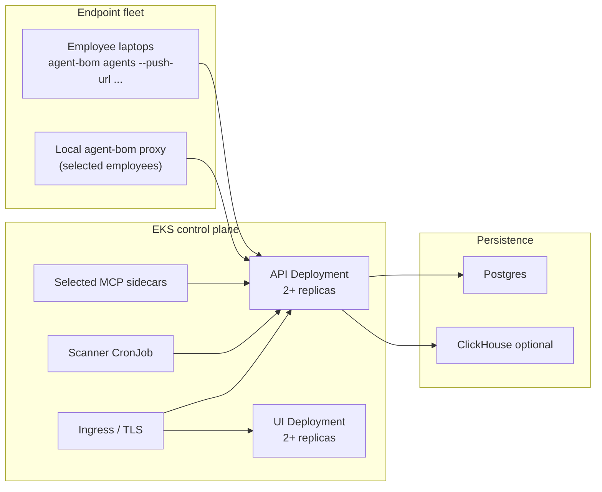

# Performance, Sizing, and Benchmarks

This guide is the operator-facing follow-up to the packaged Helm control plane
and enterprise pilot docs. It does not promise fixed throughput numbers the
repo has not published. It gives a defensible starting point for sizing,
autoscaling, and validating a self-hosted `agent-bom` deployment in EKS.

## What this guide covers

- control-plane API and UI sizing
- endpoint-fleet and proxy-audit growth boundaries
- when to keep analytics in `Postgres` and when to turn on `ClickHouse`
- what to load test before calling the deployment production-ready

## Reference topology

## Starting point by deployment size

These are starting bands, not SLA guarantees. Use them to choose the right
backend and Helm values before running your own load tests.

| Shape | Typical use | Recommended path |
|---|---|---|
| Small team | up to ~250 endpoints, selected proxy sidecars, low audit retention needs | `Postgres` only, 2 API replicas, 2 UI replicas, no `ClickHouse` |
| Initial enterprise pilot | ~250-2,000 endpoints, scheduled endpoint sync, selected runtime sidecars, retained proxy audit | `Postgres`, packaged `HPA`, topology spread, internal ingress, add `ClickHouse` only if audit/query latency grows |
| Broader rollout | 2,000+ endpoints or sustained high-volume proxy audit/event analytics | `Postgres` for transactional state plus `ClickHouse` for analytics, explicit retention policy, benchmark before rollout |

## Practical switch points

These are planning thresholds, not product-enforced limits.

| Signal | Stay on Postgres only | Add ClickHouse |
|---|---|---|
| Endpoint count | up to ~2,000 endpoints | above ~2,000 endpoints with retained analytics needs |
| Scan cadence | low to moderate scheduled scans/day | sustained high-volume scheduled scans across many tenants |
| Runtime / proxy audit volume | recent operational visibility | long retention, heavy trend queries, event-style analytics |
| Dashboard/query shape | mostly transactional reads | trend-heavy or fleet-wide historical analytics |

The product intent is:

- `Postgres` remains the transactional control-plane source of truth
- `ClickHouse` is the scale-out answer for analytics-heavy workloads

## Control-plane sizing guidance

Start from the packaged production example:

- [eks-production-values.yaml](https://github.com/msaad00/agent-bom/blob/main/deploy/helm/agent-bom/examples/eks-production-values.yaml)

That example already enables:

- API and UI `HPA`
- topology spread
- `external-secrets`
- `cert-manager`-friendly ingress annotations
- restricted ingress policy

### API

Current chart defaults in [values.yaml](https://github.com/msaad00/agent-bom/blob/main/deploy/helm/agent-bom/values.yaml):

- replicas: `2`
- requests: `100m` CPU / `256Mi` memory
- limits: `1000m` CPU / `1Gi` memory
- `HPA` packaged but off by default

Recommended production operator posture:

- keep `2` replicas as the minimum steady-state floor
- enable the shipped API `HPA` before larger endpoint or proxy rollouts
- raise requests before raising limits when sustained CPU stays above `70%`
- keep the API same-origin behind one ingress hostname unless you have a
  strong reason to split UI and API

### UI

Current chart defaults:

- replicas: `2`
- requests: `100m` CPU / `128Mi` memory
- limits: `500m` CPU / `512Mi` memory

Recommended posture:

- keep `2` replicas for zone and node failure tolerance
- enable the shipped UI `HPA` for heavier internal usage or dashboard-heavy
  SOC workflows
- scale UI based on browser concurrency, not endpoint count alone

### Scanner CronJob

The scanner is batch-oriented. The main knobs are:

- schedule frequency
- namespace scope
- `--introspect`
- `--enforce`

If scans begin overlapping, do not immediately add more control-plane replicas.
First widen the CronJob interval, split scope, or reduce introspection scope for
the rollout phase.

For the full execution model, including scheduler leader election, tenant quota
enforcement, and the split between recurring schedules and the packaged scanner
`CronJob`, see [Worker and Scheduler
Concurrency](worker-and-scheduler-concurrency.md).

## Postgres vs ClickHouse

Use `Postgres` as the source of truth for:

- fleet and policy state
- RBAC and tenant-scoped reads
- audit and control-plane writes
- scheduler coordination

Turn on `ClickHouse` when analytics starts behaving like analytics rather than
control-plane state:

- large retained proxy audit history
- heavy dashboard trend queries
- many endpoints with long retention windows
- event-style workloads where write buffering matters more than relational reads

Do not move the transactional control plane out of `Postgres` just because
analytics volume grows. The intended shape is:

- `Postgres` for the control plane
- `ClickHouse` for optional analytics scale-out

## Operational thresholds to watch

Watch these before widening rollout:

- API `p95` latency on authenticated reads and writes
- Postgres CPU, memory, and connection pressure
- scanner run duration versus schedule interval
- proxy audit ingest rate and retained volume
- UI response time under simultaneous SOC usage

If any of these fail first:

- API CPU saturation: increase API requests and enable or widen the API `HPA`
- Postgres pressure: tune connection pool, size the database, and move
  analytics-heavy reads toward `ClickHouse`
- overlapping scans: lengthen schedule or split scope
- audit query drag: add retention boundaries and move analytics to `ClickHouse`

## Tenant quotas

For multi-tenant or shared internal deployments, set explicit per-tenant quotas
 on the API instead of relying only on request rate limits.

Available environment variables:

- `AGENT_BOM_API_MAX_ACTIVE_SCAN_JOBS_PER_TENANT`
- `AGENT_BOM_API_MAX_RETAINED_JOBS_PER_TENANT`
- `AGENT_BOM_API_MAX_FLEET_AGENTS_PER_TENANT`
- `AGENT_BOM_API_MAX_SCHEDULES_PER_TENANT`

These are enforced on:

- scan creation
- scheduled scan creation
- pushed scan-result ingestion
- fleet sync
- schedule creation

The packaged production example already shows how to inject these through
 `controlPlane.api.env` in:

- [eks-production-values.yaml](https://github.com/msaad00/agent-bom/blob/main/deploy/helm/agent-bom/examples/eks-production-values.yaml)

Recommended starting posture:

- keep active scan jobs low enough that one tenant cannot saturate the API
- keep retained jobs bounded to match your retention expectations
- keep fleet-agent quotas aligned to your actual endpoint/runtime rollout size
- keep schedule quotas low unless you deliberately expose scheduled scans to many tenants

## Benchmark before production rollout

The repo now ships a small benchmark harness under:

- [deploy/loadtest/README.md](https://github.com/msaad00/agent-bom/blob/main/deploy/loadtest/README.md)
- [k6-control-plane-api.js](https://github.com/msaad00/agent-bom/blob/main/deploy/loadtest/k6-control-plane-api.js)
- [k6-proxy-audit.js](https://github.com/msaad00/agent-bom/blob/main/deploy/loadtest/k6-proxy-audit.js)

Use that harness to validate:

1. authenticated control-plane read paths
2. proxy audit ingest write paths
3. scaling behavior after enabling `HPA`
4. the point where analytics should move to `ClickHouse`

## Minimal benchmark checklist

Run these in your own environment before broader rollout:

1. Baseline the API with the control-plane script at low and medium concurrency.
2. Baseline proxy audit ingest with realistic batch sizes.
3. Repeat both runs with `HPA` enabled.
4. Repeat with `ClickHouse` disabled, then enabled if your rollout expects high
   retained analytics volume.
5. Record your chosen replica floor, resource requests, and retention policy in
   your operator runbook.

## Publish your own benchmark numbers

`agent-bom` deliberately does not claim a universal scans/day SLA. Real
throughput depends on:

- scan shape
- endpoint mix
- retention window
- whether analytics stays in Postgres or moves to ClickHouse

What the project does ship is:

- a benchmark harness
- packaged HPA/PDB controls
- explicit backend guidance

That keeps the deployment story honest while still giving operators a concrete
starting point.

## Current boundary

`agent-bom` now ships the packaged control plane, pilot path, and operator
defaults. What it still does not claim is:

- fixed throughput guarantees
- a bundled benchmark certification suite
- a managed control plane that hides storage or scaling choices from the buyer

Those choices stay explicit, which is why the self-hosted story remains honest.
