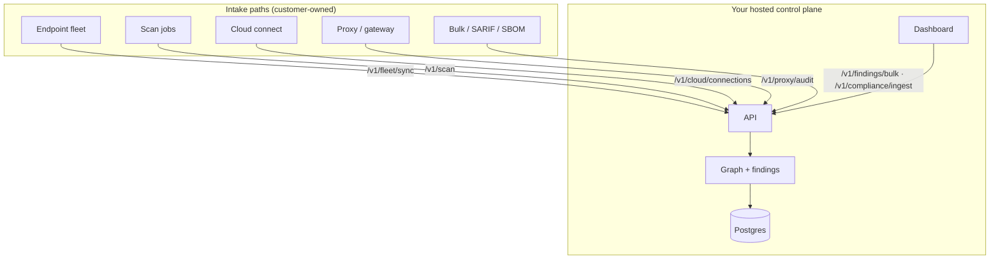

# Deploy Quickstart

Unified entry for **BYOC / self-hosted** rollout: one install script, read-only
cloud connect, and the intake paths that feed your control plane.

Full doc in the repo: [`docs/DEPLOY_QUICKSTART.md`](https://github.com/msaad00/agent-bom/blob/main/docs/DEPLOY_QUICKSTART.md).

## Install

```bash
scripts/deploy/install.sh list
scripts/deploy/install.sh pilot          # fastest local proof
scripts/deploy/install.sh eks --create-cluster --region "$AWS_REGION"
scripts/deploy/install.sh connect aws    # read-only account onboarding
```

## BYOC in one sentence

You run API + UI + Postgres in **your** cloud/VPC/K8s. Connected accounts get
**read-only** roles only. Endpoints push fleet inventory. Scans and runtime
audit flow into one graph — no mandatory vendor SaaS.

## Ten-minute proof path

```bash
cp .env.example .env
# Generate the mounted files in deploy/secrets/ as documented in
# deploy/secrets/README.md before starting the production-shaped stack.
scripts/deploy/install.sh platform-docker
scripts/deploy/install.sh connect aws       # or azure | gcp | snowflake
scripts/deploy/install.sh onboard \
  --url http://localhost:8422 \
  --api-key "$(cat deploy/secrets/api_key)"
```

Register the read-only identity printed by `connect` under **Connections**, run
inventory, and verify a completed job plus non-empty resources/identities in
**Security graph**. A zero finding count is valid; it must not be confused with
missing inventory. Cloud keys stay in workload identity or mounted files inside
the customer deployment, never in the browser.

## What feeds the control plane



| Intake | Endpoint |
|--------|----------|
| Cloud inventory | `POST /v1/cloud/connections`, Helm CronJob |
| Endpoints / MCP | `POST /v1/fleet/sync` |
| On-demand scan | `POST /v1/scan` |
| Runtime audit | `POST /v1/proxy/audit` |
| External findings | `POST /v1/findings/bulk` |
| SARIF / SBOM | `POST /v1/compliance/ingest` |

## Deeper diagrams

The deployment overview includes customer-boundary and evidence-workflow
mermaid diagrams:

- [Deployment Overview — enterprise diagrams](overview.md#enterprise-self-hosted-diagrams)
- [Self-Hosted Product Architecture](../architecture/self-hosted-product-architecture.md)
- [Proxy vs Gateway vs Fleet](proxy-vs-gateway-vs-fleet.md)

## Related

- [Deploy anywhere (three tiers)](https://github.com/msaad00/agent-bom/blob/main/docs/DEPLOY_PLATFORM.md)
- [Cloud connect model](https://github.com/msaad00/agent-bom/blob/main/docs/CLOUD_CONNECT.md)
- [Cross-cloud runbook](https://github.com/msaad00/agent-bom/blob/main/deploy/RUNBOOK.md)
- [Trust boundaries](https://github.com/msaad00/agent-bom/blob/main/docs/TRUST.md)
