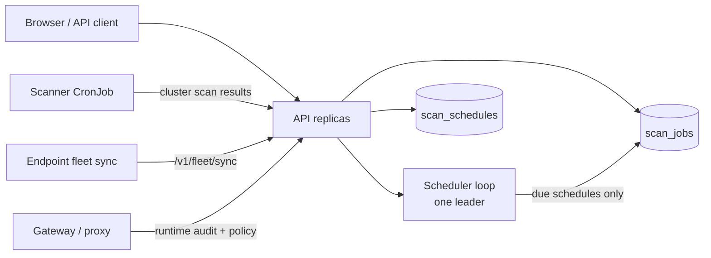

# Worker and Scheduler Concurrency

> **You do not need to read this unless** you are debugging job queue
> behavior, tuning concurrency for high-volume scans, or making a
> deliberate choice between API-triggered scans, recurring schedules, and
> packaged CronJobs.

`agent-bom` uses a few different execution models at once:

- API-triggered ad hoc scans
- recurring schedules
- packaged CronJobs
- long-running runtime services such as proxy and gateway

This guide explains which component owns which kind of work, where concurrency
limits apply, and how to scale without turning the control plane into a noisy
monolith.

## Execution model at a glance

## What runs where

| Surface | Execution model | Typical lifetime |
|---|---|---|
| `POST /v1/scan` and related API-triggered jobs | ad hoc job creation | one-off |
| `/v1/schedules` recurring scans | scheduler loop plus stored cron expressions | periodic |
| Helm scanner | Kubernetes `CronJob` | periodic |
| backup job | Kubernetes `CronJob` | periodic |
| endpoint fleet sync | endpoint timer / launchd / systemd | periodic |
| gateway and proxy | long-running service / sidecar / wrapper | long-running |

## Scheduler leader model

Recurring schedules are not fired by every API pod at once.

Current control-plane behavior:

- each API process starts the scheduler loop during server lifespan
- with `AGENT_BOM_POSTGRES_URL` set, only the replica that acquires the
  Postgres advisory lock acts as scheduler leader
- non-leaders sleep and do not trigger scans
- due schedules are checked every `60` seconds by default
- failed scheduler iterations back off exponentially up to `900` seconds

That means the scheduler is safe to run in a multi-replica API deployment
without duplicate schedule execution, as long as the deployment uses Postgres.

## Quotas and noisy-neighbor control

The scheduler and API share the same tenant quota enforcement path.

The key per-tenant limits are:

- `AGENT_BOM_API_MAX_ACTIVE_SCAN_JOBS_PER_TENANT`
- `AGENT_BOM_API_MAX_RETAINED_JOBS_PER_TENANT`
- `AGENT_BOM_API_MAX_FLEET_AGENTS_PER_TENANT`
- `AGENT_BOM_API_MAX_SCHEDULES_PER_TENANT`

What each one protects:

- active scan jobs: caps concurrent pending/running scans for one tenant
- retained jobs: caps stored scan history growth
- fleet agents: caps pushed endpoint or collector inventory
- schedules: caps recurring scan definitions

These are enforced when the API accepts new work. They are not soft dashboard
warnings; they return quota errors and emit tenant-scoped audit events.

## CronJob vs scheduler

The scanner `CronJob` and the recurring schedule subsystem are different
surfaces.

Use the packaged scanner `CronJob` when:

- you want cluster-wide or namespace-wide periodic discovery
- the work is an operator-owned infrastructure sweep
- the cadence belongs in Helm and Kubernetes

Use `/v1/schedules` when:

- a tenant or operator needs recurring logical scans through the API
- you want the schedule visible in the product
- you want tenant-scoped quota and audit around that schedule

Do not treat them as interchangeable knobs. The CronJob is cluster automation;
the scheduler is control-plane orchestration.

## Scaling guidance

When scans start overlapping, use this order:

1. widen the schedule interval
2. narrow scan scope or split jobs by target
3. raise tenant quotas only if the rollout genuinely needs it
4. scale API replicas and resource requests after queue pressure is real

Recommended posture:

- keep API replicas at `2+`
- keep the scheduler on Postgres-backed deployments
- avoid using quotas of `0` unless you truly want “unlimited”
- keep scanner CronJobs scoped and predictable before increasing frequency

## What is periodic, ad hoc, or long-running

| Workload | Category | Notes |
|---|---|---|
| API-triggered scan | ad hoc | user or automation triggered |
| scheduled scan | periodic | stored in `scan_schedules`, executed by one leader |
| cluster scanner | periodic | Kubernetes `CronJob` |
| backup job | periodic | Kubernetes `CronJob` |
| endpoint fleet sync | periodic | endpoint-owned timer or agent bundle |
| gateway | long-running | multi-replica service, runtime rate-limited |
| proxy | long-running | local wrapper or sidecar |

## Failure model

The current failure contract is explicit:

- scheduler store failures trigger exponential backoff
- lack of Postgres leader lock means “do not schedule,” not “schedule anyway”
- tenant quota violations are returned synchronously and audited
- CronJob overlap is an operator problem to solve with cadence and scope, not by
  silently widening concurrency

## Recommended operator checks

Before widening rollout, confirm:

- schedule run time stays below the configured interval
- API `p95` latency stays healthy during scheduled runs
- Postgres can handle scheduler, job, and audit write pressure together
- tenant quotas match the deployment shape you intend to support

## Related guides

- [Performance, Sizing, and Benchmarks](performance-and-sizing.md)
- [Packaged API + UI Control Plane](control-plane-helm.md)
- [Your Own AWS / EKS](own-infra-eks.md)
